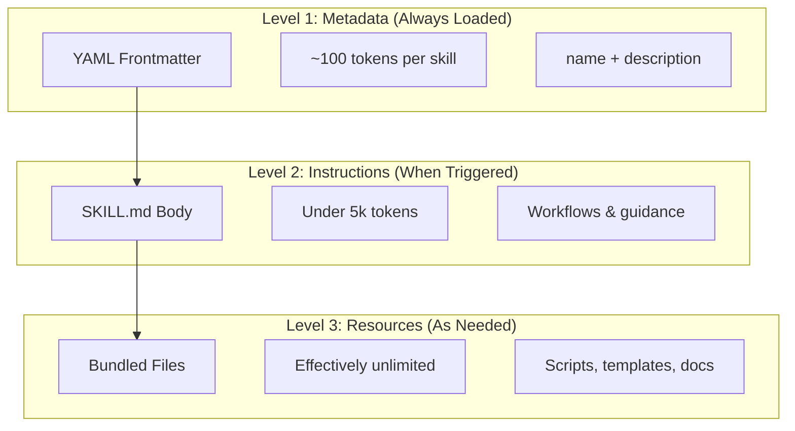
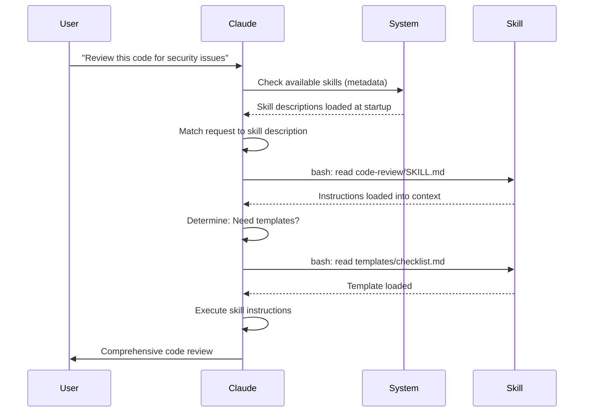

<picture>
  <source media="(prefers-color-scheme: dark)" srcset="../resources/logos/claude-howto-logo-dark.svg">
  
</picture>

# Agent Skills Guide

Agent Skills are reusable, filesystem-based capabilities that extend Claude's functionality. They package domain-specific expertise, workflows, and best practices into discoverable components that Claude automatically uses when relevant.

## Overview

**Agent Skills** are modular capabilities that transform general-purpose agents into specialists. Unlike prompts (conversation-level instructions for one-off tasks), Skills load on-demand and eliminate the need to repeatedly provide the same guidance across multiple conversations.

### Key Benefits

- **Specialize Claude**: Tailor capabilities for domain-specific tasks
- **Reduce repetition**: Create once, use automatically across conversations
- **Compose capabilities**: Combine Skills to build complex workflows
- **Scale workflows**: Reuse skills across multiple projects and teams
- **Maintain quality**: Embed best practices directly into your workflow

Skills follow the [Agent Skills](https://agentskills.io) open standard, which works across multiple AI tools. Claude Code extends the standard with additional features like invocation control, subagent execution, and dynamic context injection.

> **Note**: Custom slash commands have been merged into skills. `.claude/commands/` files still work and support the same frontmatter fields. Skills are recommended for new development. When both exist at the same path (e.g., `.claude/commands/review.md` and `.claude/skills/review/SKILL.md`), the skill takes precedence.

## How Skills Work: Progressive Disclosure

Skills leverage a **progressive disclosure** architecture—Claude loads information in stages as needed, rather than consuming context upfront. This enables efficient context management while maintaining unlimited scalability.

### Three Levels of Loading



| Level | When Loaded | Token Cost | Content |
|-------|------------|------------|---------|
| **Level 1: Metadata** | Always (at startup) | ~100 tokens per Skill | `name` and `description` from YAML frontmatter |
| **Level 2: Instructions** | When Skill is triggered | Under 5k tokens | SKILL.md body with instructions and guidance |
| **Level 3+: Resources** | As needed | Effectively unlimited | Bundled files executed via bash without loading contents into context |

This means you can install many Skills without context penalty—Claude only knows each Skill exists and when to use it until actually triggered.

## Skill Loading Process



## Skill Types & Locations

| Type | Location | Scope | Shared | Best For |
|------|----------|-------|--------|----------|
| **Enterprise** | Managed settings | All org users | Yes | Organization-wide standards |
| **Personal** | `~/.claude/skills/<skill-name>/SKILL.md` | Individual | No | Personal workflows |
| **Project** | `.claude/skills/<skill-name>/SKILL.md` | Team | Yes (via git) | Team standards |
| **Plugin** | `<plugin>/skills/<skill-name>/SKILL.md` | Where enabled | Depends | Bundled with plugins |

When skills share the same name across levels, higher-priority locations win: **enterprise > personal > project**. Plugin skills use a `plugin-name:skill-name` namespace, so they cannot conflict.

### Automatic Discovery

**Nested directories**: When you work with files in subdirectories, Claude Code automatically discovers skills from nested `.claude/skills/` directories. For example, if you're editing a file in `packages/frontend/`, Claude Code also looks for skills in `packages/frontend/.claude/skills/`. This supports monorepo setups where packages have their own skills.

**`--add-dir` directories**: Skills from directories added via `--add-dir` are loaded automatically with live change detection. Any edits to skill files in those directories take effect immediately without restarting Claude Code.

**Description budget**: Skill descriptions (Level 1 metadata) are capped at **2% of the context window** (fallback: **16,000 characters**). If you have many skills installed, some may be excluded. Run `/context` to check for warnings. Override the budget with the `SLASH_COMMAND_TOOL_CHAR_BUDGET` environment variable.

## Creating Custom Skills

### Basic Directory Structure

```
my-skill/
├── SKILL.md           # Main instructions (required)
├── template.md        # Template for Claude to fill in
├── examples/
│   └── sample.md      # Example output showing expected format
└── scripts/
    └── validate.sh    # Script Claude can execute
```

### SKILL.md Format

```yaml
---
name: your-skill-name
description: Brief description of what this Skill does and when to use it
---

# Your Skill Name

## Instructions
Provide clear, step-by-step guidance for Claude.

## Examples
Show concrete examples of using this Skill.
```

### Required Fields

- **name**: lowercase letters, numbers, hyphens only (max 64 characters). Cannot contain "anthropic" or "claude".
- **description**: what the Skill does AND when to use it (max 1024 characters). This is critical for Claude to know when to activate the skill.

### Optional Frontmatter Fields

```yaml
---
name: my-skill
description: What this skill does and when to use it
argument-hint: "[filename] [format]"        # Hint for autocomplete
disable-model-invocation: true              # Only user can invoke
user-invocable: false                       # Hide from slash menu
allowed-tools: Read, Grep, Glob             # Restrict tool access
model: opus                                 # Specific model to use
effort: high                                # Effort level override (low, medium, high, max)
context: fork                               # Run in isolated subagent
agent: Explore                              # Which agent type (with context: fork)
shell: bash                                 # Shell for commands: bash (default) or powershell
hooks:                                      # Skill-scoped hooks
  PreToolUse:
    - matcher: "Bash"
      hooks:
        - type: command
          command: "./scripts/validate.sh"
---
```

| Field | Description |
|-------|-------------|
| `name` | Lowercase letters, numbers, hyphens only (max 64 chars). Cannot contain "anthropic" or "claude". |
| `description` | What the Skill does AND when to use it (max 1024 chars). Critical for auto-invocation matching. |
| `argument-hint` | Hint shown in the `/` autocomplete menu (e.g., `"[filename] [format]"`). |
| `disable-model-invocation` | `true` = only the user can invoke via `/name`. Claude will never auto-invoke. |
| `user-invocable` | `false` = hidden from the `/` menu. Only Claude can invoke it automatically. |
| `allowed-tools` | Comma-separated list of tools the skill may use without permission prompts. |
| `model` | Model override while the skill is active (e.g., `opus`, `sonnet`). |
| `effort` | Effort level override while the skill is active: `low`, `medium`, `high`, or `max`. |
| `context` | `fork` to run the skill in a forked subagent context with its own context window. |
| `agent` | Subagent type when `context: fork` (e.g., `Explore`, `Plan`, `general-purpose`). |
| `shell` | Shell used for `!`command`` substitutions and scripts: `bash` (default) or `powershell`. |
| `hooks` | Hooks scoped to this skill's lifecycle (same format as global hooks). |

## Skill Content Types

Skills can contain two types of content, each suited for different purposes:

### Reference Content

Adds knowledge Claude applies to your current work—conventions, patterns, style guides, domain knowledge. Runs inline with your conversation context.

```yaml
---
name: api-conventions
description: API design patterns for this codebase
---

When writing API endpoints:
- Use RESTful naming conventions
- Return consistent error formats
- Include request validation
```

### Task Content

Step-by-step instructions for specific actions. Often invoked directly with `/skill-name`.

```yaml
---
name: deploy
description: Deploy the application to production
context: fork
disable-model-invocation: true
---

Deploy the application:
1. Run the test suite
2. Build the application
3. Push to the deployment target
```

## Controlling Skill Invocation

By default, both you and Claude can invoke any skill. Two frontmatter fields control the three invocation modes:

| Frontmatter | You can invoke | Claude can invoke |
|---|---|---|
| (default) | Yes | Yes |
| `disable-model-invocation: true` | Yes | No |
| `user-invocable: false` | No | Yes |

**Use `disable-model-invocation: true`** for workflows with side effects: `/commit`, `/deploy`, `/send-slack-message`. You don't want Claude deciding to deploy because your code looks ready.

**Use `user-invocable: false`** for background knowledge that isn't actionable as a command. A `legacy-system-context` skill explains how an old system works—useful for Claude, but not a meaningful action for users.

## String Substitutions

Skills support dynamic values that are resolved before the skill content reaches Claude:

| Variable | Description |
|----------|-------------|
| `$ARGUMENTS` | All arguments passed when invoking the skill |
| `$ARGUMENTS[N]` or `$N` | Access specific argument by index (0-based) |
| `${CLAUDE_SESSION_ID}` | Current session ID |
| `${CLAUDE_SKILL_DIR}` | Directory containing the skill's SKILL.md file |
| `` !`command` `` | Dynamic context injection — runs a shell command and inlines the output |

**Example:**

```yaml
---
name: fix-issue
description: Fix a GitHub issue
---

Fix GitHub issue $ARGUMENTS following our coding standards.
1. Read the issue description
2. Implement the fix
3. Write tests
4. Create a commit
```

Running `/fix-issue 123` replaces `$ARGUMENTS` with `123`.

## Injecting Dynamic Context

The `!`command`` syntax runs shell commands before the skill content is sent to Claude:

```yaml
---
name: pr-summary
description: Summarize changes in a pull request
context: fork
agent: Explore
---

## Pull request context
- PR diff: !`gh pr diff`
- PR comments: !`gh pr view --comments`
- Changed files: !`gh pr diff --name-only`

## Your task
Summarize this pull request...
```

Commands execute immediately; Claude only sees the final output. By default, commands run in `bash`. Set `shell: powershell` in frontmatter to use PowerShell instead.

## Running Skills in Subagents

Add `context: fork` to run a skill in an isolated subagent context. The skill content becomes the task for a dedicated subagent with its own context window, keeping the main conversation uncluttered.

The `agent` field specifies which agent type to use:

| Agent Type | Best For |
|---|---|
| `Explore` | Read-only research, codebase analysis |
| `Plan` | Creating implementation plans |
| `general-purpose` | Broad tasks requiring all tools |
| Custom agents | Specialized agents defined in your configuration |

**Example frontmatter:**

```yaml
---
context: fork
agent: Explore
---
```

**Full skill example:**

```yaml
---
name: deep-research
description: Research a topic thoroughly
context: fork
agent: Explore
---

Research $ARGUMENTS thoroughly:
1. Find relevant files using Glob and Grep
2. Read and analyze the code
3. Summarize findings with specific file references
```

## Practical Examples

### Example 1: Code Review Skill

**Directory Structure:**

```
~/.claude/skills/code-review/
├── SKILL.md
├── templates/
│   ├── review-checklist.md
│   └── finding-template.md
└── scripts/
    ├── analyze-metrics.py
    └── compare-complexity.py
```

**File:** `~/.claude/skills/code-review/SKILL.md`

```yaml
---
name: code-review-specialist
description: Comprehensive code review with security, performance, and quality analysis. Use when users ask to review code, analyze code quality, evaluate pull requests, or mention code review, security analysis, or performance optimization.
---

# Code Review Skill

This skill provides comprehensive code review capabilities focusing on:

1. **Security Analysis**
   - Authentication/authorization issues
   - Data exposure risks
   - Injection vulnerabilities
   - Cryptographic weaknesses

2. **Performance Review**
   - Algorithm efficiency (Big O analysis)
   - Memory optimization
   - Database query optimization
   - Caching opportunities

3. **Code Quality**
   - SOLID principles
   - Design patterns
   - Naming conventions
   - Test coverage

4. **Maintainability**
   - Code readability
   - Function size (should be < 50 lines)
   - Cyclomatic complexity
   - Type safety

## Review Template

For each piece of code reviewed, provide:

### Summary
- Overall quality assessment (1-5)
- Key findings count
- Recommended priority areas

### Critical Issues (if any)
- **Issue**: Clear description
- **Location**: File and line number
- **Impact**: Why this matters
- **Severity**: Critical/High/Medium
- **Fix**: Code example

For detailed checklists, see [templates/review-checklist.md](templates/review-checklist.md).
```

### Example 2: Codebase Visualizer Skill

A skill that generates interactive HTML visualizations:

**Directory Structure:**

```
~/.claude/skills/codebase-visualizer/
├── SKILL.md
└── scripts/
    └── visualize.py
```

**File:** `~/.claude/skills/codebase-visualizer/SKILL.md`

````yaml
---
name: codebase-visualizer
description: Generate an interactive collapsible tree visualization of your codebase. Use when exploring a new repo, understanding project structure, or identifying large files.
allowed-tools: Bash(python *)
---

# Codebase Visualizer

Generate an interactive HTML tree view showing your project's file structure.

## Usage

Run the visualization script from your project root:

```bash
python ~/.claude/skills/codebase-visualizer/scripts/visualize.py .
```

This creates `codebase-map.html` and opens it in your default browser.

## What the visualization shows

- **Collapsible directories**: Click folders to expand/collapse
- **File sizes**: Displayed next to each file
- **Colors**: Different colors for different file types
- **Directory totals**: Shows aggregate size of each folder
````

The bundled Python script does the heavy lifting while Claude handles orchestration.

### Example 3: Deploy Skill (User-Invoked Only)

```yaml
---
name: deploy
description: Deploy the application to production
disable-model-invocation: true
allowed-tools: Bash(npm *), Bash(git *)
---

Deploy $ARGUMENTS to production:

1. Run the test suite: `npm test`
2. Build the application: `npm run build`
3. Push to the deployment target
4. Verify the deployment succeeded
5. Report deployment status
```

### Example 4: Brand Voice Skill (Background Knowledge)

```yaml
---
name: brand-voice
description: Ensure all communication matches brand voice and tone guidelines. Use when creating marketing copy, customer communications, or public-facing content.
user-invocable: false
---

## Tone of Voice
- **Friendly but professional** - approachable without being casual
- **Clear and concise** - avoid jargon
- **Confident** - we know what we're doing
- **Empathetic** - understand user needs

## Writing Guidelines
- Use "you" when addressing readers
- Use active voice
- Keep sentences under 20 words
- Start with value proposition

For templates, see [templates/](templates/).
```

### Example 5: CLAUDE.md Generator Skill

```yaml
---
name: claude-md
description: Create or update CLAUDE.md files following best practices for optimal AI agent onboarding. Use when users mention CLAUDE.md, project documentation, or AI onboarding.
---

## Core Principles

**LLMs are stateless**: CLAUDE.md is the only file automatically included in every conversation.

### The Golden Rules

1. **Less is More**: Keep under 300 lines (ideally under 100)
2. **Universal Applicability**: Only include information relevant to EVERY session
3. **Don't Use Claude as a Linter**: Use deterministic tools instead
4. **Never Auto-Generate**: Craft it manually with careful consideration

## Essential Sections

- **Project Name**: Brief one-line description
- **Tech Stack**: Primary language, frameworks, database
- **Development Commands**: Install, test, build commands
- **Critical Conventions**: Only non-obvious, high-impact conventions
- **Known Issues / Gotchas**: Things that trip up developers
```

### Example 6: Refactoring Skill with Scripts

**Directory Structure:**

```
refactor/
├── SKILL.md
├── references/
│   ├── code-smells.md
│   └── refactoring-catalog.md
├── templates/
│   └── refactoring-plan.md
└── scripts/
    ├── analyze-complexity.py
    └── detect-smells.py
```

**File:** `refactor/SKILL.md`

```yaml
---
name: code-refactor
description: Systematic code refactoring based on Martin Fowler's methodology. Use when users ask to refactor code, improve code structure, reduce technical debt, or eliminate code smells.
---

# Code Refactoring Skill

A phased approach emphasizing safe, incremental changes backed by tests.

## Workflow

Phase 1: Research & Analysis → Phase 2: Test Coverage Assessment →
Phase 3: Code Smell Identification → Phase 4: Refactoring Plan Creation →
Phase 5: Incremental Implementation → Phase 6: Review & Iteration

## Core Principles

1. **Behavior Preservation**: External behavior must remain unchanged
2. **Small Steps**: Make tiny, testable changes
3. **Test-Driven**: Tests are the safety net
4. **Continuous**: Refactoring is ongoing, not a one-time event

For code smell catalog, see [references/code-smells.md](references/code-smells.md).
For refactoring techniques, see [references/refactoring-catalog.md](references/refactoring-catalog.md).
```

## Supporting Files

Skills can include multiple files in their directory beyond `SKILL.md`. These supporting files (templates, examples, scripts, reference documents) let you keep the main skill file focused while providing Claude with additional resources it can load as needed.

```
my-skill/
├── SKILL.md              # Main instructions (required, keep under 500 lines)
├── templates/            # Templates for Claude to fill in
│   └── output-format.md
├── examples/             # Example outputs showing expected format
│   └── sample-output.md
├── references/           # Domain knowledge and specifications
│   └── api-spec.md
└── scripts/              # Scripts Claude can execute
    └── validate.sh
```

Guidelines for supporting files:

- Keep `SKILL.md` under **500 lines**. Move detailed reference material, large examples, and specifications to separate files.
- Reference additional files from `SKILL.md` using **relative paths** (e.g., `[API reference](references/api-spec.md)`).
- Supporting files are loaded at Level 3 (as needed), so they do not consume context until Claude actually reads them.

## Managing Skills

### Viewing Available Skills

Ask Claude directly:
```
What Skills are available?
```

Or check the filesystem:
```bash
# List personal Skills
ls ~/.claude/skills/

# List project Skills
ls .claude/skills/
```

### Testing a Skill

Two ways to test:

**Let Claude invoke it automatically** by asking something that matches the description:
```
Can you help me review this code for security issues?
```

**Or invoke it directly** with the skill name:
```
/code-review src/auth/login.ts
```

### Updating a Skill

Edit the `SKILL.md` file directly. Changes take effect on next Claude Code startup.

```bash
# Personal Skill
code ~/.claude/skills/my-skill/SKILL.md

# Project Skill
code .claude/skills/my-skill/SKILL.md
```

### Restricting Claude's Skill Access

Three ways to control which skills Claude can invoke:

**Disable all skills** in `/permissions`:
```
# Add to deny rules:
Skill
```

**Allow or deny specific skills**:
```
# Allow only specific skills
Skill(commit)
Skill(review-pr *)

# Deny specific skills
Skill(deploy *)
```

**Hide individual skills** by adding `disable-model-invocation: true` to their frontmatter.

## Best Practices

### 1. Make Descriptions Specific

- **Bad (Vague)**: "Helps with documents"
- **Good (Specific)**: "Extract text and tables from PDF files, fill forms, merge documents. Use when working with PDF files or when the user mentions PDFs, forms, or document extraction."

### 2. Keep Skills Focused

- One Skill = one capability
- ✅ "PDF form filling"
- ❌ "Document processing" (too broad)

### 3. Include Trigger Terms

Add keywords in descriptions that match user requests:
```yaml
description: Analyze Excel spreadsheets, generate pivot tables, create charts. Use when working with Excel files, spreadsheets, or .xlsx files.
```

### 4. Keep SKILL.md Under 500 Lines

Move detailed reference material to separate files that Claude loads as needed.

### 5. Reference Supporting Files

```markdown
## Additional resources

- For complete API details, see [reference.md](reference.md)
- For usage examples, see [examples.md](examples.md)
```

### Do's

- Use clear, descriptive names
- Include comprehensive instructions
- Add concrete examples
- Package related scripts and templates
- Test with real scenarios
- Document dependencies

### Don'ts

- Don't create skills for one-time tasks
- Don't duplicate existing functionality
- Don't make skills too broad
- Don't skip the description field
- Don't install skills from untrusted sources without auditing

## Troubleshooting

### Quick Reference

| Issue | Solution |
|-------|----------|
| Claude doesn't use Skill | Make description more specific with trigger terms |
| Skill file not found | Verify path: `~/.claude/skills/name/SKILL.md` |
| YAML errors | Check `---` markers, indentation, no tabs |
| Skills conflict | Use distinct trigger terms in descriptions |
| Scripts not running | Check permissions: `chmod +x scripts/*.py` |
| Claude doesn't see all skills | Too many skills; check `/context` for warnings |

### Skill Not Triggering

If Claude doesn't use your skill when expected:

1. Check the description includes keywords users would naturally say
2. Verify the skill appears when asking "What skills are available?"
3. Try rephrasing your request to match the description
4. Invoke directly with `/skill-name` to test

### Skill Triggers Too Often

If Claude uses your skill when you don't want it:

1. Make the description more specific
2. Add `disable-model-invocation: true` for manual-only invocation

### Claude Doesn't See All Skills

Skill descriptions are loaded at **2% of the context window** (fallback: **16,000 characters**). Run `/context` to check for warnings about excluded skills. Override the budget with the `SLASH_COMMAND_TOOL_CHAR_BUDGET` environment variable.

## Security Considerations

**Only use Skills from trusted sources.** Skills provide Claude with capabilities through instructions and code—a malicious Skill can direct Claude to invoke tools or execute code in harmful ways.

**Key security considerations:**

- **Audit thoroughly**: Review all files in the Skill directory
- **External sources are risky**: Skills that fetch from external URLs can be compromised
- **Tool misuse**: Malicious Skills can invoke tools in harmful ways
- **Treat like installing software**: Only use Skills from trusted sources

## Skills vs Other Features

| Feature | Invocation | Best For |
|---------|------------|----------|
| **Skills** | Auto or `/name` | Reusable expertise, workflows |
| **Slash Commands** | User-initiated `/name` | Quick shortcuts (merged into skills) |
| **Subagents** | Auto-delegated | Isolated task execution |
| **Memory (CLAUDE.md)** | Always loaded | Persistent project context |
| **MCP** | Real-time | External data/service access |
| **Hooks** | Event-driven | Automated side effects |

## Bundled Skills

Claude Code ships with several built-in skills that are always available without installation:

| Skill | Description |
|-------|-------------|
| `/simplify` | Review changed files for reuse, quality, and efficiency; spawns 3 parallel review agents |
| `/batch <instruction>` | Orchestrate large-scale parallel changes across codebase using git worktrees |
| `/debug [description]` | Troubleshoot current session by reading debug log |
| `/loop [interval] <prompt>` | Run prompt repeatedly on interval (e.g., `/loop 5m check the deploy`) |
| `/claude-api` | Load Claude API/SDK reference; auto-activates on `anthropic`/`@anthropic-ai/sdk` imports |

These skills are available out-of-the-box and do not need to be installed or configured. They follow the same SKILL.md format as custom skills.

## Sharing Skills

### Project Skills (Team Sharing)

1. Create Skill in `.claude/skills/`
2. Commit to git
3. Team members pull changes — Skills available immediately

### Personal Skills

```bash
# Copy to personal directory
cp -r my-skill ~/.claude/skills/

# Make scripts executable
chmod +x ~/.claude/skills/my-skill/scripts/*.py
```

### Plugin Distribution

Package skills in a plugin's `skills/` directory for broader distribution.

## Going Further: A Skill Collection and a Skill Manager

Once you start building skills seriously, two things become essential: a library of proven skills and a tool to manage them.

**[luongnv89/skills](https://github.com/luongnv89/skills)** — A collection of skills I use daily across almost all my projects. Highlights include `logo-designer` (generates project logos on the fly) and `ollama-optimizer` (tunes local LLM performance for your hardware). Great starting point if you want ready-to-use skills.

**[luongnv89/asm](https://github.com/luongnv89/asm)** — Agent Skill Manager. Handles skill development, duplicate detection, and testing. The `asm link` command lets you test a skill in any project without copying files around — essential once you have more than a handful of skills.

## Additional Resources

- [Official Skills Documentation](https://code.claude.com/docs/en/skills)
- [Agent Skills Architecture Blog](https://claude.com/blog/equipping-agents-for-the-real-world-with-agent-skills)
- [Skills Repository](https://github.com/luongnv89/skills) - Collection of ready-to-use skills
- [Slash Commands Guide](../01-slash-commands/) - User-initiated shortcuts
- [Subagents Guide](../04-subagents/) - Delegated AI agents
- [Memory Guide](../02-memory/) - Persistent context
- [MCP (Model Context Protocol)](../05-mcp/) - Real-time external data
- [Hooks Guide](../06-hooks/) - Event-driven automation
