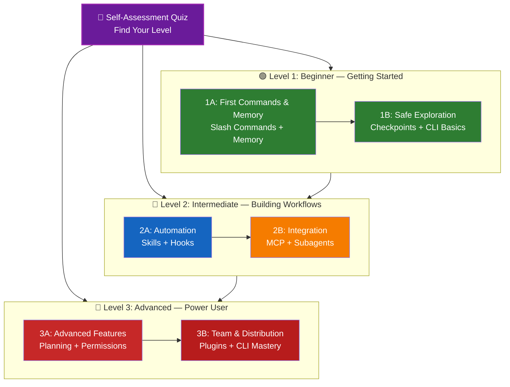

<picture>
  <source media="(prefers-color-scheme: dark)" srcset="./resources/logos/claude-howto-logo-dark.svg">
  
</picture>

# 📚 Claude Code Learning Roadmap

**New to Claude Code?** This guide helps you master Claude Code features at your own pace. Whether you're a complete beginner or an experienced developer, start with the self-assessment quiz below to find the right path for you.

---

## 🧭 Find Your Level

Not everyone starts from the same place. Take this quick self-assessment to find the right entry point.

**Answer these questions honestly:**

- [ ] I can start Claude Code and have a conversation (`claude`)
- [ ] I have created or edited a CLAUDE.md file
- [ ] I have used at least 3 built-in slash commands (e.g., /help, /compact, /model)
- [ ] I have created a custom slash command or skill (SKILL.md)
- [ ] I have configured an MCP server (e.g., GitHub, database)
- [ ] I have set up hooks in ~/.claude/settings.json
- [ ] I have created or used custom subagents (.claude/agents/)
- [ ] I have used print mode (`claude -p`) for scripting or CI/CD

**Your Level:**

| Checks | Level | Start At | Time to Complete |
|--------|-------|----------|------------------|
| 0-2 | **Level 1: Beginner** — Getting Started | [Milestone 1A](#milestone-1a-first-commands--memory) | ~3 hours |
| 3-5 | **Level 2: Intermediate** — Building Workflows | [Milestone 2A](#milestone-2a-automation-skills--hooks) | ~5 hours |
| 6-8 | **Level 3: Advanced** — Power User & Team Lead | [Milestone 3A](#milestone-3a-advanced-features) | ~5 hours |

> **Tip**: If you're unsure, start one level lower. It's better to review familiar material quickly than to miss foundational concepts.

> **Interactive version**: Run `/self-assessment` in Claude Code for a guided, interactive quiz that scores your proficiency across all 10 feature areas and generates a personalized learning path.

---

## 🎯 Learning Philosophy

The folders in this repository are numbered in **recommended learning order** based on three key principles:

1. **Dependencies** - Foundational concepts come first
2. **Complexity** - Easier features before advanced ones
3. **Frequency of Use** - Most common features taught early

This approach ensures you build a solid foundation while gaining immediate productivity benefits.

---

## 🗺️ Your Learning Path



**Color Legend:**
- 💜 Purple: Self-Assessment Quiz
- 🟢 Green: Level 1 — Beginner path
- 🔵 Blue / 🟡 Gold: Level 2 — Intermediate path
- 🔴 Red: Level 3 — Advanced path

---

## 📊 Complete Roadmap Table

| Step | Feature | Complexity | Time | Level | Dependencies | Why Learn This | Key Benefits |
|------|---------|-----------|------|-------|--------------|----------------|--------------|
| **1** | [Slash Commands](01-slash-commands/) | ⭐ Beginner | 30 min | Level 1 | None | Quick productivity wins (55+ built-in + 5 bundled skills) | Instant automation, team standards |
| **2** | [Memory](02-memory/) | ⭐⭐ Beginner+ | 45 min | Level 1 | None | Essential for all features | Persistent context, preferences |
| **3** | [Checkpoints](08-checkpoints/) | ⭐⭐ Intermediate | 45 min | Level 1 | Session management | Safe exploration | Experimentation, recovery |
| **4** | [CLI Basics](10-cli/) | ⭐⭐ Beginner+ | 30 min | Level 1 | None | Core CLI usage | Interactive & print mode |
| **5** | [Skills](03-skills/) | ⭐⭐ Intermediate | 1 hour | Level 2 | Slash Commands | Automatic expertise | Reusable capabilities, consistency |
| **6** | [Hooks](06-hooks/) | ⭐⭐ Intermediate | 1 hour | Level 2 | Tools, Commands | Workflow automation (25 events, 4 types) | Validation, quality gates |
| **7** | [MCP](05-mcp/) | ⭐⭐⭐ Intermediate+ | 1 hour | Level 2 | Configuration | Live data access | Real-time integration, APIs |
| **8** | [Subagents](04-subagents/) | ⭐⭐⭐ Intermediate+ | 1.5 hours | Level 2 | Memory, Commands | Complex task handling (6 built-in including Bash) | Delegation, specialized expertise |
| **9** | [Advanced Features](09-advanced-features/) | ⭐⭐⭐⭐⭐ Advanced | 2-3 hours | Level 3 | All previous | Power user tools | Planning, Auto Mode, Channels, Voice Dictation, permissions |
| **10** | [Plugins](07-plugins/) | ⭐⭐⭐⭐ Advanced | 2 hours | Level 3 | All previous | Complete solutions | Team onboarding, distribution |
| **11** | [CLI Mastery](10-cli/) | ⭐⭐⭐ Advanced | 1 hour | Level 3 | Recommended: All | Master command-line usage | Scripting, CI/CD, automation |

**Total Learning Time**: ~11-13 hours (or jump to your level and save time)

---

## 🟢 Level 1: Beginner — Getting Started

**For**: Users with 0-2 quiz checks
**Time**: ~3 hours
**Focus**: Immediate productivity, understanding fundamentals
**Outcome**: Comfortable daily user, ready for Level 2

### Milestone 1A: First Commands & Memory

**Topics**: Slash Commands + Memory
**Time**: 1-2 hours
**Complexity**: ⭐ Beginner
**Goal**: Immediate productivity boost with custom commands and persistent context

#### What You'll Achieve
✅ Create custom slash commands for repetitive tasks
✅ Set up project memory for team standards
✅ Configure personal preferences
✅ Understand how Claude loads context automatically

#### Hands-on Exercises

```bash
# Exercise 1: Install your first slash command
mkdir -p .claude/commands
cp 01-slash-commands/optimize.md .claude/commands/

# Exercise 2: Create project memory
cp 02-memory/project-CLAUDE.md ./CLAUDE.md

# Exercise 3: Try it out
# In Claude Code, type: /optimize
```

#### Success Criteria
- [ ] Successfully invoke `/optimize` command
- [ ] Claude remembers your project standards from CLAUDE.md
- [ ] You understand when to use slash commands vs. memory

#### Next Steps
Once comfortable, read:
- [01-slash-commands/README.md](01-slash-commands/README.md)
- [02-memory/README.md](02-memory/README.md)

> **Check your understanding**: Run `/lesson-quiz slash-commands` or `/lesson-quiz memory` in Claude Code to test what you've learned.

---

### Milestone 1B: Safe Exploration

**Topics**: Checkpoints + CLI Basics
**Time**: 1 hour
**Complexity**: ⭐⭐ Beginner+
**Goal**: Learn to experiment safely and use core CLI commands

#### What You'll Achieve
✅ Create and restore checkpoints for safe experimentation
✅ Understand interactive vs. print mode
✅ Use basic CLI flags and options
✅ Process files via piping

#### Hands-on Exercises

```bash
# Exercise 1: Try checkpoint workflow
# In Claude Code:
# Make some experimental changes, then press Esc+Esc or use /rewind
# Select the checkpoint before your experiment
# Choose "Restore code and conversation" to go back

# Exercise 2: Interactive vs Print mode
claude "explain this project"           # Interactive mode
claude -p "explain this function"       # Print mode (non-interactive)

# Exercise 3: Process file content via piping
cat error.log | claude -p "explain this error"
```

#### Success Criteria
- [ ] Created and reverted to a checkpoint
- [ ] Used both interactive and print mode
- [ ] Piped a file to Claude for analysis
- [ ] Understand when to use checkpoints for safe experimentation

#### Next Steps
- Read: [08-checkpoints/README.md](08-checkpoints/README.md)
- Read: [10-cli/README.md](10-cli/README.md)
- **Ready for Level 2!** Proceed to [Milestone 2A](#milestone-2a-automation-skills--hooks)

> **Check your understanding**: Run `/lesson-quiz checkpoints` or `/lesson-quiz cli` to verify you're ready for Level 2.

---

## 🔵 Level 2: Intermediate — Building Workflows

**For**: Users with 3-5 quiz checks
**Time**: ~5 hours
**Focus**: Automation, integration, task delegation
**Outcome**: Automated workflows, external integrations, ready for Level 3

### Prerequisites Check

Before starting Level 2, make sure you're comfortable with these Level 1 concepts:

- [ ] Can create and use slash commands ([01-slash-commands/](01-slash-commands/))
- [ ] Have set up project memory via CLAUDE.md ([02-memory/](02-memory/))
- [ ] Know how to create and restore checkpoints ([08-checkpoints/](08-checkpoints/))
- [ ] Can use `claude` and `claude -p` from the command line ([10-cli/](10-cli/))

> **Gaps?** Review the linked tutorials above before continuing.

---

### Milestone 2A: Automation (Skills + Hooks)

**Topics**: Skills + Hooks
**Time**: 2-3 hours
**Complexity**: ⭐⭐ Intermediate
**Goal**: Automate common workflows and quality checks

#### What You'll Achieve
✅ Auto-invoke specialized capabilities with YAML frontmatter (including `effort` and `shell` fields)
✅ Set up event-driven automation across 25 hook events
✅ Use all 4 hook types (command, http, prompt, agent)
✅ Enforce code quality standards
✅ Create custom hooks for your workflow

#### Hands-on Exercises

```bash
# Exercise 1: Install a skill
cp -r 03-skills/code-review ~/.claude/skills/

# Exercise 2: Set up hooks
mkdir -p ~/.claude/hooks
cp 06-hooks/pre-tool-check.sh ~/.claude/hooks/
chmod +x ~/.claude/hooks/pre-tool-check.sh

# Exercise 3: Configure hooks in settings
# Add to ~/.claude/settings.json:
{
  "hooks": {
    "PreToolUse": [
      {
        "matcher": "Bash",
        "hooks": [
          {
            "type": "command",
            "command": "~/.claude/hooks/pre-tool-check.sh"
          }
        ]
      }
    ]
  }
}
```

#### Success Criteria
- [ ] Code review skill automatically invoked when relevant
- [ ] PreToolUse hook runs before tool execution
- [ ] You understand skill auto-invocation vs. hook event triggers

#### Next Steps
- Create your own custom skill
- Set up additional hooks for your workflow
- Read: [03-skills/README.md](03-skills/README.md)
- Read: [06-hooks/README.md](06-hooks/README.md)

> **Check your understanding**: Run `/lesson-quiz skills` or `/lesson-quiz hooks` to test your knowledge before moving on.

---

### Milestone 2B: Integration (MCP + Subagents)

**Topics**: MCP + Subagents
**Time**: 2-3 hours
**Complexity**: ⭐⭐⭐ Intermediate+
**Goal**: Integrate external services and delegate complex tasks

#### What You'll Achieve
✅ Access live data from GitHub, databases, etc.
✅ Delegate work to specialized AI agents
✅ Understand when to use MCP vs. subagents
✅ Build integrated workflows

#### Hands-on Exercises

```bash
# Exercise 1: Set up GitHub MCP
export GITHUB_TOKEN="your_github_token"
claude mcp add github -- npx -y @modelcontextprotocol/server-github

# Exercise 2: Test MCP integration
# In Claude Code: /mcp__github__list_prs

# Exercise 3: Install subagents
mkdir -p .claude/agents
cp 04-subagents/*.md .claude/agents/
```

#### Integration Exercise
Try this complete workflow:
1. Use MCP to fetch a GitHub PR
2. Let Claude delegate review to code-reviewer subagent
3. Use hooks to run tests automatically

#### Success Criteria
- [ ] Successfully query GitHub data via MCP
- [ ] Claude delegates complex tasks to subagents
- [ ] You understand the difference between MCP and subagents
- [ ] Combined MCP + subagents + hooks in a workflow

#### Next Steps
- Set up additional MCP servers (database, Slack, etc.)
- Create custom subagents for your domain
- Read: [05-mcp/README.md](05-mcp/README.md)
- Read: [04-subagents/README.md](04-subagents/README.md)
- **Ready for Level 3!** Proceed to [Milestone 3A](#milestone-3a-advanced-features)

> **Check your understanding**: Run `/lesson-quiz mcp` or `/lesson-quiz subagents` to verify you're ready for Level 3.

---

## 🔴 Level 3: Advanced — Power User & Team Lead

**For**: Users with 6-8 quiz checks
**Time**: ~5 hours
**Focus**: Team tooling, CI/CD, enterprise features, plugin development
**Outcome**: Power user, can set up team workflows and CI/CD

### Prerequisites Check

Before starting Level 3, make sure you're comfortable with these Level 2 concepts:

- [ ] Can create and use skills with auto-invocation ([03-skills/](03-skills/))
- [ ] Have set up hooks for event-driven automation ([06-hooks/](06-hooks/))
- [ ] Can configure MCP servers for external data ([05-mcp/](05-mcp/))
- [ ] Know how to use subagents for task delegation ([04-subagents/](04-subagents/))

> **Gaps?** Review the linked tutorials above before continuing.

---

### Milestone 3A: Advanced Features

**Topics**: Advanced Features (Planning, Permissions, Extended Thinking, Auto Mode, Channels, Voice Dictation, Remote/Desktop/Web)
**Time**: 2-3 hours
**Complexity**: ⭐⭐⭐⭐⭐ Advanced
**Goal**: Master advanced workflows and power user tools

#### What You'll Achieve
✅ Planning mode for complex features
✅ Fine-grained permission control with 6 modes (default, acceptEdits, plan, auto, dontAsk, bypassPermissions)
✅ Extended thinking via Alt+T / Option+T toggle
✅ Background task management
✅ Auto Memory for learned preferences
✅ Auto Mode with background safety classifier
✅ Channels for structured multi-session workflows
✅ Voice Dictation for hands-free interaction
✅ Remote control, desktop app, and web sessions
✅ Agent Teams for multi-agent collaboration

#### Hands-on Exercises

```bash
# Exercise 1: Use planning mode
/plan Implement user authentication system

# Exercise 2: Try permission modes (6 available: default, acceptEdits, plan, auto, dontAsk, bypassPermissions)
claude --permission-mode plan "analyze this codebase"
claude --permission-mode acceptEdits "refactor the auth module"
claude --permission-mode auto "implement the feature"

# Exercise 3: Enable extended thinking
# Press Alt+T (Option+T on macOS) during a session to toggle

# Exercise 4: Advanced checkpoint workflow
# 1. Create checkpoint "Clean state"
# 2. Use planning mode to design a feature
# 3. Implement with subagent delegation
# 4. Run tests in background
# 5. If tests fail, rewind to checkpoint
# 6. Try alternative approach

# Exercise 5: Try auto mode (background safety classifier)
claude --permission-mode auto "implement user settings page"

# Exercise 6: Enable agent teams
export CLAUDE_AGENT_TEAMS=1
# Ask Claude: "Implement feature X using a team approach"

# Exercise 7: Scheduled tasks
/loop 5m /check-status
# Or use CronCreate for persistent scheduled tasks

# Exercise 8: Channels for multi-session workflows
# Use channels to organize work across sessions

# Exercise 9: Voice Dictation
# Use voice input for hands-free interaction with Claude Code
```

#### Success Criteria
- [ ] Used planning mode for a complex feature
- [ ] Configured permission modes (plan, acceptEdits, auto, dontAsk)
- [ ] Toggled extended thinking with Alt+T / Option+T
- [ ] Used auto mode with background safety classifier
- [ ] Used background tasks for long operations
- [ ] Explored Channels for multi-session workflows
- [ ] Tried Voice Dictation for hands-free input
- [ ] Understand Remote Control, Desktop App, and Web sessions
- [ ] Enabled and used Agent Teams for collaborative tasks
- [ ] Used `/loop` for recurring tasks or scheduled monitoring

#### Next Steps
- Read: [09-advanced-features/README.md](09-advanced-features/README.md)

> **Check your understanding**: Run `/lesson-quiz advanced` to test your mastery of power user features.

---

### Milestone 3B: Team & Distribution (Plugins + CLI Mastery)

**Topics**: Plugins + CLI Mastery + CI/CD
**Time**: 2-3 hours
**Complexity**: ⭐⭐⭐⭐ Advanced
**Goal**: Build team tooling, create plugins, master CI/CD integration

#### What You'll Achieve
✅ Install and create complete bundled plugins
✅ Master CLI for scripting and automation
✅ Set up CI/CD integration with `claude -p`
✅ JSON output for automated pipelines
✅ Session management and batch processing

#### Hands-on Exercises

```bash
# Exercise 1: Install a complete plugin
# In Claude Code: /plugin install pr-review

# Exercise 2: Print mode for CI/CD
claude -p "Run all tests and generate report"

# Exercise 3: JSON output for scripts
claude -p --output-format json "list all functions"

# Exercise 4: Session management and resumption
claude -r "feature-auth" "continue implementation"

# Exercise 5: CI/CD integration with constraints
claude -p --max-turns 3 --output-format json "review code"

# Exercise 6: Batch processing
for file in *.md; do
  claude -p --output-format json "summarize this: $(cat $file)" > ${file%.md}.summary.json
done
```

#### CI/CD Integration Exercise
Create a simple CI/CD script:
1. Use `claude -p` to review changed files
2. Output results as JSON
3. Process with `jq` for specific issues
4. Integrate into GitHub Actions workflow

#### Success Criteria
- [ ] Installed and used a plugin
- [ ] Built or modified a plugin for your team
- [ ] Used print mode (`claude -p`) in CI/CD
- [ ] Generated JSON output for scripting
- [ ] Resumed a previous session successfully
- [ ] Created a batch processing script
- [ ] Integrated Claude into a CI/CD workflow

#### Real-World Use Cases for CLI
- **Code Review Automation**: Run code reviews in CI/CD pipelines
- **Log Analysis**: Analyze error logs and system outputs
- **Documentation Generation**: Batch generate documentation
- **Testing Insights**: Analyze test failures
- **Performance Analysis**: Review performance metrics
- **Data Processing**: Transform and analyze data files

#### Next Steps
- Read: [07-plugins/README.md](07-plugins/README.md)
- Read: [10-cli/README.md](10-cli/README.md)
- Create team-wide CLI shortcuts and plugins
- Set up batch processing scripts

> **Check your understanding**: Run `/lesson-quiz plugins` or `/lesson-quiz cli` to confirm your mastery.

---

## 🧪 Test Your Knowledge

This repository includes two interactive skills you can use anytime in Claude Code to evaluate your understanding:

| Skill | Command | Purpose |
|-------|---------|---------|
| **Self-Assessment** | `/self-assessment` | Evaluate your overall proficiency across all 10 features. Choose Quick (2 min) or Deep (5 min) mode to get a personalized skill profile and learning path. |
| **Lesson Quiz** | `/lesson-quiz [lesson]` | Test your understanding of a specific lesson with 10 questions. Use before a lesson (pre-test), during (progress check), or after (mastery verification). |

**Examples:**
```
/self-assessment                  # Find your overall level
/lesson-quiz hooks                # Quiz on Lesson 06: Hooks
/lesson-quiz 03                   # Quiz on Lesson 03: Skills
/lesson-quiz advanced-features    # Quiz on Lesson 09
```

---

## ⚡ Quick Start Paths

### If You Only Have 15 Minutes
**Goal**: Get your first win

1. Copy one slash command: `cp 01-slash-commands/optimize.md .claude/commands/`
2. Try it in Claude Code: `/optimize`
3. Read: [01-slash-commands/README.md](01-slash-commands/README.md)

**Outcome**: You'll have a working slash command and understand the basics

---

### If You Have 1 Hour
**Goal**: Set up essential productivity tools

1. **Slash commands** (15 min): Copy and test `/optimize` and `/pr`
2. **Project memory** (15 min): Create CLAUDE.md with your project standards
3. **Install a skill** (15 min): Set up code-review skill
4. **Try them together** (15 min): See how they work in harmony

**Outcome**: Basic productivity boost with commands, memory, and auto-skills

---

### If You Have a Weekend
**Goal**: Become proficient with most features

**Saturday Morning** (3 hours):
- Complete Milestone 1A: Slash Commands + Memory
- Complete Milestone 1B: Checkpoints + CLI Basics

**Saturday Afternoon** (3 hours):
- Complete Milestone 2A: Skills + Hooks
- Complete Milestone 2B: MCP + Subagents

**Sunday** (4 hours):
- Complete Milestone 3A: Advanced Features
- Complete Milestone 3B: Plugins + CLI Mastery + CI/CD
- Build a custom plugin for your team

**Outcome**: You'll be a Claude Code power user ready to train others and automate complex workflows

---

## 💡 Learning Tips

### ✅ Do

- **Take the quiz first** to find your starting point
- **Complete hands-on exercises** for each milestone
- **Start simple** and add complexity gradually
- **Test each feature** before moving to the next
- **Take notes** on what works for your workflow
- **Refer back** to earlier concepts as you learn advanced topics
- **Experiment safely** using checkpoints
- **Share knowledge** with your team

### ❌ Don't

- **Skip the prerequisites check** when jumping to a higher level
- **Try to learn everything at once** - it's overwhelming
- **Copy configurations without understanding them** - you won't know how to debug
- **Forget to test** - always verify features work
- **Rush through milestones** - take time to understand
- **Ignore the documentation** - each README has valuable details
- **Work in isolation** - discuss with teammates

---

## 🎓 Learning Styles

### Visual Learners
- Study the mermaid diagrams in each README
- Watch the command execution flow
- Draw your own workflow diagrams
- Use the visual learning path above

### Hands-on Learners
- Complete every hands-on exercise
- Experiment with variations
- Break things and fix them (use checkpoints!)
- Create your own examples

### Reading Learners
- Read each README thoroughly
- Study the code examples
- Review the comparison tables
- Read the blog posts linked in resources

### Social Learners
- Set up pair programming sessions
- Teach concepts to teammates
- Join Claude Code community discussions
- Share your custom configurations

---

## 📈 Progress Tracking

Use these checklists to track your progress by level. Run `/self-assessment` anytime to get an updated skill profile, or `/lesson-quiz [lesson]` after each tutorial to verify your understanding.

### 🟢 Level 1: Beginner
- [ ] Completed [01-slash-commands](01-slash-commands/)
- [ ] Completed [02-memory](02-memory/)
- [ ] Created first custom slash command
- [ ] Set up project memory
- [ ] **Milestone 1A achieved**
- [ ] Completed [08-checkpoints](08-checkpoints/)
- [ ] Completed [10-cli](10-cli/) basics
- [ ] Created and reverted to a checkpoint
- [ ] Used interactive and print mode
- [ ] **Milestone 1B achieved**

### 🔵 Level 2: Intermediate
- [ ] Completed [03-skills](03-skills/)
- [ ] Completed [06-hooks](06-hooks/)
- [ ] Installed first skill
- [ ] Set up PreToolUse hook
- [ ] **Milestone 2A achieved**
- [ ] Completed [05-mcp](05-mcp/)
- [ ] Completed [04-subagents](04-subagents/)
- [ ] Connected GitHub MCP
- [ ] Created custom subagent
- [ ] Combined integrations in a workflow
- [ ] **Milestone 2B achieved**

### 🔴 Level 3: Advanced
- [ ] Completed [09-advanced-features](09-advanced-features/)
- [ ] Used planning mode successfully
- [ ] Configured permission modes (6 modes including auto)
- [ ] Used auto mode with safety classifier
- [ ] Used extended thinking toggle
- [ ] Explored Channels and Voice Dictation
- [ ] **Milestone 3A achieved**
- [ ] Completed [07-plugins](07-plugins/)
- [ ] Completed [10-cli](10-cli/) advanced usage
- [ ] Set up print mode (`claude -p`) CI/CD
- [ ] Created JSON output for automation
- [ ] Integrated Claude into CI/CD pipeline
- [ ] Created team plugin
- [ ] **Milestone 3B achieved**

---

## 🆘 Common Learning Challenges

### Challenge 1: "Too many concepts at once"
**Solution**: Focus on one milestone at a time. Complete all exercises before moving forward.

### Challenge 2: "Don't know which feature to use when"
**Solution**: Refer to the [Use Case Matrix](README.md#use-case-matrix) in the main README.

### Challenge 3: "Configuration not working"
**Solution**: Check the [Troubleshooting](README.md#troubleshooting) section and verify file locations.

### Challenge 4: "Concepts seem to overlap"
**Solution**: Review the [Feature Comparison](README.md#feature-comparison) table to understand differences.

### Challenge 5: "Hard to remember everything"
**Solution**: Create your own cheat sheet. Use checkpoints to experiment safely.

### Challenge 6: "I'm experienced but not sure where to start"
**Solution**: Take the [Self-Assessment Quiz](#-find-your-level) above. Skip to your level and use the prerequisites check to identify any gaps.

---

## 🎯 What's Next After Completion?

Once you've completed all milestones:

1. **Create team documentation** - Document your team's Claude Code setup
2. **Build custom plugins** - Package your team's workflows
3. **Explore Remote Control** - Control Claude Code sessions programmatically from external tools
4. **Try Web Sessions** - Use Claude Code through browser-based interfaces for remote development
5. **Use the Desktop App** - Access Claude Code features through the native desktop application
6. **Use Auto Mode** - Let Claude work autonomously with a background safety classifier
7. **Leverage Auto Memory** - Let Claude learn your preferences automatically over time
8. **Set up Agent Teams** - Coordinate multiple agents on complex, multi-faceted tasks
9. **Use Channels** - Organize work across structured multi-session workflows
10. **Try Voice Dictation** - Use hands-free voice input for interaction with Claude Code
11. **Use Scheduled Tasks** - Automate recurring checks with `/loop` and cron tools
12. **Contribute examples** - Share with the community
13. **Mentor others** - Help teammates learn
14. **Optimize workflows** - Continuously improve based on usage
15. **Stay updated** - Follow Claude Code releases and new features

---

## 📚 Additional Resources

### Official Documentation
- [Claude Code Documentation](https://code.claude.com/docs/en/overview)
- [Anthropic Documentation](https://docs.anthropic.com)
- [MCP Protocol Specification](https://modelcontextprotocol.io)

### Blog Posts
- [Discovering Claude Code Slash Commands](https://medium.com/@luongnv89/discovering-claude-code-slash-commands-cdc17f0dfb29)

### Community
- [Anthropic Cookbook](https://github.com/anthropics/anthropic-cookbook)
- [MCP Servers Repository](https://github.com/modelcontextprotocol/servers)

---

## 💬 Feedback & Support

- **Found an issue?** Create an issue in the repository
- **Have a suggestion?** Submit a pull request
- **Need help?** Check the documentation or ask the community

---

**Last Updated**: April 16, 2026
**Claude Code Version**: 2.1.112
**Sources**:
- https://docs.anthropic.com/en/docs/claude-code
- https://www.anthropic.com/news/claude-opus-4-7
- https://support.claude.com/en/articles/12138966-release-notes
**Compatible Models**: Claude Sonnet 4.6, Claude Opus 4.7, Claude Haiku 4.5
**Maintained by**: Claude How-To Contributors
**License**: Educational purposes, free to use and adapt

---

[← Back to Main README](README.md)
