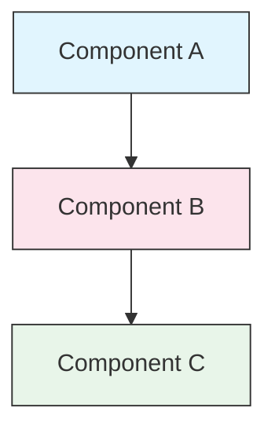

<picture>
  <source media="(prefers-color-scheme: dark)" srcset="./resources/logos/claude-howto-logo-dark.svg">
  
</picture>

# Style Guide

> Conventions and formatting rules for contributing to Claude How To. Follow this guide to keep content consistent, professional, and easy to maintain.

---

## Table of Contents

- [File and Folder Naming](#file-and-folder-naming)
- [Document Structure](#document-structure)
- [Headings](#headings)
- [Text Formatting](#text-formatting)
- [Lists](#lists)
- [Tables](#tables)
- [Code Blocks](#code-blocks)
- [Links and Cross-References](#links-and-cross-references)
- [Diagrams](#diagrams)
- [Emoji Usage](#emoji-usage)
- [YAML Frontmatter](#yaml-frontmatter)
- [Images and Media](#images-and-media)
- [Tone and Voice](#tone-and-voice)
- [Commit Messages](#commit-messages)
- [Checklist for Authors](#checklist-for-authors)

---

## File and Folder Naming

### Lesson Folders

Lesson folders use a **two-digit numbered prefix** followed by a **kebab-case** descriptor:

```
01-slash-commands/
02-memory/
03-skills/
04-subagents/
05-mcp/
```

The number reflects the learning path order from beginner to advanced.

### File Names

| Type | Convention | Examples |
|------|-----------|----------|
| **Lesson README** | `README.md` | `01-slash-commands/README.md` |
| **Feature file** | Kebab-case `.md` | `code-reviewer.md`, `generate-api-docs.md` |
| **Shell script** | Kebab-case `.sh` | `format-code.sh`, `validate-input.sh` |
| **Config file** | Standard names | `.mcp.json`, `settings.json` |
| **Memory file** | Scope-prefixed | `project-CLAUDE.md`, `personal-CLAUDE.md` |
| **Top-level docs** | UPPER_CASE `.md` | `CATALOG.md`, `QUICK_REFERENCE.md`, `CONTRIBUTING.md` |
| **Image assets** | Kebab-case | `pr-slash-command.png`, `claude-howto-logo.svg` |

### Rules

- Use **lowercase** for all file and folder names (except top-level docs like `README.md`, `CATALOG.md`)
- Use **hyphens** (`-`) as word separators, never underscores or spaces
- Keep names descriptive but concise

---

## Document Structure

### Root README

The root `README.md` follows this order:

1. Logo (`<picture>` element with dark/light variants)
2. H1 title
3. Introductory blockquote (one-line value proposition)
4. "Why This Guide?" section with comparison table
5. Horizontal rule (`---`)
6. Table of Contents
7. Feature Catalog
8. Quick Navigation
9. Learning Path
10. Feature sections
11. Getting Started
12. Best Practices / Troubleshooting
13. Contributing / License

### Lesson README

Each lesson `README.md` follows this order:

1. H1 title (e.g., `# Slash Commands`)
2. Brief overview paragraph
3. Quick reference table (optional)
4. Architecture diagram (Mermaid)
5. Detailed sections (H2)
6. Practical examples (numbered, 4-6 examples)
7. Best practices (Do's and Don'ts tables)
8. Troubleshooting
9. Related guides / Official documentation
10. Document metadata footer

### Feature/Example File

Individual feature files (e.g., `optimize.md`, `pr.md`):

1. YAML frontmatter (if applicable)
2. H1 title
3. Purpose / description
4. Usage instructions
5. Code examples
6. Customization tips

### Section Separators

Use horizontal rules (`---`) to separate major document regions:

```markdown
---

## New Major Section
```

Place them after the introductory blockquote and between logically distinct parts of the document.

---

## Headings

### Hierarchy

| Level | Use | Example |
|-------|-----|---------|
| `#` H1 | Page title (one per document) | `# Slash Commands` |
| `##` H2 | Major sections | `## Best Practices` |
| `###` H3 | Subsections | `### Adding a Skill` |
| `####` H4 | Sub-subsections (rare) | `#### Configuration Options` |

### Rules

- **One H1 per document** — the page title only
- **Never skip levels** — don't jump from H2 to H4
- **Keep headings concise** — aim for 2-5 words
- **Use sentence case** — capitalize first word and proper nouns only (exception: feature names stay as-is)
- **Add emoji prefixes only on root README** section headers (see [Emoji Usage](#emoji-usage))

---

## Text Formatting

### Emphasis

| Style | When to Use | Example |
|-------|------------|---------|
| **Bold** (`**text**`) | Key terms, labels in tables, important concepts | `**Installation**:` |
| *Italic* (`*text*`) | First use of a technical term, book/doc titles | `*frontmatter*` |
| `Code` (`` `text` ``) | File names, commands, config values, code references | `` `CLAUDE.md` `` |

### Blockquotes for Callouts

Use blockquotes with bold prefixes for important notes:

```markdown
> **Note**: Custom slash commands have been merged into skills since v2.0.

> **Important**: Never commit API keys or credentials.

> **Tip**: Combine memory with skills for maximum effectiveness.
```

Supported callout types: **Note**, **Important**, **Tip**, **Warning**.

### Paragraphs

- Keep paragraphs short (2-4 sentences)
- Add a blank line between paragraphs
- Lead with the key point, then provide context
- Explain the "why" not just the "what"

---

## Lists

### Unordered Lists

Use dashes (`-`) with 2-space indentation for nesting:

```markdown
- First item
- Second item
  - Nested item
  - Another nested item
    - Deep nested (avoid going deeper than 3 levels)
- Third item
```

### Ordered Lists

Use numbered lists for sequential steps, instructions, and ranked items:

```markdown
1. First step
2. Second step
   - Sub-point detail
   - Another sub-point
3. Third step
```

### Descriptive Lists

Use bold labels for key-value style lists:

```markdown
- **Performance bottlenecks** - identify O(n^2) operations, inefficient loops
- **Memory leaks** - find unreleased resources, circular references
- **Algorithm improvements** - suggest better algorithms or data structures
```

### Rules

- Maintain consistent indentation (2 spaces per level)
- Add a blank line before and after a list
- Keep list items parallel in structure (all start with verb, or all are nouns, etc.)
- Avoid nesting deeper than 3 levels

---

## Tables

### Standard Format

```markdown
| Column 1 | Column 2 | Column 3 |
|----------|----------|----------|
| Data     | Data     | Data     |
```

### Common Table Patterns

**Feature comparison (3-4 columns):**

```markdown
| Feature | Invocation | Persistence | Best For |
|---------|-----------|------------|----------|
| **Slash Commands** | Manual (`/cmd`) | Session only | Quick shortcuts |
| **Memory** | Auto-loaded | Cross-session | Long-term learning |
```

**Do's and Don'ts:**

```markdown
| Do | Don't |
|----|-------|
| Use descriptive names | Use vague names |
| Keep files focused | Overload a single file |
```

**Quick reference:**

```markdown
| Aspect | Details |
|--------|---------|
| **Purpose** | Generate API documentation |
| **Scope** | Project-level |
| **Complexity** | Intermediate |
```

### Rules

- **Bold table headers** when they are row labels (first column)
- Align pipes for readability in source (optional but preferred)
- Keep cell content concise; use links for details
- Use `code formatting` for commands and file paths inside cells

---

## Code Blocks

### Language Tags

Always specify a language tag for syntax highlighting:

| Language | Tag | Use For |
|----------|-----|---------|
| Shell | `bash` | CLI commands, scripts |
| Python | `python` | Python code |
| JavaScript | `javascript` | JS code |
| TypeScript | `typescript` | TS code |
| JSON | `json` | Configuration files |
| YAML | `yaml` | Frontmatter, config |
| Markdown | `markdown` | Markdown examples |
| SQL | `sql` | Database queries |
| Plain text | (no tag) | Expected output, directory trees |

### Conventions

```bash
# Comment explaining what the command does
claude mcp add notion --transport http https://mcp.notion.com/mcp
```

- Add a **comment line** before non-obvious commands
- Make all examples **copy-paste ready**
- Show **both simple and advanced** versions when relevant
- Include **expected output** when it aids understanding (use untagged code block)

### Installation Blocks

Use this pattern for installation instructions:

```bash
# Copy files to your project
cp 01-slash-commands/*.md .claude/commands/
```

### Multi-step Workflows

```bash
# Step 1: Create the directory
mkdir -p .claude/commands

# Step 2: Copy the templates
cp 01-slash-commands/*.md .claude/commands/

# Step 3: Verify installation
ls .claude/commands/
```

---

## Links and Cross-References

### Internal Links (Relative)

Use relative paths for all internal links:

```markdown
[Slash Commands](01-slash-commands/)
[Skills Guide](03-skills/)
[Memory Architecture](02-memory/#memory-architecture)
```

From a lesson folder back to root or sibling:

```markdown
[Back to main guide](../README.md)
[Related: Skills](../03-skills/)
```

### External Links (Absolute)

Use full URLs with descriptive anchor text:

```markdown
[Anthropic's official documentation](https://code.claude.com/docs/en/overview)
```

- Never use "click here" or "this link" as anchor text
- Use descriptive text that makes sense out of context

### Section Anchors

Link to sections within the same document using GitHub-style anchors:

```markdown
[Feature Catalog](#-feature-catalog)
[Best Practices](#best-practices)
```

### Related Guides Pattern

End lessons with a related guides section:

```markdown
## Related Guides

- [Slash Commands](../01-slash-commands/) - Quick shortcuts
- [Memory](../02-memory/) - Persistent context
- [Skills](../03-skills/) - Reusable capabilities
```

---

## Diagrams

### Mermaid

Use Mermaid for all diagrams. Supported types:

- `graph TB` / `graph LR` — architecture, hierarchy, flow
- `sequenceDiagram` — interaction flows
- `timeline` — chronological sequences

### Style Conventions

Apply consistent colors using style blocks:



**Color palette:**

| Color | Hex | Use For |
|-------|-----|---------|
| Light blue | `#e1f5fe` | Primary components, inputs |
| Light pink | `#fce4ec` | Processing, middleware |
| Light green | `#e8f5e9` | Outputs, results |
| Light yellow | `#fff9c4` | Configuration, optional |
| Light purple | `#f3e5f5` | User-facing, UI |

### Rules

- Use `["Label text"]` for node labels (enables special characters)
- Use `<br/>` for line breaks within labels
- Keep diagrams simple (max 10-12 nodes)
- Add a brief text description below the diagram for accessibility
- Use top-to-bottom (`TB`) for hierarchies, left-to-right (`LR`) for workflows

---

## Emoji Usage

### Where Emojis Are Used

Emojis are used **sparingly and purposefully** — only in specific contexts:

| Context | Emojis | Example |
|---------|--------|---------|
| Root README section headers | Category icons | `## 📚 Learning Path` |
| Skill level indicators | Colored circles | 🟢 Beginner, 🔵 Intermediate, 🔴 Advanced |
| Do's and Don'ts | Check/cross marks | ✅ Do this, ❌ Don't do this |
| Complexity ratings | Stars | ⭐⭐⭐ |

### Standard Emoji Set

| Emoji | Meaning |
|-------|---------|
| 📚 | Learning, guides, documentation |
| ⚡ | Getting started, quick reference |
| 🎯 | Features, quick reference |
| 🎓 | Learning paths |
| 📊 | Statistics, comparisons |
| 🚀 | Installation, quick commands |
| 🟢 | Beginner level |
| 🔵 | Intermediate level |
| 🔴 | Advanced level |
| ✅ | Recommended practice |
| ❌ | Avoid / anti-pattern |
| ⭐ | Complexity rating unit |

### Rules

- **Never use emojis in body text** or paragraphs
- **Only use emojis in headers** on the root README (not in lesson READMEs)
- **Do not add decorative emojis** — every emoji should convey meaning
- Keep emoji usage consistent with the table above

---

## YAML Frontmatter

### Feature Files (Skills, Commands, Agents)

```yaml
---
name: unique-identifier
description: What this feature does and when to use it
allowed-tools: Bash, Read, Grep
---
```

### Optional Fields

```yaml
---
name: my-feature
description: Brief description
argument-hint: "[file-path] [options]"
allowed-tools: Bash, Read, Grep, Write, Edit
model: opus                        # opus, sonnet, or haiku
disable-model-invocation: true     # User-only invocation
user-invocable: false              # Hidden from user menu
context: fork                      # Run in isolated subagent
agent: Explore                     # Agent type for context: fork
---
```

### Rules

- Place frontmatter at the very top of the file
- Use **kebab-case** for the `name` field
- Keep `description` to one sentence
- Only include fields that are needed

---

## Images and Media

### Logo Pattern

All documents that start with a logo use the `<picture>` element for dark/light mode support:

```html
<picture>
  <source media="(prefers-color-scheme: dark)" srcset="./resources/logos/claude-howto-logo-dark.svg">
  
</picture>
```

### Screenshots

- Store in the relevant lesson folder (e.g., `01-slash-commands/pr-slash-command.png`)
- Use kebab-case file names
- Include descriptive alt text
- Prefer SVG for diagrams, PNG for screenshots

### Rules

- Always provide alt text for images
- Keep image file sizes reasonable (< 500KB for PNGs)
- Use relative paths for image references
- Store images in the same directory as the document that references them, or in `assets/` for shared images

---

## Tone and Voice

### Writing Style

- **Professional but approachable** — technical accuracy without jargon overload
- **Active voice** — "Create a file" not "A file should be created"
- **Direct instructions** — "Run this command" not "You might want to run this command"
- **Beginner-friendly** — assume the reader is new to Claude Code, not new to programming

### Content Principles

| Principle | Example |
|-----------|---------|
| **Show, don't tell** | Provide working examples, not abstract descriptions |
| **Progressive complexity** | Start simple, add depth in later sections |
| **Explain the "why"** | "Use memory for... because..." not just "Use memory for..." |
| **Copy-paste ready** | Every code block should work when pasted directly |
| **Real-world context** | Use practical scenarios, not contrived examples |

### Vocabulary

- Use "Claude Code" (not "Claude CLI" or "the tool")
- Use "skill" (not "custom command" — legacy term)
- Use "lesson" or "guide" for the numbered sections
- Use "example" for individual feature files

---

## Commit Messages

Follow [Conventional Commits](https://www.conventionalcommits.org/):

```
type(scope): description
```

### Types

| Type | Use For |
|------|---------|
| `feat` | New feature, example, or guide |
| `fix` | Bug fix, correction, broken link |
| `docs` | Documentation improvements |
| `refactor` | Restructuring without changing behavior |
| `style` | Formatting changes only |
| `test` | Test additions or changes |
| `chore` | Build, dependencies, CI |

### Scopes

Use the lesson name or file area as scope:

```
feat(slash-commands): Add API documentation generator
docs(memory): Improve personal preferences example
fix(README): Correct table of contents link
docs(skills): Add comprehensive code review skill
```

---

## Document Metadata Footer

Lesson READMEs end with a metadata block:

```markdown
---
**Last Updated**: March 2026
**Claude Code Version**: 2.1.97
**Compatible Models**: Claude Sonnet 4.6, Claude Opus 4.7, Claude Haiku 4.5
```

- Use month + year format (e.g., "March 2026")
- Update the version when features change
- List all compatible models

---

## Checklist for Authors

Before submitting content, verify:

- [ ] File/folder names use kebab-case
- [ ] Document starts with H1 title (one per file)
- [ ] Heading hierarchy is correct (no skipped levels)
- [ ] All code blocks have language tags
- [ ] Code examples are copy-paste ready
- [ ] Internal links use relative paths
- [ ] External links have descriptive anchor text
- [ ] Tables are properly formatted
- [ ] Emojis follow the standard set (if used at all)
- [ ] Mermaid diagrams use the standard color palette
- [ ] No sensitive information (API keys, credentials)
- [ ] YAML frontmatter is valid (if applicable)
- [ ] Images have alt text
- [ ] Paragraphs are short and focused
- [ ] Related guides section links to relevant lessons
- [ ] Commit message follows conventional commits format

---

**Last Updated**: April 16, 2026
**Claude Code Version**: 2.1.112
**Sources**:
- https://docs.anthropic.com/en/docs/claude-code
- https://www.anthropic.com/news/claude-opus-4-7
- https://support.claude.com/en/articles/12138966-release-notes
**Compatible Models**: Claude Sonnet 4.6, Claude Opus 4.7, Claude Haiku 4.5
