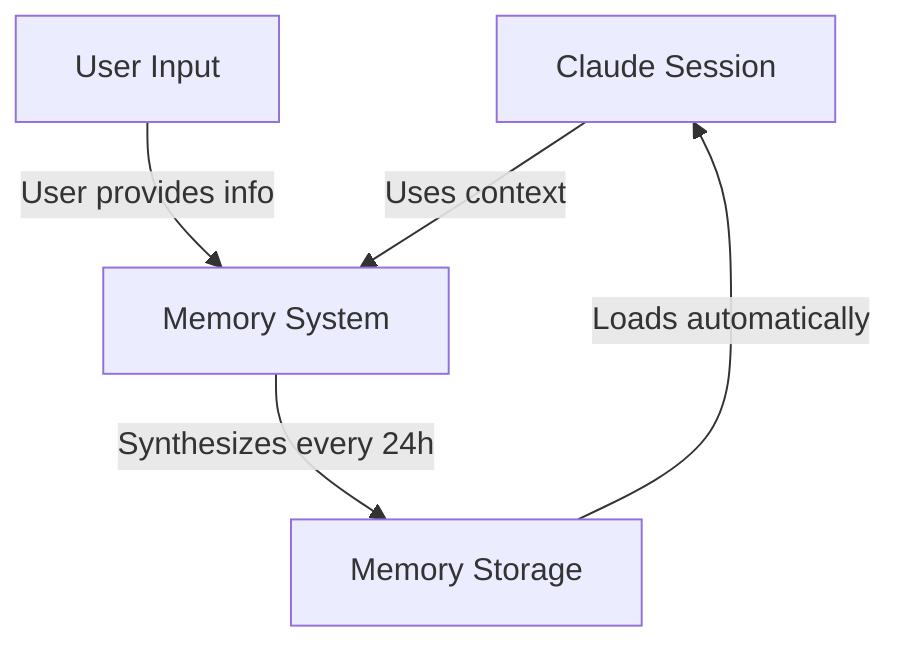
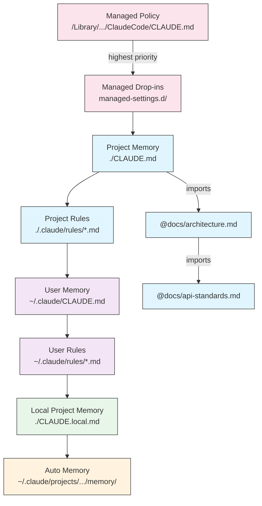
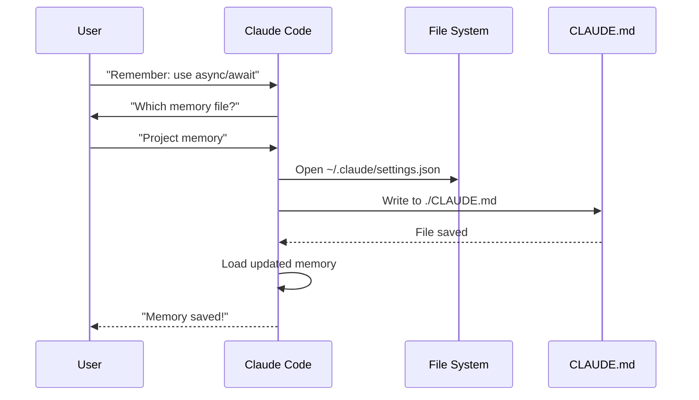
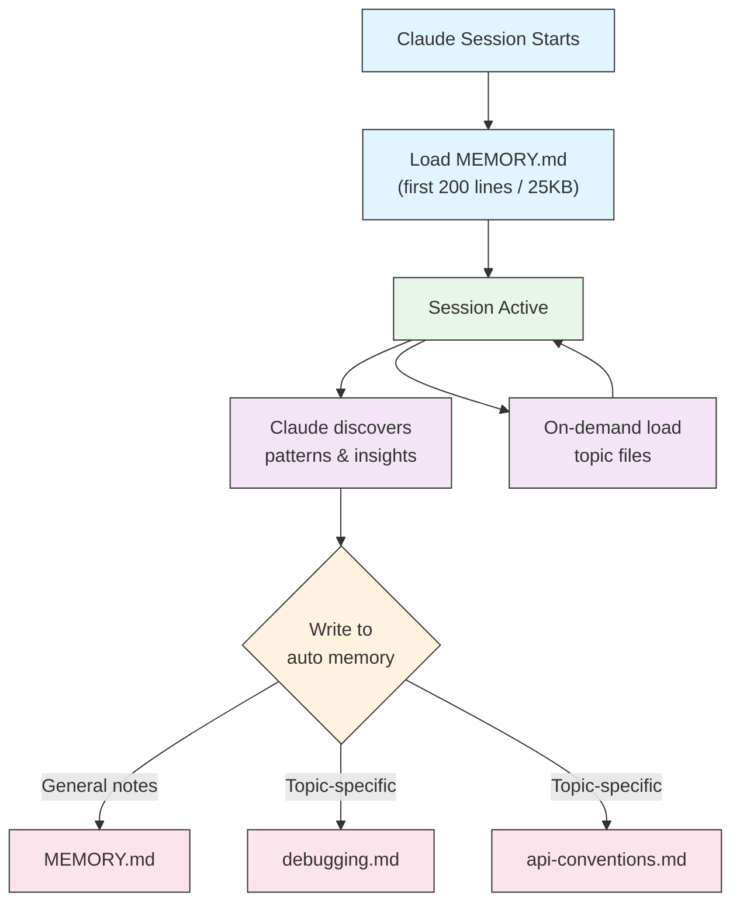

<!-- i18n-source: 02-memory/README.md -->
<!-- i18n-source-sha: 63a1416 -->
<!-- i18n-date: 2026-04-09 -->

<picture>
  <source media="(prefers-color-scheme: dark)" srcset="../../resources/logos/claude-howto-logo-dark.svg">
  
</picture>

# Посібник з пам'яті

Пам'ять дозволяє Claude зберігати контекст між сесіями та розмовами. Вона існує у двох формах: автоматичний синтез у claude.ai та файлова система CLAUDE.md у Claude Code.

## Огляд

Пам'ять у Claude Code забезпечує постійний контекст, який зберігається між кількома сесіями та розмовами. На відміну від тимчасового контекстного вікна, файли пам'яті дозволяють:

- Поширювати стандарти проєкту на всю команду
- Зберігати персональні налаштування розробки
- Підтримувати правила та конфігурації для конкретних каталогів
- Імпортувати зовнішню документацію
- Версіонувати пам'ять як частину проєкту

Система пам'яті працює на кількох рівнях — від глобальних персональних налаштувань до конкретних підкаталогів — забезпечуючи детальний контроль над тим, що Claude запам'ятовує і як застосовує ці знання.

## Короткий довідник команд пам'яті

| Команда | Призначення | Використання | Коли застосовувати |
|---------|------------|--------------|-------------------|
| `/init` | Ініціалізація пам'яті проєкту | `/init` | Початок нового проєкту, перше налаштування CLAUDE.md |
| `/memory` | Редагування файлів пам'яті в редакторі | `/memory` | Великі оновлення, реорганізація, перегляд вмісту |
| Префікс `#` | ~~Швидке додавання однорядкового правила~~ **Припинено** | — | Використовуйте `/memory` або просіть у розмові |
| `@шлях/до/файлу` | Імпорт зовнішнього вмісту | `@README.md` або `@docs/api.md` | Посилання на наявну документацію в CLAUDE.md |

## Швидкий старт: ініціалізація пам'яті

### Команда `/init`

Команда `/init` — найшвидший спосіб налаштувати пам'ять проєкту в Claude Code. Вона ініціалізує файл CLAUDE.md з базовою документацією проєкту.

**Використання:**

```bash
/init
```

**Що вона робить:**

- Створює новий файл CLAUDE.md у проєкті (зазвичай `./CLAUDE.md` або `./.claude/CLAUDE.md`)
- Встановлює конвенції та рекомендації проєкту
- Закладає основу для збереження контексту між сесіями
- Надає шаблонну структуру для документування стандартів проєкту

**Покращений інтерактивний режим:** Встановіть `CLAUDE_CODE_NEW_INIT=1`, щоб увімкнути багатофазний інтерактивний потік, який крок за кроком проведе вас через налаштування проєкту:

```bash
CLAUDE_CODE_NEW_INIT=1 claude
/init
```

**Коли використовувати `/init`:**

- Початок нового проєкту з Claude Code
- Встановлення командних стандартів кодування
- Створення документації про структуру кодової бази
- Налаштування ієрархії пам'яті для колективної розробки

**Приклад робочого процесу:**

```markdown
# У каталозі вашого проєкту
/init

# Claude створює CLAUDE.md зі структурою:
# Конфігурація проєкту
## Огляд проєкту
- Назва: Ваш Проєкт
- Стек технологій: [Ваші технології]
- Розмір команди: [Кількість розробників]

## Стандарти розробки
- Стиль коду
- Вимоги до тестування
- Конвенції Git-воркфлову
```

### Швидкі оновлення пам'яті

> **Примітка**: Ярлик `#` для вбудованого додавання до пам'яті було припинено. Використовуйте `/memory` для прямого редагування файлів пам'яті або попросіть Claude в розмові запам'ятати щось (наприклад, "запам'ятай, що ми завжди використовуємо TypeScript strict mode").

Рекомендовані способи додавання інформації до пам'яті:

**Варіант 1: Команда `/memory`**

```bash
/memory
```

Відкриває файли пам'яті у вашому системному редакторі для прямого редагування.

**Варіант 2: Запит у розмові**

```
Remember that we always use TypeScript strict mode in this project.
Please add to memory: prefer async/await over promise chains.
```

Claude оновить відповідний файл CLAUDE.md на основі вашого запиту.

**Історична довідка** (більше не працює):

Ярлик із префіксом `#` раніше дозволяв додавати правила прямо в розмові:

```markdown
# Always use TypeScript strict mode in this project  ← більше не працює
```

Якщо ви використовували цей шаблон, перейдіть на команду `/memory` або запити в розмові.

### Команда `/memory`

Команда `/memory` надає прямий доступ до редагування файлів пам'яті CLAUDE.md у сесіях Claude Code. Вона відкриває файли пам'яті у вашому системному редакторі для комплексного редагування.

**Використання:**

```bash
/memory
```

**Що вона робить:**

- Відкриває файли пам'яті у стандартному редакторі системи
- Дозволяє робити великі доповнення, модифікації та реорганізацію
- Надає прямий доступ до всіх файлів пам'яті в ієрархії
- Дає змогу керувати постійним контекстом між сесіями

**Коли використовувати `/memory`:**

- Перегляд наявного вмісту пам'яті
- Великі оновлення стандартів проєкту
- Реорганізація структури пам'яті
- Додавання детальної документації чи рекомендацій
- Підтримка та оновлення пам'яті в міру розвитку проєкту

**Порівняння: `/memory` та `/init`**

| Аспект | `/memory` | `/init` |
|--------|-----------|---------|
| **Призначення** | Редагування наявних файлів пам'яті | Ініціалізація нового CLAUDE.md |
| **Коли** | Оновлення/модифікація контексту проєкту | Початок нового проєкту |
| **Дія** | Відкриває редактор для змін | Генерує стартовий шаблон |
| **Воркфлов** | Постійна підтримка | Одноразове налаштування |

**Приклад робочого процесу:**

```markdown
# Відкрити пам'ять для редагування
/memory

# Claude пропонує варіанти:
# 1. Managed Policy Memory
# 2. Project Memory (./CLAUDE.md)
# 3. User Memory (~/.claude/CLAUDE.md)
# 4. Local Project Memory

# Оберіть варіант 2 (Project Memory)
# Стандартний редактор відкриє вміст ./CLAUDE.md

# Внесіть зміни, збережіть і закрийте редактор
# Claude автоматично перезавантажить оновлену пам'ять
```

**Використання імпортів у пам'яті:**

Файли CLAUDE.md підтримують синтаксис `@шлях/до/файлу` для включення зовнішнього вмісту:

```markdown
# Документація проєкту
See @README.md for project overview
See @package.json for available npm commands
See @docs/architecture.md for system design

# Імпорт з домашнього каталогу за абсолютним шляхом
@~/.claude/my-project-instructions.md
```

**Можливості імпорту:**

- Підтримуються відносні та абсолютні шляхи (наприклад, `@docs/api.md` або `@~/.claude/my-project-instructions.md`)
- Підтримуються рекурсивні імпорти з максимальною глибиною 5
- Перший імпорт із зовнішнього розташування викликає діалог підтвердження для безпеки
- Директиви імпорту не обробляються всередині code span та code block у Markdown (тому їх безпечно документувати в прикладах)
- Допомагає уникнути дублювання, посилаючись на наявну документацію
- Автоматично включає вміст посилань у контекст Claude

## Архітектура пам'яті

Пам'ять у Claude Code побудована за ієрархічною системою, де різні рівні виконують різні функції:



## Ієрархія пам'яті в Claude Code

Claude Code використовує багаторівневу ієрархічну систему пам'яті. Файли пам'яті автоматично завантажуються при запуску Claude Code, причому файли вищого рівня мають більший пріоритет.

**Повна ієрархія пам'яті (за пріоритетом):**

1. **Managed Policy** — загальноорганізаційні інструкції
   - macOS: `/Library/Application Support/ClaudeCode/CLAUDE.md`
   - Linux/WSL: `/etc/claude-code/CLAUDE.md`
   - Windows: `C:\Program Files\ClaudeCode\CLAUDE.md`

2. **Managed Drop-ins** — модульні файли політик, об'єднані за алфавітом (v2.1.83+)
   - Каталог `managed-settings.d/` поруч із файлом managed policy CLAUDE.md

3. **Project Memory** — спільний контекст команди (версіонований)
   - `./.claude/CLAUDE.md` або `./CLAUDE.md` (у корені репозиторію)

4. **Project Rules** — модульні, тематичні інструкції проєкту
   - `./.claude/rules/*.md`

5. **User Memory** — персональні налаштування (для всіх проєктів)
   - `~/.claude/CLAUDE.md`

6. **User-Level Rules** — персональні правила (для всіх проєктів)
   - `~/.claude/rules/*.md`

7. **Local Project Memory** — персональні налаштування конкретного проєкту
   - `./CLAUDE.local.md`

> **Примітка**: `CLAUDE.local.md` повністю підтримується та задокументований в [офіційній документації](https://code.claude.com/docs/en/memory). Він зберігає персональні налаштування проєкту, які не комітяться у систему контролю версій. Додайте `CLAUDE.local.md` до `.gitignore`.

8. **Auto Memory** — автоматичні нотатки та висновки Claude
   - `~/.claude/projects/<project>/memory/`

**Поведінка пошуку пам'яті:**

Claude шукає файли пам'яті у такому порядку, причому раніші розташування мають більший пріоритет:



## Виключення файлів CLAUDE.md за допомогою `claudeMdExcludes`

У великих монорепозиторіях деякі файли CLAUDE.md можуть бути нерелевантними для вашої поточної роботи. Налаштування `claudeMdExcludes` дозволяє пропускати певні файли CLAUDE.md, щоб вони не завантажувались у контекст:

```jsonc
// В ~/.claude/settings.json або .claude/settings.json
{
  "claudeMdExcludes": [
    "packages/legacy-app/CLAUDE.md",
    "vendors/**/CLAUDE.md"
  ]
}
```

Патерни зіставляються зі шляхами відносно кореня проєкту. Це особливо корисно для:

- Монорепозиторіїв з багатьма підпроєктами, де релевантні лише деякі
- Репозиторіїв із вендорними або сторонніми файлами CLAUDE.md
- Зменшення шуму в контекстному вікні Claude виключенням застарілих або нерелевантних інструкцій

## Ієрархія файлів налаштувань

Налаштування Claude Code (включаючи `autoMemoryDirectory`, `claudeMdExcludes` та іншу конфігурацію) визначаються з п'ятирівневої ієрархії, де вищі рівні мають більший пріоритет:

| Рівень | Розташування | Область дії |
|--------|-------------|-------------|
| 1 (Найвищий) | Managed policy (системний рівень) | Загальноорганізаційне застосування |
| 2 | `managed-settings.d/` (v2.1.83+) | Модульні drop-in політики, об'єднані за алфавітом |
| 3 | `~/.claude/settings.json` | Налаштування користувача |
| 4 | `.claude/settings.json` | Рівень проєкту (комітиться в git) |
| 5 (Найнижчий) | `.claude/settings.local.json` | Локальні перевизначення (ігнорується git) |

**Платформо-специфічна конфігурація (v2.1.51+):**

Налаштування також можна конфігурувати через:
- **macOS**: файли Property list (plist)
- **Windows**: Реєстр Windows

Ці платформо-нативні механізми зчитуються разом з JSON-файлами налаштувань і підпорядковуються тим самим правилам пріоритетності.

## Модульна система правил

Створюйте організовані, специфічні для шляхів правила за допомогою структури каталогу `.claude/rules/`. Правила можна визначати як на рівні проєкту, так і на рівні користувача:

```
your-project/
├── .claude/
│   ├── CLAUDE.md
│   └── rules/
│       ├── code-style.md
│       ├── testing.md
│       ├── security.md
│       └── api/                  # Підкаталоги підтримуються
│           ├── conventions.md
│           └── validation.md

~/.claude/
├── CLAUDE.md
└── rules/                        # Правила рівня користувача (для всіх проєктів)
    ├── personal-style.md
    └── preferred-patterns.md
```

Правила знаходяться рекурсивно в каталозі `rules/`, включаючи підкаталоги. Правила рівня користувача з `~/.claude/rules/` завантажуються перед правилами рівня проєкту, дозволяючи персональні значення за замовчуванням, які проєкти можуть перевизначити.

### Правила для конкретних шляхів із YAML-фронтматером

Визначайте правила, що застосовуються лише до конкретних шляхів файлів:

```markdown
---
paths: src/api/**/*.ts
---

# API Development Rules

- All API endpoints must include input validation
- Use Zod for schema validation
- Document all parameters and response types
- Include error handling for all operations
```

**Приклади glob-патернів:**

- `**/*.ts` — всі TypeScript-файли
- `src/**/*` — всі файли в src/
- `src/**/*.{ts,tsx}` — кілька розширень
- `{src,lib}/**/*.ts, tests/**/*.test.ts` — кілька патернів

### Підкаталоги та симлінки

Правила в `.claude/rules/` підтримують дві організаційні можливості:

- **Підкаталоги**: правила знаходяться рекурсивно, тому їх можна організувати в тематичні папки (наприклад, `rules/api/`, `rules/testing/`, `rules/security/`)
- **Симлінки**: підтримуються для спільного використання правил між кількома проєктами. Наприклад, можна створити симлінк на спільний файл правил з центрального розташування в каталог `.claude/rules/` кожного проєкту

## Таблиця розташувань пам'яті

| Розташування | Область дії | Пріоритет | Спільний | Доступ | Найкраще для |
|-------------|-------------|-----------|---------|--------|-------------|
| `/Library/Application Support/ClaudeCode/CLAUDE.md` (macOS) | Managed Policy | 1 (Найвищий) | Організація | Система | Загальноорганізаційні політики |
| `/etc/claude-code/CLAUDE.md` (Linux/WSL) | Managed Policy | 1 (Найвищий) | Організація | Система | Стандарти організації |
| `C:\Program Files\ClaudeCode\CLAUDE.md` (Windows) | Managed Policy | 1 (Найвищий) | Організація | Система | Корпоративні рекомендації |
| `managed-settings.d/*.md` (поруч з policy) | Managed Drop-ins | 1.5 | Організація | Система | Модульні файли політик (v2.1.83+) |
| `./CLAUDE.md` або `./.claude/CLAUDE.md` | Project Memory | 2 | Команда | Git | Командні стандарти, спільна архітектура |
| `./.claude/rules/*.md` | Project Rules | 3 | Команда | Git | Модульні правила для конкретних шляхів |
| `~/.claude/CLAUDE.md` | User Memory | 4 | Індивідуальний | Файлова система | Персональні налаштування (всі проєкти) |
| `~/.claude/rules/*.md` | User Rules | 5 | Індивідуальний | Файлова система | Персональні правила (всі проєкти) |
| `./CLAUDE.local.md` | Project Local | 6 | Індивідуальний | Git (ігнорується) | Персональні налаштування проєкту |
| `~/.claude/projects/<project>/memory/` | Auto Memory | 7 (Найнижчий) | Індивідуальний | Файлова система | Автоматичні нотатки та висновки Claude |

## Життєвий цикл оновлення пам'яті

Ось як оновлення пам'яті проходять через сесії Claude Code:



## Auto Memory

Auto memory — це постійний каталог, куди Claude автоматично записує висновки, патерни та інсайти під час роботи з вашим проєктом. На відміну від файлів CLAUDE.md, які ви пишете та підтримуєте вручну, auto memory записується самим Claude під час сесій.

### Як працює Auto Memory

- **Розташування**: `~/.claude/projects/<project>/memory/`
- **Точка входу**: `MEMORY.md` — головний файл у каталозі auto memory
- **Тематичні файли**: додаткові файли для конкретних тем (наприклад, `debugging.md`, `api-conventions.md`)
- **Поведінка завантаження**: перші 200 рядків `MEMORY.md` (або перші 25 КБ — що менше) завантажуються в контекст на початку сесії. Тематичні файли завантажуються за потребою, не при запуску.
- **Читання/запис**: Claude читає та записує файли пам'яті під час сесій, виявляючи патерни та знання, специфічні для проєкту

### Архітектура Auto Memory



### Структура каталогу Auto Memory

```
~/.claude/projects/<project>/memory/
├── MEMORY.md              # Точка входу (перші 200 рядків / 25 КБ завантажуються при запуску)
├── debugging.md           # Тематичний файл (завантажується за потребою)
├── api-conventions.md     # Тематичний файл (завантажується за потребою)
└── testing-patterns.md    # Тематичний файл (завантажується за потребою)
```

### Вимога до версії

Auto memory потребує **Claude Code v2.1.59 або новішої версії**. Якщо у вас старіша версія, спочатку оновіть:

```bash
npm install -g @anthropic-ai/claude-code@latest
```

### Власний каталог Auto Memory

За замовчуванням auto memory зберігається в `~/.claude/projects/<project>/memory/`. Ви можете змінити це розташування за допомогою налаштування `autoMemoryDirectory` (доступне з **v2.1.74**):

```jsonc
// В ~/.claude/settings.json або .claude/settings.local.json (тільки налаштування користувача/локальні)
{
  "autoMemoryDirectory": "/path/to/custom/memory/directory"
}
```

> **Примітка**: `autoMemoryDirectory` можна встановити лише в налаштуваннях рівня користувача (`~/.claude/settings.json`) або локальних налаштуваннях (`.claude/settings.local.json`), а не в налаштуваннях проєкту чи managed policy.

Це корисно, коли ви хочете:

- Зберігати auto memory у спільному або синхронізованому розташуванні
- Відокремити auto memory від стандартного каталогу конфігурації Claude
- Використовувати шлях, специфічний для проєкту, поза стандартною ієрархією

### Спільне використання Worktree та репозиторію

Усі робочі дерева (worktrees) та підкаталоги в межах одного git-репозиторію використовують один каталог auto memory. Це означає, що перемикання між worktrees або робота в різних підкаталогах одного репо читатиме та записуватиме ті самі файли пам'яті.

### Пам'ять субагентів

Субагенти (створені через інструменти на кшталт Task або паралельного виконання) можуть мати власний контекст пам'яті. Використовуйте поле `memory` у фронтматері визначення субагента, щоб вказати, які рівні пам'яті завантажувати:

```yaml
memory: user      # Завантажити лише пам'ять рівня користувача
memory: project   # Завантажити лише пам'ять рівня проєкту
memory: local     # Завантажити лише локальну пам'ять
```

Це дозволяє субагентам працювати з фокусованим контекстом, а не успадковувати повну ієрархію пам'яті.

> **Примітка**: Субагенти також можуть підтримувати власну auto memory. Див. [офіційну документацію пам'яті субагентів](https://code.claude.com/docs/en/sub-agents#enable-persistent-memory) для деталей.

### Керування Auto Memory

Auto memory можна контролювати через змінну оточення `CLAUDE_CODE_DISABLE_AUTO_MEMORY`:

| Значення | Поведінка |
|----------|----------|
| `0` | Примусово **увімкнути** auto memory |
| `1` | Примусово **вимкнути** auto memory |
| *(не встановлено)* | Стандартна поведінка (auto memory увімкнено) |

```bash
# Вимкнути auto memory для сесії
CLAUDE_CODE_DISABLE_AUTO_MEMORY=1 claude

# Примусово увімкнути auto memory
CLAUDE_CODE_DISABLE_AUTO_MEMORY=0 claude
```

## Додаткові каталоги з `--add-dir`

Прапорець `--add-dir` дозволяє Claude Code завантажувати файли CLAUDE.md з додаткових каталогів, окрім поточного робочого каталогу. Це корисно для монорепозиторіїв або мультипроєктних конфігурацій, де контекст з інших каталогів є релевантним.

Для увімкнення цієї функції встановіть змінну оточення:

```bash
CLAUDE_CODE_ADDITIONAL_DIRECTORIES_CLAUDE_MD=1
```

Потім запустіть Claude Code з прапорцем:

```bash
claude --add-dir /path/to/other/project
```

Claude завантажить CLAUDE.md із зазначеного додаткового каталогу разом з файлами пам'яті з вашого поточного робочого каталогу.

## Практичні приклади

### Приклад 1: Структура пам'яті проєкту

**Файл:** `./CLAUDE.md`

```markdown
# Project Configuration

## Project Overview
- **Name**: E-commerce Platform
- **Tech Stack**: Node.js, PostgreSQL, React 18, Docker
- **Team Size**: 5 developers
- **Deadline**: Q4 2025

## Architecture
@docs/architecture.md
@docs/api-standards.md
@docs/database-schema.md

## Development Standards

### Code Style
- Use Prettier for formatting
- Use ESLint with airbnb config
- Maximum line length: 100 characters
- Use 2-space indentation

### Naming Conventions
- **Files**: kebab-case (user-controller.js)
- **Classes**: PascalCase (UserService)
- **Functions/Variables**: camelCase (getUserById)
- **Constants**: UPPER_SNAKE_CASE (API_BASE_URL)
- **Database Tables**: snake_case (user_accounts)

### Git Workflow
- Branch names: `feature/description` or `fix/description`
- Commit messages: Follow conventional commits
- PR required before merge
- All CI/CD checks must pass
- Minimum 1 approval required

### Testing Requirements
- Minimum 80% code coverage
- All critical paths must have tests
- Use Jest for unit tests
- Use Cypress for E2E tests
- Test filenames: `*.test.ts` or `*.spec.ts`

### API Standards
- RESTful endpoints only
- JSON request/response
- Use HTTP status codes correctly
- Version API endpoints: `/api/v1/`
- Document all endpoints with examples

### Database
- Use migrations for schema changes
- Never hardcode credentials
- Use connection pooling
- Enable query logging in development
- Regular backups required

### Deployment
- Docker-based deployment
- Kubernetes orchestration
- Blue-green deployment strategy
- Automatic rollback on failure
- Database migrations run before deploy

## Common Commands

| Command | Purpose |
|---------|---------|
| `npm run dev` | Start development server |
| `npm test` | Run test suite |
| `npm run lint` | Check code style |
| `npm run build` | Build for production |
| `npm run migrate` | Run database migrations |

## Team Contacts
- Tech Lead: Sarah Chen (@sarah.chen)
- Product Manager: Mike Johnson (@mike.j)
- DevOps: Alex Kim (@alex.k)

## Known Issues & Workarounds
- PostgreSQL connection pooling limited to 20 during peak hours
- Workaround: Implement query queuing
- Safari 14 compatibility issues with async generators
- Workaround: Use Babel transpiler

## Related Projects
- Analytics Dashboard: `/projects/analytics`
- Mobile App: `/projects/mobile`
- Admin Panel: `/projects/admin`
```

### Приклад 2: Пам'ять для конкретного каталогу

**Файл:** `./src/api/CLAUDE.md`

````markdown
# API Module Standards

This file overrides root CLAUDE.md for everything in /src/api/

## API-Specific Standards

### Request Validation
- Use Zod for schema validation
- Always validate input
- Return 400 with validation errors
- Include field-level error details

### Authentication
- All endpoints require JWT token
- Token in Authorization header
- Token expires after 24 hours
- Implement refresh token mechanism

### Response Format

All responses must follow this structure:

```json
{
  "success": true,
  "data": { /* actual data */ },
  "timestamp": "2025-11-06T10:30:00Z",
  "version": "1.0"
}
```

Error responses:
```json
{
  "success": false,
  "error": {
    "code": "VALIDATION_ERROR",
    "message": "User message",
    "details": { /* field errors */ }
  },
  "timestamp": "2025-11-06T10:30:00Z"
}
```

### Pagination
- Use cursor-based pagination (not offset)
- Include `hasMore` boolean
- Limit max page size to 100
- Default page size: 20

### Rate Limiting
- 1000 requests per hour for authenticated users
- 100 requests per hour for public endpoints
- Return 429 when exceeded
- Include retry-after header

### Caching
- Use Redis for session caching
- Cache duration: 5 minutes default
- Invalidate on write operations
- Tag cache keys with resource type
````

### Приклад 3: Персональна пам'ять

**Файл:** `~/.claude/CLAUDE.md`

```markdown
# My Development Preferences

## About Me
- **Experience Level**: 8 years full-stack development
- **Preferred Languages**: TypeScript, Python
- **Communication Style**: Direct, with examples
- **Learning Style**: Visual diagrams with code

## Code Preferences

### Error Handling
I prefer explicit error handling with try-catch blocks and meaningful error messages.
Avoid generic errors. Always log errors for debugging.

### Comments
Use comments for WHY, not WHAT. Code should be self-documenting.
Comments should explain business logic or non-obvious decisions.

### Testing
I prefer TDD (test-driven development).
Write tests first, then implementation.
Focus on behavior, not implementation details.

### Architecture
I prefer modular, loosely-coupled design.
Use dependency injection for testability.
Separate concerns (Controllers, Services, Repositories).

## Debugging Preferences
- Use console.log with prefix: `[DEBUG]`
- Include context: function name, relevant variables
- Use stack traces when available
- Always include timestamps in logs

## Communication
- Explain complex concepts with diagrams
- Show concrete examples before explaining theory
- Include before/after code snippets
- Summarize key points at the end

## Project Organization
I organize my projects as:

   project/
   ├── src/
   │   ├── api/
   │   ├── services/
   │   ├── models/
   │   └── utils/
   ├── tests/
   ├── docs/
   └── docker/

## Tooling
- **IDE**: VS Code with vim keybindings
- **Terminal**: Zsh with Oh-My-Zsh
- **Format**: Prettier (100 char line length)
- **Linter**: ESLint with airbnb config
- **Test Framework**: Jest with React Testing Library
```

_Мій тест_
Попросіть Claude зберегти нове правило


Claude не зберіг правило, бо у мене ніде не було файлу `Claude.md`. Потім попросив Claude підтвердити розташування.


### Приклад 4: Оновлення пам'яті під час сесії

Ви можете додавати нові правила до пам'яті під час активної сесії Claude Code. Є два способи це зробити:

#### Метод 1: Прямий запит

```markdown
User: Remember that I prefer using React hooks instead of class components
     for all new components.

Claude: I'm adding that to your memory. Which memory file should this go in?
        1. Project memory (./CLAUDE.md)
        2. Personal memory (~/.claude/CLAUDE.md)

User: Project memory

Claude: ✅ Memory saved!

Added to ./CLAUDE.md:
---

### Component Development
- Use functional components with React Hooks
- Prefer hooks over class components
- Custom hooks for reusable logic
- Use useCallback for event handlers
- Use useMemo for expensive computations
```

#### Метод 2: Використання шаблону "# new rule into memory"

Також можна використовувати явний шаблон "# new rule into memory" для оновлення пам'яті:

```markdown
User: # new rule into memory
      Always validate user input with Zod schemas before processing.

Claude: I'm saving this rule to memory. Which memory file should I use?
        1. Project memory (./CLAUDE.md)
        2. Personal memory (~/.claude/CLAUDE.md)

User: Project memory

Claude: ✅ Memory saved!

Added to ./CLAUDE.md:
---

### Input Validation
- Always validate user input with Zod schemas before processing
- Define schemas at the top of each API handler file
- Return 400 status with validation errors
```

#### Поради щодо додавання до пам'яті

- Формулюйте правила конкретно та дієво
- Групуйте пов'язані правила під заголовком секції
- Оновлюйте наявні секції замість дублювання вмісту
- Обирайте відповідний рівень пам'яті (проєкт чи персональний)

## Порівняння функцій пам'яті

| Функція | Claude Web/Desktop | Claude Code (CLAUDE.md) |
|---------|-------------------|------------------------|
| Автосинтез | ✅ Кожні 24 год | ✅ Auto memory |
| Крос-проєктність | ✅ Спільна | ❌ Специфічна для проєкту |
| Командний доступ | ✅ Спільні проєкти | ✅ Відстежується через Git |
| Пошук | ✅ Вбудований | ✅ Через `/memory` |
| Редагування | ✅ У чаті | ✅ Пряме редагування файлу |
| Імпорт/Експорт | ✅ Так | ✅ Копіювання/вставлення |
| Постійність | ✅ 24+ год | ✅ Необмежена |

### Пам'ять у Claude Web/Desktop

#### Хронологія синтезу пам'яті


**Приклад зведення пам'яті:**

```markdown
## Claude's Memory of User

### Professional Background
- Senior full-stack developer with 8 years experience
- Focus on TypeScript/Node.js backends and React frontends
- Active open source contributor
- Interested in AI and machine learning

### Project Context
- Currently building e-commerce platform
- Tech stack: Node.js, PostgreSQL, React 18, Docker
- Working with team of 5 developers
- Using CI/CD and blue-green deployments

### Communication Preferences
- Prefers direct, concise explanations
- Likes visual diagrams and examples
- Appreciates code snippets
- Explains business logic in comments

### Current Goals
- Improve API performance
- Increase test coverage to 90%
- Implement caching strategy
- Document architecture
```

## Найкращі практики

### Рекомендовано — що включати

- **Будьте конкретними та детальними**: використовуйте чіткі, детальні інструкції замість розпливчастих рекомендацій
  - ✅ Добре: "Use 2-space indentation for all JavaScript files"
  - ❌ Уникайте: "Follow best practices"

- **Підтримуйте порядок**: структуруйте файли пам'яті з чіткими Markdown-секціями та заголовками

- **Використовуйте відповідні рівні ієрархії**:
  - **Managed policy**: загальноорганізаційні політики, стандарти безпеки, вимоги відповідності
  - **Project memory**: командні стандарти, архітектура, конвенції кодування (комітити в git)
  - **User memory**: персональні налаштування, стиль спілкування, вибір інструментів
  - **Directory memory**: правила та перевизначення для конкретних модулів

- **Використовуйте імпорти**: синтаксис `@шлях/до/файлу` для посилання на наявну документацію
  - Підтримує до 5 рівнів рекурсивного вкладення
  - Уникає дублювання між файлами пам'яті
  - Приклад: `See @README.md for project overview`

- **Документуйте часті команди**: включайте команди, які часто використовуєте, для економії часу

- **Версіонуйте пам'ять проєкту**: комітьте файли CLAUDE.md рівня проєкту в git на користь команди

- **Періодично переглядайте**: оновлюйте пам'ять регулярно в міру розвитку проєкту та зміни вимог

- **Надавайте конкретні приклади**: включайте фрагменти коду та конкретні сценарії

### Не рекомендовано — чого уникати

- **Не зберігайте секрети**: ніколи не включайте API-ключі, паролі, токени чи облікові дані

- **Не включайте конфіденційні дані**: жодних персональних даних, приватної інформації чи комерційних таємниць

- **Не дублюйте вміст**: використовуйте імпорти (`@шлях`) для посилання на наявну документацію

- **Не будьте розпливчастими**: уникайте загальних фраз на кшталт "follow best practices" або "write good code"

- **Не робіть файли занадто довгими**: тримайте окремі файли пам'яті сфокусованими та до 500 рядків

- **Не переорганізовуйте**: використовуйте ієрархію стратегічно; не створюйте надмірних перевизначень підкаталогів

- **Не забувайте оновлювати**: застаріла пам'ять може спричинити плутанину та використання застарілих практик

- **Не перевищуйте ліміти вкладення**: імпорти пам'яті підтримують до 5 рівнів вкладення

### Поради з управління пам'яттю

**Оберіть правильний рівень пам'яті:**

| Випадок використання | Рівень пам'яті | Обґрунтування |
|---------------------|----------------|--------------|
| Корпоративна політика безпеки | Managed Policy | Застосовується до всіх проєктів організації |
| Стайлгайд коду команди | Project | Спільний з командою через git |
| Ваші улюблені ярлики редактора | User | Персональне налаштування, не спільне |
| Стандарти API-модуля | Directory | Специфічно лише для цього модуля |

**Швидкий воркфлов оновлення:**

1. Для окремих правил: використовуйте префікс `#` у розмові
2. Для кількох змін: використовуйте `/memory` для відкриття редактора
3. Для початкового налаштування: використовуйте `/init` для створення шаблону

**Найкращі практики імпорту:**

```markdown
# Добре: посилання на наявні документи
@README.md
@docs/architecture.md
@package.json

# Уникайте: копіювання вмісту, що існує деінде
# Замість копіювання вмісту README в CLAUDE.md — просто імпортуйте його
```

## Інструкції з встановлення

### Налаштування пам'яті проєкту

#### Метод 1: Команда `/init` (рекомендовано)

Найшвидший спосіб налаштувати пам'ять проєкту:

1. **Перейдіть у каталог проєкту:**
   ```bash
   cd /path/to/your/project
   ```

2. **Виконайте команду init у Claude Code:**
   ```bash
   /init
   ```

3. **Claude створить та заповнить CLAUDE.md** шаблонною структурою

4. **Налаштуйте згенерований файл** відповідно до потреб проєкту

5. **Закомітьте в git:**
   ```bash
   git add CLAUDE.md
   git commit -m "Initialize project memory with /init"
   ```

#### Метод 2: Ручне створення

Якщо ви надаєте перевагу ручному налаштуванню:

1. **Створіть CLAUDE.md у корені проєкту:**
   ```bash
   cd /path/to/your/project
   touch CLAUDE.md
   ```

2. **Додайте стандарти проєкту:**
   ```bash
   cat > CLAUDE.md << 'EOF'
   # Project Configuration

   ## Project Overview
   - **Name**: Your Project Name
   - **Tech Stack**: List your technologies
   - **Team Size**: Number of developers

   ## Development Standards
   - Your coding standards
   - Naming conventions
   - Testing requirements
   EOF
   ```

3. **Закомітьте в git:**
   ```bash
   git add CLAUDE.md
   git commit -m "Add project memory configuration"
   ```

#### Метод 3: Швидкі оновлення з `#`

Коли CLAUDE.md вже існує, швидко додавайте правила під час розмов:

```markdown
# Use semantic versioning for all releases

# Always run tests before committing

# Prefer composition over inheritance
```

Claude запропонує обрати, який файл пам'яті оновити.

### Налаштування персональної пам'яті

1. **Створіть каталог ~/.claude:**
   ```bash
   mkdir -p ~/.claude
   ```

2. **Створіть персональний CLAUDE.md:**
   ```bash
   touch ~/.claude/CLAUDE.md
   ```

3. **Додайте ваші налаштування:**
   ```bash
   cat > ~/.claude/CLAUDE.md << 'EOF'
   # My Development Preferences

   ## About Me
   - Experience Level: [Your level]
   - Preferred Languages: [Your languages]
   - Communication Style: [Your style]

   ## Code Preferences
   - [Your preferences]
   EOF
   ```

### Налаштування пам'яті для конкретного каталогу

1. **Створіть пам'ять для конкретних каталогів:**
   ```bash
   mkdir -p /path/to/directory/.claude
   touch /path/to/directory/CLAUDE.md
   ```

2. **Додайте правила, специфічні для каталогу:**
   ```bash
   cat > /path/to/directory/CLAUDE.md << 'EOF'
   # [Directory Name] Standards

   This file overrides root CLAUDE.md for this directory.

   ## [Specific Standards]
   EOF
   ```

3. **Закомітьте у систему контролю версій:**
   ```bash
   git add /path/to/directory/CLAUDE.md
   git commit -m "Add [directory] memory configuration"
   ```

### Перевірка налаштування

1. **Перевірте розташування пам'яті:**
   ```bash
   # Пам'ять кореня проєкту
   ls -la ./CLAUDE.md

   # Персональна пам'ять
   ls -la ~/.claude/CLAUDE.md
   ```

2. **Claude Code автоматично завантажить** ці файли при запуску сесії

3. **Протестуйте з Claude Code**, запустивши нову сесію у вашому проєкті

## Офіційна документація

Для найактуальнішої інформації зверніться до офіційної документації Claude Code:

- **[Документація пам'яті](https://code.claude.com/docs/en/memory)** — повний довідник системи пам'яті
- **[Довідник слеш-команд](https://code.claude.com/docs/en/interactive-mode)** — всі вбудовані команди, включаючи `/init` та `/memory`
- **[Довідник CLI](https://code.claude.com/docs/en/cli-reference)** — документація інтерфейсу командного рядка

### Ключові технічні деталі з офіційної документації

**Завантаження пам'яті:**

- Усі файли пам'яті автоматично завантажуються при запуску Claude Code
- Claude проходить вгору від поточного робочого каталогу для виявлення файлів CLAUDE.md
- Файли піддерев виявляються та завантажуються контекстно при доступі до цих каталогів

**Синтаксис імпорту:**

- Використовуйте `@шлях/до/файлу` для включення зовнішнього вмісту (наприклад, `@~/.claude/my-project-instructions.md`)
- Підтримуються відносні та абсолютні шляхи
- Рекурсивні імпорти підтримуються з максимальною глибиною 5
- Перший зовнішній імпорт викликає діалог підтвердження
- Не обробляються всередині code span та code block у Markdown
- Автоматично включає вміст посилань у контекст Claude

**Пріоритет ієрархії пам'яті:**

1. Managed Policy (найвищий пріоритет)
2. Managed Drop-ins (`managed-settings.d/`, v2.1.83+)
3. Project Memory
4. Project Rules (`.claude/rules/`)
5. User Memory
6. User-Level Rules (`~/.claude/rules/`)
7. Local Project Memory
8. Auto Memory (найнижчий пріоритет)

## Посилання на пов'язані концепції

### Точки інтеграції
- [Протокол MCP](../05-mcp/) — доступ до даних у реальному часі поруч з пам'яттю
- [Слеш-команди](../01-slash-commands/) — ярлики для сесій
- [Навички](../03-skills/) — автоматизовані воркфлови з контекстом пам'яті

### Пов'язані функції Claude
- [Пам'ять Claude Web](https://claude.ai) — автоматичний синтез
- [Офіційна документація пам'яті](https://code.claude.com/docs/en/memory) — документація Anthropic

---
**Останнє оновлення**: 9 квітня 2026
**Версія Claude Code**: 2.1.97
**Сумісні моделі**: Claude Sonnet 4.6, Claude Opus 4.6, Claude Haiku 4.5
