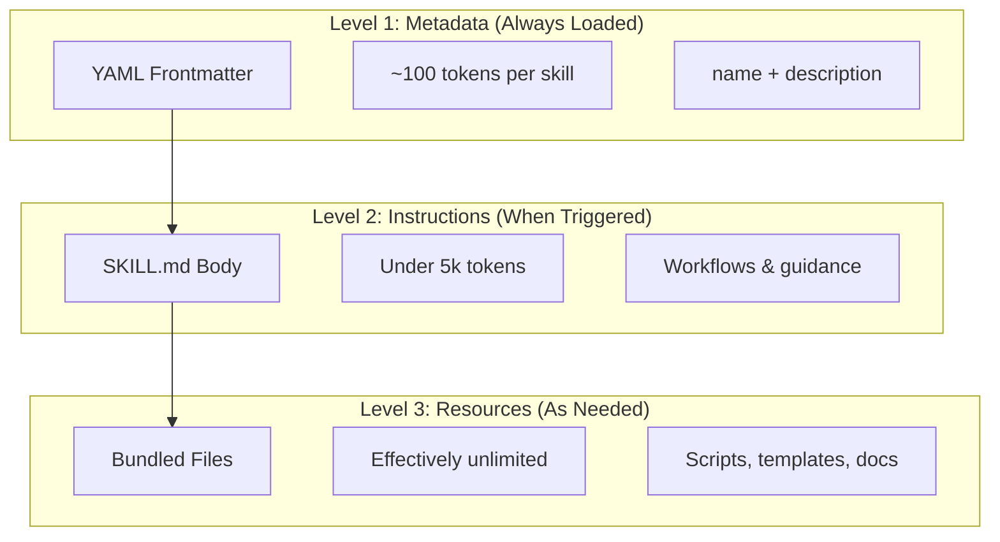
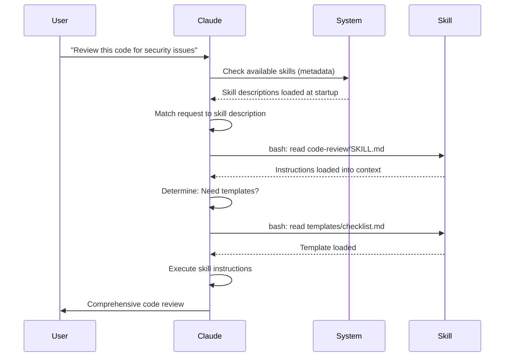

<!-- i18n-source: 03-skills/README.md -->
<!-- i18n-source-sha: 63a1416 -->
<!-- i18n-date: 2026-04-09 -->

<picture>
  <source media="(prefers-color-scheme: dark)" srcset="../../resources/logos/claude-howto-logo-dark.svg">
  
</picture>

# Посібник з навичок агента

Навички агента (Agent Skills) — це повторно використовувані, файлові можливості, які розширюють функціональність Claude. Вони пакують доменну експертизу, воркфлови та найкращі практики в компоненти, що автоматично виявляються, і Claude використовує їх, коли це доречно.

## Огляд

**Навички агента** — це модульні можливості, які перетворюють агентів загального призначення на спеціалістів. На відміну від промптів (інструкцій рівня розмови для одноразових завдань), навички завантажуються за потребою і усувають необхідність повторно надавати ті самі рекомендації в кількох розмовах.

### Ключові переваги

- **Спеціалізація Claude**: налаштування можливостей для доменних завдань
- **Зменшення повторень**: створити один раз, використовувати автоматично в усіх розмовах
- **Комбінування можливостей**: поєднання навичок для побудови складних воркфловів
- **Масштабування воркфловів**: повторне використання навичок у кількох проєктах і командах
- **Підтримка якості**: вбудовування найкращих практик безпосередньо у воркфлов

Навички відповідають відкритому стандарту [Agent Skills](https://agentskills.io), який працює з кількома AI-інструментами. Claude Code розширює стандарт додатковими функціями: керування викликом, виконання в субагенті та динамічне впровадження контексту.

> **Примітка**: Користувацькі слеш-команди об'єднано з навичками. Файли `.claude/commands/` все ще працюють і підтримують ті самі поля фронтматера. Навички рекомендовано для нової розробки. Коли обидва існують за одним шляхом (наприклад, `.claude/commands/review.md` та `.claude/skills/review/SKILL.md`), навичка має пріоритет.

## Як працюють навички: прогресивне розкриття

Навички використовують архітектуру **прогресивного розкриття** (progressive disclosure) — Claude завантажує інформацію поетапно за потребою, а не споживає весь контекст одразу. Це забезпечує ефективне управління контекстом із необмеженою масштабованістю.

### Три рівні завантаження



| Рівень | Коли завантажується | Вартість токенів | Вміст |
|--------|-------------------|-----------------|-------|
| **Рівень 1: Метадані** | Завжди (при запуску) | ~100 токенів на навичку | `name` та `description` з YAML-фронтматера |
| **Рівень 2: Інструкції** | Коли навичка активована | До 5k токенів | Тіло SKILL.md з інструкціями та рекомендаціями |
| **Рівень 3+: Ресурси** | За потребою | Фактично необмежено | Файли-пакети, що виконуються через bash без завантаження в контекст |

Це означає, що ви можете встановити багато навичок без штрафу за контекст — Claude лише знає, що кожна навичка існує і коли її використовувати, доки вона фактично не активована.

## Процес завантаження навички



## Типи та розташування навичок

| Тип | Розташування | Область дії | Спільний | Найкраще для |
|-----|-------------|-------------|---------|-------------|
| **Enterprise** | Managed settings | Всі користувачі організації | Так | Загальноорганізаційні стандарти |
| **Personal** | `~/.claude/skills/<skill-name>/SKILL.md` | Індивідуальний | Ні | Персональні воркфлови |
| **Project** | `.claude/skills/<skill-name>/SKILL.md` | Команда | Так (через git) | Командні стандарти |
| **Plugin** | `<plugin>/skills/<skill-name>/SKILL.md` | Де увімкнено | Залежить | В складі плагінів |

Коли навички мають однакову назву на різних рівнях, вищі пріоритетні розташування перемагають: **enterprise > personal > project**. Навички плагінів використовують простір імен `plugin-name:skill-name`, тому конфлікти неможливі.

### Автоматичне виявлення

**Вкладені каталоги**: коли ви працюєте з файлами в підкаталогах, Claude Code автоматично виявляє навички з вкладених каталогів `.claude/skills/`. Наприклад, якщо ви редагуєте файл у `packages/frontend/`, Claude Code також шукає навички в `packages/frontend/.claude/skills/`. Це підтримує конфігурації монорепо, де пакети мають власні навички.

**Каталоги `--add-dir`**: навички з каталогів, доданих через `--add-dir`, завантажуються автоматично з виявленням змін у реальному часі. Будь-які зміни файлів навичок у цих каталогах набувають чинності негайно без перезапуску Claude Code.

**Бюджет опису**: описи навичок (метадані рівня 1) обмежені **1% контекстного вікна** (резерв: **8 000 символів**). Якщо встановлено багато навичок, описи можуть бути скорочені. Назви всіх навичок завжди включаються, але описи обрізаються для вписування. Розміщуйте ключовий випадок використання на початку описів. Перевизначте бюджет змінною оточення `SLASH_COMMAND_TOOL_CHAR_BUDGET`.

## Створення власних навичок

### Базова структура каталогу

```
my-skill/
├── SKILL.md           # Головні інструкції (обов'язковий)
├── template.md        # Шаблон для заповнення Claude
├── examples/
│   └── sample.md      # Приклад результату з очікуваним форматом
└── scripts/
    └── validate.sh    # Скрипт, який Claude може виконати
```

### Формат SKILL.md

```yaml
---
name: your-skill-name
description: Brief description of what this Skill does and when to use it
---

# Your Skill Name

## Instructions
Provide clear, step-by-step guidance for Claude.

## Examples
Show concrete examples of using this Skill.
```

### Обов'язкові поля

- **name**: тільки малі літери, цифри, дефіси (макс. 64 символи). Не може містити "anthropic" або "claude".
- **description**: що навичка робить І коли її використовувати (макс. 1024 символи). Це критично для того, щоб Claude знав, коли активувати навичку.

### Додаткові поля фронтматера

```yaml
---
name: my-skill
description: What this skill does and when to use it
argument-hint: "[filename] [format]"        # Підказка для автодоповнення
disable-model-invocation: true              # Тільки користувач може викликати
user-invocable: false                       # Приховати з меню слеш-команд
allowed-tools: Read, Grep, Glob             # Обмежити доступ до інструментів
model: opus                                 # Конкретна модель
effort: high                                # Рівень зусиль (low, medium, high, max)
context: fork                               # Запуск в ізольованому субагенті
agent: Explore                              # Тип агента (з context: fork)
shell: bash                                 # Оболонка: bash (за замовч.) або powershell
hooks:                                      # Хуки, обмежені навичкою
  PreToolUse:
    - matcher: "Bash"
      hooks:
        - type: command
          command: "./scripts/validate.sh"
paths: "src/api/**/*.ts"               # Glob-патерни, що обмежують активацію
---
```

| Поле | Опис |
|------|------|
| `name` | Тільки малі літери, цифри, дефіси (макс. 64 символи). Не може містити "anthropic" або "claude". |
| `description` | Що навичка робить І коли її використовувати (макс. 1024 символи). Критично для автоматичного зіставлення. |
| `argument-hint` | Підказка в меню автодоповнення `/` (наприклад, `"[filename] [format]"`). |
| `disable-model-invocation` | `true` = тільки користувач може викликати через `/name`. Claude ніколи не викличе автоматично. |
| `user-invocable` | `false` = приховано з меню `/`. Тільки Claude може викликати автоматично. |
| `allowed-tools` | Список інструментів через кому, які навичка може використовувати без запитів дозволу. |
| `model` | Перевизначення моделі під час активності навички (наприклад, `opus`, `sonnet`). |
| `effort` | Перевизначення рівня зусиль: `low`, `medium`, `high` або `max`. |
| `context` | `fork` для запуску навички у відгалуженому контексті субагента з власним контекстним вікном. |
| `agent` | Тип субагента при `context: fork` (наприклад, `Explore`, `Plan`, `general-purpose`). |
| `shell` | Оболонка для підстановок `!`command`` та скриптів: `bash` (за замовч.) або `powershell`. |
| `hooks` | Хуки, обмежені життєвим циклом цієї навички (той самий формат, що й глобальні хуки). |
| `paths` | Glob-патерни, що обмежують автоактивацію. Рядок через кому або YAML-список. Формат як у правилах для конкретних шляхів. |

## Типи вмісту навичок

Навички можуть містити два типи вмісту, кожен для різних цілей:

### Довідковий вміст

Додає знання, які Claude застосовує до вашої поточної роботи — конвенції, патерни, стайлгайди, доменні знання. Виконується в контексті вашої розмови.

```yaml
---
name: api-conventions
description: API design patterns for this codebase
---

When writing API endpoints:
- Use RESTful naming conventions
- Return consistent error formats
- Include request validation
```

### Вміст завдань

Покрокові інструкції для конкретних дій. Часто викликається безпосередньо через `/skill-name`.

```yaml
---
name: deploy
description: Deploy the application to production
context: fork
disable-model-invocation: true
---

Deploy the application:
1. Run the test suite
2. Build the application
3. Push to the deployment target
```

## Керування викликом навичок

За замовчуванням і ви, і Claude можете викликати будь-яку навичку. Два поля фронтматера контролюють три режими виклику:

| Фронтматер | Ви можете викликати | Claude може викликати |
|---|---|---|
| (за замовч.) | Так | Так |
| `disable-model-invocation: true` | Так | Ні |
| `user-invocable: false` | Ні | Так |

**Використовуйте `disable-model-invocation: true`** для воркфловів з побічними ефектами: `/commit`, `/deploy`, `/send-slack-message`. Ви не хочете, щоб Claude вирішив задеплоїти, бо ваш код виглядає готовим.

**Використовуйте `user-invocable: false`** для фонових знань, які не є дієвими як команда. Навичка `legacy-system-context` пояснює, як працює стара система — корисно для Claude, але не має сенсу як дія для користувачів.

## Підстановки рядків

Навички підтримують динамічні значення, які розв'язуються до того, як вміст навички потрапляє до Claude:

| Змінна | Опис |
|--------|------|
| `$ARGUMENTS` | Всі аргументи, передані при виклику навички |
| `$ARGUMENTS[N]` або `$N` | Доступ до конкретного аргументу за індексом (починаючи з 0) |
| `${CLAUDE_SESSION_ID}` | ID поточної сесії |
| `${CLAUDE_SKILL_DIR}` | Каталог, що містить файл SKILL.md навички |
| `` !`command` `` | Динамічне впровадження контексту — виконує команду оболонки та вставляє результат |

**Приклад:**

```yaml
---
name: fix-issue
description: Fix a GitHub issue
---

Fix GitHub issue $ARGUMENTS following our coding standards.
1. Read the issue description
2. Implement the fix
3. Write tests
4. Create a commit
```

Виконання `/fix-issue 123` замінює `$ARGUMENTS` на `123`.

## Впровадження динамічного контексту

Синтаксис `` !`command` `` виконує команди оболонки до того, як вміст навички відправляється до Claude:

```yaml
---
name: pr-summary
description: Summarize changes in a pull request
context: fork
agent: Explore
---

## Pull request context
- PR diff: !`gh pr diff`
- PR comments: !`gh pr view --comments`
- Changed files: !`gh pr diff --name-only`

## Your task
Summarize this pull request...
```

Команди виконуються негайно; Claude бачить лише кінцевий результат. За замовчуванням команди виконуються в `bash`. Встановіть `shell: powershell` у фронтматері для використання PowerShell.

## Запуск навичок у субагентах

Додайте `context: fork` для запуску навички в ізольованому контексті субагента. Вміст навички стає завданням для виділеного субагента з власним контекстним вікном, зберігаючи основну розмову чистою.

Поле `agent` вказує тип агента:

| Тип агента | Найкраще для |
|---|---|
| `Explore` | Дослідження лише для читання, аналіз кодової бази |
| `Plan` | Створення планів реалізації |
| `general-purpose` | Широкі завдання, що потребують усіх інструментів |
| Custom agents | Спеціалізовані агенти, визначені у вашій конфігурації |

**Приклад фронтматера:**

```yaml
---
context: fork
agent: Explore
---
```

**Повний приклад навички:**

```yaml
---
name: deep-research
description: Research a topic thoroughly
context: fork
agent: Explore
---

Research $ARGUMENTS thoroughly:
1. Find relevant files using Glob and Grep
2. Read and analyze the code
3. Summarize findings with specific file references
```

## Практичні приклади

### Приклад 1: Навичка код-рев'ю

**Структура каталогу:**

```
~/.claude/skills/code-review/
├── SKILL.md
├── templates/
│   ├── review-checklist.md
│   └── finding-template.md
└── scripts/
    ├── analyze-metrics.py
    └── compare-complexity.py
```

**Файл:** `~/.claude/skills/code-review/SKILL.md`

```yaml
---
name: code-review-specialist
description: Comprehensive code review with security, performance, and quality analysis. Use when users ask to review code, analyze code quality, evaluate pull requests, or mention code review, security analysis, or performance optimization.
---

# Code Review Skill

This skill provides comprehensive code review capabilities focusing on:

1. **Security Analysis**
   - Authentication/authorization issues
   - Data exposure risks
   - Injection vulnerabilities
   - Cryptographic weaknesses

2. **Performance Review**
   - Algorithm efficiency (Big O analysis)
   - Memory optimization
   - Database query optimization
   - Caching opportunities

3. **Code Quality**
   - SOLID principles
   - Design patterns
   - Naming conventions
   - Test coverage

4. **Maintainability**
   - Code readability
   - Function size (should be < 50 lines)
   - Cyclomatic complexity
   - Type safety

## Review Template

For each piece of code reviewed, provide:

### Summary
- Overall quality assessment (1-5)
- Key findings count
- Recommended priority areas

### Critical Issues (if any)
- **Issue**: Clear description
- **Location**: File and line number
- **Impact**: Why this matters
- **Severity**: Critical/High/Medium
- **Fix**: Code example

For detailed checklists, see [templates/review-checklist.md](templates/review-checklist.md).
```

### Приклад 2: Навичка візуалізації кодової бази

Навичка, що генерує інтерактивні HTML-візуалізації:

**Структура каталогу:**

```
~/.claude/skills/codebase-visualizer/
├── SKILL.md
└── scripts/
    └── visualize.py
```

**Файл:** `~/.claude/skills/codebase-visualizer/SKILL.md`

````yaml
---
name: codebase-visualizer
description: Generate an interactive collapsible tree visualization of your codebase. Use when exploring a new repo, understanding project structure, or identifying large files.
allowed-tools: Bash(python *)
---

# Codebase Visualizer

Generate an interactive HTML tree view showing your project's file structure.

## Usage

Run the visualization script from your project root:

```bash
python ~/.claude/skills/codebase-visualizer/scripts/visualize.py .
```

This creates `codebase-map.html` and opens it in your default browser.

## What the visualization shows

- **Collapsible directories**: Click folders to expand/collapse
- **File sizes**: Displayed next to each file
- **Colors**: Different colors for different file types
- **Directory totals**: Shows aggregate size of each folder
````

Python-скрипт у пакеті виконує важку роботу, а Claude займається оркестрацією.

### Приклад 3: Навичка деплою (тільки виклик користувачем)

```yaml
---
name: deploy
description: Deploy the application to production
disable-model-invocation: true
allowed-tools: Bash(npm *), Bash(git *)
---

Deploy $ARGUMENTS to production:

1. Run the test suite: `npm test`
2. Build the application: `npm run build`
3. Push to the deployment target
4. Verify the deployment succeeded
5. Report deployment status
```

### Приклад 4: Навичка голосу бренду (фонові знання)

```yaml
---
name: brand-voice
description: Ensure all communication matches brand voice and tone guidelines. Use when creating marketing copy, customer communications, or public-facing content.
user-invocable: false
---

## Tone of Voice
- **Friendly but professional** - approachable without being casual
- **Clear and concise** - avoid jargon
- **Confident** - we know what we're doing
- **Empathetic** - understand user needs

## Writing Guidelines
- Use "you" when addressing readers
- Use active voice
- Keep sentences under 20 words
- Start with value proposition

For templates, see [templates/](templates/).
```

### Приклад 5: Навичка генератора CLAUDE.md

```yaml
---
name: claude-md
description: Create or update CLAUDE.md files following best practices for optimal AI agent onboarding. Use when users mention CLAUDE.md, project documentation, or AI onboarding.
---

## Core Principles

**LLMs are stateless**: CLAUDE.md is the only file automatically included in every conversation.

### The Golden Rules

1. **Less is More**: Keep under 300 lines (ideally under 100)
2. **Universal Applicability**: Only include information relevant to EVERY session
3. **Don't Use Claude as a Linter**: Use deterministic tools instead
4. **Never Auto-Generate**: Craft it manually with careful consideration

## Essential Sections

- **Project Name**: Brief one-line description
- **Tech Stack**: Primary language, frameworks, database
- **Development Commands**: Install, test, build commands
- **Critical Conventions**: Only non-obvious, high-impact conventions
- **Known Issues / Gotchas**: Things that trip up developers
```

### Приклад 6: Навичка рефакторингу зі скриптами

**Структура каталогу:**

```
refactor/
├── SKILL.md
├── references/
│   ├── code-smells.md
│   └── refactoring-catalog.md
├── templates/
│   └── refactoring-plan.md
└── scripts/
    ├── analyze-complexity.py
    └── detect-smells.py
```

**Файл:** `refactor/SKILL.md`

```yaml
---
name: code-refactor
description: Systematic code refactoring based on Martin Fowler's methodology. Use when users ask to refactor code, improve code structure, reduce technical debt, or eliminate code smells.
---

# Code Refactoring Skill

A phased approach emphasizing safe, incremental changes backed by tests.

## Workflow

Phase 1: Research & Analysis → Phase 2: Test Coverage Assessment →
Phase 3: Code Smell Identification → Phase 4: Refactoring Plan Creation →
Phase 5: Incremental Implementation → Phase 6: Review & Iteration

## Core Principles

1. **Behavior Preservation**: External behavior must remain unchanged
2. **Small Steps**: Make tiny, testable changes
3. **Test-Driven**: Tests are the safety net
4. **Continuous**: Refactoring is ongoing, not a one-time event

For code smell catalog, see [references/code-smells.md](references/code-smells.md).
For refactoring techniques, see [references/refactoring-catalog.md](references/refactoring-catalog.md).
```

## Допоміжні файли

Навички можуть включати кілька файлів у каталозі крім `SKILL.md`. Ці допоміжні файли (шаблони, приклади, скрипти, довідкові документи) дозволяють тримати головний файл навички сфокусованим, надаючи Claude додаткові ресурси, які він завантажує за потребою.

```
my-skill/
├── SKILL.md              # Головні інструкції (обов'язковий, до 500 рядків)
├── templates/            # Шаблони для заповнення Claude
│   └── output-format.md
├── examples/             # Приклади результатів з очікуваним форматом
│   └── sample-output.md
├── references/           # Доменні знання та специфікації
│   └── api-spec.md
└── scripts/              # Скрипти, які Claude може виконати
    └── validate.sh
```

Рекомендації щодо допоміжних файлів:

- Тримайте `SKILL.md` до **500 рядків**. Переносіть детальний довідковий матеріал, великі приклади та специфікації в окремі файли.
- Посилайтесь на додаткові файли з `SKILL.md` за допомогою **відносних шляхів** (наприклад, `[API reference](references/api-spec.md)`).
- Допоміжні файли завантажуються на рівні 3 (за потребою), тому вони не споживають контекст, поки Claude фактично їх не прочитає.

## Управління навичками

### Перегляд доступних навичок

Запитайте Claude безпосередньо:
```
What Skills are available?
```

Або перевірте файлову систему:
```bash
# Список персональних навичок
ls ~/.claude/skills/

# Список навичок проєкту
ls .claude/skills/
```

### Тестування навички

Два способи тестування:

**Дозвольте Claude викликати автоматично**, запитавши щось, що відповідає опису:
```
Can you help me review this code for security issues?
```

**Або викличте безпосередньо** за назвою навички:
```
/code-review src/auth/login.ts
```

### Оновлення навички

Редагуйте файл `SKILL.md` безпосередньо. Зміни набувають чинності при наступному запуску Claude Code.

```bash
# Персональна навичка
code ~/.claude/skills/my-skill/SKILL.md

# Навичка проєкту
code .claude/skills/my-skill/SKILL.md
```

### Обмеження доступу Claude до навичок

Три способи контролювати, які навички Claude може викликати:

**Вимкнути всі навички** в `/permissions`:
```
# Додати до правил заборони:
Skill
```

**Дозволити або заборонити конкретні навички**:
```
# Дозволити лише конкретні навички
Skill(commit)
Skill(review-pr *)

# Заборонити конкретні навички
Skill(deploy *)
```

**Приховати окремі навички**, додавши `disable-model-invocation: true` до їхнього фронтматера.

## Найкращі практики

### 1. Робіть описи конкретними

- **Погано (розпливчасто)**: "Helps with documents"
- **Добре (конкретно)**: "Extract text and tables from PDF files, fill forms, merge documents. Use when working with PDF files or when the user mentions PDFs, forms, or document extraction."

### 2. Тримайте навички сфокусованими

- Одна навичка = одна можливість
- ✅ "PDF form filling"
- ❌ "Document processing" (занадто широко)

### 3. Включайте тригерні терміни

Додавайте ключові слова в описи, що відповідають запитам користувачів:
```yaml
description: Analyze Excel spreadsheets, generate pivot tables, create charts. Use when working with Excel files, spreadsheets, or .xlsx files.
```

### 4. Тримайте SKILL.md до 500 рядків

Переносіть детальний довідковий матеріал в окремі файли, які Claude завантажує за потребою.

### 5. Посилайтесь на допоміжні файли

```markdown
## Additional resources

- For complete API details, see [reference.md](reference.md)
- For usage examples, see [examples.md](examples.md)
```

### Рекомендовано

- Використовуйте зрозумілі, описові назви
- Включайте вичерпні інструкції
- Додавайте конкретні приклади
- Пакуйте пов'язані скрипти та шаблони
- Тестуйте з реальними сценаріями
- Документуйте залежності

### Не рекомендовано

- Не створюйте навички для одноразових завдань
- Не дублюйте наявну функціональність
- Не робіть навички занадто широкими
- Не пропускайте поле description
- Не встановлюйте навички з ненадійних джерел без аудиту

## Усунення несправностей

### Короткий довідник

| Проблема | Рішення |
|----------|---------|
| Claude не використовує навичку | Зробіть опис конкретнішим з тригерними термінами |
| Файл навички не знайдено | Перевірте шлях: `~/.claude/skills/name/SKILL.md` |
| Помилки YAML | Перевірте маркери `---`, відступи, відсутність табів |
| Конфлікт навичок | Використовуйте різні тригерні терміни в описах |
| Скрипти не запускаються | Перевірте дозволи: `chmod +x scripts/*.py` |
| Claude не бачить всі навички | Занадто багато навичок; перевірте `/context` на попередження |

### Навичка не спрацьовує

Якщо Claude не використовує навичку, коли очікується:

1. Перевірте, що опис містить ключові слова, які користувачі природно вживають
2. Переконайтесь, що навичка відображається при запиті "What skills are available?"
3. Спробуйте переформулювати запит відповідно до опису
4. Викличте безпосередньо через `/skill-name` для тестування

### Навичка спрацьовує занадто часто

Якщо Claude використовує навичку, коли ви цього не хочете:

1. Зробіть опис конкретнішим
2. Додайте `disable-model-invocation: true` для виклику лише вручну

### Claude не бачить усі навички

Описи навичок завантажуються з лімітом **1% контекстного вікна** (резерв: **8 000 символів**). Кожен запис обмежений 250 символами незалежно від бюджету. Запустіть `/context`, щоб перевірити попередження про виключені навички. Перевизначте бюджет змінною оточення `SLASH_COMMAND_TOOL_CHAR_BUDGET`.

## Питання безпеки

**Використовуйте навички лише з надійних джерел.** Навички надають Claude можливості через інструкції та код — шкідлива навичка може направити Claude на виклик інструментів або виконання коду небезпечними способами.

**Ключові питання безпеки:**

- **Ретельний аудит**: перевіряйте всі файли в каталозі навички
- **Зовнішні джерела ризиковані**: навички, що завантажують із зовнішніх URL, можуть бути скомпрометовані
- **Зловживання інструментами**: шкідливі навички можуть викликати інструменти небезпечними способами
- **Ставтесь як до встановлення ПЗ**: використовуйте навички лише з надійних джерел

## Навички vs інші функції

| Функція | Виклик | Найкраще для |
|---------|--------|-------------|
| **Навички** | Авто або `/name` | Повторно використовувана експертиза, воркфлови |
| **Слеш-команди** | Користувач через `/name` | Швидкі ярлики (об'єднано з навичками) |
| **Субагенти** | Автоделегування | Ізольоване виконання завдань |
| **Пам'ять (CLAUDE.md)** | Завжди завантажена | Постійний контекст проєкту |
| **MCP** | У реальному часі | Доступ до зовнішніх даних/сервісів |
| **Хуки** | За подіями | Автоматизовані побічні ефекти |

## Вбудовані навички

Claude Code постачається з кількома вбудованими навичками, доступними без встановлення:

| Навичка | Опис |
|---------|------|
| `/simplify` | Перевірка змінених файлів на повторне використання, якість та ефективність; запускає 3 паралельних агенти рев'ю |
| `/batch <instruction>` | Оркестрація масштабних паралельних змін по кодовій базі з використанням git worktrees |
| `/debug [description]` | Усунення несправностей поточної сесії через читання журналу налагодження |
| `/loop [interval] <prompt>` | Циклічне виконання промпта з інтервалом (наприклад, `/loop 5m check the deploy`) |
| `/claude-api` | Завантаження довідника Claude API/SDK; автоактивується при імпортах `anthropic`/`@anthropic-ai/sdk` |

Ці навички доступні одразу і не потребують встановлення чи конфігурації. Вони використовують той самий формат SKILL.md, що й власні навички.

## Поширення навичок

### Навички проєкту (командне поширення)

1. Створіть навичку в `.claude/skills/`
2. Закомітьте в git
3. Члени команди витягують зміни — навички доступні одразу

### Персональні навички

```bash
# Копіювання в персональний каталог
cp -r my-skill ~/.claude/skills/

# Зробити скрипти виконуваними
chmod +x ~/.claude/skills/my-skill/scripts/*.py
```

### Дистрибуція через плагіни

Пакуйте навички в каталог `skills/` плагіна для ширшої дистрибуції.

## Далі: колекція навичок та менеджер навичок

Коли ви починаєте серйозно створювати навички, дві речі стають необхідними: бібліотека перевірених навичок та інструмент для їх управління.

**[luongnv89/skills](https://github.com/luongnv89/skills)** — колекція навичок, які автор використовує щодня майже у всіх проєктах. Серед цікавих: `logo-designer` (генерація логотипів проєктів на льоту) та `ollama-optimizer` (налаштування продуктивності локальних LLM під ваше обладнання). Хороша відправна точка для готових до використання навичок.

**[luongnv89/asm](https://github.com/luongnv89/asm)** — Agent Skill Manager. Керує розробкою навичок, виявленням дублікатів та тестуванням. Команда `asm link` дозволяє тестувати навичку в будь-якому проєкті без копіювання файлів — це необхідно, коли навичок більше кількох.

## Додаткові ресурси

- [Офіційна документація навичок](https://code.claude.com/docs/en/skills)
- [Блог про архітектуру Agent Skills](https://claude.com/blog/equipping-agents-for-the-real-world-with-agent-skills)
- [Репозиторій навичок](https://github.com/luongnv89/skills) — колекція готових навичок
- [Посібник слеш-команд](../01-slash-commands/) — ярлики, ініційовані користувачем
- [Посібник субагентів](../04-subagents/) — делеговані AI-агенти
- [Посібник з пам'яті](../02-memory/) — постійний контекст
- [MCP (Model Context Protocol)](../05-mcp/) — зовнішні дані в реальному часі
- [Посібник хуків](../06-hooks/) — автоматизація за подіями

---
**Останнє оновлення**: 9 квітня 2026
**Версія Claude Code**: 2.1.97
**Сумісні моделі**: Claude Sonnet 4.6, Claude Opus 4.6, Claude Haiku 4.5
