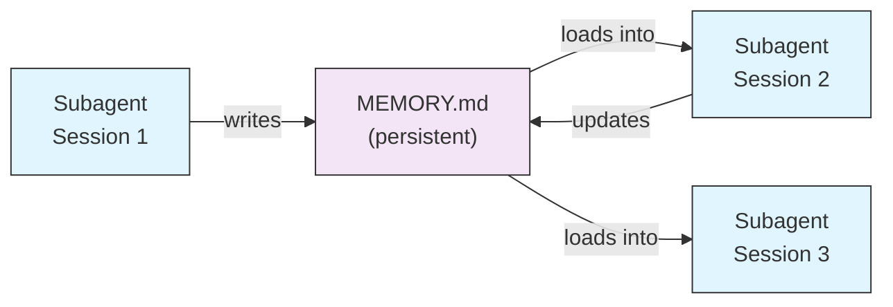
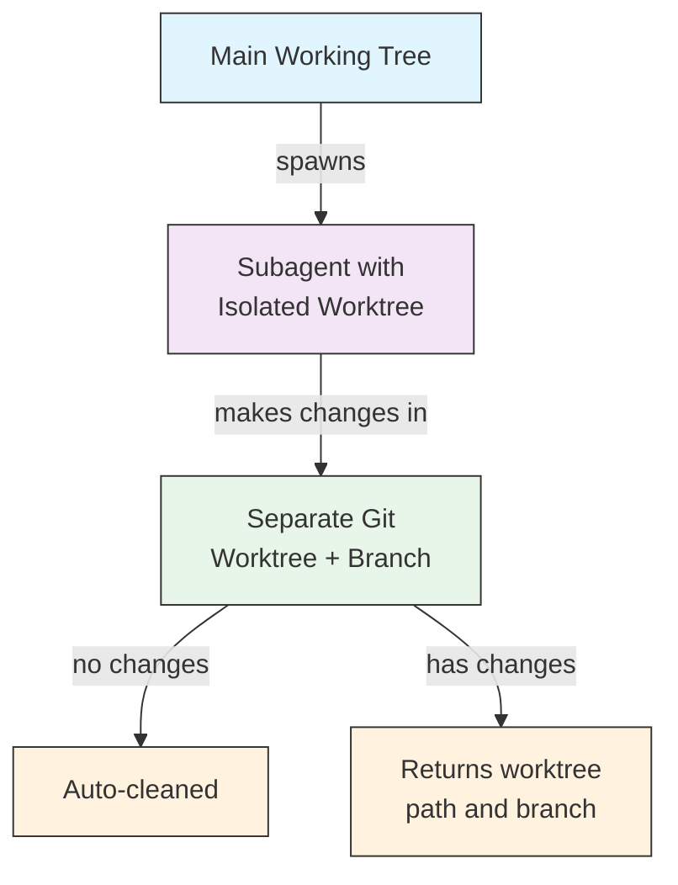
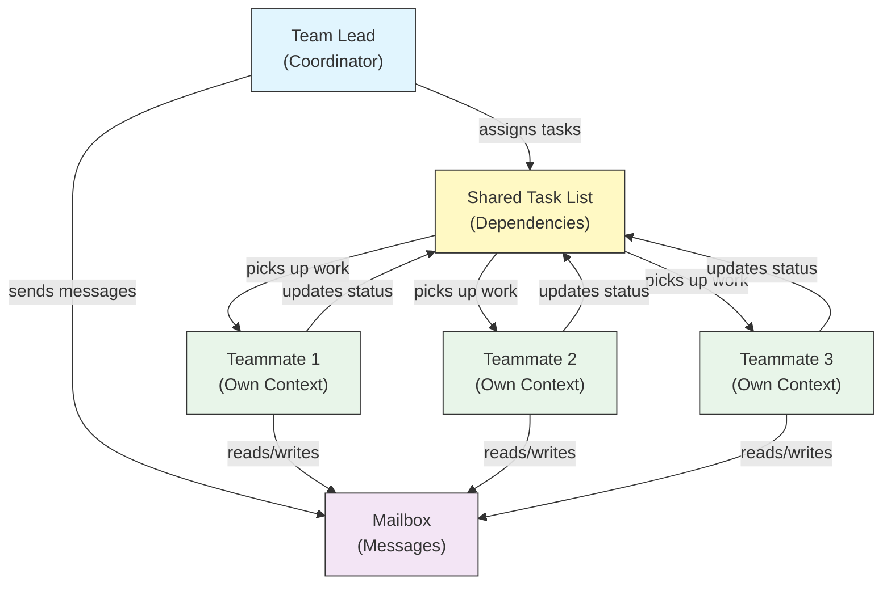
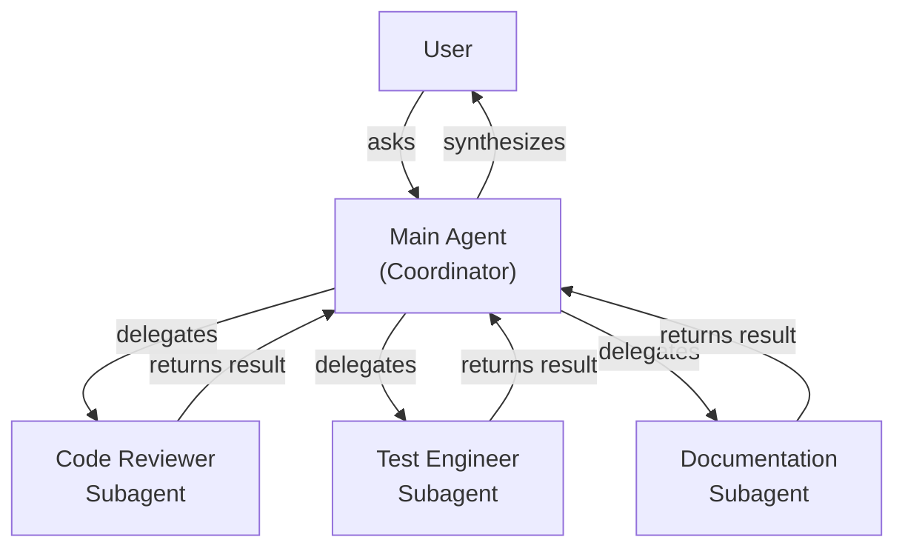
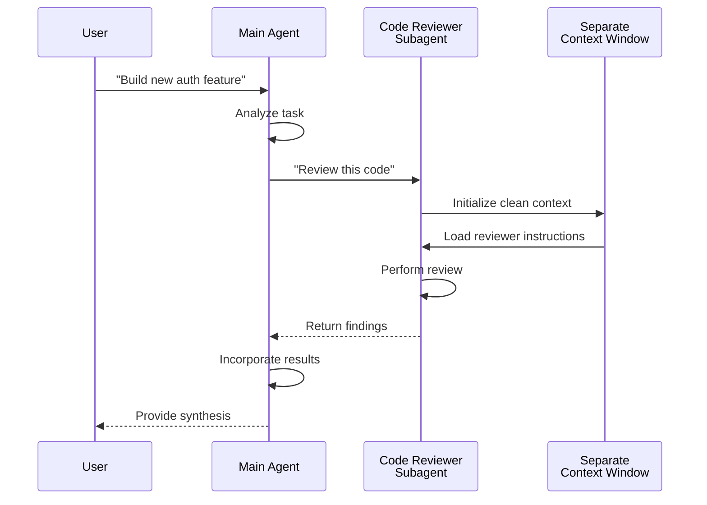
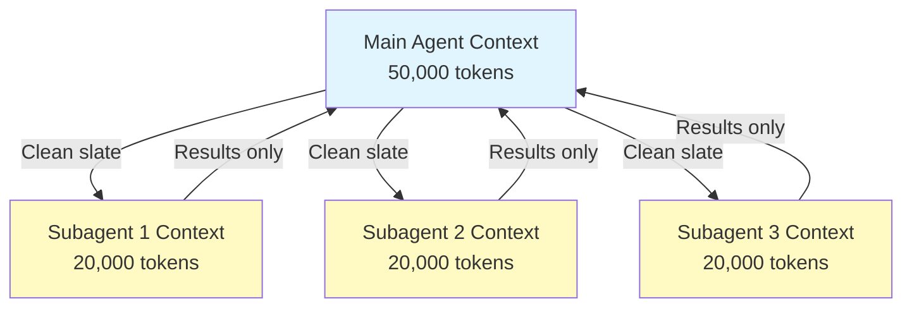
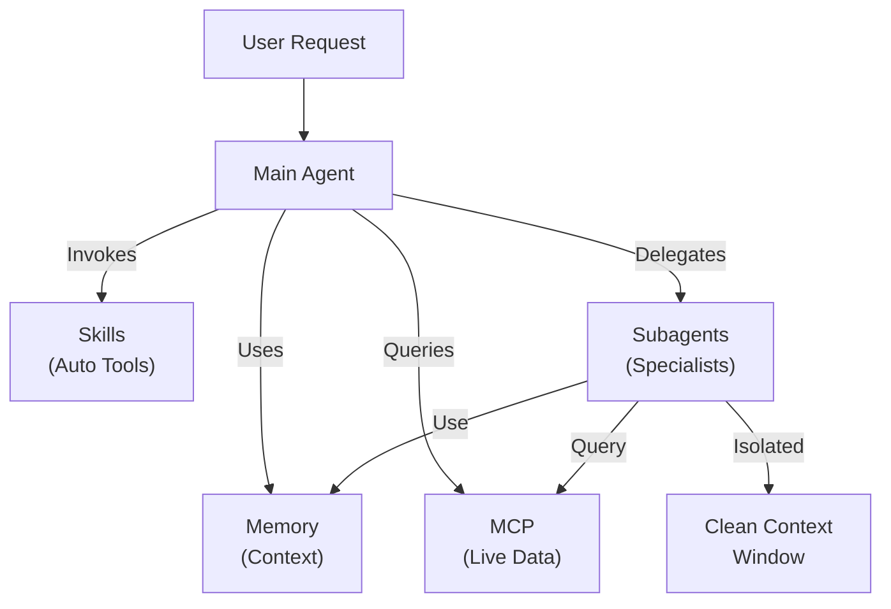

<!-- i18n-source: 04-subagents/README.md -->
<!-- i18n-source-sha: 63a1416 -->
<!-- i18n-date: 2026-04-09 -->

<picture>
  <source media="(prefers-color-scheme: dark)" srcset="../../resources/logos/claude-howto-logo-dark.svg">
  
</picture>

# Субагенти — повний довідник

Субагенти — це спеціалізовані AI-асистенти, яким Claude Code може делегувати завдання. Кожен субагент має конкретне призначення, використовує власне контекстне вікно, окреме від основної розмови, і може бути налаштований з конкретними інструментами та власним системним промптом.

## Зміст

1. [Огляд](#огляд)
2. [Ключові переваги](#ключові-переваги)
3. [Розташування файлів](#розташування-файлів)
4. [Конфігурація](#конфігурація)
5. [Вбудовані субагенти](#вбудовані-субагенти)
6. [Управління субагентами](#управління-субагентами)
7. [Використання субагентів](#використання-субагентів)
8. [Відновлювані агенти](#відновлювані-агенти)
9. [Ланцюжки субагентів](#ланцюжки-субагентів)
10. [Постійна пам'ять для субагентів](#постійна-память-для-субагентів)
11. [Фонові субагенти](#фонові-субагенти)
12. [Ізоляція через Worktree](#ізоляція-через-worktree)
13. [Обмеження створюваних субагентів](#обмеження-створюваних-субагентів)
14. [CLI-команда `claude agents`](#cli-команда-claude-agents)
15. [Agent Teams (експериментально)](#agent-teams-експериментально)
16. [Безпека субагентів плагінів](#безпека-субагентів-плагінів)
17. [Архітектура](#архітектура)
18. [Управління контекстом](#управління-контекстом)
19. [Коли використовувати субагентів](#коли-використовувати-субагентів)
20. [Найкращі практики](#найкращі-практики)
21. [Приклади субагентів у цій папці](#приклади-субагентів-у-цій-папці)
22. [Інструкції з встановлення](#інструкції-з-встановлення)
23. [Пов'язані концепції](#повязані-концепції)

---

## Огляд

Субагенти забезпечують делеговане виконання завдань у Claude Code шляхом:

- Створення **ізольованих AI-асистентів** з окремими контекстними вікнами
- Надання **налаштованих системних промптів** для спеціалізованої експертизи
- Застосування **контролю доступу до інструментів** для обмеження можливостей
- Запобігання **забрудненню контексту** від складних завдань
- Забезпечення **паралельного виконання** кількох спеціалізованих завдань

Кожен субагент працює незалежно з чистого аркуша, отримуючи лише конкретний контекст, необхідний для його завдання, а потім повертає результати головному агенту для синтезу.

**Швидкий старт**: Використовуйте команду `/agents` для створення, перегляду, редагування та управління субагентами в інтерактивному режимі.

---

## Ключові переваги

| Перевага | Опис |
|----------|------|
| **Збереження контексту** | Працює в окремому контексті, запобігаючи забрудненню основної розмови |
| **Спеціалізована експертиза** | Точно налаштований для конкретних доменів з вищим рівнем успіху |
| **Повторне використання** | Використання в різних проєктах і поширення між командами |
| **Гнучкі дозволи** | Різні рівні доступу до інструментів для різних типів субагентів |
| **Масштабованість** | Кілька агентів працюють над різними аспектами одночасно |

---

## Розташування файлів

Файли субагентів можна зберігати в кількох розташуваннях з різними областями дії:

| Пріоритет | Тип | Розташування | Область дії |
|-----------|-----|-------------|-------------|
| 1 (найвищий) | **CLI-визначені** | Через прапорець `--agents` (JSON) | Лише сесія |
| 2 | **Субагенти проєкту** | `.claude/agents/` | Поточний проєкт |
| 3 | **Субагенти користувача** | `~/.claude/agents/` | Усі проєкти |
| 4 (найнижчий) | **Агенти плагінів** | Каталог `agents/` плагіна | Через плагіни |

Коли існують дублікати імен, джерела з вищим пріоритетом мають перевагу.

---

## Конфігурація

### Формат файлу

Субагенти визначаються у YAML-фронтматері, за яким іде системний промпт у Markdown:

```yaml
---
name: your-sub-agent-name
description: Description of when this subagent should be invoked
tools: tool1, tool2, tool3  # Опціонально — успадковує всі інструменти, якщо не вказано
disallowedTools: tool4  # Опціонально — явно заборонені інструменти
model: sonnet  # Опціонально — sonnet, opus, haiku або inherit
permissionMode: default  # Опціонально — режим дозволів
maxTurns: 20  # Опціонально — ліміт агентних кроків
skills: skill1, skill2  # Опціонально — навички для попереднього завантаження
mcpServers: server1  # Опціонально — доступні MCP-сервери
memory: user  # Опціонально — область постійної пам'яті (user, project, local)
background: false  # Опціонально — запуск як фонове завдання
effort: high  # Опціонально — рівень зусиль (low, medium, high, max)
isolation: worktree  # Опціонально — ізоляція через git worktree
initialPrompt: "Start by analyzing the codebase"  # Опціонально — автоматичний перший крок
hooks:  # Опціонально — хуки, обмежені компонентом
  PreToolUse:
    - matcher: "Bash"
      hooks:
        - type: command
          command: "./scripts/security-check.sh"
---

Your subagent's system prompt goes here. This can be multiple paragraphs
and should clearly define the subagent's role, capabilities, and approach
to solving problems.
```

### Поля конфігурації

| Поле | Обов'язкове | Опис |
|------|-------------|------|
| `name` | Так | Унікальний ідентифікатор (малі літери та дефіси) |
| `description` | Так | Опис призначення природною мовою. Включіть "use PROACTIVELY" для заохочення автоматичного виклику |
| `tools` | Ні | Список інструментів через кому. Пропустіть для успадкування всіх. Підтримує синтаксис `Agent(agent_name)` для обмеження створюваних субагентів |
| `disallowedTools` | Ні | Список заборонених інструментів через кому |
| `model` | Ні | Модель: `sonnet`, `opus`, `haiku`, повний ID моделі або `inherit`. За замовч. — налаштована модель субагента |
| `permissionMode` | Ні | `default`, `acceptEdits`, `dontAsk`, `bypassPermissions`, `plan` |
| `maxTurns` | Ні | Максимальна кількість агентних кроків |
| `skills` | Ні | Список навичок через кому для попереднього завантаження. Вставляє повний вміст навички в контекст при запуску |
| `mcpServers` | Ні | MCP-сервери, доступні субагенту |
| `hooks` | Ні | Хуки, обмежені компонентом (PreToolUse, PostToolUse, Stop) |
| `memory` | Ні | Область постійної пам'яті: `user`, `project` або `local` |
| `background` | Ні | `true` для запуску як фонового завдання |
| `effort` | Ні | Рівень зусиль: `low`, `medium`, `high` або `max` |
| `isolation` | Ні | `worktree` для власного git worktree |
| `initialPrompt` | Ні | Автоматичний перший крок при запуску субагента як головного агента |

### Варіанти конфігурації інструментів

**Варіант 1: Успадкування всіх інструментів (пропустити поле)**
```yaml
---
name: full-access-agent
description: Agent with all available tools
---
```

**Варіант 2: Вказати конкретні інструменти**
```yaml
---
name: limited-agent
description: Agent with specific tools only
tools: Read, Grep, Glob, Bash
---
```

**Варіант 3: Умовний доступ до інструментів**
```yaml
---
name: conditional-agent
description: Agent with filtered tool access
tools: Read, Bash(npm:*), Bash(test:*)
---
```

### Конфігурація через CLI

Визначте субагентів для однієї сесії за допомогою прапорця `--agents` у форматі JSON:

```bash
claude --agents '{
  "code-reviewer": {
    "description": "Expert code reviewer. Use proactively after code changes.",
    "prompt": "You are a senior code reviewer. Focus on code quality, security, and best practices.",
    "tools": ["Read", "Grep", "Glob", "Bash"],
    "model": "sonnet"
  }
}'
```

**Формат JSON для прапорця `--agents`:**

```json
{
  "agent-name": {
    "description": "Required: when to invoke this agent",
    "prompt": "Required: system prompt for the agent",
    "tools": ["Optional", "array", "of", "tools"],
    "model": "optional: sonnet|opus|haiku"
  }
}
```

**Пріоритет визначень агентів:**

Визначення агентів завантажуються з таким пріоритетом (перший збіг виграє):
1. **CLI-визначені** — прапорець `--agents` (лише сесія, JSON)
2. **Рівень проєкту** — `.claude/agents/` (поточний проєкт)
3. **Рівень користувача** — `~/.claude/agents/` (усі проєкти)
4. **Рівень плагіна** — каталог `agents/` плагіна

Це дозволяє CLI-визначенням перевизначати всі інші джерела для однієї сесії.

---

## Вбудовані субагенти

Claude Code включає кілька вбудованих субагентів, які завжди доступні:

| Агент | Модель | Призначення |
|-------|--------|-------------|
| **general-purpose** | Успадковує | Складні, багатокрокові завдання |
| **Plan** | Успадковує | Дослідження для режиму планування |
| **Explore** | Haiku | Дослідження кодової бази лише для читання (швидке/середнє/дуже ретельне) |
| **Bash** | Успадковує | Термінальні команди в окремому контексті |
| **statusline-setup** | Sonnet | Налаштування рядка стану |
| **Claude Code Guide** | Haiku | Відповіді на питання про функції Claude Code |

### Субагент General-Purpose

| Властивість | Значення |
|-------------|----------|
| **Модель** | Успадковує від батька |
| **Інструменти** | Усі інструменти |
| **Призначення** | Складні дослідницькі завдання, багатокрокові операції, модифікація коду |

**Коли використовується**: Завдання, що потребують дослідження та модифікації зі складною логікою.

### Субагент Plan

| Властивість | Значення |
|-------------|----------|
| **Модель** | Успадковує від батька |
| **Інструменти** | Read, Glob, Grep, Bash |
| **Призначення** | Автоматичне дослідження кодової бази в режимі планування |

**Коли використовується**: Коли Claude потрібно зрозуміти кодову базу перед представленням плану.

### Субагент Explore

| Властивість | Значення |
|-------------|----------|
| **Модель** | Haiku (швидкий, низька затримка) |
| **Режим** | Строго лише для читання |
| **Інструменти** | Glob, Grep, Read, Bash (лише команди для читання) |
| **Призначення** | Швидкий пошук та аналіз кодової бази |

**Коли використовується**: Пошук/розуміння коду без внесення змін.

**Рівні ретельності** — вкажіть глибину дослідження:
- **"quick"** — швидкий пошук з мінімальним дослідженням, добре для пошуку конкретних патернів
- **"medium"** — помірне дослідження, баланс швидкості та ретельності, стандартний підхід
- **"very thorough"** — комплексний аналіз у кількох розташуваннях та конвенціях іменування, може зайняти більше часу

### Субагент Bash

| Властивість | Значення |
|-------------|----------|
| **Модель** | Успадковує від батька |
| **Інструменти** | Bash |
| **Призначення** | Виконання термінальних команд в окремому контекстному вікні |

**Коли використовується**: Виконання команд оболонки, які виграють від ізольованого контексту.

### Субагент Statusline Setup

| Властивість | Значення |
|-------------|----------|
| **Модель** | Sonnet |
| **Інструменти** | Read, Write, Bash |
| **Призначення** | Налаштування відображення рядка стану Claude Code |

**Коли використовується**: Налаштування або кастомізація рядка стану.

### Субагент Claude Code Guide

| Властивість | Значення |
|-------------|----------|
| **Модель** | Haiku (швидкий, низька затримка) |
| **Інструменти** | Лише для читання |
| **Призначення** | Відповіді на питання про функції та використання Claude Code |

**Коли використовується**: Коли користувачі питають про роботу Claude Code або використання конкретних функцій.

---

## Управління субагентами

### Команда `/agents` (рекомендовано)

```bash
/agents
```

Надає інтерактивне меню для:
- Перегляду всіх доступних субагентів (вбудованих, користувача та проєкту)
- Створення нових субагентів з керованим налаштуванням
- Редагування наявних субагентів та доступу до інструментів
- Видалення субагентів
- Перегляду активних субагентів при наявності дублікатів

### Пряме управління файлами

```bash
# Створення субагента проєкту
mkdir -p .claude/agents
cat > .claude/agents/test-runner.md << 'EOF'
---
name: test-runner
description: Use proactively to run tests and fix failures
---

You are a test automation expert. When you see code changes, proactively
run the appropriate tests. If tests fail, analyze the failures and fix
them while preserving the original test intent.
EOF

# Створення субагента користувача (доступний у всіх проєктах)
mkdir -p ~/.claude/agents
```

---

## Використання субагентів

### Автоматичне делегування

Claude проактивно делегує завдання на основі:
- Опису завдання у вашому запиті
- Поля `description` у конфігурації субагента
- Поточного контексту та доступних інструментів

Для заохочення проактивного використання додайте "use PROACTIVELY" або "MUST BE USED" у поле `description`:

```yaml
---
name: code-reviewer
description: Expert code review specialist. Use PROACTIVELY after writing or modifying code.
---
```

### Явний виклик

Ви можете явно запросити конкретного субагента:

```
> Use the test-runner subagent to fix failing tests
> Have the code-reviewer subagent look at my recent changes
> Ask the debugger subagent to investigate this error
```

### Виклик через @-згадку

Використовуйте префікс `@` для гарантованого виклику конкретного субагента (обходить евристику автоматичного делегування):

```
> @"code-reviewer (agent)" review the auth module
```

### Агент на всю сесію

Запуск сесії з конкретним агентом як головним:

```bash
# Через прапорець CLI
claude --agent code-reviewer

# Через settings.json
{
  "agent": "code-reviewer"
}
```

### Список доступних агентів

Використовуйте команду `claude agents` для переліку всіх налаштованих агентів з усіх джерел:

```bash
claude agents
```

---

## Відновлювані агенти

Субагенти можуть продовжувати попередні розмови зі збереженим контекстом:

```bash
# Початковий виклик
> Use the code-analyzer agent to start reviewing the authentication module
# Повертає agentId: "abc123"

# Відновлення агента пізніше
> Resume agent abc123 and now analyze the authorization logic as well
```

**Випадки використання**:
- Тривалі дослідження між кількома сесіями
- Ітеративне вдосконалення без втрати контексту
- Багатокрокові воркфлови зі збереженням контексту

---

## Ланцюжки субагентів

Послідовне виконання кількох субагентів:

```bash
> First use the code-analyzer subagent to find performance issues,
  then use the optimizer subagent to fix them
```

Це дозволяє створювати складні воркфлови, де результат одного субагента є вхідними даними для іншого.

---

## Постійна пам'ять для субагентів

Поле `memory` надає субагентам постійний каталог, що зберігається між розмовами. Це дозволяє субагентам накопичувати знання з часом, зберігаючи нотатки, висновки та контекст між сесіями.

### Області пам'яті

| Область | Каталог | Випадок використання |
|---------|---------|---------------------|
| `user` | `~/.claude/agent-memory/<n>/` | Персональні нотатки та налаштування для всіх проєктів |
| `project` | `.claude/agent-memory/<n>/` | Знання, специфічні для проєкту, спільні з командою |
| `local` | `.claude/agent-memory-local/<n>/` | Локальні знання проєкту, не комітяться у контроль версій |

### Як це працює

- Перші 200 рядків `MEMORY.md` у каталозі пам'яті автоматично завантажуються в системний промпт субагента
- Інструменти `Read`, `Write` та `Edit` автоматично ввімкнені для управління файлами пам'яті
- Субагент може створювати додаткові файли у каталозі пам'яті за потребою

### Приклад конфігурації

```yaml
---
name: researcher
memory: user
---

You are a research assistant. Use your memory directory to store findings,
track progress across sessions, and build up knowledge over time.

Check your MEMORY.md file at the start of each session to recall previous context.
```



---

## Фонові субагенти

Субагенти можуть працювати у фоні, звільняючи основну розмову для інших завдань.

### Конфігурація

Встановіть `background: true` у фронтматері для постійного запуску субагента як фонового завдання:

```yaml
---
name: long-runner
background: true
description: Performs long-running analysis tasks in the background
---
```

### Клавіатурні скорочення

| Скорочення | Дія |
|-----------|-----|
| `Ctrl+B` | Перемістити поточне завдання субагента у фон |
| `Ctrl+F` | Завершити всіх фонових агентів (натисніть двічі для підтвердження) |

### Вимкнення фонових завдань

Встановіть змінну оточення для повного вимкнення підтримки фонових завдань:

```bash
export CLAUDE_CODE_DISABLE_BACKGROUND_TASKS=1
```

---

## Ізоляція через Worktree

Налаштування `isolation: worktree` надає субагенту власне git worktree, дозволяючи вносити зміни незалежно, не впливаючи на основне робоче дерево.

### Конфігурація

```yaml
---
name: feature-builder
isolation: worktree
description: Implements features in an isolated git worktree
tools: Read, Write, Edit, Bash, Grep, Glob
---
```

### Як це працює



- Субагент працює у власному git worktree на окремій гілці
- Якщо субагент не вносить змін, worktree автоматично очищується
- Якщо зміни є, шлях до worktree та назва гілки повертаються головному агенту для огляду або мерджу

---

## Обмеження створюваних субагентів

Ви можете контролювати, яких субагентів може створювати конкретний субагент, використовуючи синтаксис `Agent(agent_type)` у полі `tools`. Це дозволяє створити список дозволених субагентів для делегування.

> **Примітка**: У v2.1.63 інструмент `Task` було перейменовано на `Agent`. Існуючі посилання `Task(...)` все ще працюють як псевдоніми.

### Приклад

```yaml
---
name: coordinator
description: Coordinates work between specialized agents
tools: Agent(worker, researcher), Read, Bash
---

You are a coordinator agent. You can delegate work to the "worker" and
"researcher" subagents only. Use Read and Bash for your own exploration.
```

У цьому прикладі субагент `coordinator` може створювати лише субагентів `worker` та `researcher`. Він не може створювати інших субагентів, навіть якщо вони визначені деінде.

---

## CLI-команда `claude agents`

Команда `claude agents` відображає всіх налаштованих агентів, згрупованих за джерелом (вбудовані, рівень користувача, рівень проєкту):

```bash
claude agents
```

Ця команда:
- Показує всіх доступних агентів з усіх джерел
- Групує агентів за розташуванням джерела
- Вказує **перевизначення**, коли агент вищого пріоритету затіняє агента нижчого рівня (наприклад, агент рівня проєкту з тим самим ім'ям, що й агент рівня користувача)

---

## Agent Teams (експериментально)

Agent Teams координують кілька екземплярів Claude Code, що працюють разом над складними завданнями. На відміну від субагентів (які є делегованими підзавданнями, що повертають результати), тіммейти працюють незалежно з власними контекстними вікнами і можуть обмінюватися повідомленнями безпосередньо через спільну систему поштових скриньок.

> **Офіційна документація**: [code.claude.com/docs/en/agent-teams](https://code.claude.com/docs/en/agent-teams)

> **Примітка**: Agent Teams — експериментальна функція, вимкнена за замовчуванням. Потребує Claude Code v2.1.32+. Увімкніть перед використанням.

### Субагенти vs Agent Teams

| Аспект | Субагенти | Agent Teams |
|--------|-----------|-------------|
| **Модель делегування** | Батько делегує підзавдання, чекає результат | Тімлід координує роботу, тіммейти виконують незалежно |
| **Контекст** | Чистий контекст на підзавдання, результати стискаються назад | Кожен тіммейт підтримує власне постійне контекстне вікно |
| **Координація** | Послідовна або паралельна, керована батьком | Спільний список завдань з автоматичним управлінням залежностями |
| **Комунікація** | Результати повертаються лише батьку (без обміну між агентами) | Тіммейти обмінюються повідомленнями безпосередньо через поштову скриньку |
| **Відновлення сесії** | Підтримується | Не підтримується з in-process тіммейтами |
| **Найкраще для** | Сфокусовані, чітко визначені підзавдання | Складна робота, що потребує міжагентної комунікації та паралельного виконання |

### Увімкнення Agent Teams

Встановіть змінну оточення або додайте до `settings.json`:

```bash
export CLAUDE_CODE_EXPERIMENTAL_AGENT_TEAMS=1
```

Або в `settings.json`:

```json
{
  "env": {
    "CLAUDE_CODE_EXPERIMENTAL_AGENT_TEAMS": "1"
  }
}
```

### Запуск команди

Після увімкнення попросіть Claude працювати з тіммейтами у промпті:

```
User: Build the authentication module. Use a team — one teammate for the API endpoints,
      one for the database schema, and one for the test suite.
```

Claude створить команду, призначить завдання та автоматично координуватиме роботу.

### Режими відображення

Контролюйте, як відображається активність тіммейтів:

| Режим | Прапорець | Опис |
|-------|-----------|------|
| **Auto** | `--teammate-mode auto` | Автоматично обирає найкращий режим для вашого терміналу |
| **In-process** (за замовч.) | `--teammate-mode in-process` | Показує вивід тіммейтів у поточному терміналі |
| **Split-panes** | `--teammate-mode tmux` | Відкриває кожного тіммейта в окремій панелі tmux або iTerm2 |

```bash
claude --teammate-mode tmux
```

Також можна встановити режим у `settings.json`:

```json
{
  "teammateMode": "tmux"
}
```

> **Примітка**: Режим split-pane потребує tmux або iTerm2. Недоступний у VS Code terminal, Windows Terminal або Ghostty.

### Навігація

Використовуйте `Shift+Down` для навігації між тіммейтами в режимі split-pane.

### Конфігурація команди

Конфігурації команд зберігаються в `~/.claude/teams/{team-name}/config.json`.

### Архітектура



**Ключові компоненти**:

- **Team Lead**: основна сесія Claude Code, що створює команду, призначає завдання та координує
- **Shared Task List**: синхронізований список завдань з автоматичним відстеженням залежностей
- **Mailbox**: система міжагентних повідомлень для координації тіммейтів
- **Teammates**: незалежні екземпляри Claude Code з власними контекстними вікнами

### Призначення завдань та обмін повідомленнями

Тімлід розбиває роботу на завдання та призначає їх тіммейтам. Спільний список завдань забезпечує:

- **Автоматичне управління залежностями** — завдання чекають завершення залежностей
- **Відстеження статусу** — тіммейти оновлюють статус завдань під час роботи
- **Міжагентні повідомлення** — тіммейти надсилають повідомлення через поштову скриньку для координації (наприклад, "Схема бази даних готова, можете починати писати запити")

### Воркфлов затвердження плану

Для складних завдань тімлід створює план виконання перед початком роботи тіммейтів. Користувач переглядає та затверджує план, забезпечуючи відповідність підходу команди очікуванням перед внесенням будь-яких змін у код.

### Хук-події для команд

Agent Teams додають дві додаткових [хук-події](../06-hooks/):

| Подія | Спрацьовує коли | Випадок використання |
|-------|----------------|---------------------|
| `TeammateIdle` | Тіммейт завершив поточне завдання і не має очікуваної роботи | Сповіщення, призначення наступних завдань |
| `TaskCompleted` | Завдання у спільному списку позначено як завершене | Валідація, оновлення дашбордів, ланцюжки залежних робіт |

### Найкращі практики

- **Розмір команди**: тримайте 3-5 тіммейтів для оптимальної координації
- **Розмір завдань**: розбивайте роботу на завдання по 5-15 хвилин — достатньо малі для паралелізації, достатньо великі для значущості
- **Уникайте конфліктів файлів**: призначайте різні файли або каталоги різним тіммейтам
- **Починайте просто**: використовуйте in-process режим для першої команди; переходьте на split-panes після звикання
- **Чіткі описи завдань**: надавайте конкретні, дієві описи завдань

### Обмеження

- **Експериментально**: поведінка функції може змінитися в майбутніх релізах
- **Немає відновлення сесії**: in-process тіммейти не можуть бути відновлені після завершення сесії
- **Одна команда на сесію**: неможливо створити вкладені команди або кілька команд в одній сесії
- **Фіксований лідер**: роль тімліда не може бути передана тіммейту
- **Обмеження split-pane**: потребує tmux/iTerm2; недоступний у VS Code terminal, Windows Terminal або Ghostty
- **Немає крос-сесійних команд**: тіммейти існують лише в межах поточної сесії

> **Увага**: Agent Teams — експериментальна функція. Спочатку тестуйте з некритичною роботою та відстежуйте координацію тіммейтів на предмет неочікуваної поведінки.

---

## Безпека субагентів плагінів

Субагенти плагінів мають обмежені можливості фронтматера з міркувань безпеки. Наступні поля **заборонені** у визначеннях субагентів плагінів:

- `hooks` — не можна визначати хуки життєвого циклу
- `mcpServers` — не можна налаштовувати MCP-сервери
- `permissionMode` — не можна перевизначати налаштування дозволів

Це запобігає ескалації привілеїв або виконанню довільних команд через хуки субагентів плагінів.

---

## Архітектура

### Високорівнева архітектура



### Життєвий цикл субагента



---

## Управління контекстом



### Ключові моменти

- Кожен субагент отримує **чисте контекстне вікно** без історії основної розмови
- Субагенту передається лише **релевантний контекст** для конкретного завдання
- Результати **стискаються** назад до головного агента
- Це запобігає **вичерпанню токенів контексту** у тривалих проєктах

### Міркування щодо продуктивності

- **Ефективність контексту** — агенти зберігають основний контекст, дозволяючи довші сесії
- **Затримка** — субагенти починають з чистого аркуша і можуть додавати затримку при збиранні початкового контексту

### Ключові поведінки

- **Без вкладеного створення** — субагенти не можуть створювати інших субагентів
- **Фонові дозволи** — фонові субагенти автоматично відхиляють дозволи, що не були попередньо схвалені
- **Переведення у фон** — натисніть `Ctrl+B` для переведення поточного завдання у фон
- **Транскрипти** — транскрипти субагентів зберігаються в `~/.claude/projects/{project}/{sessionId}/subagents/agent-{agentId}.jsonl`
- **Автокомпакція** — контекст субагента автоматично компактується при ~95% заповненості (перевизначити через змінну оточення `CLAUDE_AUTOCOMPACT_PCT_OVERRIDE`)

---

## Коли використовувати субагентів

| Сценарій | Використовувати субагента | Чому |
|----------|--------------------------|------|
| Складна фіча з багатьма кроками | Так | Розділення відповідальності, запобігання забрудненню контексту |
| Швидке код-рев'ю | Ні | Зайві накладні витрати |
| Паралельне виконання завдань | Так | Кожен субагент має власний контекст |
| Потрібна спеціалізована експертиза | Так | Кастомні системні промпти |
| Тривалий аналіз | Так | Запобігає вичерпанню основного контексту |
| Одне завдання | Ні | Додає затримку без потреби |

---

## Найкращі практики

### Принципи проєктування

**Рекомендовано:**
- Починайте з агентів, згенерованих Claude — створіть початкового субагента через Claude, потім ітеруйте для кастомізації
- Проєктуйте сфокусованих субагентів — одна чітка відповідальність замість одного, що робить все
- Пишіть детальні промпти — включайте конкретні інструкції, приклади та обмеження
- Обмежуйте доступ до інструментів — надавайте лише необхідні інструменти
- Контроль версій — комітьте субагентів проєкту у систему контролю версій

**Не рекомендовано:**
- Створювати субагентів з перекриваючимися ролями
- Надавати субагентам зайвий доступ до інструментів
- Використовувати субагентів для простих однокрокових завдань
- Змішувати відповідальності в промпті одного субагента
- Забувати передавати необхідний контекст

### Найкращі практики системного промпта

1. **Будьте конкретними щодо ролі**
   ```
   You are an expert code reviewer specializing in [specific areas]
   ```

2. **Чітко визначте пріоритети**
   ```
   Review priorities (in order):
   1. Security Issues
   2. Performance Problems
   3. Code Quality
   ```

3. **Вкажіть формат виводу**
   ```
   For each issue provide: Severity, Category, Location, Description, Fix, Impact
   ```

4. **Включіть кроки дій**
   ```
   When invoked:
   1. Run git diff to see recent changes
   2. Focus on modified files
   3. Begin review immediately
   ```

### Стратегія доступу до інструментів

1. **Починайте з обмежень**: лише необхідні інструменти
2. **Розширюйте за потребою**: додавайте інструменти, коли вимоги цього потребують
3. **Лише для читання де можливо**: Read/Grep для аналітичних агентів
4. **Ізольоване виконання**: обмежте Bash-команди конкретними патернами

---

## Приклади субагентів у цій папці

Ця папка містить готові до використання приклади субагентів:

### 1. Code Reviewer (`code-reviewer.md`)

**Призначення**: комплексний аналіз якості та підтримуваності коду

**Інструменти**: Read, Grep, Glob, Bash

**Спеціалізація**: виявлення вразливостей безпеки, ідентифікація оптимізацій продуктивності, оцінка підтримуваності коду, аналіз покриття тестами

**Коли використовувати**: потрібне автоматизоване код-рев'ю з фокусом на якість та безпеку

---

### 2. Test Engineer (`test-engineer.md`)

**Призначення**: стратегія тестування, аналіз покриття та автоматичне тестування

**Інструменти**: Read, Write, Bash, Grep

**Спеціалізація**: створення юніт-тестів, проєктування інтеграційних тестів, ідентифікація крайніх випадків, аналіз покриття (ціль >80%)

**Коли використовувати**: потрібне створення комплексного набору тестів або аналіз покриття

---

### 3. Documentation Writer (`documentation-writer.md`)

**Призначення**: технічна документація, документація API та посібники користувача

**Інструменти**: Read, Write, Grep

**Спеціалізація**: документація API-ендпоінтів, створення посібників користувача, архітектурна документація, покращення коментарів коду

**Коли використовувати**: потрібне створення або оновлення документації проєкту

---

### 4. Secure Reviewer (`secure-reviewer.md`)

**Призначення**: код-рев'ю з фокусом на безпеку з мінімальними дозволами

**Інструменти**: Read, Grep

**Спеціалізація**: виявлення вразливостей безпеки, проблеми автентифікації/авторизації, ризики витоку даних, ідентифікація ін'єкційних атак

**Коли використовувати**: потрібний аудит безпеки без можливості модифікації

---

### 5. Implementation Agent (`implementation-agent.md`)

**Призначення**: повні можливості реалізації для розробки функцій

**Інструменти**: Read, Write, Edit, Bash, Grep, Glob

**Спеціалізація**: реалізація функцій, генерація коду, виконання збірки та тестів, модифікація кодової бази

**Коли використовувати**: потрібен субагент для наскрізної реалізації функцій

---

### 6. Debugger (`debugger.md`)

**Призначення**: спеціаліст з налагодження помилок, провалених тестів та неочікуваної поведінки

**Інструменти**: Read, Edit, Bash, Grep, Glob

**Спеціалізація**: аналіз першопричин, дослідження помилок, розв'язання провалених тестів, мінімальне виправлення

**Коли використовувати**: стикаєтесь з багами, помилками або неочікуваною поведінкою

---

### 7. Data Scientist (`data-scientist.md`)

**Призначення**: експерт з аналізу даних для SQL-запитів та інсайтів

**Інструменти**: Bash, Read, Write

**Спеціалізація**: оптимізація SQL-запитів, операції BigQuery, аналіз та візуалізація даних, статистичні інсайти

**Коли використовувати**: потрібний аналіз даних, SQL-запити або операції BigQuery

---

## Інструкції з встановлення

### Метод 1: Команда /agents (рекомендовано)

```bash
/agents
```

Далі:
1. Оберіть 'Create New Agent'
2. Оберіть рівень проєкту або користувача
3. Опишіть субагента детально
4. Оберіть інструменти (або залиште порожнім для успадкування всіх)
5. Збережіть і використовуйте

### Метод 2: Копіювання в проєкт

Скопіюйте файли агентів у каталог `.claude/agents/` проєкту:

```bash
# Перейдіть до проєкту
cd /path/to/your/project

# Створіть каталог агентів, якщо він не існує
mkdir -p .claude/agents

# Скопіюйте файли агентів з цієї папки
cp /path/to/04-subagents/*.md .claude/agents/

# Видаліть README (не потрібний у .claude/agents)
rm .claude/agents/README.md
```

### Метод 3: Копіювання в каталог користувача

Для агентів, доступних у всіх проєктах:

```bash
# Створіть каталог агентів користувача
mkdir -p ~/.claude/agents

# Скопіюйте агентів
cp /path/to/04-subagents/code-reviewer.md ~/.claude/agents/
cp /path/to/04-subagents/debugger.md ~/.claude/agents/
# ... скопіюйте інших за потребою
```

### Перевірка

Після встановлення переконайтесь, що агенти розпізнаються:

```bash
/agents
```

Ви повинні побачити встановлених агентів поряд з вбудованими.

---

## Структура файлів

```
project/
├── .claude/
│   └── agents/
│       ├── code-reviewer.md
│       ├── test-engineer.md
│       ├── documentation-writer.md
│       ├── secure-reviewer.md
│       ├── implementation-agent.md
│       ├── debugger.md
│       └── data-scientist.md
└── ...
```

---

## Пов'язані концепції

### Пов'язані функції

- **[Слеш-команди](../01-slash-commands/)** — швидкі ярлики, ініційовані користувачем
- **[Пам'ять](../02-memory/)** — постійний крос-сесійний контекст
- **[Навички](../03-skills/)** — повторно використовувані автономні можливості
- **[Протокол MCP](../05-mcp/)** — доступ до зовнішніх даних у реальному часі
- **[Хуки](../06-hooks/)** — автоматизація команд оболонки за подіями
- **[Плагіни](../07-plugins/)** — пакети розширень

### Порівняння з іншими функціями

| Функція | Виклик користувачем | Автовиклик | Постійна | Зовнішній доступ | Ізольований контекст |
|---------|---------------------|------------|----------|------------------|---------------------|
| **Слеш-команди** | Так | Ні | Ні | Ні | Ні |
| **Субагенти** | Так | Так | Ні | Ні | Так |
| **Пам'ять** | Авто | Авто | Так | Ні | Ні |
| **MCP** | Авто | Так | Ні | Так | Ні |
| **Навички** | Так | Так | Ні | Ні | Ні |

### Патерн інтеграції



---

## Додаткові ресурси

- [Офіційна документація субагентів](https://code.claude.com/docs/en/sub-agents)
- [Довідник CLI](https://code.claude.com/docs/en/cli-reference) — прапорець `--agents` та інші опції CLI
- [Посібник плагінів](../07-plugins/) — для пакування агентів з іншими функціями
- [Посібник навичок](../03-skills/) — для автоматично викликуваних можливостей
- [Посібник з пам'яті](../02-memory/) — для постійного контексту
- [Посібник хуків](../06-hooks/) — для автоматизації за подіями

---
**Останнє оновлення**: 9 квітня 2026
**Версія Claude Code**: 2.1.97
**Сумісні моделі**: Claude Sonnet 4.6, Claude Opus 4.6, Claude Haiku 4.5
