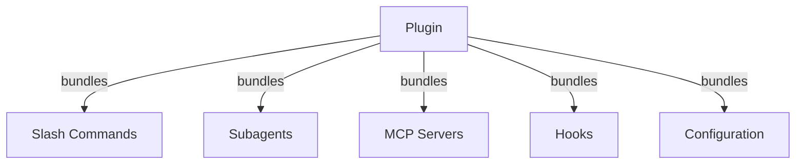
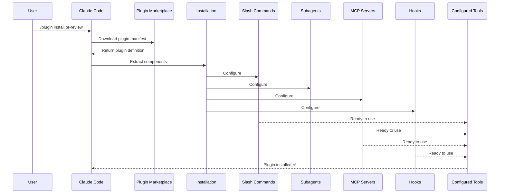
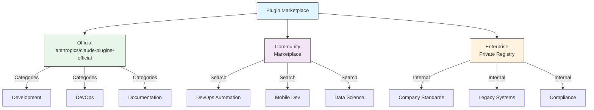
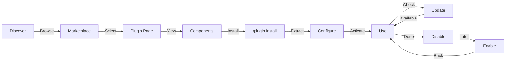
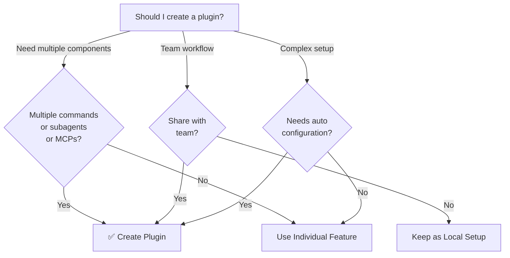

<!-- i18n-source: 07-plugins/README.md -->
<!-- i18n-source-sha: 63a1416 -->
<!-- i18n-date: 2026-04-09 -->

<picture>
  <source media="(prefers-color-scheme: dark)" srcset="../../resources/logos/claude-howto-logo-dark.svg">
  
</picture>

# Плагіни Claude Code

Ця папка містить повні приклади плагінів, які обʼєднують кілька функцій Claude Code у цілісні пакети, що встановлюються однією командою.

## Огляд

Плагіни Claude Code — це обʼєднані колекції кастомізацій (слеш-команди, субагенти, MCP-сервери та хуки), які встановлюються однією командою. Вони є механізмом розширення найвищого рівня — поєднуючи кілька функцій у цілісні пакети, якими можна ділитися.

## Архітектура плагінів



## Процес завантаження плагіна



## Типи та дистрибуція плагінів

| Тип | Область | Спільний | Авторитет | Приклади |
|-----|---------|----------|-----------|----------|
| Офіційний | Глобальний | Усі користувачі | Anthropic | PR Review, Security Guidance |
| Спільнота | Публічний | Усі користувачі | Спільнота | DevOps, Data Science |
| Організація | Внутрішній | Члени команди | Компанія | Внутрішні стандарти, інструменти |
| Персональний | Індивідуальний | Один користувач | Розробник | Кастомні робочі процеси |

## Структура визначення плагіна

Маніфест плагіна використовує формат JSON у файлі `.claude-plugin/plugin.json`:

```json
{
  "name": "my-first-plugin",
  "description": "A greeting plugin",
  "version": "1.0.0",
  "author": {
    "name": "Your Name"
  },
  "homepage": "https://example.com",
  "repository": "https://github.com/user/repo",
  "license": "MIT"
}
```

## Приклад структури плагіна

```
my-plugin/
├── .claude-plugin/
│   └── plugin.json       # Маніфест (назва, опис, версія, автор)
├── commands/             # Навички як Markdown-файли
│   ├── task-1.md
│   ├── task-2.md
│   └── workflows/
├── agents/               # Визначення кастомних агентів
│   ├── specialist-1.md
│   ├── specialist-2.md
│   └── configs/
├── skills/               # Навички агентів з файлами SKILL.md
│   ├── skill-1.md
│   └── skill-2.md
├── hooks/                # Обробники подій у hooks.json
│   └── hooks.json
├── .mcp.json             # Конфігурації MCP-серверів
├── .lsp.json             # Конфігурації LSP-серверів для інтелектуальної роботи з кодом
├── bin/                  # Виконувані файли, додані до PATH інструменту Bash поки плагін увімкнено
├── settings.json         # Стандартні налаштування при увімкненні плагіна (наразі підтримується лише ключ `agent`)
├── templates/
│   └── issue-template.md
├── scripts/
│   ├── helper-1.sh
│   └── helper-2.py
├── docs/
│   ├── README.md
│   └── USAGE.md
└── tests/
    └── plugin.test.js
```

### Конфігурація LSP-сервера

Плагіни можуть включати підтримку Language Server Protocol (LSP — протокол мовного сервера) для інтелектуальної роботи з кодом у реальному часі. LSP-сервери надають діагностику, навігацію по коду та інформацію про символи під час роботи.

**Розташування конфігурації**:
- Файл `.lsp.json` у кореневому каталозі плагіна
- Інлайн-ключ `lsp` у `plugin.json`

#### Довідник полів

| Поле | Обовʼязкове | Опис |
|------|-------------|------|
| `command` | Так | Бінарний файл LSP-сервера (має бути в PATH) |
| `extensionToLanguage` | Так | Відповідність розширень файлів ідентифікаторам мов |
| `args` | Ні | Аргументи командного рядка для сервера |
| `transport` | Ні | Метод комунікації: `stdio` (за замовчуванням) або `socket` |
| `env` | Ні | Змінні оточення для процесу сервера |
| `initializationOptions` | Ні | Опції, що надсилаються під час ініціалізації LSP |
| `settings` | Ні | Конфігурація робочого простору, що передається серверу |
| `workspaceFolder` | Ні | Перевизначення шляху до папки робочого простору |
| `startupTimeout` | Ні | Максимальний час (мс) очікування запуску сервера |
| `shutdownTimeout` | Ні | Максимальний час (мс) для коректного завершення |
| `restartOnCrash` | Ні | Автоматичний перезапуск при збої сервера |
| `maxRestarts` | Ні | Максимальна кількість спроб перезапуску |

#### Приклади конфігурацій

**Go (gopls)**:

```json
{
  "go": {
    "command": "gopls",
    "args": ["serve"],
    "extensionToLanguage": {
      ".go": "go"
    }
  }
}
```

**Python (pyright)**:

```json
{
  "python": {
    "command": "pyright-langserver",
    "args": ["--stdio"],
    "extensionToLanguage": {
      ".py": "python",
      ".pyi": "python"
    }
  }
}
```

**TypeScript**:

```json
{
  "typescript": {
    "command": "typescript-language-server",
    "args": ["--stdio"],
    "extensionToLanguage": {
      ".ts": "typescript",
      ".tsx": "typescriptreact",
      ".js": "javascript",
      ".jsx": "javascriptreact"
    }
  }
}
```

#### Доступні LSP-плагіни

Офіційний маркетплейс включає попередньо налаштовані LSP-плагіни:

| Плагін | Мова | Бінарний файл сервера | Команда встановлення |
|--------|------|----------------------|---------------------|
| `pyright-lsp` | Python | `pyright-langserver` | `pip install pyright` |
| `typescript-lsp` | TypeScript/JavaScript | `typescript-language-server` | `npm install -g typescript-language-server typescript` |
| `rust-lsp` | Rust | `rust-analyzer` | Встановлення через `rustup component add rust-analyzer` |

#### Можливості LSP

Після налаштування LSP-сервери надають:

- **Миттєва діагностика** — помилки та попередження зʼявляються одразу після редагування
- **Навігація по коду** — перехід до визначення, пошук посилань, реалізацій
- **Інформація при наведенні** — сигнатури типів та документація при наведенні курсора
- **Список символів** — перегляд символів у поточному файлі або робочому просторі

## Опції плагіна (v2.1.83+)

Плагіни можуть оголошувати користувацькі опції в маніфесті через `userConfig`. Значення з позначкою `sensitive: true` зберігаються у системному сховищі ключів (keychain), а не в текстових файлах налаштувань:

```json
{
  "name": "my-plugin",
  "version": "1.0.0",
  "userConfig": {
    "apiKey": {
      "description": "API key for the service",
      "sensitive": true
    },
    "region": {
      "description": "Deployment region",
      "default": "us-east-1"
    }
  }
}
```

## Постійні дані плагіна (`${CLAUDE_PLUGIN_DATA}`) (v2.1.78+)

Плагіни мають доступ до каталогу постійного стану через змінну оточення `${CLAUDE_PLUGIN_DATA}`. Цей каталог є унікальним для кожного плагіна та зберігається між сесіями, що робить його придатним для кешів, баз даних та іншого постійного стану:

```json
{
  "hooks": {
    "PostToolUse": [
      {
        "command": "node ${CLAUDE_PLUGIN_DATA}/track-usage.js"
      }
    ]
  }
}
```

Каталог створюється автоматично при встановленні плагіна. Файли зберігаються до видалення плагіна.

## Інлайн-плагін через налаштування (`source: 'settings'`) (v2.1.80+)

Плагіни можна визначати інлайн у файлах налаштувань як записи маркетплейсу з полем `source: 'settings'`. Це дозволяє вбудовувати визначення плагіна безпосередньо, без окремого репозиторію або маркетплейсу:

```json
{
  "pluginMarketplaces": [
    {
      "name": "inline-tools",
      "source": "settings",
      "plugins": [
        {
          "name": "quick-lint",
          "source": "./local-plugins/quick-lint"
        }
      ]
    }
  ]
}
```

## Налаштування плагіна

Плагіни можуть постачатися з файлом `settings.json` для стандартної конфігурації. Наразі підтримується ключ `agent`, який встановлює основного агента потоку для плагіна:

```json
{
  "agent": "agents/specialist-1.md"
}
```

Коли плагін включає `settings.json`, його стандартні значення застосовуються при встановленні. Користувачі можуть перевизначити ці налаштування у своїй конфігурації проєкту або користувача.

## Автономний vs плагін-підхід

| Підхід | Назви команд | Конфігурація | Найкраще для |
|--------|-------------|--------------|--------------|
| **Автономний** | `/hello` | Ручне налаштування в CLAUDE.md | Персональне, специфічне для проєкту |
| **Плагіни** | `/plugin-name:hello` | Автоматичне через plugin.json | Поширення, дистрибуція, командна робота |

Використовуйте **автономні слеш-команди** для швидких персональних робочих процесів. Використовуйте **плагіни**, коли хочете обʼєднати кілька функцій, поділитися з командою або опублікувати для дистрибуції.

## Практичні приклади

### Приклад 1: Плагін PR Review

**Файл:** `.claude-plugin/plugin.json`

```json
{
  "name": "pr-review",
  "version": "1.0.0",
  "description": "Complete PR review workflow with security, testing, and docs",
  "author": {
    "name": "Anthropic"
  },
  "repository": "https://github.com/your-org/pr-review",
  "license": "MIT"
}
```

**Файл:** `commands/review-pr.md`

```markdown
---
name: Review PR
description: Start comprehensive PR review with security and testing checks
---

# PR Review

This command initiates a complete pull request review including:

1. Security analysis
2. Test coverage verification
3. Documentation updates
4. Code quality checks
5. Performance impact assessment
```

**Файл:** `agents/security-reviewer.md`

```yaml
---
name: security-reviewer
description: Security-focused code review
tools: read, grep, diff
---

# Security Reviewer

Specializes in finding security vulnerabilities:
- Authentication/authorization issues
- Data exposure
- Injection attacks
- Secure configuration
```

**Встановлення:**

```bash
/plugin install pr-review

# Результат:
# ✅ 3 слеш-команди встановлено
# ✅ 3 субагенти налаштовано
# ✅ 2 MCP-сервери підключено
# ✅ 4 хуки зареєстровано
# ✅ Готово до використання!
```

### Приклад 2: Плагін DevOps

**Компоненти:**

```
devops-automation/
├── commands/
│   ├── deploy.md
│   ├── rollback.md
│   ├── status.md
│   └── incident.md
├── agents/
│   ├── deployment-specialist.md
│   ├── incident-commander.md
│   └── alert-analyzer.md
├── mcp/
│   ├── github-config.json
│   ├── kubernetes-config.json
│   └── prometheus-config.json
├── hooks/
│   ├── pre-deploy.js
│   ├── post-deploy.js
│   └── on-error.js
└── scripts/
    ├── deploy.sh
    ├── rollback.sh
    └── health-check.sh
```

### Приклад 3: Плагін документації

**Обʼєднані компоненти:**

```
documentation/
├── commands/
│   ├── generate-api-docs.md
│   ├── generate-readme.md
│   ├── sync-docs.md
│   └── validate-docs.md
├── agents/
│   ├── api-documenter.md
│   ├── code-commentator.md
│   └── example-generator.md
├── mcp/
│   ├── github-docs-config.json
│   └── slack-announce-config.json
└── templates/
    ├── api-endpoint.md
    ├── function-docs.md
    └── adr-template.md
```

## Маркетплейс плагінів

Офіційний каталог плагінів, керований Anthropic — `anthropics/claude-plugins-official`. Адміністратори підприємств також можуть створювати приватні маркетплейси для внутрішньої дистрибуції.



### Конфігурація маркетплейсу

Підприємства та просунуті користувачі можуть контролювати поведінку маркетплейсу через налаштування:

| Налаштування | Опис |
|-------------|------|
| `extraKnownMarketplaces` | Додати додаткові джерела маркетплейсу крім стандартних |
| `strictKnownMarketplaces` | Контролювати, які маркетплейси дозволено додавати користувачам |
| `deniedPlugins` | Блок-список для запобігання встановленню конкретних плагінів (керований адміністратором) |

### Додаткові функції маркетплейсу

- **Стандартний таймаут git**: Збільшено з 30с до 120с для великих репозиторіїв плагінів
- **Кастомні npm-реєстри**: Плагіни можуть вказувати URL кастомних npm-реєстрів для розвʼязання залежностей
- **Фіксація версій**: Закріплення плагінів за конкретними версіями для відтворюваних середовищ

### Схема визначення маркетплейсу

Маркетплейси плагінів визначаються у `.claude-plugin/marketplace.json`:

```json
{
  "name": "my-team-plugins",
  "owner": "my-org",
  "plugins": [
    {
      "name": "code-standards",
      "source": "./plugins/code-standards",
      "description": "Enforce team coding standards",
      "version": "1.2.0",
      "author": "platform-team"
    },
    {
      "name": "deploy-helper",
      "source": {
        "source": "github",
        "repo": "my-org/deploy-helper",
        "ref": "v2.0.0"
      },
      "description": "Deployment automation workflows"
    }
  ]
}
```

| Поле | Обовʼязкове | Опис |
|------|-------------|------|
| `name` | Так | Назва маркетплейсу в kebab-case |
| `owner` | Так | Організація або користувач, що підтримує маркетплейс |
| `plugins` | Так | Масив записів плагінів |
| `plugins[].name` | Так | Назва плагіна (kebab-case) |
| `plugins[].source` | Так | Джерело плагіна (рядок шляху або обʼєкт джерела) |
| `plugins[].description` | Ні | Короткий опис плагіна |
| `plugins[].version` | Ні | Рядок семантичної версії |
| `plugins[].author` | Ні | Імʼя автора плагіна |

### Типи джерел плагінів

Плагіни можуть завантажуватися з кількох місць:

| Джерело | Синтаксис | Приклад |
|---------|-----------|---------|
| **Відносний шлях** | Рядок шляху | `"./plugins/my-plugin"` |
| **GitHub** | `{ "source": "github", "repo": "owner/repo" }` | `{ "source": "github", "repo": "acme/lint-plugin", "ref": "v1.0" }` |
| **Git URL** | `{ "source": "url", "url": "..." }` | `{ "source": "url", "url": "https://git.internal/plugin.git" }` |
| **Підкаталог Git** | `{ "source": "git-subdir", "url": "...", "path": "..." }` | `{ "source": "git-subdir", "url": "https://github.com/org/monorepo.git", "path": "packages/plugin" }` |
| **npm** | `{ "source": "npm", "package": "..." }` | `{ "source": "npm", "package": "@acme/claude-plugin", "version": "^2.0" }` |
| **pip** | `{ "source": "pip", "package": "..." }` | `{ "source": "pip", "package": "claude-data-plugin", "version": ">=1.0" }` |

Джерела GitHub та git підтримують необовʼязкові поля `ref` (гілка/тег) та `sha` (хеш коміту) для фіксації версій.

### Методи дистрибуції

**GitHub (рекомендовано)**:
```bash
# Користувачі додають ваш маркетплейс
/plugin marketplace add owner/repo-name
```

**Інші git-сервіси** (потрібен повний URL):
```bash
/plugin marketplace add https://gitlab.com/org/marketplace-repo.git
```

**Приватні репозиторії**: Підтримуються через git credential helpers або токени оточення. Користувачі повинні мати доступ на читання до репозиторію.

**Подання до офіційного маркетплейсу**: Подавайте плагіни до курованого Anthropic маркетплейсу для ширшої дистрибуції через [claude.ai/settings/plugins/submit](https://claude.ai/settings/plugins/submit) або [platform.claude.com/plugins/submit](https://platform.claude.com/plugins/submit).

### Суворий режим (strict mode)

Контроль взаємодії визначень маркетплейсу з локальними файлами `plugin.json`:

| Налаштування | Поведінка |
|-------------|----------|
| `strict: true` (за замовчуванням) | Локальний `plugin.json` є авторитетним; запис маркетплейсу доповнює його |
| `strict: false` | Запис маркетплейсу є повним визначенням плагіна |

**Обмеження організації** через `strictKnownMarketplaces`:

| Значення | Ефект |
|----------|-------|
| Не встановлено | Без обмежень — користувачі можуть додавати будь-який маркетплейс |
| Порожній масив `[]` | Блокування — маркетплейси заборонені |
| Масив патернів | Білий список — дозволено лише маркетплейси, що відповідають патернам |

```json
{
  "strictKnownMarketplaces": [
    "my-org/*",
    "github.com/trusted-vendor/*"
  ]
}
```

> **Увага**: У суворому режимі з `strictKnownMarketplaces` користувачі можуть встановлювати плагіни лише з маркетплейсів білого списку. Це корисно для корпоративних середовищ, що вимагають контрольованої дистрибуції плагінів.

## Встановлення та життєвий цикл плагіна



## Порівняння функцій плагінів

| Функція | Слеш-команда | Навичка | Субагент | Плагін |
|---------|-------------|---------|----------|--------|
| **Встановлення** | Ручне копіювання | Ручне копіювання | Ручна конфігурація | Одна команда |
| **Час налаштування** | 5 хвилин | 10 хвилин | 15 хвилин | 2 хвилини |
| **Обʼєднання** | Один файл | Один файл | Один файл | Кілька |
| **Версіонування** | Ручне | Ручне | Ручне | Автоматичне |
| **Поширення в команді** | Копіювання файлу | Копіювання файлу | Копіювання файлу | ID встановлення |
| **Оновлення** | Ручне | Ручне | Ручне | Автоматично доступне |
| **Залежності** | Немає | Немає | Немає | Можуть включати |
| **Маркетплейс** | Ні | Ні | Ні | Так |
| **Дистрибуція** | Репозиторій | Репозиторій | Репозиторій | Маркетплейс |

## CLI-команди плагінів

Усі операції з плагінами доступні як CLI-команди:

```bash
claude plugin install <n>@<marketplace>   # Встановити з маркетплейсу
claude plugin uninstall <n>               # Видалити плагін
claude plugin list                           # Список встановлених плагінів
claude plugin enable <n>                  # Увімкнути вимкнений плагін
claude plugin disable <n>                 # Вимкнути плагін
claude plugin validate                       # Валідація структури плагіна
```

## Методи встановлення

### З маркетплейсу
```bash
/plugin install plugin-name
# або з CLI:
claude plugin install plugin-name@marketplace-name
```

### Увімкнення / Вимкнення (з автовизначенням області)
```bash
/plugin enable plugin-name
/plugin disable plugin-name
```

### Локальний плагін (для розробки)
```bash
# CLI-прапорець для локального тестування (повторюваний для кількох плагінів)
claude --plugin-dir ./path/to/plugin
claude --plugin-dir ./plugin-a --plugin-dir ./plugin-b
```

### З Git-репозиторію
```bash
/plugin install github:username/repo
```

## Коли створювати плагін



### Випадки використання плагінів

| Випадок | Рекомендація | Чому |
|---------|-------------|------|
| **Онбординг команди** | ✅ Плагін | Миттєве налаштування, усі конфігурації |
| **Налаштування фреймворку** | ✅ Плагін | Обʼєднує команди, специфічні для фреймворку |
| **Корпоративні стандарти** | ✅ Плагін | Централізована дистрибуція, контроль версій |
| **Швидка автоматизація** | ❌ Команда | Надмірна складність |
| **Одна предметна область** | ❌ Навичка | Занадто важко, використовуйте навичку |
| **Спеціалізований аналіз** | ❌ Субагент | Створіть вручну або використовуйте навичку |
| **Доступ до живих даних** | ❌ MCP | Автономний, не обʼєднуйте |

## Тестування плагіна

Перед публікацією протестуйте плагін локально за допомогою CLI-прапорця `--plugin-dir` (повторюваний для кількох плагінів):

```bash
claude --plugin-dir ./my-plugin
claude --plugin-dir ./my-plugin --plugin-dir ./another-plugin
```

Це запускає Claude Code з завантаженим плагіном, дозволяючи:
- Перевірити доступність усіх слеш-команд
- Протестувати коректну роботу субагентів та агентів
- Підтвердити правильне підключення MCP-серверів
- Валідувати виконання хуків
- Перевірити конфігурації LSP-серверів
- Виявити помилки конфігурації

## Гаряче перезавантаження (Hot-Reload)

Плагіни підтримують гаряче перезавантаження під час розробки. При зміні файлів плагіна Claude Code може автоматично виявляти зміни. Також можна примусово перезавантажити командою:

```bash
/reload-plugins
```

Це повторно зчитує всі маніфести плагінів, команди, агентів, навички, хуки та конфігурації MCP/LSP без перезапуску сесії.

## Керовані налаштування для плагінів

Адміністратори можуть контролювати поведінку плагінів в організації через керовані налаштування (managed settings):

| Налаштування | Опис |
|-------------|------|
| `enabledPlugins` | Білий список плагінів, увімкнених за замовчуванням |
| `deniedPlugins` | Блок-список плагінів, які не можна встановити |
| `extraKnownMarketplaces` | Додаткові джерела маркетплейсу крім стандартних |
| `strictKnownMarketplaces` | Обмеження маркетплейсів, які дозволено додавати користувачам |
| `allowedChannelPlugins` | Контроль дозволених плагінів для кожного каналу випуску |

Ці налаштування можна застосувати на рівні організації через файли керованої конфігурації, і вони мають пріоритет над налаштуваннями рівня користувача.

## Безпека плагінів

Субагенти плагінів працюють в обмеженій пісочниці (sandbox). Наступні ключі frontmatter **заборонені** у визначеннях субагентів плагінів:

- `hooks` — субагенти не можуть реєструвати обробники подій
- `mcpServers` — субагенти не можуть налаштовувати MCP-сервери
- `permissionMode` — субагенти не можуть перевизначати модель дозволів

Це гарантує, що плагіни не можуть підвищити привілеї або модифікувати хост-середовище за межами оголошеної області.

## Публікація плагіна

**Кроки для публікації:**

1. Створити структуру плагіна з усіма компонентами
2. Написати маніфест `.claude-plugin/plugin.json`
3. Створити `README.md` з документацією
4. Протестувати локально за допомогою `claude --plugin-dir ./my-plugin`
5. Подати до маркетплейсу плагінів
6. Пройти перевірку та затвердження
7. Публікація в маркетплейсі
8. Користувачі можуть встановити однією командою

**Приклад подання:**

```markdown
# PR Review Plugin

## Description
Complete PR review workflow with security, testing, and documentation checks.

## What's Included
- 3 slash commands for different review types
- 3 specialized subagents
- GitHub and CodeQL MCP integration
- Automated security scanning hooks

## Installation
```bash
/plugin install pr-review
```

## Features
✅ Security analysis
✅ Test coverage checking
✅ Documentation verification
✅ Code quality assessment
✅ Performance impact analysis

## Usage
```bash
/review-pr
/check-security
/check-tests
```

## Requirements
- Claude Code 1.0+
- GitHub access
- CodeQL (optional)
```

## Плагін vs ручна конфігурація

**Ручне налаштування (2+ години):**
- Встановити слеш-команди одну за одною
- Створити субагентів окремо
- Налаштувати MCP окремо
- Встановити хуки вручну
- Задокументувати все
- Поширити в команді (сподіватися, що налаштують правильно)

**З плагіном (2 хвилини):**
```bash
/plugin install pr-review
# ✅ Все встановлено та налаштовано
# ✅ Готово до використання одразу
# ✅ Команда може відтворити точну конфігурацію
```

## Найкращі практики

### Рекомендовано ✅
- Використовуйте зрозумілі, описові назви плагінів
- Включайте вичерпний README
- Версіонуйте плагін правильно (semver — семантичне версіонування)
- Тестуйте всі компоненти разом
- Документуйте вимоги чітко
- Надавайте приклади використання
- Включайте обробку помилок
- Тегуйте належним чином для виявлення
- Підтримуйте зворотну сумісність
- Тримайте плагіни зосередженими та цілісними
- Включайте вичерпні тести
- Документуйте всі залежності

### Не рекомендовано ❌
- Не обʼєднуйте неповʼязані функції
- Не зашивайте облікові дані в код
- Не пропускайте тестування
- Не забувайте про документацію
- Не створюйте надлишкових плагінів
- Не ігноруйте версіонування
- Не ускладнюйте залежності компонентів
- Не забувайте обробляти помилки коректно

## Інструкції зі встановлення

### Встановлення з маркетплейсу

1. **Перегляд доступних плагінів:**
   ```bash
   /plugin list
   ```

2. **Деталі плагіна:**
   ```bash
   /plugin info plugin-name
   ```

3. **Встановлення плагіна:**
   ```bash
   /plugin install plugin-name
   ```

### Встановлення з локального шляху

```bash
/plugin install ./path/to/plugin-directory
```

### Встановлення з GitHub

```bash
/plugin install github:username/repo
```

### Список встановлених плагінів

```bash
/plugin list --installed
```

### Оновлення плагіна

```bash
/plugin update plugin-name
```

### Вимкнення/Увімкнення плагіна

```bash
# Тимчасове вимкнення
/plugin disable plugin-name

# Повторне увімкнення
/plugin enable plugin-name
```

### Видалення плагіна

```bash
/plugin uninstall plugin-name
```

## Повʼязані концепції

Наступні функції Claude Code працюють разом з плагінами:

- **[Слеш-команди](../01-slash-commands/)** — окремі команди, обʼєднані в плагіни
- **[Памʼять](../02-memory/)** — постійний контекст для плагінів
- **[Навички](../03-skills/)** — предметна експертиза, яку можна обгорнути в плагіни
- **[Субагенти](../04-subagents/)** — спеціалізовані агенти як компоненти плагінів
- **[MCP-сервери](../05-mcp/)** — інтеграції Model Context Protocol, обʼєднані в плагіни
- **[Хуки](../06-hooks/)** — обробники подій, що запускають робочі процеси плагінів

## Повний приклад робочого процесу

### Повний робочий процес плагіна PR Review

```
1. Користувач: /review-pr

2. Плагін виконує:
   ├── pre-review.js хук валідує git-репо
   ├── GitHub MCP отримує дані PR
   ├── security-reviewer субагент аналізує безпеку
   ├── test-checker субагент перевіряє покриття
   └── performance-analyzer субагент перевіряє продуктивність

3. Результати синтезуються та представляються:
   ✅ Безпека: Критичних проблем не виявлено
   ⚠️  Тестування: Покриття 65% (рекомендовано 80%+)
   ✅ Продуктивність: Значного впливу немає
   📝 Надано 12 рекомендацій
```

## Усунення несправностей

### Плагін не встановлюється
- Перевірте сумісність версії Claude Code: `/version`
- Перевірте синтаксис `plugin.json` валідатором JSON
- Перевірте підключення до інтернету (для віддалених плагінів)
- Перевірте дозволи: `ls -la plugin/`

### Компоненти не завантажуються
- Переконайтеся, що шляхи в `plugin.json` відповідають фактичній структурі каталогів
- Перевірте дозволи файлів: `chmod +x scripts/`
- Перегляньте синтаксис файлів компонентів
- Перевірте журнали: `/plugin debug plugin-name`

### Збій підключення MCP
- Переконайтеся, що змінні оточення встановлені правильно
- Перевірте встановлення та працездатність MCP-сервера
- Протестуйте підключення MCP окремо за допомогою `/mcp test`
- Перегляньте конфігурацію MCP у каталозі `mcp/`

### Команди недоступні після встановлення
- Переконайтеся, що плагін встановлено успішно: `/plugin list --installed`
- Перевірте, чи плагін увімкнено: `/plugin status plugin-name`
- Перезапустіть Claude Code: `exit` та відкрийте знову
- Перевірте конфлікти назв з існуючими командами

### Проблеми з виконанням хуків
- Переконайтеся, що файли хуків мають правильні дозволи
- Перевірте синтаксис хуків та назви подій
- Перегляньте журнали хуків для деталей помилок
- Протестуйте хуки вручну, якщо можливо

## Додаткові ресурси

- [Офіційна документація плагінів](https://code.claude.com/docs/en/plugins)
- [Каталог плагінів](https://code.claude.com/docs/en/discover-plugins)
- [Маркетплейси плагінів](https://code.claude.com/docs/en/plugin-marketplaces)
- [Довідник плагінів](https://code.claude.com/docs/en/plugins-reference)
- [Довідник MCP-серверів](https://modelcontextprotocol.io/)
- [Посібник конфігурації субагентів](../04-subagents/README.md)
- [Довідник системи хуків](../06-hooks/README.md)

---
**Останнє оновлення**: 9 квітня 2026
**Версія Claude Code**: 2.1.97
**Сумісні моделі**: Claude Sonnet 4.6, Claude Opus 4.6, Claude Haiku 4.5
