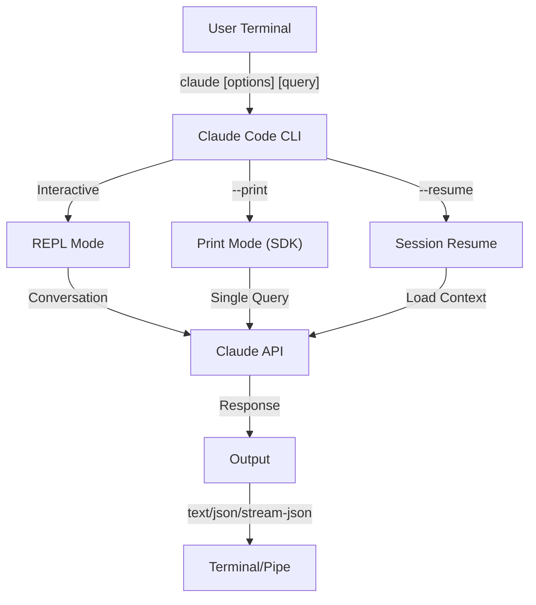
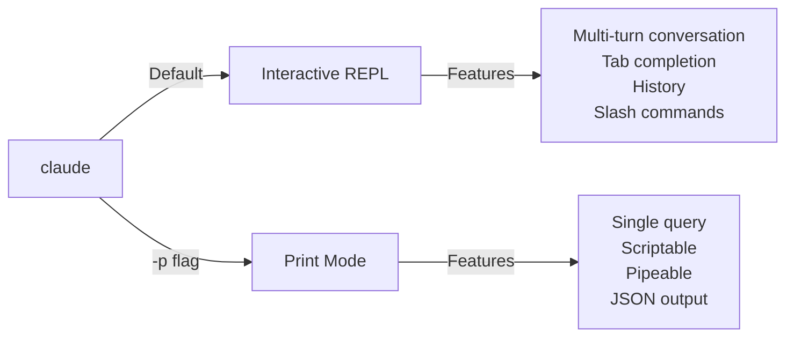

<!-- i18n-source: 10-cli/README.md -->
<!-- i18n-source-sha: 63a1416 -->
<!-- i18n-date: 2026-04-09 -->

<picture>
  <source media="(prefers-color-scheme: dark)" srcset="../../resources/logos/claude-howto-logo-dark.svg">
  
</picture>

# Довідник CLI

## Огляд

Claude Code CLI (інтерфейс командного рядка — основний інструмент для роботи з терміналом) — це головний спосіб взаємодії з Claude Code. Він надає потужні опції для виконання запитів, управління сесіями, конфігурації моделей та інтеграції Claude у ваші робочі процеси розробки.

## Архітектура



## CLI-команди

| Команда | Опис | Приклад |
|---------|------|---------|
| `claude` | Запуск інтерактивного REPL (циклу читання-виконання-виводу) | `claude` |
| `claude "query"` | Запуск REPL з початковим промптом | `claude "explain this project"` |
| `claude -p "query"` | Print-режим — запит і вихід | `claude -p "explain this function"` |
| `cat file \| claude -p "query"` | Обробка вмісту через pipe (конвеєр) | `cat logs.txt \| claude -p "explain"` |
| `claude -c` | Продовжити останню розмову | `claude -c` |
| `claude -c -p "query"` | Продовжити в print-режимі | `claude -c -p "check for type errors"` |
| `claude -r "<session>" "query"` | Відновити сесію за ID або назвою | `claude -r "auth-refactor" "finish this PR"` |
| `claude update` | Оновити до останньої версії | `claude update` |
| `claude mcp` | Налаштування MCP-серверів | Див. [документацію MCP](../05-mcp/) |
| `claude mcp serve` | Запуск Claude Code як MCP-сервера | `claude mcp serve` |
| `claude agents` | Список усіх налаштованих субагентів | `claude agents` |
| `claude auto-mode defaults` | Вивести стандартні правила auto mode як JSON | `claude auto-mode defaults` |
| `claude remote-control` | Запуск сервера Remote Control | `claude remote-control` |
| `claude plugin` | Управління плагінами (встановлення, увімкнення, вимкнення) | `claude plugin install my-plugin` |
| `claude auth login` | Вхід (підтримує `--email`, `--sso`) | `claude auth login --email user@example.com` |
| `claude auth logout` | Вихід з поточного облікового запису | `claude auth logout` |
| `claude auth status` | Перевірка статусу авторизації (код виходу 0 = увійшов, 1 = ні) | `claude auth status` |

## Основні прапорці

| Прапорець | Опис | Приклад |
|-----------|------|---------|
| `-p, --print` | Вивести відповідь без інтерактивного режиму | `claude -p "query"` |
| `-c, --continue` | Завантажити останню розмову | `claude --continue` |
| `-r, --resume` | Відновити конкретну сесію за ID або назвою | `claude --resume auth-refactor` |
| `-v, --version` | Показати номер версії | `claude -v` |
| `-w, --worktree` | Запуск в ізольованому git worktree (робочому дереві) | `claude -w` |
| `-n, --name` | Відображувана назва сесії | `claude -n "auth-refactor"` |
| `--from-pr <number>` | Відновити сесії, привʼязані до GitHub PR | `claude --from-pr 42` |
| `--remote "task"` | Створити веб-сесію на claude.ai | `claude --remote "implement API"` |
| `--remote-control, --rc` | Інтерактивна сесія з Remote Control | `claude --rc` |
| `--teleport` | Відновити веб-сесію локально | `claude --teleport` |
| `--teammate-mode` | Режим відображення Agent Teams | `claude --teammate-mode tmux` |
| `--bare` | Мінімальний режим (без хуків, навичок, плагінів, MCP, auto memory, CLAUDE.md) | `claude --bare` |
| `--enable-auto-mode` | Розблокувати auto permission mode | `claude --enable-auto-mode` |
| `--channels` | Підписка на MCP channel plugins | `claude --channels discord,telegram` |
| `--chrome` / `--no-chrome` | Увімкнути/вимкнути інтеграцію з браузером Chrome | `claude --chrome` |
| `--effort` | Встановити рівень зусиль мислення | `claude --effort high` |
| `--init` / `--init-only` | Запуск хуків ініціалізації | `claude --init` |
| `--maintenance` | Запуск хуків обслуговування та вихід | `claude --maintenance` |
| `--disable-slash-commands` | Вимкнути всі навички та слеш-команди | `claude --disable-slash-commands` |
| `--no-session-persistence` | Вимкнути збереження сесії (print mode) | `claude -p --no-session-persistence "query"` |

### Інтерактивний vs Print-режим



**Інтерактивний режим** (за замовчуванням):
```bash
# Запуск інтерактивної сесії
claude

# Запуск з початковим промптом
claude "explain the authentication flow"
```

**Print-режим** (неінтерактивний):
```bash
# Один запит, потім вихід
claude -p "what does this function do?"

# Обробка вмісту файлу
cat error.log | claude -p "explain this error"

# Ланцюжок з іншими інструментами
claude -p "list todos" | grep "URGENT"
```

## Модель та конфігурація

| Прапорець | Опис | Приклад |
|-----------|------|---------|
| `--model` | Встановити модель (sonnet, opus, haiku або повна назва) | `claude --model opus` |
| `--fallback-model` | Автоматичний фолбек (запасна модель) при перевантаженні | `claude -p --fallback-model sonnet "query"` |
| `--agent` | Вказати агента для сесії | `claude --agent my-custom-agent` |
| `--agents` | Визначити кастомних субагентів через JSON | Див. [Конфігурація агентів](#конфігурація-агентів) |
| `--effort` | Встановити рівень зусиль (low, medium, high, max) | `claude --effort high` |

### Приклади вибору моделі

```bash
# Opus 4.6 для складних завдань
claude --model opus "design a caching strategy"

# Haiku 4.5 для швидких завдань
claude --model haiku -p "format this JSON"

# Повна назва моделі
claude --model claude-sonnet-4-6-20250929 "review this code"

# З фолбеком для надійності
claude -p --model opus --fallback-model sonnet "analyze architecture"

# opusplan (Opus планує, Sonnet виконує)
claude --model opusplan "design and implement the caching layer"
```

## Кастомізація системного промпта

| Прапорець | Опис | Приклад |
|-----------|------|---------|
| `--system-prompt` | Замінити весь стандартний промпт | `claude --system-prompt "You are a Python expert"` |
| `--system-prompt-file` | Завантажити промпт з файлу (print mode) | `claude -p --system-prompt-file ./prompt.txt "query"` |
| `--append-system-prompt` | Додати до стандартного промпта | `claude --append-system-prompt "Always use TypeScript"` |

### Приклади системного промпта

```bash
# Повністю кастомна персона
claude --system-prompt "You are a senior security engineer. Focus on vulnerabilities."

# Додавання конкретних інструкцій
claude --append-system-prompt "Always include unit tests with code examples"

# Завантаження складного промпта з файлу
claude -p --system-prompt-file ./prompts/code-reviewer.txt "review main.py"
```

### Порівняння прапорців системного промпта

| Прапорець | Поведінка | Інтерактивний | Print |
|-----------|----------|---------------|-------|
| `--system-prompt` | Замінює весь стандартний системний промпт | ✅ | ✅ |
| `--system-prompt-file` | Замінює промптом з файлу | ❌ | ✅ |
| `--append-system-prompt` | Додає до стандартного системного промпта | ✅ | ✅ |

**Використовуйте `--system-prompt-file` лише в print-режимі. Для інтерактивного режиму використовуйте `--system-prompt` або `--append-system-prompt`.**

## Управління інструментами та дозволами

| Прапорець | Опис | Приклад |
|-----------|------|---------|
| `--tools` | Обмежити доступні вбудовані інструменти | `claude -p --tools "Bash,Edit,Read" "query"` |
| `--allowedTools` | Інструменти, що виконуються без запиту дозволу | `"Bash(git log:*)" "Read"` |
| `--disallowedTools` | Інструменти, видалені з контексту | `"Bash(rm:*)" "Edit"` |
| `--dangerously-skip-permissions` | Пропустити всі запити дозволів | `claude --dangerously-skip-permissions` |
| `--permission-mode` | Починати у вказаному режимі дозволів | `claude --permission-mode auto` |
| `--permission-prompt-tool` | MCP-інструмент для обробки дозволів | `claude -p --permission-prompt-tool mcp_auth "query"` |
| `--enable-auto-mode` | Розблокувати auto permission mode | `claude --enable-auto-mode` |

### Приклади дозволів

```bash
# Режим тільки для читання — код-рев'ю
claude --permission-mode plan "review this codebase"

# Обмеження до безпечних інструментів
claude --tools "Read,Grep,Glob" -p "find all TODO comments"

# Дозволити конкретні git-команди без запитів
claude --allowedTools "Bash(git status:*)" "Bash(git log:*)"

# Заблокувати небезпечні операції
claude --disallowedTools "Bash(rm -rf:*)" "Bash(git push --force:*)"
```

## Вивід та формат

| Прапорець | Опис | Опції | Приклад |
|-----------|------|-------|---------|
| `--output-format` | Формат виводу (print mode) | `text`, `json`, `stream-json` | `claude -p --output-format json "query"` |
| `--input-format` | Формат вводу (print mode) | `text`, `stream-json` | `claude -p --input-format stream-json` |
| `--verbose` | Увімкнути детальне логування | | `claude --verbose` |
| `--include-partial-messages` | Включити потокові (streaming) події | Потребує `stream-json` | `claude -p --output-format stream-json --include-partial-messages "query"` |
| `--json-schema` | Отримати валідований JSON за схемою | | `claude -p --json-schema '{"type":"object"}' "query"` |
| `--max-budget-usd` | Максимальні витрати для print mode | | `claude -p --max-budget-usd 5.00 "query"` |

### Приклади формату виводу

```bash
# Звичайний текст (за замовчуванням)
claude -p "explain this code"

# JSON для програмного використання
claude -p --output-format json "list all functions in main.py"

# Потоковий JSON для обробки в реальному часі
claude -p --output-format stream-json "generate a long report"

# Структурований вивід із валідацією за схемою
claude -p --json-schema '{"type":"object","properties":{"bugs":{"type":"array"}}}' \
  "find bugs in this code and return as JSON"
```

## Робочий простір та каталог

| Прапорець | Опис | Приклад |
|-----------|------|---------|
| `--add-dir` | Додати додаткові робочі каталоги | `claude --add-dir ../apps ../lib` |
| `--setting-sources` | Джерела налаштувань через кому | `claude --setting-sources user,project` |
| `--settings` | Завантажити налаштування з файлу або JSON | `claude --settings ./settings.json` |
| `--plugin-dir` | Завантажити плагіни з каталогу (повторюваний) | `claude --plugin-dir ./my-plugin` |

### Приклад роботи з кількома каталогами

```bash
# Робота в кількох каталогах проєкту одночасно
claude --add-dir ../frontend ../backend ../shared "find all API endpoints"

# Завантаження кастомних налаштувань
claude --settings '{"model":"opus","verbose":true}' "complex task"
```

## Конфігурація MCP

| Прапорець | Опис | Приклад |
|-----------|------|---------|
| `--mcp-config` | Завантажити MCP-сервери з JSON | `claude --mcp-config ./mcp.json` |
| `--strict-mcp-config` | Використовувати тільки вказану MCP-конфігурацію | `claude --strict-mcp-config --mcp-config ./mcp.json` |
| `--channels` | Підписка на MCP channel plugins | `claude --channels discord,telegram` |

### Приклади MCP

```bash
# Завантаження GitHub MCP-сервера
claude --mcp-config ./github-mcp.json "list open PRs"

# Суворий режим — тільки вказані сервери
claude --strict-mcp-config --mcp-config ./production-mcp.json "deploy to staging"
```

## Управління сесіями

| Прапорець | Опис | Приклад |
|-----------|------|---------|
| `--session-id` | Використовувати конкретний ID сесії (UUID) | `claude --session-id "550e8400-..."` |
| `--fork-session` | Створити нову сесію при відновленні | `claude --resume abc123 --fork-session` |

### Приклади сесій

```bash
# Продовжити останню розмову
claude -c

# Відновити іменовану сесію
claude -r "feature-auth" "continue implementing login"

# Форк сесії для експериментів
claude --resume feature-auth --fork-session "try alternative approach"

# Використання конкретного ID сесії
claude --session-id "550e8400-e29b-41d4-a716-446655440000" "continue"
```

### Форк сесії

Створення відгалуження від існуючої сесії для експериментів:

```bash
# Форк сесії для альтернативного підходу
claude --resume abc123 --fork-session "try alternative implementation"

# Форк з кастомним повідомленням
claude -r "feature-auth" --fork-session "test with different architecture"
```

**Випадки використання:**
- Спроба альтернативних реалізацій без втрати оригінальної сесії
- Паралельне експериментування з різними підходами
- Створення відгалужень від успішної роботи для варіацій
- Тестування зламуючих змін (breaking changes) без впливу на основну сесію

Оригінальна сесія залишається без змін, а форк стає новою незалежною сесією.

## Розширені функції

| Прапорець | Опис | Приклад |
|-----------|------|---------|
| `--chrome` | Увімкнути інтеграцію з браузером Chrome | `claude --chrome` |
| `--no-chrome` | Вимкнути інтеграцію з Chrome | `claude --no-chrome` |
| `--ide` | Автопідключення до IDE, якщо доступна | `claude --ide` |
| `--max-turns` | Обмежити кількість агентних кроків (неінтерактивний режим) | `claude -p --max-turns 3 "query"` |
| `--debug` | Увімкнути режим налагодження з фільтрацією | `claude --debug "api,mcp"` |
| `--enable-lsp-logging` | Увімкнути детальне логування LSP | `claude --enable-lsp-logging` |
| `--betas` | Beta-заголовки для API-запитів | `claude --betas interleaved-thinking` |
| `--plugin-dir` | Завантажити плагіни з каталогу (повторюваний) | `claude --plugin-dir ./my-plugin` |
| `--enable-auto-mode` | Розблокувати auto permission mode | `claude --enable-auto-mode` |
| `--effort` | Встановити рівень зусиль мислення | `claude --effort high` |
| `--bare` | Мінімальний режим (без хуків, навичок, плагінів, MCP, auto memory, CLAUDE.md) | `claude --bare` |
| `--channels` | Підписка на MCP channel plugins | `claude --channels discord` |
| `--tmux` | Створити tmux-сесію для worktree | `claude --tmux` |
| `--fork-session` | Створити новий ID сесії при відновленні | `claude --resume abc --fork-session` |
| `--max-budget-usd` | Максимальні витрати (print mode) | `claude -p --max-budget-usd 5.00 "query"` |
| `--json-schema` | Валідований JSON-вивід | `claude -p --json-schema '{"type":"object"}' "q"` |

### Приклади розширених функцій

```bash
# Обмежити автономні дії
claude -p --max-turns 5 "refactor this module"

# Налагодження API-викликів
claude --debug "api" "test query"

# Увімкнути інтеграцію з IDE
claude --ide "help me with this file"
```

## Конфігурація агентів

Прапорець `--agents` приймає JSON-обʼєкт, що визначає кастомних субагентів для сесії.

### Формат JSON для агентів

```json
{
  "agent-name": {
    "description": "Обовʼязково: коли викликати цього агента",
    "prompt": "Обовʼязково: системний промпт для агента",
    "tools": ["Необовʼязково", "масив", "інструментів"],
    "model": "необовʼязково: sonnet|opus|haiku"
  }
}
```

**Обовʼязкові поля:**
- `description` — опис природною мовою, коли використовувати цього агента
- `prompt` — системний промпт, що визначає роль та поведінку агента

**Необовʼязкові поля:**
- `tools` — масив доступних інструментів (якщо не вказано, успадковує всі)
  - Формат: `["Read", "Grep", "Glob", "Bash"]`
- `model` — модель: `sonnet`, `opus` або `haiku`

### Повний приклад агентів

```json
{
  "code-reviewer": {
    "description": "Expert code reviewer. Use proactively after code changes.",
    "prompt": "You are a senior code reviewer. Focus on code quality, security, and best practices.",
    "tools": ["Read", "Grep", "Glob", "Bash"],
    "model": "sonnet"
  },
  "debugger": {
    "description": "Debugging specialist for errors and test failures.",
    "prompt": "You are an expert debugger. Analyze errors, identify root causes, and provide fixes.",
    "tools": ["Read", "Edit", "Bash", "Grep"],
    "model": "opus"
  },
  "documenter": {
    "description": "Documentation specialist for generating guides.",
    "prompt": "You are a technical writer. Create clear, comprehensive documentation.",
    "tools": ["Read", "Write"],
    "model": "haiku"
  }
}
```

### Приклади команд з агентами

```bash
# Визначення кастомних агентів інлайн
claude --agents '{
  "security-auditor": {
    "description": "Security specialist for vulnerability analysis",
    "prompt": "You are a security expert. Find vulnerabilities and suggest fixes.",
    "tools": ["Read", "Grep", "Glob"],
    "model": "opus"
  }
}' "audit this codebase for security issues"

# Завантаження агентів з файлу
claude --agents "$(cat ~/.claude/agents.json)" "review the auth module"

# Комбінація з іншими прапорцями
claude -p --agents "$(cat agents.json)" --model sonnet "analyze performance"
```

### Пріоритет агентів

При наявності кількох визначень агентів вони завантажуються в такому порядку пріоритету:
1. **CLI-визначені** (прапорець `--agents`) — для конкретної сесії
2. **Рівень користувача** (`~/.claude/agents/`) — для всіх проєктів
3. **Рівень проєкту** (`.claude/agents/`) — для поточного проєкту

CLI-визначені агенти перевизначають агентів рівня користувача та проєкту на час сесії.

---

## Високоцінні сценарії використання

### 1. Інтеграція CI/CD

Використання Claude Code у CI/CD-пайплайнах (конвеєрах безперервної інтеграції/доставки) для автоматизованого код-рев'ю, тестування та документації.

**Приклад GitHub Actions:**

```yaml
name: AI Code Review

on: [pull_request]

jobs:
  review:
    runs-on: ubuntu-latest
    steps:
      - uses: actions/checkout@v4

      - name: Install Claude Code
        run: npm install -g @anthropic-ai/claude-code

      - name: Run Code Review
        env:
          ANTHROPIC_API_KEY: ${{ secrets.ANTHROPIC_API_KEY }}
        run: |
          claude -p --output-format json \
            --max-turns 1 \
            "Review the changes in this PR for:
            - Security vulnerabilities
            - Performance issues
            - Code quality
            Output as JSON with 'issues' array" > review.json

      - name: Post Review Comment
        uses: actions/github-script@v7
        with:
          script: |
            const fs = require('fs');
            const review = JSON.parse(fs.readFileSync('review.json', 'utf8'));
            // Обробка та публікація коментарів рев'ю
```

**Пайплайн Jenkins:**

```groovy
pipeline {
    agent any
    stages {
        stage('AI Review') {
            steps {
                sh '''
                    claude -p --output-format json \
                      --max-turns 3 \
                      "Analyze test coverage and suggest missing tests" \
                      > coverage-analysis.json
                '''
            }
        }
    }
}
```

### 2. Pipe-обробка скриптів

Обробка файлів, журналів та даних через Claude для аналізу.

**Аналіз журналів:**

```bash
# Аналіз журналів помилок
tail -1000 /var/log/app/error.log | claude -p "summarize these errors and suggest fixes"

# Пошук патернів у журналах доступу
cat access.log | claude -p "identify suspicious access patterns"

# Аналіз git-історії
git log --oneline -50 | claude -p "summarize recent development activity"
```

**Обробка коду:**

```bash
# Рев'ю конкретного файлу
cat src/auth.ts | claude -p "review this authentication code for security issues"

# Генерація документації
cat src/api/*.ts | claude -p "generate API documentation in markdown"

# Пошук TODO та пріоритезація
grep -r "TODO" src/ | claude -p "prioritize these TODOs by importance"
```

### 3. Мультисесійні робочі процеси

Управління складними проєктами з кількома потоками розмов.

```bash
# Запуск сесії для гілки функції
claude -r "feature-auth" "let's implement user authentication"

# Пізніше — продовження сесії
claude -r "feature-auth" "add password reset functionality"

# Форк для альтернативного підходу
claude --resume feature-auth --fork-session "try OAuth instead"

# Переключення між різними сесіями функцій
claude -r "feature-payments" "continue with Stripe integration"
```

### 4. Кастомна конфігурація агентів

Визначення спеціалізованих агентів для робочих процесів вашої команди.

```bash
# Збереження конфігурації агентів у файл
cat > ~/.claude/agents.json << 'EOF'
{
  "reviewer": {
    "description": "Code reviewer for PR reviews",
    "prompt": "Review code for quality, security, and maintainability.",
    "model": "opus"
  },
  "documenter": {
    "description": "Documentation specialist",
    "prompt": "Generate clear, comprehensive documentation.",
    "model": "sonnet"
  },
  "refactorer": {
    "description": "Code refactoring expert",
    "prompt": "Suggest and implement clean code refactoring.",
    "tools": ["Read", "Edit", "Glob"]
  }
}
EOF

# Використання агентів у сесії
claude --agents "$(cat ~/.claude/agents.json)" "review the auth module"
```

### 5. Пакетна обробка

Обробка кількох запитів з однаковими налаштуваннями.

```bash
# Обробка кількох файлів
for file in src/*.ts; do
  echo "Processing $file..."
  claude -p --model haiku "summarize this file: $(cat $file)" >> summaries.md
done

# Пакетне код-рев'ю
find src -name "*.py" -exec sh -c '
  echo "## $1" >> review.md
  cat "$1" | claude -p "brief code review" >> review.md
' _ {} \;

# Генерація тестів для всіх модулів
for module in $(ls src/modules/); do
  claude -p "generate unit tests for src/modules/$module" > "tests/$module.test.ts"
done
```

### 6. Безпечна розробка

Використання контролю дозволів для безпечної роботи.

```bash
# Аудит безпеки тільки для читання
claude --permission-mode plan \
  --tools "Read,Grep,Glob" \
  "audit this codebase for security vulnerabilities"

# Блокування небезпечних команд
claude --disallowedTools "Bash(rm:*)" "Bash(curl:*)" "Bash(wget:*)" \
  "help me clean up this project"

# Обмежена автоматизація
claude -p --max-turns 2 \
  --allowedTools "Read" "Glob" \
  "find all hardcoded credentials"
```

### 7. JSON API інтеграція

Використання Claude як програмного API для ваших інструментів з парсингом через `jq`.

```bash
# Структурований аналіз
claude -p --output-format json \
  --json-schema '{"type":"object","properties":{"functions":{"type":"array"},"complexity":{"type":"string"}}}' \
  "analyze main.py and return function list with complexity rating"

# Інтеграція з jq для обробки
claude -p --output-format json "list all API endpoints" | jq '.endpoints[]'

# Використання в скриптах
RESULT=$(claude -p --output-format json "is this code secure? answer with {secure: boolean, issues: []}" < code.py)
if echo "$RESULT" | jq -e '.secure == false' > /dev/null; then
  echo "Security issues found!"
  echo "$RESULT" | jq '.issues[]'
fi
```

### Приклади парсингу jq

Парсинг та обробка JSON-виводу Claude за допомогою `jq`:

```bash
# Витяг конкретних полів
claude -p --output-format json "analyze this code" | jq '.result'

# Фільтрація елементів масиву
claude -p --output-format json "list issues" | jq -r '.issues[] | select(.severity=="high")'

# Витяг кількох полів
claude -p --output-format json "describe the project" | jq -r '.{name, version, description}'

# Конвертація в CSV
claude -p --output-format json "list functions" | jq -r '.functions[] | [.name, .lineCount] | @csv'

# Умовна обробка
claude -p --output-format json "check security" | jq 'if .vulnerabilities | length > 0 then "UNSAFE" else "SAFE" end'

# Витяг вкладених значень
claude -p --output-format json "analyze performance" | jq '.metrics.cpu.usage'

# Обробка всього масиву
claude -p --output-format json "find todos" | jq '.todos | length'

# Трансформація виводу
claude -p --output-format json "list improvements" | jq 'map({title: .title, priority: .priority})'
```

---

## Моделі

Claude Code підтримує кілька моделей з різними можливостями:

| Модель | ID | Контекстне вікно | Примітки |
|--------|-----|-----------------|----------|
| Opus 4.6 | `claude-opus-4-6` | 1M токенів | Найпотужніша, адаптивні рівні зусиль |
| Sonnet 4.6 | `claude-sonnet-4-6` | 1M токенів | Баланс швидкості та можливостей |
| Haiku 4.5 | `claude-haiku-4-5` | 1M токенів | Найшвидша, оптимальна для швидких завдань |

### Вибір моделі

```bash
# Використання коротких назв
claude --model opus "complex architectural review"
claude --model sonnet "implement this feature"
claude --model haiku -p "format this JSON"

# Використання alias opusplan (Opus планує, Sonnet виконує)
claude --model opusplan "design and implement the API"

# Перемикання на швидкий режим під час сесії
/fast
```

### Рівні зусиль (Opus 4.6)

Opus 4.6 підтримує адаптивне міркування з рівнями зусиль:

```bash
# Через прапорець CLI
claude --effort high "complex review"

# Через слеш-команду
/effort high

# Через змінну оточення
export CLAUDE_CODE_EFFORT_LEVEL=high   # low, medium, high або max (лише Opus 4.6)
```

Ключове слово "ultrathink" у промптах активує глибоке міркування. Рівень `max` — ексклюзивний для Opus 4.6.

---

## Ключові змінні оточення

| Змінна | Опис |
|--------|------|
| `ANTHROPIC_API_KEY` | API-ключ для автентифікації |
| `ANTHROPIC_MODEL` | Перевизначення стандартної моделі |
| `ANTHROPIC_CUSTOM_MODEL_OPTION` | Кастомна опція моделі для API |
| `ANTHROPIC_DEFAULT_OPUS_MODEL` | Перевизначення стандартного ID моделі Opus |
| `ANTHROPIC_DEFAULT_SONNET_MODEL` | Перевизначення стандартного ID моделі Sonnet |
| `ANTHROPIC_DEFAULT_HAIKU_MODEL` | Перевизначення стандартного ID моделі Haiku |
| `MAX_THINKING_TOKENS` | Бюджет токенів розширеного мислення |
| `CLAUDE_CODE_EFFORT_LEVEL` | Рівень зусиль (`low`/`medium`/`high`/`max`) |
| `CLAUDE_CODE_SIMPLE` | Мінімальний режим, встановлюється прапорцем `--bare` |
| `CLAUDE_CODE_DISABLE_AUTO_MEMORY` | Вимкнути автоматичне оновлення CLAUDE.md |
| `CLAUDE_CODE_DISABLE_BACKGROUND_TASKS` | Вимкнути виконання фонових завдань |
| `CLAUDE_CODE_DISABLE_CRON` | Вимкнути заплановані/cron-завдання |
| `CLAUDE_CODE_DISABLE_GIT_INSTRUCTIONS` | Вимкнути git-інструкції |
| `CLAUDE_CODE_DISABLE_TERMINAL_TITLE` | Вимкнути оновлення заголовка терміналу |
| `CLAUDE_CODE_DISABLE_1M_CONTEXT` | Вимкнути контекстне вікно 1M токенів |
| `CLAUDE_CODE_DISABLE_NONSTREAMING_FALLBACK` | Вимкнути фолбек без стрімінгу |
| `CLAUDE_CODE_ENABLE_TASKS` | Увімкнути функцію списку завдань |
| `CLAUDE_CODE_TASK_LIST_ID` | Іменований каталог завдань, спільний між сесіями |
| `CLAUDE_CODE_ENABLE_PROMPT_SUGGESTION` | Увімкнути/вимкнути пропозиції промптів (`true`/`false`) |
| `CLAUDE_CODE_EXPERIMENTAL_AGENT_TEAMS` | Увімкнути експериментальні Agent Teams |
| `CLAUDE_CODE_NEW_INIT` | Використовувати новий потік ініціалізації |
| `CLAUDE_CODE_SUBAGENT_MODEL` | Модель для виконання субагентів |
| `CLAUDE_CODE_PLUGIN_SEED_DIR` | Каталог для seed-файлів плагінів |
| `CLAUDE_CODE_SUBPROCESS_ENV_SCRUB` | Змінні оточення для видалення з підпроцесів |
| `CLAUDE_AUTOCOMPACT_PCT_OVERRIDE` | Перевизначити відсоток автокомпакції |
| `CLAUDE_STREAM_IDLE_TIMEOUT_MS` | Таймаут простою потоку в мілісекундах |
| `SLASH_COMMAND_TOOL_CHAR_BUDGET` | Бюджет символів для інструментів слеш-команд |
| `ENABLE_TOOL_SEARCH` | Увімкнути пошук інструментів |
| `MAX_MCP_OUTPUT_TOKENS` | Максимум токенів для виводу MCP-інструмента |

---

## Швидкий довідник

### Найпоширеніші команди

```bash
# Інтерактивна сесія
claude

# Швидке питання
claude -p "how do I..."

# Продовжити розмову
claude -c

# Обробити файл
cat file.py | claude -p "review this"

# JSON-вивід для скриптів
claude -p --output-format json "query"
```

### Комбінації прапорців

| Сценарій | Команда |
|----------|---------|
| Швидке код-рев'ю | `cat file \| claude -p "review"` |
| Структурований вивід | `claude -p --output-format json "query"` |
| Безпечне дослідження | `claude --permission-mode plan` |
| Автономність з безпекою | `claude --enable-auto-mode --permission-mode auto` |
| CI/CD інтеграція | `claude -p --max-turns 3 --output-format json` |
| Відновлення роботи | `claude -r "session-name"` |
| Кастомна модель | `claude --model opus "complex task"` |
| Мінімальний режим | `claude --bare "quick query"` |
| Ліміт бюджету | `claude -p --max-budget-usd 2.00 "analyze code"` |

---

## Усунення несправностей

### Команда не знайдена

**Проблема:** `claude: command not found`

**Рішення:**
- Встановіть Claude Code: `npm install -g @anthropic-ai/claude-code`
- Перевірте, що PATH включає глобальний bin-каталог npm
- Спробуйте запуск з повним шляхом: `npx claude`

### Проблеми з API-ключем

**Проблема:** Помилка автентифікації

**Рішення:**
- Встановіть API-ключ: `export ANTHROPIC_API_KEY=your-key`
- Перевірте валідність ключа та наявність достатнього балансу
- Перевірте дозволи ключа для запитуваної моделі

### Сесія не знайдена

**Проблема:** Неможливо відновити сесію

**Рішення:**
- Перегляньте доступні сесії, щоб знайти правильну назву/ID
- Сесії можуть закінчуватися після періоду неактивності
- Використовуйте `-c` для продовження останньої сесії

### Проблеми з форматом виводу

**Проблема:** JSON-вивід пошкоджений

**Рішення:**
- Використовуйте `--json-schema` для примусового дотримання структури
- Додайте явні інструкції щодо JSON у промпті
- Використовуйте `--output-format json` (а не просто просіть JSON у промпті)

### Відмова в дозволі

**Проблема:** Виконання інструменту заблоковане

**Рішення:**
- Перевірте налаштування `--permission-mode`
- Перегляньте прапорці `--allowedTools` та `--disallowedTools`
- Використовуйте `--dangerously-skip-permissions` для автоматизації (з обережністю)

---

## Додаткові ресурси

- **[Офіційний довідник CLI](https://code.claude.com/docs/en/cli-reference)** — повний довідник команд
- **[Документація Headless Mode](https://code.claude.com/docs/en/headless)** — автоматизоване виконання
- **[Слеш-команди](../01-slash-commands/)** — кастомні ярлики в Claude
- **[Посібник з памʼяті](../02-memory/)** — постійний контекст через CLAUDE.md
- **[Протокол MCP](../05-mcp/)** — інтеграція зовнішніх інструментів
- **[Розширені функції](../09-advanced-features/)** — режим планування, розширене мислення
- **[Посібник субагентів](../04-subagents/)** — делеговане виконання завдань

---

*Частина серії посібників [Claude How To](../)*

---
**Останнє оновлення**: 9 квітня 2026
**Версія Claude Code**: 2.1.97
**Сумісні моделі**: Claude Sonnet 4.6, Claude Opus 4.6, Claude Haiku 4.5
