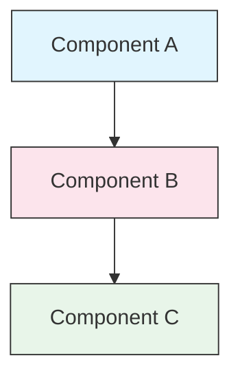

<!-- i18n-source: STYLE_GUIDE.md -->
<!-- i18n-source-sha: 63a1416 -->
<!-- i18n-date: 2026-04-09 -->

<picture>
  <source media="(prefers-color-scheme: dark)" srcset="../resources/logos/claude-howto-logo-dark.svg">
  
</picture>

# Гайд зі стилю

> Конвенції та правила форматування для внеску в Claude How To. Дотримуйтесь цього гайду, щоб тримати контент консистентним, професійним та зручним для підтримки.

---

## Зміст

- [Іменування файлів та каталогів](#іменування-файлів-та-каталогів)
- [Структура документа](#структура-документа)
- [Заголовки](#заголовки)
- [Форматування тексту](#форматування-тексту)
- [Списки](#списки)
- [Таблиці](#таблиці)
- [Блоки коду](#блоки-коду)
- [Посилання та перехресні посилання](#посилання-та-перехресні-посилання)
- [Діаграми](#діаграми)
- [Використання емодзі](#використання-емодзі)
- [YAML Frontmatter](#yaml-frontmatter)
- [Зображення та медіа](#зображення-та-медіа)
- [Тон та голос](#тон-та-голос)
- [Повідомлення комітів](#повідомлення-комітів)
- [Чеклист для авторів](#чеклист-для-авторів)

---

## Іменування файлів та каталогів

### Каталоги уроків

Каталоги уроків використовують **двозначний числовий префікс** з **kebab-case** описом:

```
01-slash-commands/
02-memory/
03-skills/
04-subagents/
05-mcp/
```

Номер відображає порядок навчального шляху від початківця до просунутого.

### Імена файлів

| Тип | Конвенція | Приклади |
|-----|-----------|---------|
| **README уроку** | `README.md` | `01-slash-commands/README.md` |
| **Файл функції** | Kebab-case `.md` | `code-reviewer.md`, `generate-api-docs.md` |
| **Shell-скрипт** | Kebab-case `.sh` | `format-code.sh`, `validate-input.sh` |
| **Конфіг-файл** | Стандартні назви | `.mcp.json`, `settings.json` |
| **Файл пам'яті** | З префіксом области | `project-CLAUDE.md`, `personal-CLAUDE.md` |
| **Документи верхнього рівня** | UPPER_CASE `.md` | `CATALOG.md`, `QUICK_REFERENCE.md`, `CONTRIBUTING.md` |
| **Зображення** | Kebab-case | `pr-slash-command.png`, `claude-howto-logo.svg` |

### Правила

- Використовуйте **нижній регістр** для всіх імен файлів та каталогів (крім документів верхнього рівня як `README.md`, `CATALOG.md`)
- Використовуйте **дефіси** (`-`) як розділювачі слів, ніколи підкреслення або пробіли
- Тримайте назви описовими, але стислими

---

## Структура документа

### Кореневий README

Кореневий `README.md` дотримується порядку:

1. Логотип (елемент `<picture>` з варіантами dark/light)
2. Заголовок H1
3. Вступна цитата (однорядкова ціннісна пропозиція)
4. Секція "Чому цей довідник?" з таблицею порівняння
5. Горизонтальна лінія (`---`)
6. Зміст
7. Каталог функцій
8. Швидка навігація
9. Навчальний шлях
10. Секції функцій
11. Початок роботи
12. Найкращі практики / Усунення проблем
13. Внесок / Ліцензія

### README уроку

Кожен `README.md` уроку дотримується порядку:

1. Заголовок H1 (напр., `# Slash Commands`)
2. Короткий вступний абзац
3. Таблиця швидкого довідника (опціонально)
4. Архітектурна діаграма (Mermaid)
5. Детальні секції (H2)
6. Практичні приклади (нумеровані, 4-6 прикладів)
7. Найкращі практики (таблиці Do's and Don'ts)
8. Усунення проблем
9. Пов'язані гайди / Офіційна документація
10. Метадані документа у футері

### Файл функції/прикладу

Окремі файли функцій (напр., `optimize.md`, `pr.md`):

1. YAML frontmatter (якщо потрібно)
2. Заголовок H1
3. Призначення / опис
4. Інструкції з використання
5. Приклади коду
6. Поради з налаштування

### Розділювачі секцій

Використовуйте горизонтальні лінії (`---`) для відділення основних регіонів документа:

```markdown
---

## Нова основна секція
```

Розміщуйте їх після вступної цитати та між логічно окремими частинами документа.

---

## Заголовки

### Ієрархія

| Рівень | Використання | Приклад |
|--------|-------------|---------|
| `#` H1 | Заголовок сторінки (один на документ) | `# Slash Commands` |
| `##` H2 | Основні секції | `## Best Practices` |
| `###` H3 | Підсекції | `### Adding a Skill` |
| `####` H4 | Під-підсекції (рідко) | `#### Configuration Options` |

### Правила

- **Один H1 на документ** — лише заголовок сторінки
- **Ніколи не пропускайте рівні** — не стрибайте з H2 на H4
- **Тримайте заголовки стислими** — прагніть до 2-5 слів
- **Використовуйте sentence case** — великі літери тільки для першого слова та власних назв (виняток: назви функцій залишаються як є)
- **Додавайте емодзі-префікси тільки в кореневому README** для заголовків секцій (див. [Використання емодзі](#використання-емодзі))

---

## Форматування тексту

### Виділення

| Стиль | Коли використовувати | Приклад |
|-------|---------------------|---------|
| **Жирний** (`**text**`) | Ключові терміни, мітки в таблицях, важливі поняття | `**Installation**:` |
| *Курсив* (`*text*`) | Перше згадування технічного терміну, назви книг/документів | `*frontmatter*` |
| `Код` (`` `text` ``) | Імена файлів, команди, значення конфігурації, посилання на код | `` `CLAUDE.md` `` |

### Цитати для виносок

Використовуйте цитати з жирними префіксами для важливих нотаток:

```markdown
> **Note**: Custom slash commands have been merged into skills since v2.0.

> **Important**: Never commit API keys or credentials.

> **Tip**: Combine memory with skills for maximum effectiveness.
```

Підтримувані типи виносок: **Note**, **Important**, **Tip**, **Warning**.

### Абзаци

- Тримайте абзаци короткими (2-4 речення)
- Додавайте порожній рядок між абзацами
- Починайте з ключового моменту, потім надавайте контекст
- Пояснюйте «чому», а не тільки «що»

---

## Списки

### Ненумеровані списки

Використовуйте дефіси (`-`) з 2-пробіловим відступом для вкладеності:

```markdown
- First item
- Second item
  - Nested item
  - Another nested item
    - Deep nested (avoid going deeper than 3 levels)
- Third item
```

### Нумеровані списки

Використовуйте нумеровані списки для послідовних кроків, інструкцій та ранжованих елементів:

```markdown
1. First step
2. Second step
   - Sub-point detail
   - Another sub-point
3. Third step
```

### Описові списки

Використовуйте жирні мітки для списків ключ-значення:

```markdown
- **Performance bottlenecks** - identify O(n^2) operations, inefficient loops
- **Memory leaks** - find unreleased resources, circular references
- **Algorithm improvements** - suggest better algorithms or data structures
```

### Правила

- Підтримуйте консистентні відступи (2 пробіли на рівень)
- Додавайте порожній рядок перед та після списку
- Тримайте елементи списку паралельними за структурою
- Уникайте вкладеності глибше 3 рівнів

---

## Таблиці

### Стандартний формат

```markdown
| Column 1 | Column 2 | Column 3 |
|----------|----------|----------|
| Data     | Data     | Data     |
```

### Поширені патерни таблиць

**Порівняння функцій (3-4 колонки):**

```markdown
| Feature | Invocation | Persistence | Best For |
|---------|-----------|------------|----------|
| **Slash Commands** | Manual (`/cmd`) | Session only | Quick shortcuts |
| **Memory** | Auto-loaded | Cross-session | Long-term learning |
```

**Do's and Don'ts:**

```markdown
| Do | Don't |
|----|-------|
| Use descriptive names | Use vague names |
| Keep files focused | Overload a single file |
```

**Швидкий довідник:**

```markdown
| Aspect | Details |
|--------|---------|
| **Purpose** | Generate API documentation |
| **Scope** | Project-level |
| **Complexity** | Intermediate |
```

### Правила

- **Жирний для заголовків таблиці**, коли вони є мітками рядків (перша колонка)
- Вирівнюйте пайпи для читабельності у вихідному коді (опціонально, але бажано)
- Тримайте вміст комірок стислим; використовуйте посилання для деталей
- Використовуйте `форматування коду` для команд та шляхів файлів у комірках

---

## Блоки коду

### Теги мов

Завжди вказуйте тег мови для підсвічування синтаксису:

| Мова | Тег | Використання |
|------|-----|-------------|
| Shell | `bash` | Команди CLI, скрипти |
| Python | `python` | Код Python |
| JavaScript | `javascript` | Код JS |
| TypeScript | `typescript` | Код TS |
| JSON | `json` | Конфігураційні файли |
| YAML | `yaml` | Frontmatter, конфіг |
| Markdown | `markdown` | Приклади Markdown |
| SQL | `sql` | Запити до бази даних |
| Звичайний текст | (без тегу) | Очікуваний вивід, дерева каталогів |

### Конвенції

```bash
# Comment explaining what the command does
claude mcp add notion --transport http https://mcp.notion.com/mcp
```

- Додавайте **рядок коментаря** перед неочевидними командами
- Робіть всі приклади **готовими до копіювання та вставки**
- Показуйте **і прості, і просунуті** версії де доречно
- Включайте **очікуваний вивід** коли це допомагає розумінню (використовуйте блок коду без тегу)

### Блоки встановлення

Використовуйте цей патерн для інструкцій з встановлення:

```bash
# Copy files to your project
cp 01-slash-commands/*.md .claude/commands/
```

### Багатокрокові робочі процеси

```bash
# Step 1: Create the directory
mkdir -p .claude/commands

# Step 2: Copy the templates
cp 01-slash-commands/*.md .claude/commands/

# Step 3: Verify installation
ls .claude/commands/
```

---

## Посилання та перехресні посилання

### Внутрішні посилання (відносні)

Використовуйте відносні шляхи для всіх внутрішніх посилань:

```markdown
[Slash Commands](01-slash-commands/)
[Skills Guide](03-skills/)
[Memory Architecture](02-memory/#memory-architecture)
```

З каталогу уроку назад до кореня або сусіда:

```markdown
[Back to main guide](../README.md)
[Related: Skills](../03-skills/)
```

### Зовнішні посилання (абсолютні)

Використовуйте повні URL з описовим текстом якоря:

```markdown
[Anthropic's official documentation](https://code.claude.com/docs/en/overview)
```

- Ніколи не використовуйте "click here" або "this link" як текст якоря
- Використовуйте описовий текст, що має сенс поза контекстом

### Якорі секцій

Посилайтесь на секції в тому ж документі за допомогою GitHub-style якорів:

```markdown
[Feature Catalog](#-feature-catalog)
[Best Practices](#best-practices)
```

### Патерн пов'язаних гайдів

Завершуйте уроки секцією пов'язаних гайдів:

```markdown
## Related Guides

- [Slash Commands](../01-slash-commands/) - Quick shortcuts
- [Memory](../02-memory/) - Persistent context
- [Skills](../03-skills/) - Reusable capabilities
```

---

## Діаграми

### Mermaid

Використовуйте Mermaid для всіх діаграм. Підтримувані типи:

- `graph TB` / `graph LR` — архітектура, ієрархія, потік
- `sequenceDiagram` — потоки взаємодії
- `timeline` — хронологічні послідовності

### Стильові конвенції

Застосовуйте консистентні кольори за допомогою блоків стилів:



**Палітра кольорів:**

| Колір | Hex | Використання |
|-------|-----|-------------|
| Світло-блакитний | `#e1f5fe` | Основні компоненти, входи |
| Світло-рожевий | `#fce4ec` | Обробка, проміжне ПЗ |
| Світло-зелений | `#e8f5e9` | Виходи, результати |
| Світло-жовтий | `#fff9c4` | Конфігурація, опціональне |
| Світло-фіолетовий | `#f3e5f5` | Користувацький інтерфейс |

### Правила

- Використовуйте `["Label text"]` для міток вузлів (дозволяє спеціальні символи)
- Використовуйте `<br/>` для переносу рядків у мітках
- Тримайте діаграми простими (максимум 10-12 вузлів)
- Додавайте короткий текстовий опис під діаграмою для доступності
- Використовуйте зверху вниз (`TB`) для ієрархій, зліва направо (`LR`) для робочих процесів

---

## Використання емодзі

### Де використовуються емодзі

Емодзі використовуються **рідко та цілеспрямовано** — тільки в певних контекстах:

| Контекст | Емодзі | Приклад |
|----------|--------|---------|
| Заголовки секцій кореневого README | Іконки категорій | `## 📚 Learning Path` |
| Індикатори рівня навичок | Кольорові кола | 🟢 Початківець, 🔵 Середній, 🔴 Просунутий |
| Do's and Don'ts | Галочки/хрестики | ✅ Робіть це, ❌ Не робіть це |
| Рейтинги складності | Зірки | ⭐⭐⭐ |

### Стандартний набір емодзі

| Емодзі | Значення |
|--------|---------|
| 📚 | Навчання, гайди, документація |
| ⚡ | Початок роботи, швидкий довідник |
| 🎯 | Функції, швидкий довідник |
| 🎓 | Навчальні шляхи |
| 📊 | Статистика, порівняння |
| 🚀 | Встановлення, швидкі команди |
| 🟢 | Рівень початківця |
| 🔵 | Середній рівень |
| 🔴 | Просунутий рівень |
| ✅ | Рекомендована практика |
| ❌ | Уникати / анти-патерн |
| ⭐ | Одиниця рейтингу складності |

### Правила

- **Ніколи не використовуйте емодзі в основному тексті** або абзацах
- **Використовуйте емодзі в заголовках тільки** в кореневому README (не в README уроків)
- **Не додавайте декоративних емодзі** — кожне емодзі повинно нести значення
- Тримайте використання емодзі консистентним з таблицею вище

---

## YAML Frontmatter

### Файли функцій (навички, команди, агенти)

```yaml
---
name: unique-identifier
description: What this feature does and when to use it
allowed-tools: Bash, Read, Grep
---
```

### Опціональні поля

```yaml
---
name: my-feature
description: Brief description
argument-hint: "[file-path] [options]"
allowed-tools: Bash, Read, Grep, Write, Edit
model: opus                        # opus, sonnet, or haiku
disable-model-invocation: true     # User-only invocation
user-invocable: false              # Hidden from user menu
context: fork                      # Run in isolated subagent
agent: Explore                     # Agent type for context: fork
---
```

### Правила

- Розміщуйте frontmatter на самому початку файлу
- Використовуйте **kebab-case** для поля `name`
- Тримайте `description` в одне речення
- Включайте тільки необхідні поля

---

## Зображення та медіа

### Патерн логотипу

Усі документи, що починаються з логотипу, використовують елемент `<picture>` для підтримки dark/light режимів:

```html
<picture>
  <source media="(prefers-color-scheme: dark)" srcset="../resources/logos/claude-howto-logo-dark.svg">
  
</picture>
```

### Скріншоти

- Зберігайте у відповідному каталозі уроку (напр., `01-slash-commands/pr-slash-command.png`)
- Використовуйте kebab-case імена файлів
- Включайте описовий alt-текст
- Віддавайте перевагу SVG для діаграм, PNG для скріншотів

### Правила

- Завжди вказуйте alt-текст для зображень
- Тримайте розмір файлів зображень розумним (< 500KB для PNG)
- Використовуйте відносні шляхи для посилань на зображення
- Зберігайте зображення в тому ж каталозі, що й документ, який на них посилається, або в `assets/` для спільних зображень

---

## Тон та голос

### Стиль написання

- **Професійний, але доступний** — технічна точність без перевантаження жаргоном
- **Активний стан** — "Create a file", а не "A file should be created"
- **Прямі інструкції** — "Run this command", а не "You might want to run this command"
- **Дружній до початківців** — припускаємо, що читач новий у Claude Code, але не новий у програмуванні

### Принципи контенту

| Принцип | Приклад |
|---------|---------|
| **Показуйте, а не розповідайте** | Надавайте працюючі приклади, а не абстрактні описи |
| **Прогресивна складність** | Починайте просто, додавайте глибину в наступних секціях |
| **Пояснюйте «чому»** | "Use memory for... because...", а не просто "Use memory for..." |
| **Готове до копіювання** | Кожен блок коду повинен працювати при безпосередній вставці |
| **Реальний контекст** | Використовуйте практичні сценарії, а не штучні приклади |

### Словник

- Використовуйте "Claude Code" (не "Claude CLI" або "the tool")
- Використовуйте "skill" (не "custom command" — застарілий термін)
- Використовуйте "lesson" або "guide" для нумерованих секцій
- Використовуйте "example" для окремих файлів функцій

---

## Повідомлення комітів

Дотримуйтесь [Conventional Commits](https://www.conventionalcommits.org/):

```
type(scope): description
```

### Типи

| Тип | Використання |
|-----|-------------|
| `feat` | Нова функція, приклад або гайд |
| `fix` | Виправлення помилки, корекція, зламане посилання |
| `docs` | Покращення документації |
| `refactor` | Реструктуризація без зміни поведінки |
| `style` | Тільки зміни форматування |
| `test` | Додавання або зміни тестів |
| `chore` | Збірка, залежності, CI |

### Скоупи

Використовуйте назву уроку або області файлу як скоуп:

```
feat(slash-commands): Add API documentation generator
docs(memory): Improve personal preferences example
fix(README): Correct table of contents link
docs(skills): Add comprehensive code review skill
```

---

## Метадані документа у футері

README уроків завершуються блоком метаданих:

```markdown
---
**Last Updated**: March 2026
**Claude Code Version**: 2.1.97
**Compatible Models**: Claude Sonnet 4.6, Claude Opus 4.6, Claude Haiku 4.5
```

- Використовуйте формат місяць + рік (напр., "March 2026")
- Оновлюйте версію при зміні функцій
- Перелічуйте всі сумісні моделі

---

## Чеклист для авторів

Перед відправкою контенту перевірте:

- [ ] Імена файлів/каталогів використовують kebab-case
- [ ] Документ починається з заголовку H1 (один на файл)
- [ ] Ієрархія заголовків коректна (без пропущених рівнів)
- [ ] Усі блоки коду мають теги мов
- [ ] Приклади коду готові до копіювання та вставки
- [ ] Внутрішні посилання використовують відносні шляхи
- [ ] Зовнішні посилання мають описовий текст якоря
- [ ] Таблиці правильно відформатовані
- [ ] Емодзі відповідають стандартному набору (якщо використовуються)
- [ ] Mermaid-діаграми використовують стандартну палітру кольорів
- [ ] Немає чутливої інформації (API-ключі, облікові дані)
- [ ] YAML frontmatter валідний (якщо використовується)
- [ ] Зображення мають alt-текст
- [ ] Абзаци короткі та зосереджені
- [ ] Секція пов'язаних гайдів посилається на відповідні уроки
- [ ] Повідомлення коміту відповідає формату conventional commits

---
**Останнє оновлення**: Квітень 2026
