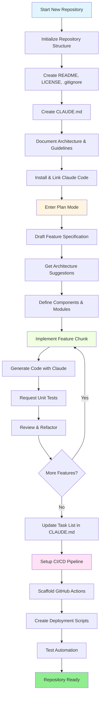
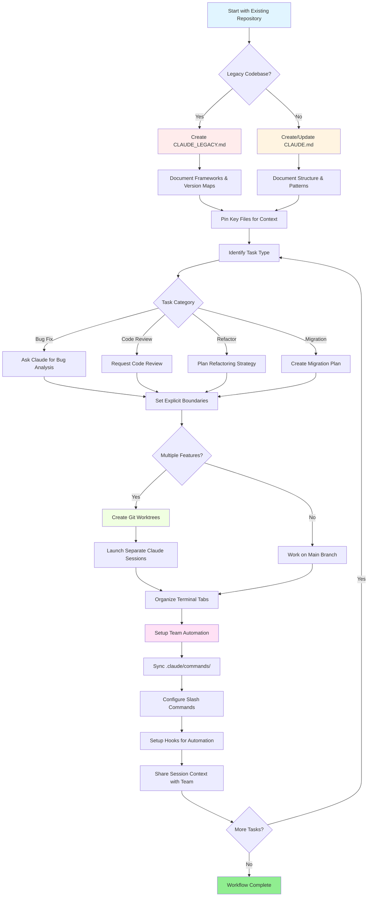

<!-- i18n-source: resources.md -->
<!-- i18n-source-sha: 63a1416 -->
<!-- i18n-date: 2026-04-10 -->

<picture>
  <source media="(prefers-color-scheme: dark)" srcset="../resources/logos/claude-howto-logo-dark.svg">
  
</picture>

# Список корисних ресурсів

## Офіційна документація

| Ресурс | Опис | Посилання |
|--------|------|-----------|
| Claude Code Docs | Офіційна документація Claude Code | [code.claude.com/docs/en/overview](https://code.claude.com/docs/en/overview) |
| Anthropic Docs | Повна документація Anthropic | [docs.anthropic.com](https://docs.anthropic.com) |
| MCP Protocol | Специфікація Model Context Protocol | [modelcontextprotocol.io](https://modelcontextprotocol.io) |
| MCP Servers | Офіційні реалізації MCP-серверів | [github.com/modelcontextprotocol/servers](https://github.com/modelcontextprotocol/servers) |
| Anthropic Cookbook | Приклади коду та туторіали | [github.com/anthropics/anthropic-cookbook](https://github.com/anthropics/anthropic-cookbook) |
| Claude Code Skills | Репозиторій навичок спільноти | [github.com/anthropics/skills](https://github.com/anthropics/skills) |
| Agent Teams | Координація та співпраця кількох агентів | [code.claude.com/docs/en/agent-teams](https://code.claude.com/docs/en/agent-teams) |
| Scheduled Tasks | Повторювані завдання з /loop та cron | [code.claude.com/docs/en/scheduled-tasks](https://code.claude.com/docs/en/scheduled-tasks) |
| Chrome Integration | Автоматизація браузера | [code.claude.com/docs/en/chrome](https://code.claude.com/docs/en/chrome) |
| Keybindings | Налаштування клавіатурних скорочень | [code.claude.com/docs/en/keybindings](https://code.claude.com/docs/en/keybindings) |
| Desktop App | Нативний десктопний додаток | [code.claude.com/docs/en/desktop](https://code.claude.com/docs/en/desktop) |
| Remote Control | Віддалене управління сесіями | [code.claude.com/docs/en/remote-control](https://code.claude.com/docs/en/remote-control) |
| Auto Mode | Автоматичне управління дозволами | [code.claude.com/docs/en/permissions](https://code.claude.com/docs/en/permissions) |
| Channels | Багатоканальна комунікація | [code.claude.com/docs/en/channels](https://code.claude.com/docs/en/channels) |
| Voice Dictation | Голосовий ввід для Claude Code | [code.claude.com/docs/en/voice-dictation](https://code.claude.com/docs/en/voice-dictation) |

## Інженерний блог Anthropic

| Стаття | Опис | Посилання |
|--------|------|-----------|
| Code Execution with MCP | Як вирішити проблему роздування контексту MCP за допомогою виконання коду — 98.7% зменшення токенів | [anthropic.com/engineering/code-execution-with-mcp](https://www.anthropic.com/engineering/code-execution-with-mcp) |

---

## Опанування Claude Code за 30 хвилин

_Відео_: https://www.youtube.com/watch?v=6eBSHbLKuN0

_**Усі поради**_
- **Досліджуйте просунуті функції та скорочення**
  - Регулярно перевіряйте нові функції редагування коду та контексту Claude в їхніх нотатках до випусків.
  - Вивчіть клавіатурні скорочення для швидкого перемикання між чатом, файлами та редактором.

- **Ефективне налаштування**
  - Створюйте проєктно-специфічні сесії з чіткими назвами/описами для легкого пошуку.
  - Закріпіть найчастіше використовувані файли або папки, щоб Claude мав до них доступ у будь-який час.
  - Налаштуйте інтеграції Claude (напр., GitHub, популярні IDE) для оптимізації процесу кодування.

- **Ефективне Q&A по кодовій базі**
  - Ставте Claude детальні запитання про архітектуру, патерни проєктування та конкретні модулі.
  - Використовуйте посилання на файли та рядки у запитаннях (напр., "Що робить логіка в `app/models/user.py`?").
  - Для великих кодових баз надайте резюме або маніфест, щоб допомогти Claude зосередитись.
  - **Приклад промпту**: _"Can you explain the authentication flow implemented in src/auth/AuthService.ts:45-120? How does it integrate with the middleware in src/middleware/auth.ts?"_

- **Редагування та рефакторинг коду**
  - Використовуйте інлайн-коментарі або запити в блоках коду для отримання цілеспрямованих правок ("Refactor this function for clarity").
  - Запитуйте порівняння до/після.
  - Дозвольте Claude генерувати тести або документацію після значних правок для забезпечення якості.
  - **Приклад промпту**: _"Refactor the getUserData function in api/users.js to use async/await instead of promises. Show me a before/after comparison and generate unit tests for the refactored version."_

- **Управління контекстом**
  - Обмежуйте вставлений код/контекст лише тим, що стосується поточного завдання.
  - Використовуйте структуровані промпти ("Here's file A, here's function B, my question is X") для найкращої продуктивності.
  - Видаляйте або згортайте великі файли у вікні промпту, щоб не перевищувати ліміти контексту.
  - **Приклад промпту**: _"Here's the User model from models/User.js and the validateUser function from utils/validation.js. My question is: how can I add email validation while maintaining backward compatibility?"_

- **Інтеграція командних інструментів**
  - Підключайте сесії Claude до репозиторіїв та документації вашої команди.
  - Використовуйте вбудовані шаблони або створюйте власні для повторюваних інженерних завдань.
  - Співпрацюйте, діляться стенограмами сесій та промптами з колегами.

- **Підвищення продуктивності**
  - Давайте Claude чіткі, цілеорієнтовані інструкції (напр., "Summarize this class in five bullet points").
  - Видаляйте зайві коментарі та шаблонний код з вікон контексту.
  - Якщо вивід Claude збився з курсу, скиньте контекст або переформулюйте запитання.
  - **Приклад промпту**: _"Summarize the DatabaseManager class in src/db/Manager.ts in five bullet points, focusing on its main responsibilities and key methods."_

- **Практичні приклади використання**
  - Дебаг: Вставте помилки та стек-трейси, потім запитайте можливі причини та виправлення.
  - Генерація тестів: Запитайте property-based, юніт або інтеграційні тести для складної логіки.
  - Код-рев'ю: Попросіть Claude виявити ризиковані зміни, граничні випадки або code smells.
  - **Приклади промптів**:
    - _"I'm getting this error: 'TypeError: Cannot read property 'map' of undefined at line 42 in components/UserList.jsx'. Here's the stack trace and the relevant code. What's causing this and how can I fix it?"_
    - _"Generate comprehensive unit tests for the PaymentProcessor class, including edge cases for failed transactions, timeouts, and invalid inputs."_
    - _"Review this pull request diff and identify potential security issues, performance bottlenecks, and code smells."_

- **Автоматизація робочих процесів**
  - Скриптуйте повторювані завдання (форматування, очищення, перейменування) за допомогою промптів Claude.
  - Використовуйте Claude для створення описів PR, нотаток до релізів або документації на основі git diff.
  - **Приклад промпту**: _"Based on the git diff, create a detailed PR description with a summary of changes, list of modified files, testing steps, and potential impacts. Also generate release notes for version 2.3.0."_

**Порада**: Для найкращих результатів комбінуйте кілька цих практик — почніть з закріплення критичних файлів та резюмування цілей, потім використовуйте цілеспрямовані промпти та інструменти рефакторингу Claude для поступового покращення кодової бази та автоматизації.

**Рекомендований робочий процес з Claude Code**

### Рекомендований робочий процес з Claude Code

#### Для нового репозиторію

1. **Ініціалізація репо та інтеграція Claude**
   - Налаштуйте новий репозиторій з базовою структурою: README, LICENSE, .gitignore, кореневі конфіги.
   - Створіть файл `CLAUDE.md` з описом архітектури, високорівневих цілей та настанов кодування.
   - Встановіть Claude Code та підключіть до репозиторію для пропозицій коду, створення тестів та автоматизації.

2. **Використовуйте режим плану та специфікації**
   - Використовуйте режим плану (`shift-tab` або `/plan`) для створення детальної специфікації перед реалізацією.
   - Запитайте Claude про пропозиції архітектури та початкове компонування проєкту.
   - Тримайте чітку, цілеорієнтовану послідовність промптів — запитуйте контури компонентів, основні модулі та відповідальності.

3. **Ітеративна розробка та рев'ю**
   - Реалізуйте основні функції маленькими частинами, запитуючи Claude про генерацію коду, рефакторинг та документацію.
   - Запитуйте юніт-тести та приклади після кожного інкременту.
   - Підтримуйте поточний список завдань у CLAUDE.md.

4. **Автоматизація CI/CD та деплою**
   - Використовуйте Claude для створення каркасу GitHub Actions, npm/yarn скриптів або робочих процесів деплою.
   - Легко адаптуйте конвеєри, оновлюючи CLAUDE.md та запитуючи відповідні команди/скрипти.

#### Для існуючого репозиторію

1. **Налаштування репо та контексту**
   - Додайте або оновіть `CLAUDE.md` з документацією структури репо, патернів кодування та ключових файлів. Для legacy-репозиторіїв використовуйте `CLAUDE_LEGACY.md` з описом фреймворків, карт версій, інструкцій, багів та нотаток оновлення.
   - Закріпіть або виділіть основні файли, які Claude повинен використовувати для контексту.

2. **Контекстне Q&A по коду**
   - Запитуйте Claude про код-рев'ю, пояснення багів, рефакторинг або плани міграції з посиланням на конкретні файли/функції.
   - Давайте Claude чіткі межі (напр., "modify only these files" або "no new dependencies").

3. **Управління гілками, worktree та кількома сесіями**
   - Використовуйте кілька git worktree для ізольованих функцій або виправлень та запускайте окремі сесії Claude на кожен worktree.
   - Тримайте вкладки/вікна терміналу організованими за гілкою або функцією для паралельних робочих процесів.

4. **Командні інструменти та автоматизація**
   - Синхронізуйте власні команди через `.claude/commands/` для крос-командної консистентності.
   - Автоматизуйте повторювані завдання, створення PR та форматування коду через слеш-команди або хуки Claude.
   - Діліться сесіями та контекстом з членами команди для спільного усунення проблем та рев'ю.

**Поради**:
- Починайте кожну нову функцію або виправлення зі специфікації та промпту в режимі плану.
- Для legacy та складних репозиторіїв зберігайте детальні настанови в CLAUDE.md/CLAUDE_LEGACY.md.
- Давайте чіткі, зосереджені інструкції та розбивайте складну роботу на багатофазні плани.
- Регулярно очищайте сесії, обрізайте контекст та видаляйте завершені worktree, щоб уникнути безладу.

Ці кроки описують основні рекомендації для плавних робочих процесів з Claude Code як у нових, так і в існуючих кодових базах.

---

## Нові функції та можливості (Березень 2026)

### Ключові ресурси функцій

| Функція | Опис | Дізнатися більше |
|---------|------|------------------|
| **Auto Memory** | Claude автоматично вивчає та запам'ятовує ваші уподобання між сесіями | [Посібник з пам'яті](02-memory/) |
| **Remote Control** | Програмне управління сесіями Claude Code із зовнішніх інструментів та скриптів | [Просунуті функції](09-advanced-features/) |
| **Web Sessions** | Доступ до Claude Code через браузерні інтерфейси для віддаленої розробки | [Довідник CLI](10-cli/) |
| **Desktop App** | Нативний десктопний додаток Claude Code з покращеним UI | [Claude Code Docs](https://code.claude.com/docs/en/desktop) |
| **Extended Thinking** | Перемикання глибокого мислення через `Alt+T`/`Option+T` або змінну `MAX_THINKING_TOKENS` | [Просунуті функції](09-advanced-features/) |
| **Permission Modes** | Тонке управління: default, acceptEdits, plan, auto, dontAsk, bypassPermissions | [Просунуті функції](09-advanced-features/) |
| **7-Tier Memory** | Managed Policy, Project, Project Rules, User, User Rules, Local, Auto Memory | [Посібник з пам'яті](02-memory/) |
| **Hook Events** | 25 подій: PreToolUse, PostToolUse, PostToolUseFailure, Stop, StopFailure, SubagentStart, SubagentStop, Notification, Elicitation та інші | [Посібник з хуків](06-hooks/) |
| **Agent Teams** | Координація кількох агентів для складних завдань | [Посібник з субагентів](04-subagents/) |
| **Scheduled Tasks** | Налаштування повторюваних завдань з `/loop` та cron | [Просунуті функції](09-advanced-features/) |
| **Chrome Integration** | Автоматизація браузера з headless Chromium | [Просунуті функції](09-advanced-features/) |
| **Keyboard Customization** | Налаштування клавіатурних скорочень включаючи chord-послідовності | [Просунуті функції](09-advanced-features/) |

---
**Останнє оновлення**: Квітень 2026
