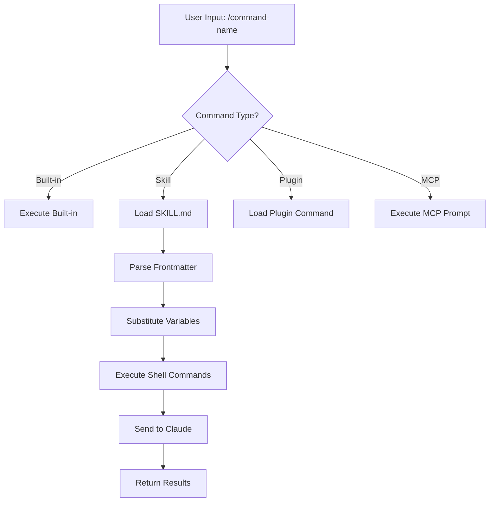
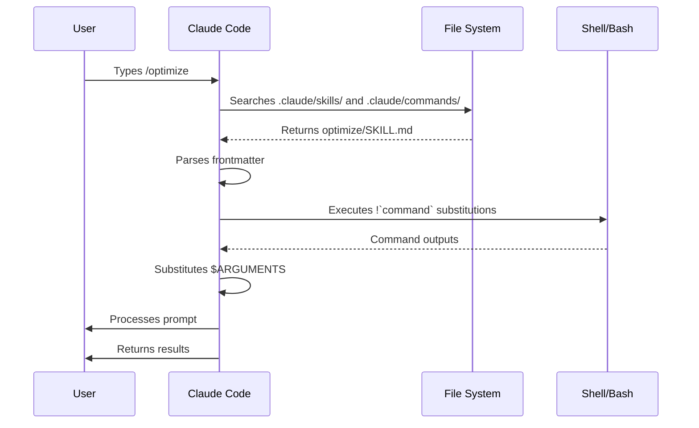

<picture>
  <source media="(prefers-color-scheme: dark)" srcset="../../resources/logos/claude-howto-logo-dark.svg">
  
</picture>

# Lệnh Slash

## Tổng Quan

Lệnh slash là các lối tắt để điều khiển hành vi của Claude trong một phiên tương tác. Chúng có một số loại:

- **Lệnh được tích hợp sẵn**: Được cung cấp bởi Claude Code (`/help`, `/clear`, `/model`)
- **Skills**: Các lệnh do người dùng định nghĩa được tạo dưới dạng file `SKILL.md` (`/optimize`, `/pr`)
- **Lệnh plugin**: Các lệnh từ plugins đã cài đặt (`/frontend-design:frontend-design`)
- **MCP prompts**: Các lệnh từ MCP servers (`/mcp__github__list_prs`)

> **Lưu ý**: Lệnh slash tùy chỉnh đã được hợp nhất vào skills. Files trong `.claude/commands/` vẫn hoạt động, nhưng skills (`.claude/skills/`) hiện là cách tiếp cận được khuyến nghị. Cả hai đều tạo ra các lối tắt `/command-name`. Xem [Hướng Dẫn Skills](../03-skills/) để có tài liệu tham khảo đầy đủ.

## Tham Khảo Lệnh Tích Hợp Sẵn

Lệnh tích hợp sẵn là các lối tắt cho các hành động phổ biến. Có **60+ lệnh tích hợp sẵn** và **5 skills được gói** sẵn. Gõ `/` trong Claude Code để xem danh sách đầy đủ, hoặc gõ `/` theo sau bởi bất kỳ chữ cái nào để lọc.

| Lệnh | Mục Đích |
|---------|---------|
| `/add-dir <path>` | Thêm thư mục làm việc |
| `/agents` | Quản lý cấu hình tác nhân |
| `/branch [name]` | Phân nhánh cuộc hội thoại vào phiên mới (bí danh: `/fork`). Lưu ý: `/fork` đã đổi tên thành `/branch` trong v2.1.77 |
| `/btw <question>` | Câu hỏi phụ không thêm vào lịch sử |
| `/chrome` | Cấu hình tích hợp trình duyệt Chrome |
| `/clear` | Xóa cuộc hội thoại (bí danh: `/reset`, `/new`) |
| `/color [color\|default]` | Đặt màu thanh prompt |
| `/compact [instructions]` | Nén cuộc hội thoại với hướng dẫn tập trung tùy chọn |
| `/config` | Mở Cài Đặt (bí danh: `/settings`) |
| `/context` | Trực quan hóa việc sử dụng bối cảnh dưới dạng lưới màu |
| `/copy [N]` | Sao chép phản hồi trợ lý vào clipboard; `w` ghi vào file |
| `/cost` | Hiển thị thống kê sử dụng token |
| `/desktop` | Tiếp tục trong ứng dụng Desktop (bí danh: `/app`) |
| `/diff` | Trình xem diff tương tác cho các thay đổi chưa commit |
| `/doctor` | Chẩn đoán tình trạng cài đặt |
| `/effort [low\|medium\|high\|max\|auto]` | Đặt mức nỗ lực. `max` yêu cầu Opus 4.6 |
| `/exit` | Thoát khỏi REPL (bí danh: `/quit`) |
| `/export [filename]` | Xuất cuộc hội thoại hiện tại sang file hoặc clipboard |
| `/extra-usage` | Cấu hình sử dụng thêm cho giới hạn tốc độ |
| `/fast [on\|off]` | Bật/tắt chế độ nhanh |
| `/feedback` | Gửi phản hồi (bí danh: `/bug`) |
| `/help` | Hiển thị trợ giúp |
| `/hooks` | Xem cấu hình hooks |
| `/ide` | Quản lý tích hợp IDE |
| `/init` | Khởi tạo `CLAUDE.md`. Đặt `CLAUDE_CODE_NEW_INIT=1` cho quy trình tương tác |
| `/insights` | Tạo báo cáo phân tích phiên |
| `/install-github-app` | Thiết lập ứng dụng GitHub Actions |
| `/install-slack-app` | Cài đặt ứng dụng Slack |
| `/keybindings` | Mở cấu hình keybindings |
| `/login` | Chuyển đổi tài khoản Anthropic |
| `/logout` | Đăng xuất khỏi tài khoản Anthropic của bạn |
| `/mcp` | Quản lý MCP servers và OAuth |
| `/memory` | Chỉnh sửa `CLAUDE.md`, bật/tắt auto-memory |
| `/mobile` | Mã QR cho ứng dụng di động (bí danh: `/ios`, `/android`) |
| `/model [model]` | Chọn mô hình với mũi tên trái/phải cho nỗ lực |
| `/passes` | Chia sẻ tuần miễn phí Claude Code |
| `/permissions` | Xem/cập nhật quyền (bí danh: `/allowed-tools`) |
| `/plan [description]` | Nhập chế độ lập kế hoạch |
| `/plugin` | Quản lý plugins |
| `/powerup` | Khám phá tính năng thông qua các bài học tương tác với demo hoạt hình |
| `/privacy-settings` | Cài đặt quyền riêng tư (chỉ Pro/Max) |
| `/release-notes` | Xem changelog |
| `/reload-plugins` | Tải lại các plugins hoạt động |
| `/remote-control` | Điều khiển từ xa từ claude.ai (bí danh: `/rc`) |
| `/remote-env` | Cấu hình môi trường từ xa mặc định |
| `/rename [name]` | Đổi tên phiên |
| `/resume [session]` | Tiếp tục cuộc hội thoại (bí danh: `/continue`) |
| `/review` | **Đã lỗi thời** — cài đặt plugin `code-review` thay thế |
| `/rewind` | Quay lại cuộc hội thoại và/hoặc code (bí danh: `/checkpoint`) |
| `/sandbox` | Bật/tắt chế độ sandbox |
| `/schedule [description]` | Tạo/quản lý các tác vụ định kỳ |
| `/security-review` | Phân tích nhánh để tìm lỗ hổng bảo mật |
| `/skills` | Liệt kê các skills có sẵn |
| `/stats` | Trực quan hóa việc sử dụng hàng ngày, các phiên, chuỗi ngày |
| `/stickers` | Đặt sticker Claude Code |
| `/status` | Hiển thị phiên bản, mô hình, tài khoản |
| `/statusline` | Cấu hình dòng trạng thái |
| `/tasks` | Liệt kê/quản lý các tác vụ nền |
| `/terminal-setup` | Cấu hình terminal keybindings |
| `/theme` | Thay đổi chủ đề màu |
| `/ultraplan <prompt>` | Soạn kế hoạch trong ultraplan session, xem trong trình duyệt |
| `/upgrade` | Mở trang nâng cấp cho tier cao hơn |
| `/voice` | Bật/tắt nhập liệu giọng nói push-to-talk |

### Skills Được Gói Sẵn

Những skills này được gửi kèm với Claude Code và được gọi như lệnh slash:

| Skill | Mục Đích |
|-------|---------|
| `/batch <instruction>` | Điều phối các thay đổi song song quy mô lớn sử dụng worktrees |
| `/claude-api` | Tải tài liệu tham khảo Claude API cho ngôn ngữ dự án |
| `/debug [description]` | Bật ghi log debug |
| `/loop [interval] <prompt>` | Chạy prompt lặp lại trên khoảng thời gian |
| `/simplify [focus]` | Review các file đã thay đổi để kiểm tra chất lượng code |

### Lệnh Đã Lỗi Thời

| Lệnh | Trạng Thái |
|---------|--------|
| `/review` | Đã lỗi thời — được thay thế bởi plugin `code-review` |
| `/output-style` | Đã lỗi thời kể từ v2.1.73 |
| `/fork` | Đổi tên thành `/branch` (bí danh vẫn hoạt động, v2.1.77) |
| `/pr-comments` | Đã xóa trong v2.1.91 — hỏi Claude trực tiếp để xem bình luận PR |
| `/vim` | Đã xóa trong v2.1.92 — sử dụng /config → Editor mode |

### Thay Đổi Gần Đây

- `/fork` đổi tên thành `/branch` với `/fork` được giữ lại làm bí danh (v2.1.77)
- `/output-style` đã lỗi thời (v2.1.73)
- `/review` đã lỗi thời thay vào đó là plugin `code-review`
- Lệnh `/effort` được thêm với mức `max` yêu cầu Opus 4.6
- Lệnh `/voice` được thêm cho nhập liệu giọng nói push-to-talk
- Lệnh `/schedule` được thêm để tạo/quản lý các tác vụ định kỳ
- Lệnh `/color` được thêm để tùy chỉnh thanh prompt
- `/pr-comments` đã xóa trong v2.1.91 — hỏi Claude trực tiếp để xem bình luận PR
- `/vim` đã xóa trong v2.1.92 — sử dụng /config → Editor mode thay thế
- `/ultraplan` được thêm để xem và thực thi kế hoạch trong trình duyệt
- `/powerup` được thêm để học tính năng tương tác
- `/sandbox` được thêm để bật/tắt chế độ sandbox
- Bộ chọn `/model` hiện hiển thị nhãn dễ đọc cho con người (ví dụ: "Sonnet 4.6") thay vì ID mô hình thô
- `/resume` hỗ trợ bí danh `/continue`
- MCP prompts có sẵn dưới dạng các lệnh `/mcp__<server>__<prompt>` (xem [MCP Prompts dưới dạng Lệnh](#mcp-prompts-dưới-dạng-lệnh))

## Lệnh Tùy Chỉnh (Hiện Là Skills)

Lệnh slash tùy chỉnh đã được **hợp nhất vào skills**. Cả hai cách tiếp cận đều tạo ra các lệnh bạn có thể gọi với `/command-name`:

| Cách Tiếp Cận | Vị Trí | Trạng Thái |
|----------|----------|--------|
| **Skills (Khuyến Nghị)** | `.claude/skills/<name>/SKILL.md` | Tiêu chuẩn hiện tại |
| **Lệnh Legacy** | `.claude/commands/<name>.md` | Vẫn hoạt động |

Nếu một skill và một lệnh chia sẻ cùng tên, **skill sẽ được ưu tiên**. Ví dụ, khi cả `.claude/commands/review.md` và `.claude/skills/review/SKILL.md` tồn tại, phiên bản skill sẽ được sử dụng.

### Đường Dẫn Chuyển Đổi

Files `.claude/commands/` hiện tại của bạn tiếp tục hoạt động mà không cần thay đổi. Để chuyển đổi sang skills:

**Trước (Lệnh):**
```
.claude/commands/optimize.md
```

**Sau (Skill):**
```
.claude/skills/optimize/SKILL.md
```

### Tại Sao Skills?

Skills cung cấp các tính năng bổ sung so với lệnh legacy:

- **Cấu trúc thư mục**: Gói scripts, templates, và files tham khảo
- **Tự động gọi**: Claude có thể kích hoạt skills tự động khi có liên quan
- **Kiểm soát gọi**: Chọn liệu người dùng, Claude, hoặc cả hai có thể gọi
- **Thực thi tác nhân con**: Chạy skills trong các bối cảnh cô lập với `context: fork`
- **Tiết lộ từng bước**: Tải các files bổ sung chỉ khi cần thiết

### Tạo Một Lệnh Tùy Chỉnh dưới dạng Skill

Tạo một thư mục với file `SKILL.md`:

```bash
mkdir -p .claude/skills/my-command
```

**File:** `.claude/skills/my-command/SKILL.md`

```yaml
---
name: my-command
description: Lệnh này làm gì và khi nào sử dụng
---

# My Command

Hướng dẫn cho Claude để theo khi lệnh này được gọi.

1. Bước đầu tiên
2. Bước thứ hai
3. Bước thứ ba
```

### Tham Khảo Frontmatter

| Trường | Mục Đích | Mặc Định |
|-------|---------|---------|
| `name` | Tên lệnh (trở thành `/name`) | Tên thư mục |
| `description` | Mô tả ngắn (giúp Claude biết khi nào sử dụng) | Đoạn đầu tiên |
| `argument-hint` | Các đối số mong đợi cho tự động hoàn thành | Không có |
| `allowed-tools` | Các công cụ lệnh có thể sử dụng mà không cần quyền | Kế thừa |
| `model` | Mô hình cụ thể để sử dụng | Kế thừa |
| `disable-model-invocation` | Nếu `true`, chỉ người dùng có thể gọi (không phải Claude) | `false` |
| `user-invocable` | Nếu `false`, ẩn từ menu `/` | `true` |
| `context` | Đặt thành `fork` để chạy trong tác nhân con cô lập | Không có |
| `agent` | Loại tác nhân khi sử dụng `context: fork` | `general-purpose` |
| `hooks` | Hooks theo phạm vi skill (PreToolUse, PostToolUse, Stop) | Không có |

### Đối Số

Lệnh có thể nhận đối số:

**Tất cả đối số với `$ARGUMENTS`:**

```yaml
---
name: fix-issue
description: Fix a GitHub issue by number
---

Fix issue #$ARGUMENTS following our coding standards
```

Cách sử dụng: `/fix-issue 123` → `$ARGUMENTS` trở thành "123"

**Đối số riêng lẻ với `$0`, `$1`, v.v.:**

```yaml
---
name: review-pr
description: Review a PR with priority
---

Review PR #$0 with priority $1
```

Cách sử dụng: `/review-pr 456 high` → `$0`="456", `$1`="high"

### Bối Cảnh Động Với Lệnh Shell

Thực thi các lệnh bash trước prompt sử dụng `!`command``:

```yaml
---
name: commit
description: Create a git commit with context
allowed-tools: Bash(git *)
---

## Context

- Current git status: !`git status`
- Current git diff: !`git diff HEAD`
- Current branch: !`git branch --show-current`
- Recent commits: !`git log --oneline -5`

## Your task

Based on the above changes, create a single git commit.
```

### Tham Chiếu File

Bao gồm nội dung file sử dụng `@`:

```markdown
Review the implementation in @src/utils/helpers.js
Compare @src/old-version.js with @src/new-version.js
```

## Lệnh Plugin

Plugins có thể cung cấp các lệnh tùy chỉnh:

```
/plugin-name:command-name
```

Hoặc đơn giản là `/command-name` khi không có xung đột tên.

**Ví dụ:**
```bash
/frontend-design:frontend-design
/commit-commands:commit
```

## MCP Prompts dưới dạng Lệnh

MCP servers có thể expose prompts dưới dạng lệnh slash:

```
/mcp__<server-name>__<prompt-name> [arguments]
```

**Ví dụ:**
```bash
/mcp__github__list_prs
/mcp__github__pr_review 456
/mcp__jira__create_issue "Bug title" high
```

### Cú Pháp Quyền MCP

Kiểm soát quyền truy cập MCP server trong quyền:

- `mcp__github` - Truy cập toàn bộ MCP server GitHub
- `mcp__github__*` - Truy cập wildcard cho tất cả công cụ
- `mcp__github__get_issue` - Truy cập công cụ cụ thể

## Kiến Trúc Lệnh



## Vòng Đời Lệnh



## Các Lệnh Có Sẵn trong Thư Mục Này

Các lệnh ví dụ này có thể được cài đặt dưới dạng skills hoặc lệnh legacy.

### 1. `/optimize` - Tối Ưu Hóa Code

Phân tích code để tìm các vấn đề hiệu suất, rò rỉ bộ nhớ, và cơ hội tối ưu hóa.

**Cách sử dụng:**
```
/optimize
[Paste your code]
```

### 2. `/pr` - Chuẩn Bị Pull Request

Hướng dẫn qua danh sách kiểm tra chuẩn bị PR bao gồm linting, testing, và định dạng commit.

**Cách sử dụng:**
```
/pr
```

**Ảnh chụp màn hình:**


### 3. `/generate-api-docs` - Trình Tạo Tài Liệu API

Tạo tài liệu API toàn diện từ mã nguồn.

**Cách sử dụng:**
```
/generate-api-docs
```

### 4. `/commit` - Git Commit với Bối Cảnh

Tạo một git commit với bối cảnh động từ kho chứa của bạn.

**Cách sử dụng:**
```
/commit [optional message]
```

### 5. `/push-all` - Stage, Commit, và Push

Stage tất cả thay đổi, tạo commit, và push đến remote với các kiểm tra an toàn.

**Cách sử dụng:**
```
/push-all
```

**Kiểm tra an toàn:**
- Bí mật: `.env*`, `*.key`, `*.pem`, `credentials.json`
- API Keys: Phát hiện các khóa thực so với placeholder
- Files lớn: `>10MB` mà không có Git LFS
- Build artifacts: `node_modules/`, `dist/`, `__pycache__/`

### 6. `/doc-refactor` - Cấu Trúc Lại Tài Liệu

Cấu trúc lại tài liệu dự án để rõ ràng và dễ truy cập.

**Cách sử dụng:**
```
/doc-refactor
```

### 7. `/setup-ci-cd` - Thiết Lập Pipeline CI/CD

Triển khai pre-commit hooks và GitHub Actions để đảm bảo chất lượng.

**Cách sử dụng:**
```
/setup-ci-cd
```

### 8. `/unit-test-expand` - Mở Rộng Phủ Vùng Test

Tăng vùng phủ test bằng cách nhắm vào các nhánh chưa được test và các trường hợp ngoại lệ.

**Cách sử dụng:**
```
/unit-test-expand
```

## Cài Đặt

### Dưới dạng Skills (Khuyến Nghị)

Sao chép vào thư mục skills của bạn:

```bash
# Tạo thư mục skills
mkdir -p .claude/skills

# Với mỗi file lệnh, tạo một thư mục skill
for cmd in optimize pr commit; do
  mkdir -p .claude/skills/$cmd
  cp 01-slash-commands/$cmd.md .claude/skills/$cmd/SKILL.md
done
```

### Dưới dạng Lệnh Legacy

Sao chép vào thư mục lệnh của bạn:

```bash
# Phạm vi dự án (đội)
mkdir -p .claude/commands
cp 01-slash-commands/*.md .claude/commands/

# Sử dụng cá nhân
mkdir -p ~/.claude/commands
cp 01-slash-commands/*.md ~/.claude/commands/
```

## Tạo Lệnh Riêng Của Bạn

### Mẫu Skill (Khuyến Nghị)

Tạo `.claude/skills/my-command/SKILL.md`:

```yaml
---
name: my-command
description: Lệnh này làm gì. Sử dụng khi [điều kiện kích hoạt].
argument-hint: [đối số-tùy-chọn]
allowed-tools: Bash(npm *), Read, Grep
---

# Command Title

## Context

- Current branch: !`git branch --show-current`
- Related files: @package.json

## Instructions

1. Bước đầu tiên
2. Bước thứ hai với đối số: $ARGUMENTS
3. Bước thứ ba

## Output Format

- Cách định dạng phản hồi
- Những gì cần bao gồm
```

### Lệnh Chỉ Người Dùng (Không Tự Động Gọi)

Đối với các lệnh có tác dụng phụ mà Claude không nên kích hoạt tự động:

```yaml
---
name: deploy
description: Deploy to production
disable-model-invocation: true
allowed-tools: Bash(npm *), Bash(git *)
---

Deploy the application to production:

1. Run tests
2. Build application
3. Push to deployment target
4. Verify deployment
```

## Thực Hành Tốt Nhất

| Nên | Không Nên |
|------|---------|
| Sử dụng tên rõ ràng, hướng hành động | Tạo lệnh cho tác vụ một lần |
| Bao gồm `description` với điều kiện kích hoạt | Xây dựng logic phức tạp trong lệnh |
| Giữ lệnh tập trung vào một tác vụ | Hardcode thông tin nhạy cảm |
| Sử dụng `disable-model-invocation` cho tác dụng phụ | Bỏ qua trường description |
| Sử dụng tiền tố `!` cho bối cảnh động | Giả sử Claude biết trạng thái hiện tại |
| Sắp xếp các files liên quan trong thư mục skill | Đặt mọi thứ trong một file |

## Xử Lý Sự Cố

### Không Tìm Thấy Lệnh

**Giải pháp:**
- Kiểm tra file có trong `.claude/skills/<name>/SKILL.md` hoặc `.claude/commands/<name>.md`
- Xác minh trường `name` trong frontmatter khớp với tên lệnh mong đợi
- Khởi động lại phiên Claude Code
- Chạy `/help` để xem các lệnh có sẵn

### Lệnh Không Thực Thi Như Mong Đợi

**Giải pháp:**
- Thêm hướng dẫn cụ thể hơn
- Bao gồm các ví dụ trong file skill
- Kiểm tra `allowed-tools` nếu sử dụng các lệnh bash
- Thử với các đầu vào đơn giản trước

### Xung Đột Skill vs Lệnh

Nếu cả hai tồn tại với cùng tên, **skill sẽ được ưu tiên**. Xóa một hoặc đổi tên nó.

## Hướng Dẫn Liên Quan

- **[Skills](../03-skills/)** - Tài liệu tham khảo đầy đủ cho skills (khả năng tự động gọi)
- **[Bộ Nhớ](../02-memory/)** - Bối cảnh liên tục với CLAUDE.md
- **[Tác Nhân Con](../04-subagents/)** - Các tác nhân AI được ủy quyền
- **[Plugins](../07-plugins/)** - Bộ sưu tập lệnh được gói
- **[Hooks](../06-hooks/)** - Tự động hóa dựa trên sự kiện

## Tài Nguyên Thêm

- [Tài Liệu Chế Độ Tương Tác Chính Thức](https://code.claude.com/docs/en/interactive-mode) - Tham khảo lệnh tích hợp sẵn
- [Tài Liệu Skills Chính Thức](https://code.claude.com/docs/en/skills) - Tham khảo skills hoàn chỉnh
- [Tham Khảo CLI](https://code.claude.com/docs/en/cli-reference) - Tùy chọn dòng lệnh

---

**Cập Nhật Lần Cuối**: Tháng 4 năm 2026
**Phiên Bản Claude Code**: 2.1+
**Các Mô Hình Tương Thích**: Claude Sonnet 4.6, Claude Opus 4.6, Claude Haiku 4.5

*Phần của series hướng dẫn [Claude How To](../)*
