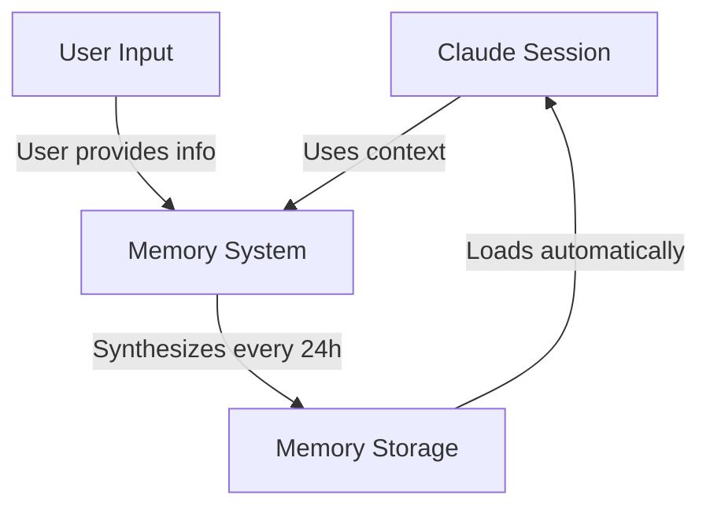
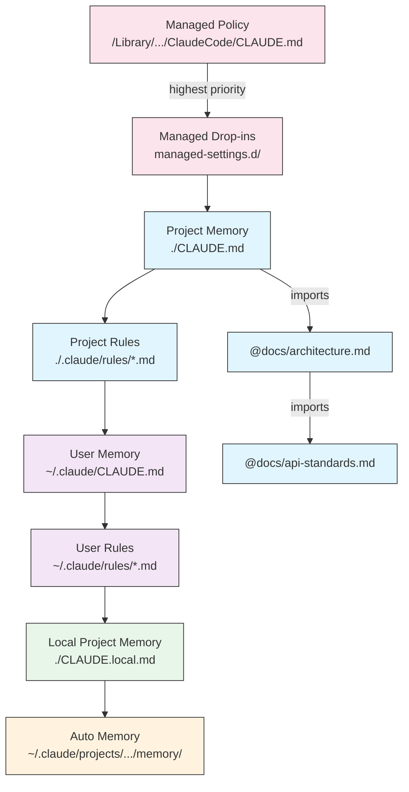
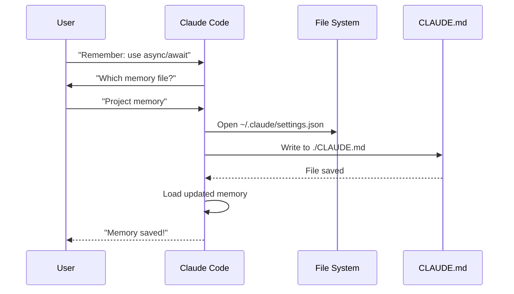
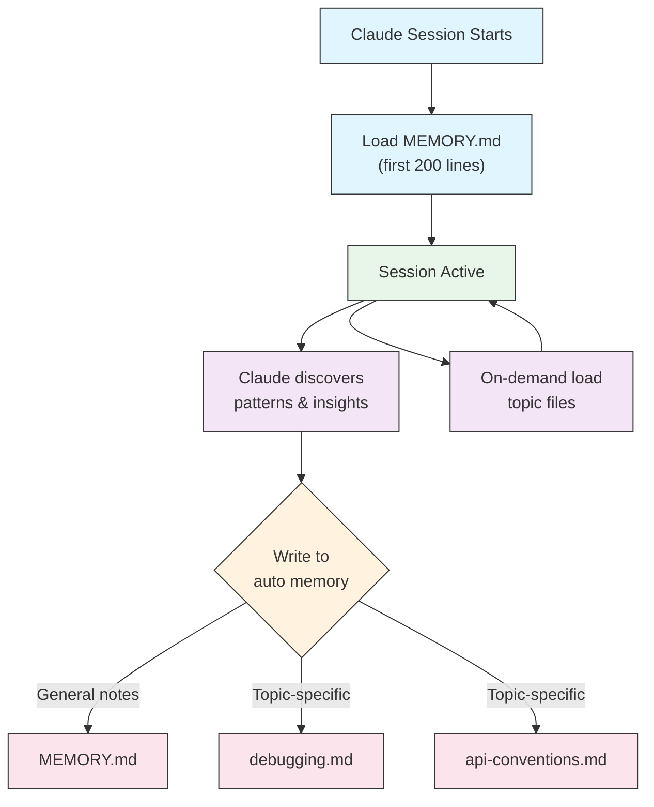

<picture>
  <source media="(prefers-color-scheme: dark)" srcset="../../resources/logos/claude-howto-logo-dark.svg">
  
</picture>

# Hướng Dẫn Bộ Nhớ

Bộ nhớ cho phép Claude lưu giữ bối cảnh xuyên suốt các phiên và cuộc hội thoại. Nó tồn tại dưới hai dạng: tổng hợp tự động trong claude.ai, và CLAUDE.md dựa trên filesystem trong Claude Code.

## Tổng Quan

Bộ nhớ trong Claude Code cung cấp bối cảnh liên tục mà hoạt động qua nhiều phiên và cuộc hội thoại. Không giống như các cửa sổ bối cảnh tạm thời, files bộ nhớ cho phép bạn:

- Chia sẻ tiêu chuẩn dự án cho toàn bộ đội của bạn
- Lưu trữ tùy thích phát triển cá nhân
- Duy trì các quy tắc và cấu hình cụ thể theo thư mục
- Nhập tài liệu bên ngoài
- Kiểm soát phiên bản bộ nhớ như một phần của dự án của bạn

Hệ thống bộ nhớ hoạt động ở nhiều cấp độ, từ tùy thích cá nhân toàn cầu xuống đến các thư mục con cụ thể, cho phép kiểm soát chi tiết những gì Claude nhớ và cách nó áp dụng kiến thức đó.

## Tham Khảo Nhanh Các Lệnh Bộ Nhớ

| Lệnh | Mục Đích | Cách Sử Dụng | Khi Nào Sử Dụng |
|---------|---------|-------|-------------|
| `/init` | Khởi tạo bộ nhớ dự án | `/init` | Bắt đầu dự án mới, thiết lập CLAUDE.md lần đầu |
| `/memory` | Chỉnh sửa files bộ nhớ trong editor | `/memory` | Các cập nhật mở rộng, tái tổ chức, xem lại nội dung |
| `#` prefix | Thêm bộ nhớ một dòng nhanh | `# Quy tắc của bạn ở đây` | Thêm quy tắc nhanh trong cuộc hội thoại |
| `# new rule into memory` | Thêm bộ nhớ rõ ràng | `# new rule into memory<br/>Quy tắc chi tiết của bạn` | Thêm các quy tắc đa dòng phức tạp |
| `# remember this` | Bộ nhớ ngôn ngữ tự nhiên | `# remember this<br/>Hướng dẫn của bạn` | Cập nhật bộ nhớ theo hội thoại |
| `@path/to/file` | Nhập nội dung bên ngoài | `@README.md` hoặc `@docs/api.md` | Tham khảo tài liệu hiện có trong CLAUDE.md |

## Bắt Đầu Nhanh: Khởi Tạo Bộ Nhớ

### Lệnh `/init`

Lệnh `/init` là cách nhanh nhất để thiết lập bộ nhớ dự án trong Claude Code. Nó khởi tạo một file CLAUDE.md với tài liệu nền tảng của dự án.

**Cách sử dụng:**

```bash
/init
```

**Những gì nó làm:**

- Tạo một file CLAUDE.md mới trong dự án của bạn (thường tại `./CLAUDE.md` hoặc `./.claude/CLAUDE.md`)
- Thiết lập các quy ước và hướng dẫn dự án
- Thiết lập nền tảng cho tính liên tục của bối cảnh qua các phiên
- Cung cấp cấu trúc mẫu để ghiêu chuẩn dự án của bạn

**Chế độ tương tác nâng cao:** Đặt `CLAUDE_CODE_NEW_INIT=1` để bật quy trình tương tác đa giai đoạn hướng dẫn bạn qua việc thiết lập dự án từng bước:

```bash
CLAUDE_CODE_NEW_INIT=1 claude
/init
```

**Khi nào sử dụng `/init`:**

- Bắt đầu một dự án mới với Claude Code
- Thiết lập tiêu chuẩn code và quy ước cho đội
- Tạo tài liệu về cấu trúc codebase của bạn
- Thiết lập hệ phân cấp bộ nhớ cho phát triển hợp tác

**Ví dụ workflow:**

```markdown
# Trong thư mục dự án của bạn
/init

# Claude tạo CLAUDE.md với cấu trúc như:
# Project Configuration
## Project Overview
- Name: Your Project
- Tech Stack: [Your technologies]
- Team Size: [Number of developers]

## Development Standards
- Code style preferences
- Testing requirements
- Git workflow conventions
```

### Cập Nhật Bộ Nhớ Nhanh Với `#`

Bạn có thể thêm thông tin vào bộ nhớ nhanh chóng trong bất kỳ cuộc hội thoại nào bằng cách bắt đầu thông điệp của bạn với `#`:

**Cú pháp:**

```markdown
# Quy tắc hoặc hướng dẫn bộ nhớ của bạn ở đây
```

**Ví dụ:**

```markdown
# Luôn sử dụng chế độ TypeScript strict mode trong dự án này

# Ưu tiên async/await hơn promise chains

# Chạy npm test trước mỗi commit

# Sử dụng kebab-case cho tên file
```

**Cách nó hoạt động:**

1. Bắt đầu thông điệp của bạn với `#` theo sau là quy tắc của bạn
2. Claude nhận ra đây là một yêu cầu cập nhật bộ nhớ
3. Claude hỏi file bộ nhớ nào để cập nhật (dự án hoặc cá nhân)
4. Quy tắc được thêm vào file CLAUDE.md phù hợp
5. Các phiên tương lai tự động tải bối cảnh này

**Các mẫu thay thế:**

```markdown
# new rule into memory
Luôn xác thực input người dùng với Zod schemas

# remember this
Sử dụng semantic versioning cho tất cả các releases

# add to memory
Database migrations phải có thể đảo ngược
```

### Lệnh `/memory`

Lệnh `/memory` cung cấp truy cập trực tiếp để chỉnh sửa các file bộ nhớ CLAUDE.md của bạn trong các phiên Claude Code. Nó mở các file bộ nhớ của bạn trong editor hệ thống để chỉnh sửa toàn diện.

**Cách sử dụng:**

```bash
/memory
```

**Những gì nó làm:**

- Mở các file bộ nhớ của bạn trong editor mặc định của hệ thống
- Cho phép bạn thực hiện các thêm, sửa đổi, và tái tổ chức mở rộng
- Cung cấp truy cập trực tiếp đến tất cả các file trong hệ phân cấp
- Cho phép bạn quản lý bối cảnh liên tục qua các phiên

**Khi nào sử dụng `/memory`:**

- Xem lại nội dung bộ nhớ hiện có
- Thực hiện các cập nhật mở rộng cho tiêu chuẩn dự án
- Tái tổ chức cấu trúc bộ nhớ
- Thêm tài liệu hoặc hướng dẫn chi tiết
- Duy trì và cập nhật bộ nhớ khi dự án của bạn phát triển

**So sánh: `/memory` vs `/init`**

| Khía cạnh | `/memory` | `/init` |
|--------|-----------|---------|
| **Mục đích** | Chỉnh sửa các file bộ nhớ hiện có | Khởi tạo CLAUDE.md mới |
| **Khi nào sử dụng** | Cập nhật/sửa đổi bối cảnh dự án | Bắt đầu dự án mới |
| **Hành động** | Mở editor để thay đổi | Tạo mẫu khởi đầu |
| **Workflow** | Duy trì liên tục | Thiết lập một lần |

**Ví dụ workflow:**

```markdown
# Mở bộ nhớ để chỉnh sửa
/memory

# Claude trình bày các tùy chọn:
# 1. Managed Policy Memory
# 2. Project Memory (./CLAUDE.md)
# 3. User Memory (~/.claude/CLAUDE.md)
# 4. Local Project Memory

# Chọn tùy chọn 2 (Project Memory)
# Editor mặc định của bạn mở với nội dung ./CLAUDE.md

# Thực hiện thay đổi, lưu, và đóng editor
# Claude tự động tải lại bộ nhớ đã cập nhật
```

**Sử Dụng Bộ Nhớ Nhập:**

Các file CLAUDE.md hỗ trợ cú pháp `@path/to/file` để bao gồm nội dung bên ngoài:

```markdown
# Project Documentation
Xem @README.md để có tổng quan dự án
Xem @package.json để có các lệnh npm có sẵn
Xem @docs/architecture.md để có thiết kế hệ thống

# Import từ thư mục home sử dụng đường dẫn tuyệt đối
@~/.claude/my-project-instructions.md
```

**Tính năng import:**

- Cả đường dẫn tương đối và tuyệt đối đều được hỗ trợ (ví dụ: `@docs/api.md` hoặc `@~/.claude/my-project-instructions.md`)
- Các import đệ quy được hỗ trợ với độ sâu tối đa 5
- Lần đầu tiên import từ các vị trí bên ngoài sẽ kích hoạt hộp thoại phê duyệt để bảo mật
- Các chỉ thị import không được đánh giá bên trong các khoảng mã markdown hoặc khối code (vì vậy tài liệu hóa chúng trong ví dụ là an toàn)
- Giúp tránh trùng lặp bằng cách tham khảo tài liệu hiện có
- Tự động bao gồm nội dung được tham chiếu trong bối cảnh của Claude

## Kiến Trúc Bộ Nhớ

Bộ nhớ trong Claude Code theo một hệ thống phân cấp trong đó các phạm vi khác nhau phục vụ các mục đích khác nhau:



## Hệ Phân Cấp Bộ Nhớ trong Claude Code

Claude Code sử dụng một hệ thống bộ nhớ phân cấp đa tầng. Các file bộ nhớ được tự động tải khi Claude Code khởi động, với các file cấp cao hơn được ưu tiên.

**Hệ Phân Cấp Bộ Nhớ Hoàn Chỉnh (theo thứ tự ưu tiên):**

1. **Managed Policy** - Hướng dẫn toàn tổ chức
   - macOS: `/Library/Application Support/ClaudeCode/CLAUDE.md`
   - Linux/WSL: `/etc/claude-code/CLAUDE.md`
   - Windows: `C:\Program Files\ClaudeCode\CLAUDE.md`

2. **Managed Drop-ins** - Các file chính sách được hợp nhất theo bảng chữ cái (v2.1.83+)
   - Thư mục `managed-settings.d/` bên cạnh file chính sách được quản lý CLAUDE.md
   - Các file được hợp nhất theo thứ tự bảng chữ cái để quản lý chính sách mô-đun

3. **Project Memory** - Bối cảnh được chia sẻ cho đội (được kiểm soát phiên bản)
   - `./.claude/CLAUDE.md` hoặc `./CLAUDE.md` (trong root repository)

4. **Project Rules** - Hướng dẫn dự án mô-đun, cụ thể theo chủ đề
   - `./.claude/rules/*.md`

5. **User Memory** - Tùy thích cá nhân (tất cả dự án)
   - `~/.claude/CLAUDE.md`

6. **User-Level Rules** - Quy tắc cá nhân (tất cả dự án)
   - `~/.claude/rules/*.md`

7. **Local Project Memory** - Tùy thích cụ thể dự án cá nhân
   - `./CLAUDE.local.md`

> **Lưu ý**: `CLAUDE.local.md` không được đề cập trong [tài liệu chính thức](https://code.claude.com/docs/en/memory) tính đến tháng 3 năm 2026. Nó vẫn có thể hoạt động như một tính năng legacy. Đối với dự án mới, hãy cân nhắc sử dụng `~/.claude/CLAUDE.md` (cấp người dùng) hoặc `.claude/rules/` (cấp dự án, phạm vi đường dẫn) thay thế.

8. **Auto Memory** - Các ghi chú và bài học tự động của Claude
   - `~/.claude/projects/<project>/memory/`

**Hành Vi Khám Phá Bộ Nhớ:**

Claude tìm kiếm các file bộ nhớ theo thứ tự này, với các vị trí trước đó được ưu tiên:



## Loại Trừ Các File CLAUDE.md Với `claudeMdExcludes`

Trong các monorepos lớn, một số file CLAUDE.md có thể không liên quan đến công việc hiện tại của bạn. Cài đặt `claudeMdExcludes` cho phép bạn bỏ qua các file CLAUDE.md cụ thể để chúng không được tải vào bối cảnh:

```jsonc
// In ~/.claude/settings.json hoặc .claude/settings.json
{
  "claudeMdExcludes": [
    "packages/legacy-app/CLAUDE.md",
    "vendors/**/CLAUDE.md"
  ]
}
```

Các mẫu được so khớp với các đường dẫn tương đối với root dự án. Điều này đặc biệt hữu ích cho:

- Monorepos với nhiều dự án con, trong đó chỉ một số có liên quan
- Các kho chứa chứa các file CLAUDE.md của bên thứ ba hoặc được bán
- Giảm tiếng ồn trong cửa sổ bối cảnh của Claude bằng cách loại trừ các hướng dẫn cũ hoặc không liên quan

## Hệ Phân Cấp File Settings

Các cài đặt Claude Code (bao gồm `autoMemoryDirectory`, `claudeMdExcludes`, và các cấu hình khác) được giải quyết từ một hệ phân cấp năm cấp, với các cấp cao hơn được ưu tiên:

| Cấp | Vị Trí | Phạm Vi |
|-------|----------|-------|
| 1 (Cao nhất) | Managed policy (cấp hệ thống) | Thực thi toàn tổ chức |
| 2 | `managed-settings.d/` (v2.1.83+) | Các drop-in chính sách mô-đun, được hợp nhất theo bảng chữ cái |
| 3 | `~/.claude/settings.json` | Tùy thích người dùng |
| 4 | `.claude/settings.json` | Cấp dự án (được commit vào git) |
| 5 (Thấp nhất) | `.claude/settings.local.json` | Ghi đè cục bộ (bị git bỏ qua) |

**Cấu hình cụ thể theo nền tảng (v2.1.51+):**

Các cài đặt cũng có thể được cấu hình qua:
- **macOS**: Các file property list (plist)
- **Windows**: Windows Registry

Các cơ chế gốc theo nền tảng này được đọc cùng với các file settings JSON và theo cùng các quy tắc ưu tiên.

## Hệ Thống Quy Tắc Mô-Đun

Tạo các quy tắc có tổ chức, cụ thể theo đường dẫn sử dụng cấu trúc thư mục `.claude/rules/`. Các quy tắc có thể được định nghĩa ở cả cấp dự án và cấp người dùng:

```
your-project/
├── .claude/
│   ├── CLAUDE.md
│   └── rules/
│       ├── code-style.md
│       ├── testing.md
│       ├── security.md
│       └── api/                  # Subdirectories được hỗ trợ
│           ├── conventions.md
│           └── validation.md

~/.claude/
├── CLAUDE.md
└── rules/                        # User-level rules (tất cả dự án)
    ├── personal-style.md
    └── preferred-patterns.md
```

Các quy tắc được khám phá đệ quy trong thư mục `rules/`, bao gồm bất kỳ thư mục con nào. Các quy tắc cấp người dùng tại `~/.claude/rules/` được tải trước các quy tắc cấp dự án, cho phép các mặc định cá nhân mà các dự án có thể ghi đè.

### Quy Tắc Cụ Theo Đường Dẫn Với YAML Frontmatter

Định nghĩa các quy tắc chỉ áp dụng cho các đường dẫn file cụ thể:

```markdown
---
paths: src/api/**/*.ts
---

# API Development Rules

- All API endpoints must include input validation
- Use Zod for schema validation
- Document all parameters and response types
- Include error handling for all operations
```

**Ví dụ Mẫu Glob:**

- `**/*.ts` - Tất cả files TypeScript
- `src/**/*` - Tất cả files dưới src/
- `src/**/*.{ts,tsx}` - Nhiều phần mở rộng
- `{src,lib}/**/*.ts, tests/**/*.test.ts` - Nhiều mẫu

### Thư Mục Con và Symlinks

Các quy tắc trong `.claude/rules/` hỗ trợ hai tính năng tổ chức:

- **Thư mục con**: Các quy tắc được khám phá đệ quy, vì vậy bạn có thể tổ chức chúng thành các thư mục theo chủ đề (ví dụ: `rules/api/`, `rules/testing/`, `rules/security/`)
- **Symlinks**: Symlinks được hỗ trợ để chia sẻ các quy tắc qua nhiều dự án. Ví dụ: bạn có thể symlink một file quy tắc được chia sẻ từ một vị trí trung tâm vào thư mục `.claude/rules/` của mỗi dự án

## Bảng Vị Trí Bộ Nhớ

| Vị Trí | Phạm Vi | Ưu Tiên | Được Chia Sẻ | Truy Cập | Tốt Nhất Cho |
|----------|-------|----------|--------|--------|----------|
| `/Library/Application Support/ClaudeCode/CLAUDE.md` (macOS) | Managed Policy | 1 (Cao nhất) | Tổ chức | Hệ thống | Chính sách toàn công ty |
| `/etc/claude-code/CLAUDE.md` (Linux/WSL) | Managed Policy | 1 (Cao nhất) | Tổ chức | Hệ thống | Tiêu chuẩn tổ chức |
| `C:\Program Files\ClaudeCode\CLAUDE.md` (Windows) | Managed Policy | 1 (Cao nhất) | Tổ chức | Hệ thống | Hướng dẫn công ty |
| `managed-settings.d/*.md` (bên cạnh chính sách) | Managed Drop-ins | 1.5 | Tổ chức | Hệ thống | Các file chính sách mô-đun (v2.1.83+) |
| `./CLAUDE.md` hoặc `./.claude/CLAUDE.md` | Project Memory | 2 | Đội | Git | Tiêu chuẩn đội, kiến trúc được chia sẻ |
| `./.claude/rules/*.md` | Project Rules | 3 | Đội | Git | Các quy tắc mô-đun, cụ thể theo đường dẫn |
| `~/.claude/CLAUDE.md` | User Memory | 4 | Cá nhân | Filesystem | Tùy thích cá nhân (tất cả dự án) |
| `~/.claude/rules/*.md` | User Rules | 5 | Cá nhân | Filesystem | Quy tắc cá nhân (tất cả dự án) |
| `./CLAUDE.local.md` | Project Local | 6 | Cá nhân | Git (bị bỏ qua) | Tùy thích cụ thể dự án cá nhân |
| `~/.claude/projects/<project>/memory/` | Auto Memory | 7 (Thấp nhất) | Cá nhân | Filesystem | Các ghi chú và bài học tự động của Claude |

## Vòng Đời Cập Nhật Bộ Nhớ

Đây là cách các cập nhật bộ nhớ luân chuyển qua các phiên Claude Code của bạn:



## Auto Memory

Auto memory là một thư mục liên tục nơi Claude tự động ghi lại các bài học, mẫu, và thông tin chi tiết khi nó làm việc với dự án của bạn. Không giống như các file CLAUDE.md mà bạn viết và duy trì thủ công, auto memory được viết bởi Claude bản thân trong các phiên.

### Cách Auto Memory Hoạt Động

- **Vị trí**: `~/.claude/projects/<project>/memory/`
- **Điểm vào**: `MEMORY.md` phục vụ như file chính trong thư mục auto memory
- **Files chủ đề**: Các file bổ sung tùy chọn cho các chủ đề cụ thể (ví dụ: `debugging.md`, `api-conventions.md`)
- **Hành vi tải**: 200 dòng đầu tiên của `MEMORY.md` được tải vào system prompt khi bắt đầu phiên. Các file chủ đề được tải theo yêu cầu, không phải khi khởi động.
- **Đọc/ghi**: Claude đọc và ghi các file bộ nhớ trong các phiên khi nó khám phá các mẫu và kiến thức cụ thể dự án

### Kiến Trúc Auto Memory



### Cấu Trúc Thư Mục Auto Memory

```
~/.claude/projects/<project>/memory/
├── MEMORY.md              # Entrypoint (200 dòng đầu tiên được tải khi khởi động)
├── debugging.md           # Topic file (được tải theo yêu cầu)
├── api-conventions.md     # Topic file (được tải theo yêu cầu)
└── testing-patterns.md    # Topic file (được tải theo yêu cầu)
```

### Yêu Cầu Phiên Bản

Auto memory yêu cầu **Claude Code v2.1.59 hoặc mới hơn**. Nếu bạn đang sử dụng phiên bản cũ hơn, hãy nâng cấp trước:

```bash
npm install -g @anthropic-ai/claude-code@latest
```

### Thư Mục Auto Memory Tùy Chỉnh

Theo mặc định, auto memory được lưu trữ trong `~/.claude/projects/<project>/memory/`. Bạn có thể thay đổi vị trí này sử dụng cài đặt `autoMemoryDirectory` (có sẵn kể từ **v2.1.74**):

```jsonc
// In ~/.claude/settings.json hoặc .claude/settings.local.json (chỉ cài đặt người dùng/cục bộ)
{
  "autoMemoryDirectory": "/path/to/custom/memory/directory"
}
```

> **Lưu ý**: `autoMemoryDirectory` chỉ có thể được đặt ở cấp người dùng (`~/.claude/settings.json`) hoặc cài đặt cục bộ (`.claude/settings.local.json`), không phải trong cài đặt dự án hoặc chính sách được quản lý.

Điều này hữu ích khi bạn muốn:

- Lưu trữ auto memory ở một vị trí được chia sẻ hoặc đồng bộ
- Tách biệt auto memory khỏi thư mục cấu hình Claude mặc định
- Sử dụng một đường dẫn cụ thể theo dự án bên ngoài hệ phân cấp mặc định

### Worktree và Chia Sẻ Repository

Tất cả các worktrees và thư mục con trong cùng một git repository chia sẻ một thư mục auto memory duy nhất. Điều này có nghĩa là chuyển đổi giữa các worktree hoặc làm việc trong các thư mục con khác nhau của cùng một repo sẽ đọc và ghi vào cùng các file bộ nhớ.

### Bộ Nhớ Subagent

Các subagent (được tạo ra qua các công cụ như Task hoặc thực thi song song) có thể có bối cảnh bộ nhớ riêng của chúng. Sử dụng trường frontmatter `memory` trong định nghĩa subagent để chỉ định các phạm vi bộ nhớ nào để tải:

```yaml
memory: user      # Chỉ tải bộ nhớ cấp người dùng
memory: project   # Chỉ tải bộ nhớ cấp dự án
memory: local     # Chỉ tải bộ nhớ cục bộ
```

Điều này cho phép các subagent hoạt động với bối cảnh tập trung thay vì kế thừa toàn bộ hệ phân cấp bộ nhớ.

### Kiểm Soát Auto Memory

Auto memory có thể được kiểm soát qua biến môi trường `CLAUDE_CODE_DISABLE_AUTO_MEMORY`:

| Giá Trị | Hành Vi |
|-------|----------|
| `0` | Buộc auto memory **bật** |
| `1` | Buột auto memory **tắt** |
| *(chưa đặt)* | Hành vi mặc định (auto memory được bật) |

```bash
# Tắt auto memory cho một phiên
CLAUDE_CODE_DISABLE_AUTO_MEMORY=1 claude

# Buộc auto memory bật rõ ràng
CLAUDE_CODE_DISABLE_AUTO_MEMORY=0 claude
```

## Các Thư Mục Bổ Sung Với `--add-dir`

Cờ `--add-dir` cho phép Claude Code tải các file CLAUDE.md từ các thư mục bổ sung ngoài thư mục làm việc hiện tại. Điều này hữu ích cho các monorepos hoặc thiết lập đa dự án mà bối cảnh từ các thư mục khác có liên quan.

Để bật tính năng này, đặt biến môi trường:

```bash
CLAUDE_CODE_ADDITIONAL_DIRECTORIES_CLAUDE_MD=1
```

Sau đó khởi động Claude Code với cờ:

```bash
claude --add-dir /path/to/other/project
```

Claude sẽ tải CLAUDE.md từ thư mục bổ sung được chỉ định cùng với các file bộ nhớ từ thư mục làm việc hiện tại của bạn.

## Các Ví Dụ Thực Tiễn

### Ví Dụ 1: Cấu Trúc Bộ Nhớ Dự Án

**File:** `./CLAUDE.md`

```markdown
# Project Configuration

## Project Overview
- **Name**: E-commerce Platform
- **Tech Stack**: Node.js, PostgreSQL, React 18, Docker
- **Team Size**: 5 developers
- **Deadline**: Q4 2025

## Architecture
@docs/architecture.md
@docs/api-standards.md
@docs/database-schema.md

## Development Standards

### Code Style
- Use Prettier for formatting
- Use ESLint with airbnb config
- Maximum line length: 100 characters
- Use 2-space indentation

### Naming Conventions
- **Files**: kebab-case (user-controller.js)
- **Classes**: PascalCase (UserService)
- **Functions/Variables**: camelCase (getUserById)
- **Constants**: UPPER_SNAKE_CASE (API_BASE_URL)
- **Database Tables**: snake_case (user_accounts)

### Git Workflow
- Branch names: `feature/description` hoặc `fix/description`
- Commit messages: Follow conventional commits
- PR required before merge
- All CI/CD checks must pass
- Minimum 1 approval required

### Testing Requirements
- Minimum 80% code coverage
- All critical paths must have tests
- Use Jest for unit tests
- Use Cypress for E2E tests
- Test filenames: `*.test.ts` hoặc `*.spec.ts`

### API Standards
- RESTful endpoints only
- JSON request/response
- Use HTTP status codes correctly
- Version API endpoints: `/api/v1/`
- Document all endpoints with examples

### Database
- Use migrations for schema changes
- Never hardcode credentials
- Use connection pooling
- Enable query logging in development
- Regular backups required

### Deployment
- Docker-based deployment
- Kubernetes orchestration
- Blue-green deployment strategy
- Automatic rollback on failure
- Database migrations run before deploy

## Common Commands

| Command | Purpose |
|---------|---------|
| `npm run dev` | Start development server |
| `npm test` | Run test suite |
| `npm run lint` | Check code style |
| `npm run build` | Build for production |
| `npm run migrate` | Run database migrations |

## Team Contacts
- Tech Lead: Sarah Chen (@sarah.chen)
- Product Manager: Mike Johnson (@mike.j)
- DevOps: Alex Kim (@alex.k)

## Known Issues & Workarounds
- PostgreSQL connection pooling limited to 20 during peak hours
- Workaround: Implement query queuing
- Safari 14 compatibility issues with async generators
- Workaround: Use Babel transpiler

## Related Projects
- Analytics Dashboard: `/projects/analytics`
- Mobile App: `/projects/mobile`
- Admin Panel: `/projects/admin`
```

### Ví Dụ 2: Bộ Nhớ Cụ Theo Thư Mục

**File:** `./src/api/CLAUDE.md`

```markdown
# API Module Standards

This file overrides root CLAUDE.md for everything in /src/api/

## API-Specific Standards

### Request Validation
- Use Zod for schema validation
- Always validate input
- Return 400 with validation errors
- Include field-level error details

### Authentication
- All endpoints require JWT token
- Token in Authorization header
- Token expires after 24 hours
- Implement refresh token mechanism

### Response Format

All responses must follow this structure:

```json
{
  "success": true,
  "data": { /* actual data */ },
  "timestamp": "2025-11-06T10:30:00Z",
  "version": "1.0"
}
```

Error responses:
```json
{
  "success": false,
  "error": {
    "code": "VALIDATION_ERROR",
    "message": "User message",
    "details": { /* field errors */ }
  },
  "timestamp": "2025-11-06T10:30:00Z"
}
```

### Pagination
- Use cursor-based pagination (not offset)
- Include `hasMore` boolean
- Limit max page size to 100
- Default page size: 20

### Rate Limiting
- 1000 requests per hour for authenticated users
- 100 requests per hour for public endpoints
- Return 429 when exceeded
- Include retry-after header

### Caching
- Use Redis for session caching
- Cache duration: 5 minutes default
- Invalidate on write operations
- Tag cache keys with resource type
```

### Ví Dụ 3: Bộ Nhớ Cá Nhân

**File:** `~/.claude/CLAUDE.md`

```markdown
# My Development Preferences

## About Me
- **Experience Level**: 8 years full-stack development
- **Preferred Languages**: TypeScript, Python
- **Communication Style**: Direct, with examples
- **Learning Style**: Visual diagrams with code

## Code Preferences

### Error Handling
I prefer explicit error handling with try-catch blocks and meaningful error messages.
Avoid generic errors. Always log errors for debugging.

### Comments
Use comments for WHY, not WHAT. Code should be self-documenting.
Comments should explain business logic or non-obvious decisions.

### Testing
I prefer TDD (test-driven development).
Write tests first, then implementation.
Focus on behavior, not implementation details.

### Architecture
I prefer modular, loosely-coupled design.
Use dependency injection for testability.
Separate concerns (Controllers, Services, Repositories).

## Debugging Preferences
- Use console.log with prefix: `[DEBUG]`
- Include context: function name, relevant variables
- Use stack traces when available
- Always include timestamps in logs

## Communication
- Explain complex concepts with diagrams
- Show concrete examples before explaining theory
- Include before/after code snippets
- Summarize key points at the end

## Project Organization
I organize my projects as:

   project/
   ├── src/
   │   ├── api/
   │   ├── services/
   │   ├── models/
   │   └── utils/
   ├── tests/
   ├── docs/
   └── docker/

## Tooling
- **IDE**: VS Code with vim keybindings
- **Terminal**: Zsh with Oh-My-Zsh
- **Format**: Prettier (100 char line length)
- **Linter**: ESLint with airbnb config
- **Test Framework**: Jest with React Testing Library
```

### Ví Dụ 4: Cập Nhật Bộ Nhớ Trong Phiên

Bạn có thể thêm các quy tắc mới vào bộ nhớ trong một phiên Claude Code đang hoạt động. Có hai cách để làm điều này:

#### Phương Pháp 1: Yêu Cầu Trực Tiếp

```markdown
User: Remember that I prefer using React hooks instead of class components
     for all new components.

Claude: I'm adding that to your memory. Which memory file should this go in?
        1. Project memory (./CLAUDE.md)
        2. Personal memory (~/.claude/CLAUDE.md)

User: Project memory

Claude: ✅ Memory saved!

Added to ./CLAUDE.md:
---

### Component Development
- Use functional components with React Hooks
- Prefer hooks over class components
- Custom hooks for reusable logic
- Use useCallback for event handlers
- Use useMemo for expensive computations
```

#### Phương Pháp 2: Sử Dụng Mẫu "# new rule into memory"

Bạn cũng có thể sử dụng mẫu rõ ràng "# new rule into memory" để kích hoạt cập nhật bộ nhớ:

```markdown
User: # new rule into memory
      Always validate user input with Zod schemas before processing.

Claude: I'm saving this rule to memory. Which memory file should I use?
        1. Project memory (./CLAUDE.md)
        2. Personal memory (~/.claude/CLAUDE.md)

User: Project memory

Claude: ✅ Memory saved!

Added to ./CLAUDE.md:
---

### Input Validation
- Always validate user input with Zod schemas before processing
- Define schemas at the top of each API handler file
- Return 400 status with validation errors
```

#### Mẹo Để Thêm Bộ Nhớ

- Hãy cụ thể và có thể thực hiện trong các quy tắc của bạn
- Nhóm các quy tắc liên quan lại với nhau dưới một tiêu đề phần
- Cập nhật các phần hiện có thay vì nhân đôi nội dung
- Chọn phạm vi bộ nhớ phù hợp (dự án vs cá nhân)

## So Sánh Tính Năng Bộ Nhớ

| Tính Năng | Claude Web/Desktop | Claude Code (CLAUDE.md) |
|---------|-------------------|------------------------|
| Auto-synthesis | ✅ Every 24h | ❌ Manual |
| Cross-project | ✅ Shared | ❌ Project-specific |
| Team access | ✅ Shared projects | ✅ Git-tracked |
| Searchable | ✅ Built-in | ✅ Through `/memory` |
| Editable | ✅ In-chat | ✅ Direct file edit |
| Import/Export | ✅ Yes | ✅ Copy/paste |
| Persistent | ✅ 24h+ | ✅ Indefinite |

### Bộ Nhớ Trong Claude Web/Desktop

#### Dòng Thời Gian Tổng Hợp Bộ Nhớ


**Ví Dụ Tóm Tắt Bộ Nhớ:**

```markdown
## Claude's Memory of User

### Professional Background
- Senior full-stack developer with 8 years experience
- Focus on TypeScript/Node.js backends and React frontends
- Active open source contributor
- Interested in AI and machine learning

### Project Context
- Currently building e-commerce platform
- Tech stack: Node.js, PostgreSQL, React 18, Docker
- Working with team of 5 developers
- Using CI/CD and blue-green deployments

### Communication Preferences
- Prefers direct, concise explanations
- Likes visual diagrams and examples
- Appreciates code snippets
- Explains business logic in comments

### Current Goals
- Improve API performance
- Increase test coverage to 90%
- Implement caching strategy
- Document architecture
```

## Thực Hành Tốt Nhất

### Nên Làm - Những Gì Để Bao Gồm

- **Hãy cụ thể và chi tiết**: Sử dụng các hướng dẫn rõ ràng, chi tiết thay vì hướng dẫn mơ hồ
  - ✅ Tốt: "Use 2-space indentation for all JavaScript files"
  - ❌ Tránh: "Follow best practices"

- **Giữ tổ chức**: Cấu trúc các file bộ nhớ với các phần và tiêu đề markdown rõ ràng

- **Sử dụng các cấp hệ phân cấp phù hợp**:
  - **Managed policy**: Các chính sách toàn công ty, tiêu chuẩn bảo mật, yêu cầu tuân thủ
  - **Project memory**: Tiêu chuẩn đội, kiến trúc, quy ước code (commit vào git)
  - **User memory**: Tùy thích cá nhân, phong cách giao tiếp, lựa chọn công cụ
  - **Directory memory**: Các quy tắc và ghi đè cụ thể theo module

- **Tận dụng imports**: Sử dụng cú pháp `@path/to/file` để tham khảo tài liệu hiện có
  - Hỗ trợ lên đến 5 cấp lồng ghép đệ quy
  - Tránh nhân đôi qua các file bộ nhớ
  - Ví dụ: `See @README.md for project overview`

- **Tài liệu hóa các lệnh thường dùng**: Bao gồm các lệnh bạn sử dụng lặp lại để tiết kiệm thời gian

- **Kiểm soát phiên bản bộ nhớ dự án**: Commit các file CLAUDE.md cấp dự án vào git để lợi ích cho đội

- **Xem lại định kỳ**: Cập nhật bộ nhớ thường xuyên khi các dự án phát triển và yêu cầu thay đổi

- **Cung cấp các ví dụ cụ thể**: Bao gồm các đoạn code và các kịch bản cụ thể

### Không Nên Làm - Những Gì Cần Tránh

- **Đừng lưu trữ bí mật**: Không bao giờ bao gồm API keys, mật khẩu, tokens, hoặc credentials

- **Đừng bao gồm dữ liệu nhạy cảm**: Không PII, thông tin riêng tư, hoặc bí mật độc quyền

- **Đừng nhân đôi nội dung**: Sử dụng imports (`@path`) để tham khảo tài liệu hiện có thay thế

- **Đừng mơ hồ**: Tránh các câu chung chung như "follow best practices" hoặc "write good code"

- **Đừng làm nó quá dài**: Giữ các file bộ nhớ cá thể tập trung và dưới 500 dòng

- **Đừng tổ chức quá mức**: Sử dụng hệ phân cấp một cách chiến lược; đừng tạo quá nhiều ghi đè thư mục con

- **Đừng quên cập nhật**: Bộ nhớ cũ có thể gây nhầm lẫn và thực hành lỗi thời

- **Đừng vượt quá giới hạn lồng**: Bộ nhớ import hỗ trợ lên đến 5 cấp lồng

### Mẹo Quản Lý Bộ Nhớ

**Chọn cấp bộ nhớ đúng:**

| Use Case | Cấp Bộ Nhớ | Lý Do |
|----------|-------------|-----------|
| Company security policy | Managed Policy | Áp dụng cho tất cả dự án toàn tổ chức |
| Team code style guide | Project | Được chia sẻ với đội qua git |
| Your preferred editor shortcuts | User | Tùy thích cá nhân, không được chia sẻ |
| API module standards | Directory | Cụ thể cho module đó thôi |

**Workflow cập nhật nhanh:**

1. Đối với các quy tắc đơn: Sử dụng tiền tố `#` trong cuộc hội thoại
2. Đối với nhiều thay đổi: Sử dụng `/memory` để mở editor
3. Đối với thiết lập ban đầu: Sử dụng `/init` để tạo mẫu

**Thực hành import tốt nhất:**

```markdown
# Tốt: Tham khảo tài liệu hiện có
@README.md
@docs/architecture.md
@package.json

# Tránh: Sao chép nội dung tồn tại ở nơi khác
# Thay vì sao chép nội dung README vào CLAUDE.md, chỉ cần import nó
```

## Hướng Dẫn Cài Đặt

### Thiết Lập Bộ Nhớ Dự Án

#### Phương Pháp 1: Sử Dụng Lệnh `/init` (Khuyến Nghị)

Cách nhanh nhất để thiết lập bộ nhớ dự án:

1. **Điều hướng đến thư mục dự án của bạn:**
   ```bash
   cd /path/to/your/project
   ```

2. **Chạy lệnh init trong Claude Code:**
   ```bash
   /init
   ```

3. **Claude sẽ tạo và điền CLAUDE.md** với một cấu trúc mẫu

4. **Tùy chỉnh file được tạo** để phù hợp với nhu cầu dự án của bạn

5. **Commit vào git:**
   ```bash
   git add CLAUDE.md
   git commit -m "Initialize project memory with /init"
   ```

#### Phương Pháp 2: Tạo Thủ Công

Nếu bạn thích thiết lập thủ công:

1. **Tạo một CLAUDE.md trong root dự án của bạn:**
   ```bash
   cd /path/to/your/project
   touch CLAUDE.md
   ```

2. **Thêm tiêu chuẩn dự án:**
   ```bash
   cat > CLAUDE.md << 'EOF'
   # Project Configuration

   ## Project Overview
   - **Name**: Your Project Name
   - **Tech Stack**: List your technologies
   - **Team Size**: Number of developers

   ## Development Standards
   - Your coding standards
   - Naming conventions
   - Testing requirements
   EOF
   ```

3. **Commit vào git:**
   ```bash
   git add CLAUDE.md
   git commit -m "Add project memory configuration"
   ```

#### Phương Pháp 3: Cập Nhật Nhanh Với `#`

Khi CLAUDE.md tồn tại, thêm các quy tắc nhanh trong các cuộc hội thoại:

```markdown
# Use semantic versioning for all releases

# Always run tests before committing

# Prefer composition over inheritance
```

Claude sẽ nhắc bạn chọn file bộ nhớ nào để cập nhật.

### Thiết Lập Bộ Nhớ Cá Nhân

1. **Tạo thư mục ~/.claude:**
   ```bash
   mkdir -p ~/.claude
   ```

2. **Tạo CLAUDE.md cá nhân:**
   ```bash
   touch ~/.claude/CLAUDE.md
   ```

3. **Thêm tùy thích của bạn:**
   ```bash
   cat > ~/.claude/CLAUDE.md << 'EOF'
   # My Development Preferences

   ## About Me
   - Experience Level: [Your level]
   - Preferred Languages: [Your languages]
   - Communication Style: [Your style]

   ## Code Preferences
   - [Your preferences]
   EOF
   ```

### Thiết Lập Bộ Nhớ Cụ Theo Thư Mục

1. **Tạo bộ nhớ cho các thư mục cụ thể:**
   ```bash
   mkdir -p /path/to/directory/.claude
   touch /path/to/directory/CLAUDE.md
   ```

2. **Thêm các quy tắc cụ thể theo thư mục:**
   ```bash
   cat > /path/to/directory/CLAUDE.md << 'EOF'
   # [Directory Name] Standards

   This file overrides root CLAUDE.md for this directory.

   ## [Specific Standards]
   EOF
   ```

3. **Commit vào kiểm soát phiên bản:**
   ```bash
   git add /path/to/directory/CLAUDE.md
   git commit -m "Add [directory] memory configuration"
   ```

### Xác Minh Thiết Lập

1. **Kiểm tra các vị trí bộ nhớ:**
   ```bash
   # Project root memory
   ls -la ./CLAUDE.md

   # Personal memory
   ls -la ~/.claude/CLAUDE.md
   ```

2. **Claude Code sẽ tự động tải** các file này khi bắt đầu một phiên

3. **Kiểm tra với Claude Code** bằng cách bắt đầu một phiên mới trong dự án của bạn

## Tài Liệu Chính Thức

Để có thông tin cập nhật nhất, hãy tham khảo tài liệu Claude Code chính thức:

- **[Tài Liệu Bộ Nhớ](https://code.claude.com/docs/en/memory)** - Tham khảo hệ thống bộ nhớ hoàn chỉnh
- **[Tham Khảo Lệnh Slash](https://code.claude.com/docs/en/interactive-mode)** - Tất cả các lệnh được tích hợp sẵn bao gồm `/init` và `/memory`
- **[Tham Khảo CLI](https://code.claude.com/docs/en/cli-reference)** - Tài liệu giao diện dòng lệnh

### Chi Tiết Kỹ Thuật Chính Từ Tài Liệu Chính Thức

**Tải Bộ Nhớ:**

- Tất cả các file bộ nhớ được tự động tải khi Claude Code khởi động
- Claude duyệt lên từ thư mục làm việc hiện tại để khám phá các file CLAUDE.md
- Các file subtree được khám phá và tải theo bối cảnh khi truy cập các thư mục đó

**Cú Pháp Import:**

- Sử dụng `@path/to/file` để bao gồm nội dung bên ngoài (ví dụ: `@~/.claude/my-project-instructions.md`)
- Hỗ trợ cả đường dẫn tương đối và tuyệt đối
- Các import đệ quy được hỗ trợ với độ sâu tối đa 5
- Lần đầu tiên import bên ngoài sẽ kích hoạt hộp thoại phê duyệt
- Không được đánh giá bên trong các khoảng mã markdown hoặc khối code
- Tự động bao gồm nội dung được tham chiếu trong bối cảnh của Claude

**Ưu Tiên Hệ Phân Cấp Bộ Nhớ:**

1. Managed Policy (ưu tiên cao nhất)
2. Managed Drop-ins (`managed-settings.d/`, v2.1.83+)
3. Project Memory
4. Project Rules (`.claude/rules/`)
5. User Memory
6. User-Level Rules (`~/.claude/rules/`)
7. Local Project Memory
8. Auto Memory (ưu tiên thấp nhất)

## Các Liên Kết Khái Niệm Liên Quan

### Các Điểm Tích Hợp
- [Giao Thức MCP](../05-mcp/) - Truy cập dữ liệu trực tiếp cùng với bộ nhớ
- [Lệnh Slash](../01-slash-commands/) - Các lối tắt cụ thể theo phiên
- [Skills](../03-skills/) - Các workflow tự động với bối cảnh bộ nhớ

### Các Tính Năng Claude Liên Quan
- [Bộ Nhớ Claude Web](https://claude.ai) - Tổng hợp tự động
- [Tài Liệu Bộ Nhớ Chính Thức](https://code.claude.com/docs/en/memory) - Tài liệu Anthropic

---

**Cập Nhật Lần Cuối**: Tháng 4 năm 2026
**Phiên Bản Claude Code**: 2.1+
**Các Mô Hình Tương Thích**: Claude Sonnet 4.6, Claude Opus 4.6, Claude Haiku 4.5
