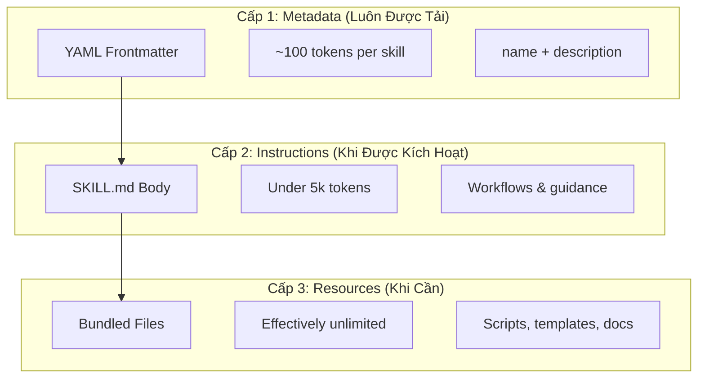
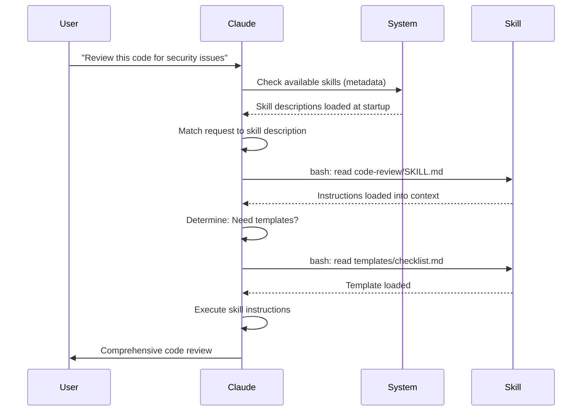

<picture>
  <source media="(prefers-color-scheme: dark)" srcset="../../resources/logos/claude-howto-logo-dark.svg">
  
</picture>

# Hướng Dẫn Agent Skills

Agent Skills là các khả năng dựa trên filesystem có thể tái sử dụng mở rộng chức năng của Claude. Chúng gói đóng kiến thức chuyên ngành, workflows, và thực hành tốt nhất thành các thành phần có thể khám phá mà Claude tự động sử dụng khi có liên quan.

## Tổng Quan

**Agent Skills** là các khả năng mô-đun biến các tác nhân đa năng thành chuyên gia. Không giống như prompts (hướng dẫn cấp cuộc hội thoại cho các tác vụ một lần), Skills tải theo yêu cầu và loại bỏ nhu cầu cung cấp liên tục cùng một hướng dẫn qua nhiều cuộc hội thoại.

### Lợi Ích Chính

- **Chuyên biệt hóa Claude**: Tùy chỉnh khả năng cho các tác vụ cụ thể theo lĩnh vực
- **Giảm lặp lại**: Tạo một lần, sử dụng tự động qua các cuộc hội thoại
- **Kết hợp khả năng**: Kết hợp Skills để xây dựng các workflow phức tạp
- **Mở rộng quy mô workflows**: Tái sử dụng skills qua nhiều dự án và đội
- **Duy trì chất lượng**: Nhúng thực hành tốt nhất trực tiếp vào workflow của bạn

Skills theo tiêu chuẩn mở [Agent Skills](https://agentskills.io), hoạt động qua nhiều công cụ AI khác nhau. Claude Code mở rộng tiêu chuẩn với các tính năng bổ sung như kiểm soát gọi, thực thi tác nhân con, và tiêm bối cảnh động.

> **Lưu ý**: Lệnh slash tùy chỉnh đã được hợp nhất vào skills. Files `.claude/commands/` vẫn hoạt động và hỗ trợ các trường frontmatter giống nhau. Skills được khuyến nghị cho phát triển mới. Khi cả hai tồn tại ở cùng đường dẫn (ví dụ: `.claude/commands/review.md` và `.claude/skills/review/SKILL.md`), skill được ưu tiên.

## Cách Skills Hoạt Động: Progressive Disclosure

Skills tận dụng kiến trúc **progressive disclosure**—Claude tải thông tin theo từng giai đoạn khi cần, thay vì tiêu thụ bối cảnh ngay từ đầu. Điều này cho phép quản lý bối cảnh hiệu quả trong khi duy trì khả năng mở rộng vô hạn.

### Ba Cấp Độ Tải



| Cấp | Khi Được Tải | Chi Phí Token | Nội Dung |
|-------|------------|------------|---------|
| **Cấp 1: Metadata** | Luôn (khi khởi động) | ~100 tokens per Skill | `name` và `description` từ YAML frontmatter |
| **Cấp 2: Instructions** | Khi Skill được kích hoạt | Under 5k tokens | Nội dung SKILL.md với hướng dẫn và chỉ dẫn |
| **Cấp 3+: Resources** | Khi cần | Effectively unlimited | Các file được gói thực thi qua bash mà không tải nội dung vào bối cảnh |

Điều này có nghĩa là bạn có thể cài đặt nhiều Skills mà không bị phạt bối cảnh—Claude chỉ biết mỗi Skill tồn tại và khi nào sử dụng nó cho đến khi thực sự được kích hoạt.

## Quy Trình Tải Skill



## Các Loại & Vị Trí Skill

| Loại | Vị Trí | Phạm Vi | Được Chia Sẻ | Tốt Nhất Cho |
|------|----------|-------|--------|----------|
| **Enterprise** | Managed settings | Tất cả người dùng org | Có | Tiêu chuẩn toàn tổ chức |
| **Personal** | `~/.claude/skills/<skill-name>/SKILL.md` | Cá nhân | Không | Workflows cá nhân |
| **Project** | `.claude/skills/<skill-name>/SKILL.md` | Đội | Có (qua git) | Tiêu chuẩn đội |
| **Plugin** | `<plugin>/skills/<skill-name>/SKILL.md` | Nơi được bật | Phụ thuộc | Được gói với plugins |

Khi skills chia sẻ cùng tên qua các cấp, vị trí ưu tiên cao hơn thắng: **enterprise > personal > project**. Plugin skills sử dụng namespace `plugin-name:skill-name`, vì vậy chúng không thể xung đột.

### Khám Phá Tự Động

**Thư mục lồng nhau**: Khi bạn làm việc với các file trong thư mục con, Claude Code tự động khám phá skills từ các thư mục `.claude/skills/` lồng nhau. Ví dụ: nếu bạn đang chỉnh sửa một file trong `packages/frontend/`, Claude Code cũng tìm kiếm skills trong `packages/frontend/.claude/skills/`. Điều này hỗ trợ thiết lập monorepo nơi các packages có skills riêng của chúng.

**Thư mục `--add-dir`**: Skills từ các thư mục được thêm qua `--add-dir` được tải tự động với phát hiện thay đổi trực tiếp. Bất kỳ chỉnh sửa nào cho các file skill trong các thư mục đó có hiệu lực ngay lập tức mà không cần khởi động lại Claude Code.

**Ngân sách description**: Các mô tả Skill (metadata cấp 1) được giới hạn ở **2% của cửa sổ bối cảnh** (fallback: **16,000 ký tự**). Nếu bạn có nhiều skills được cài đặt, một số có thể bị loại bỏ. Chạy `/context` để kiểm tra các cảnh báo. Ghi đè ngân sách với biến môi trường `SLASH_COMMAND_TOOL_CHAR_BUDGET`.

## Tạo Skills Tùy Chỉnh

### Cấu Trúc Thư Mục Cơ Bản

```
my-skill/
├── SKILL.md           # Hướng dẫn chính (bắt buộc)
├── template.md        # Mẫu để Claude điền vào
├── examples/
│   └── sample.md      # Ví dụ đầu ra hiển thị định dạng mong đợi
└── scripts/
    └── validate.sh    # Script Claude có thể thực thi
```

### Định Dạng SKILL.md

```yaml
---
name: your-skill-name
description: Mô tả ngắn về những gì Skill này làm và khi nào sử dụng nó
---

# Tên Skill Của Bạn

## Hướng Dẫn
Cung cấp hướng dẫn rõ ràng, từng bước cho Claude.

## Ví Dụ
Hiển thị các ví dụ cụ thể về việc sử dụng Skill này.
```

### Các Trường Bắt Buộc

- **name**: chỉ chữ thường, số, gạch ngang (tối đa 64 ký tự). Không thể chứa "anthropic" hoặc "claude".
- **description**: những gì Skill làm VÀ khi nào sử dụng nó (tối đa 1024 ký tự). Điều này quan trọng để Claude biết khi nào kích hoạt skill.

### Các Trường Frontmatter Tùy Chọn

```yaml
---
name: my-skill
description: What this skill does and when to use it
argument-hint: "[filename] [format]"        # Gợi ý cho autocomplete
disable-model-invocation: true              # Chỉ người dùng có thể gọi
user-invocable: false                       # Ẩn từ menu slash
allowed-tools: Read, Grep, Glob             # Hạn chế truy cập công cụ
model: opus                                 # Mô hình cụ thể để sử dụng
effort: high                                # Ghi đè mức nỗ lực (low, medium, high, max)
context: fork                               # Chạy trong tác nhân con cô lập
agent: Explore                              # Loại tác nhân nào (với context: fork)
shell: bash                                 # Shell cho các lệnh: bash (mặc định) hoặc powershell
hooks:                                      # Hooks theo phạm vi skill
  PreToolUse:
    - matcher: "Bash"
      hooks:
        - type: command
          command: "./scripts/validate.sh"
---
```

| Trường | Mô Tả |
|-------|-------------|
| `name` | Chỉ chữ thường, số, gạch ngang (tối đa 64 ký tự). Không thể chứa "anthropic" hoặc "claude". |
| `description` | Những gì Skill làm VÀ khi nào sử dụng nó (tối đa 1024 ký tự). Quan trọng cho phù hợp kích hoạt tự động. |
| `argument-hint` | Gợi ý hiển thị trong menu autocomplete `/` (ví dụ: `"[filename] [format]"`). |
| `disable-model-invocation` | `true` = chỉ người dùng có thể gọi qua `/name`. Claude sẽ không bao giờ tự gọi. |
| `user-invocable` | `false` = ẩn từ menu `/`. Chỉ Claude có thể gọi nó tự động. |
| `allowed-tools` | Danh sách phân tách bằng dấu phẩy của các công cụ mà skill có thể sử dụng mà không cần nhắc quyền. |
| `model` | Ghi đè mô hình trong khi skill hoạt động (ví dụ: `opus`, `sonnet`). |
| `effort` | Ghi đè mức nỗ lực trong khi skill hoạt động: `low`, `medium`, `high`, hoặc `max`. |
| `context` | `fork` để chạy skill trong bối cảnh tác nhân con được fork với cửa sổ bối cảnh riêng. |
| `agent` | Loại tác nhân con khi `context: fork` (ví dụ: `Explore`, `Plan`, `general-purpose`). |
| `shell` | Shell được sử dụng cho các thay thế `` !`command` `` và scripts: `bash` (mặc định) hoặc `powershell`. |
| `hooks` | Hooks theo phạm vi vòng đời skill này (cùng định dạng với hooks toàn cục). |

## Các Loại Nội Dung Skill

Skills có thể chứa hai loại nội dung, mỗi loại phù hợp cho các mục đích khác nhau:

### Nội Dung Tham Khảo

Thêm kiến thức Claude áp dụng cho công việc hiện tại của bạn—quy ước, mẫu, hướng dẫn phong cách, kiến thức lĩnh vực. Chạy nội tuyến với bối cảnh cuộc hội thoại của bạn.

```yaml
---
name: api-conventions
description: API design patterns for this codebase
---

Khi viết API endpoints:
- Sử dụng quy ước đặt tên RESTful
- Trả về định dạng lỗi nhất quán
- Bao gồm xác thực request
```

### Nội Dung Tác Vụ

Hướng dẫn từng bước cho các hành động cụ thể. Thường được gọi trực tiếp với `/skill-name`.

```yaml
---
name: deploy
description: Deploy the application to production
context: fork
disable-model-invocation: true
---

Deploy the application:
1. Run the test suite
2. Build the application
3. Push to the deployment target
```

## Kiểm Soát Gọi Skill

Theo mặc định, cả bạn và Claude đều có thể gọi bất kỳ skill nào. Hai trường frontmatter kiểm soát ba chế độ gọi:

| Frontmatter | Bạn có thể gọi | Claude có thể gọi |
|---|---|---|
| (mặc định) | Có | Có |
| `disable-model-invocation: true` | Có | Không |
| `user-invocable: false` | Không | Có |

**Sử dụng `disable-model-invocation: true`** cho các workflows có tác dụng phụ: `/commit`, `/deploy`, `/send-slack-message`. Bạn không muốn Claude quyết định deploy vì code của bạn trông đã sẵn sàng.

**Sử dụng `user-invocable: false`** cho kiến thức nền không thể thực hiện như một lệnh. Skill `legacy-system-context` giải thích cách hệ thống cũ hoạt động—hữu ích cho Claude, nhưng không phải là một hành động có ý nghĩa cho người dùng.

## Thay Thế Chuỗi

Skills hỗ trợ các giá trị động được giải quyết trước khi nội dung skill đến được Claude:

| Biến | Mô Tả |
|----------|-------------|
| `$ARGUMENTS` | Tất cả đối số được truyền khi gọi skill |
| `$ARGUMENTS[N]` hoặc `$N` | Truy cập đối số cụ thể theo chỉ mục (0-based) |
| `${CLAUDE_SESSION_ID}` | ID phiên hiện tại |
| `${CLAUDE_SKILL_DIR}` | Thư mục chứa file SKILL.md của skill |
| `` !`command` `` | Tiêm bối cảnh động — chạy một lệnh shell và đưa đầu ra vào |

**Ví dụ:**

```yaml
---
name: fix-issue
description: Fix a GitHub issue
---

Fix GitHub issue $ARGUMENTS following our coding standards.
1. Read the issue description
2. Implement the fix
3. Write tests
4. Create a commit
```

Chạy `/fix-issue 123` thay thế `$ARGUMENTS` bằng `123`.

## Tiêm Bối Cảnh Động

Cú pháp `` !`command` `` chạy các lệnh shell trước khi nội dung skill được gửi đến Claude:

```yaml
---
name: pr-summary
description: Summarize changes in a pull request
context: fork
agent: Explore
---

## Pull request context
- PR diff: !`gh pr diff`
- PR comments: !`gh pr view --comments`
- Changed files: !`gh pr diff --name-only`

## Your task
Summarize this pull request...
```

Các lệnh thực thi ngay lập tức; Claude chỉ thấy đầu ra cuối cùng. Theo mặc định, các lệnh chạy trong `bash`. Đặt `shell: powershell` trong frontmatter để sử dụng PowerShell thay thế.

## Chạy Skills Trong Tác Nhân Con

Thêm `context: fork` để chạy một skill trong bối cảnh tác nhân con cô lập. Nội dung skill trở thành tác vụ cho một tác nhân con chuyên dụng với cửa sổ bối cảnh riêng, giữ cho cuộc hội thoại chính gọn gàng.

Trường `agent` chỉ định loại tác nhân nào để sử dụng:

| Loại Tác Nhân | Tốt Nhất Cho |
|---|---|
| `Explore` | Nghiên cứu chỉ đọc, phân tích codebase |
| `Plan` | Tạo kế hoạch triển khai |
| `general-purpose` | Các tác vụ rộng yêu cầu tất cả công cụ |
| Tác nhân tùy chỉnh | Các tác nhân chuyên biệt được định nghĩa trong cấu hình của bạn |

**Ví dụ frontmatter:**

```yaml
---
context: fork
agent: Explore
---
```

**Ví dụ skill đầy đủ:**

```yaml
---
name: deep-research
description: Research a topic thoroughly
context: fork
agent: Explore
---

Research $ARGUMENTS thoroughly:
1. Find relevant files using Glob and Grep
2. Read and analyze the code
3. Summarize findings with specific file references
```

## Các Ví Dụ Thực Tiễn

### Ví Dụ 1: Code Review Skill

**Cấu Trúc Thư Mục:**

```
~/.claude/skills/code-review/
├── SKILL.md
├── templates/
│   ├── review-checklist.md
│   └── finding-template.md
└── scripts/
    ├── analyze-metrics.py
    └── compare-complexity.py
```

**File:** `~/.claude/skills/code-review/SKILL.md`

```yaml
---
name: code-review-specialist
description: Comprehensive code review with security, performance, and quality analysis. Use when users ask to review code, analyze code quality, evaluate pull requests, or mention code review, security analysis, or performance optimization.
---

# Code Review Skill

This skill provides comprehensive code review capabilities focusing on:

1. **Security Analysis**
   - Authentication/authorization issues
   - Data exposure risks
   - Injection vulnerabilities
   - Cryptographic weaknesses

2. **Performance Review**
   - Algorithm efficiency (Big O analysis)
   - Memory optimization
   - Database query optimization
   - Caching opportunities

3. **Code Quality**
   - SOLID principles
   - Design patterns
   - Naming conventions
   - Test coverage

4. **Maintainability**
   - Code readability
   - Function size (should be < 50 lines)
   - Cyclomatic complexity
   - Type safety

## Review Template

For each piece of code reviewed, provide:

### Summary
- Overall quality assessment (1-5)
- Key findings count
- Recommended priority areas

### Critical Issues (if any)
- **Issue**: Clear description
- **Location**: File and line number
- **Impact**: Why this matters
- **Severity**: Critical/High/Medium
- **Fix**: Code example

For detailed checklists, see [templates/review-checklist.md](templates/review-checklist.md).
```

### Ví Dụ 2: Codebase Visualizer Skill

Một skill tạo ra các hình ảnh hóa HTML tương tác:

**Cấu Trúc Thư Mục:**

```
~/.claude/skills/codebase-visualizer/
├── SKILL.md
└── scripts/
    └── visualize.py
```

**File:** `~/.claude/skills/codebase-visualizer/SKILL.md`

```yaml
---
name: codebase-visualizer
description: Generate an interactive collapsible tree visualization of your codebase. Use when exploring a new repo, understanding project structure, or identifying large files.
allowed-tools: Bash(python *)
---

# Codebase Visualizer

Generate an interactive HTML tree view showing your project's file structure.

## Usage

Run the visualization script from your project root:

```bash
python ~/.claude/skills/codebase-visualizer/scripts/visualize.py .
```

This creates `codebase-map.html` and opens it in your default browser.

## What the visualization shows

- **Collapsible directories**: Click folders to expand/collapse
- **File sizes**: Displayed next to each file
- **Colors**: Different colors for different file types
- **Directory totals**: Shows aggregate size of each folder
```

Script Python được gói thực hiện công việc nặng trong khi Claude xử lý điều phối.

### Ví Dụ 3: Deploy Skill (Chỉ Người Dùng Gọi)

```yaml
---
name: deploy
description: Deploy the application to production
disable-model-invocation: true
allowed-tools: Bash(npm *), Bash(git *)
---

Deploy $ARGUMENTS to production:

1. Run the test suite: `npm test`
2. Build the application: `npm run build`
3. Push to the deployment target
4. Verify the deployment succeeded
5. Report deployment status
```

### Ví Dụ 4: Brand Voice Skill (Kiến Thức Nền)

```yaml
---
name: brand-voice
description: Ensure all communication matches brand voice and tone guidelines. Use when creating marketing copy, customer communications, or public-facing content.
user-invocable: false
---

## Tone of Voice
- **Friendly but professional** - approachable without being casual
- **Clear and concise** - avoid jargon
- **Confident** - we know what we're doing
- **Empathetic** - understand user needs

## Writing Guidelines
- Use "you" when addressing readers
- Use active voice
- Keep sentences under 20 words
- Start with value proposition

For templates, see [templates/](templates/).
```

### Ví Dụ 5: CLAUDE.md Generator Skill

```yaml
---
name: claude-md
description: Create or update CLAUDE.md files following best practices for optimal AI agent onboarding. Use when users mention CLAUDE.md, project documentation, or AI onboarding.
---

## Core Principles

**LLMs are stateless**: CLAUDE.md is the only file automatically included in every conversation.

### The Golden Rules

1. **Less is More**: Keep under 300 lines (ideally under 100)
2. **Universal Applicability**: Only include information relevant to EVERY session
3. **Don't Use Claude as a Linter**: Use deterministic tools instead
4. **Never Auto-Generate**: Craft it manually with careful consideration

## Essential Sections

- **Project Name**: Brief one-line description
- **Tech Stack**: Primary language, frameworks, database
- **Development Commands**: Install, test, build commands
- **Critical Conventions**: Only non-obvious, high-impact conventions
- **Known Issues / Gotchas**: Things that trip up developers
```

### Ví Dụ 6: Refactoring Skill với Scripts

**Cấu Trúc Thư Mục:**

```
refactor/
├── SKILL.md
├── references/
│   ├── code-smells.md
│   └── refactoring-catalog.md
├── templates/
│   └── refactoring-plan.md
└── scripts/
    ├── analyze-complexity.py
    └── detect-smells.py
```

**File:** `refactor/SKILL.md`

```yaml
---
name: code-refactor
description: Systematic code refactoring based on Martin Fowler's methodology. Use when users ask to refactor code, improve code structure, reduce technical debt, or eliminate code smells.
---

# Code Refactoring Skill

A phased approach emphasizing safe, incremental changes backed by tests.

## Workflow

Phase 1: Research & Analysis → Phase 2: Test Coverage Assessment →
Phase 3: Code Smell Identification → Phase 4: Refactoring Plan Creation →
Phase 5: Incremental Implementation → Phase 6: Review & Iteration

## Core Principles

1. **Behavior Preservation**: External behavior must remain unchanged
2. **Small Steps**: Make tiny, testable changes
3. **Test-Driven**: Tests are the safety net
4. **Continuous**: Refactoring is ongoing, not a one-time event

For code smell catalog, see [references/code-smells.md](references/code-smells.md).
For refactoring techniques, see [references/refactoring-catalog.md](references/refactoring-catalog.md).
```

## Các File Hỗ Trợ

Skills có thể bao gồm nhiều file trong thư mục của chúng ngoài `SKILL.md`. Các file hỗ trợ này (templates, examples, scripts, tài liệu tham khảo) cho phép bạn giữ file skill chính tập trung trong khi cung cấp cho Claude các tài nguyên bổ sung mà nó có thể tải khi cần.

```
my-skill/
├── SKILL.md              # Hướng dẫn chính (bắt buộc, giữ dưới 500 dòng)
├── templates/            # Mẫu để Claude điền vào
│   └── output-format.md
├── examples/             # Ví dụ đầu ra hiển thị định dạng mong đợi
│   └── sample-output.md
├── references/           # Kiến thức lĩnh vực và thông số kỹ thuật
│   └── api-spec.md
└── scripts/              # Scripts Claude có thể thực thi
    └── validate.sh
```

Hướng dẫn cho các file hỗ trợ:

- Giữ `SKILL.md` dưới **500 dòng**. Di chuyển tài liệu tham khảo chi tiết, ví dụ lớn, và thông số kỹ thuật sang các file riêng.
- Tham khảo các file bổ sung từ `SKILL.md` sử dụng **đường dẫn tương đối** (ví dụ: `[API reference](references/api-spec.md)`).
- Các file hỗ trợ được tải ở Cấp 3 (khi cần), vì vậy chúng không tiêu thụ bối cảnh cho đến khi Claude thực sự đọc chúng.

## Quản Lý Skills

### Xem Các Skills Có Sẵn

Hỏi Claude trực tiếp:
```
What Skills are available?
```

Hoặc kiểm tra filesystem:
```bash
# List personal Skills
ls ~/.claude/skills/

# List project Skills
ls .claude/skills/
```

### Kiểm Tra Một Skill

Hai cách để kiểm tra:

**Để Claude gọi tự động** bằng cách hỏi một cái gì đó phù hợp với mô tả:
```
Can you help me review this code for security issues?
```

**Hoặc gọi trực tiếp** với tên skill:
```
/code-review src/auth/login.ts
```

### Cập Nhật Một Skill

Chỉnh sửa file `SKILL.md` trực tiếp. Các thay đổi có hiệu lực vào lần khởi động Claude Code tiếp theo.

```bash
# Personal Skill
code ~/.claude/skills/my-skill/SKILL.md

# Project Skill
code .claude/skills/my-skill/SKILL.md
```

### Hạn Chế Truy Cập Skill Của Claude

Ba cách để kiểm soát skills nào Claude có thể gọi:

**Vô hiệu hóa tất cả skills** trong `/permissions`:
```
# Add to deny rules:
Skill
```

**Cho phép hoặc từ chối các skills cụ thể**:
```
# Allow only specific skills
Skill(commit)
Skill(review-pr *)

# Deny specific skills
Skill(deploy *)
```

**Ẩn các skills riêng lẻ** bằng cách thêm `disable-model-invocation: true` vào frontmatter của chúng.

## Thực Hành Tốt Nhất

### 1. Làm Cho Mô Tả Cụ Thể

- **Xấu (Mơ hồ)**: "Helps with documents"
- **Tốt (Cụ thể)**: "Extract text and tables from PDF files, fill forms, merge documents. Use when working with PDF files or when the user mentions PDFs, forms, or document extraction."

### 2. Giữ Skills Tập Trung

- Một Skill = một khả năng
- ✅ "PDF form filling"
- ❌ "Document processing" (quá rộng)

### 3. Bao Gồm Các Thuật Ngọc Kích Hoạt

Thêm các từ khóa trong các mô tả phù hợp với các yêu cầu của người dùng:
```yaml
description: Analyze Excel spreadsheets, generate pivot tables, create charts. Use when working with Excel files, spreadsheets, or .xlsx files.
```

### 4. Giữ SKILL.md Dưới 500 Dòng

Di chuyển tài liệu tham khảo chi tiết sang các file riêng mà Claude tải khi cần.

### 5. Tham Khảo Các File Hỗ Trợ

```markdown
## Additional resources

- For complete API details, see [reference.md](reference.md)
- For usage examples, see [examples.md](examples.md)
```

### Nên Làm

- Sử dụng tên rõ ràng, mang tính mô tả
- Bao gồm hướng dẫn toàn diện
- Thêm các ví dụ cụ thể
- Gói đóng các script và template liên quan
- Kiểm tra với các kịch bản thực
- Tài liệu hóa các dependencies

### Không Nên Làm

- Đừng tạo skills cho các tác vụ một lần
- Đừng nhân đôi chức năng hiện có
- Đừng làm skills quá rộng
- Đừng bỏ qua trường description
- Đừng cài đặt skills từ các nguồn không đáng tin mà không kiểm tra

## Xử Lý Sự Cố

### Tham Khảo Nhanh

| Vấn Đề | Giải Pháp |
|-------|----------|
| Claude không sử dụng Skill | Làm cho mô tả cụ thể hơn với các thuật ngữ kích hoạt |
| File skill không tìm thấy | Xác minh đường dẫn: `~/.claude/skills/name/SKILL.md` |
| Lỗi YAML | Kiểm tra đánh dấu `---`, thụt lề, không tabs |
| Skills xung đột | Sử dụng các thuật ngữ kích hoạt riêng biệt trong các mô tả |
| Scripts không chạy | Kiểm tra quyền: `chmod +x scripts/*.py` |
| Claude không thấy tất cả skills | Quá nhiều skills; kiểm tra `/context` để có cảnh báo |

### Skill Không Kích Hoạt

Nếu Claude không sử dụng skill của bạn khi mong đợi:

1. Kiểm tra mô tả bao gồm các từ khóa người dùng sẽ tự nhiên nói
2. Xác minh skill xuất hiện khi hỏi "What skills are available?"
3. Thử diễn đạt lại yêu cầu của bạn để phù hợp với mô tả
4. Gọi trực tiếp với `/skill-name` để kiểm tra

### Skill Kích Hoạt Quá Thường

Nếu Claude sử dụng skill của bạn khi bạn không muốn:

1. Làm cho mô tả cụ thể hơn
2. Thêm `disable-model-invocation: true` để chỉ gọi thủ công

### Claude Không Thấy Tất Cả Skills

Các mô tả Skill được tải ở **2% của cửa sổ bối cảnh** (fallback: **16,000 ký tự**). Chạy `/context` để kiểm tra các cảnh báo về các skills bị loại bỏ. Ghi đè ngân sách với biến môi trường `SLASH_COMMAND_TOOL_CHAR_BUDGET`.

## Cân Nhắc Bảo Mật

**Chỉ sử dụng Skills từ các nguồn đáng tin cậy.** Skills cung cấp cho Claude các khả năng qua hướng dẫn và code—một Skill độc hại có thể hướng dẫn Claude gọi các công cụ hoặc thực thi code theo cách có hại.

**Cân nhắc bảo mật chính:**

- **Kiểm tra kỹ**: Xem xét tất cả các file trong thư mục Skill
- **Nguồn bên ngoài là rủi ro**: Skills mà fetch từ các URL bên ngoài có thể bị xâm phạm
- **Lạm dụng công cụ**: Skills độc hại có thể gọi các công cụ theo cách có hại
- **Coi như cài đặt phần mềm**: Chỉ sử dụng Skills từ các nguồn đáng tin cậy

## Skills So Với Các Tính Năng Khác

| Tính Năng | Gọi | Tốt Nhất Cho |
|---------|------------|----------|
| **Skills** | Tự động hoặc `/name` | Chuyên môn có thể tái sử dụng, workflows |
| **Lệnh Slash** | Người dùng khởi tạo `/name` | Các lối tắt nhanh (đã hợp nhất vào skills) |
| **Tác Nhân Con** | Tự động ủy quyền | Thực thi tác vụ cô lập |
| **Bộ Nhớ (CLAUDE.md)** | Luôn được tải | Bối cảnh dự án liên tục |
| **MCP** | Thời gian thực | Truy cập dữ liệu/dịch vụ bên ngoài |
| **Hooks** | Dựa trên sự kiện | Các tác dụng phụ tự động |

## Các Skills Được Gói

Claude Code được gửi với một số skills được tích hợp sẵn luôn có sẵn mà không cần cài đặt:

| Skill | Mô Tả |
|-------|-------------|
| `/simplify` | Review các file đã thay đổi để tái sử dụng, chất lượng, và hiệu quả; tạo ra 3 tác nhân review song song |
| `/batch <instruction>` | Điều phối các thay đổi song song quy mô lớn qua codebase sử dụng git worktrees |
| `/debug [description]` | Khắc phục sự cố phiên hiện tại bằng cách đọc debug log |
| `/loop [interval] <prompt>` | Chạy prompt lặp lại trên khoảng thời gian (ví dụ: `/loop 5m check the deploy`) |
| `/claude-api` | Tải tài liệu tham khảo Claude API/SDK; tự động kích hoạt trên các imports `anthropic`/`@anthropic-ai/sdk` |

Các skills này có sẵn ngay lập tức và không cần được cài đặt hoặc cấu hình. Chúng theo cùng định dạng SKILL.md như các skills tùy chỉnh.

## Chia Sẻ Skills

### Project Skills (Chia Sẻ Đội)

1. Tạo Skill trong `.claude/skills/`
2. Commit vào git
3. Các thành viên kéo các thay đổi — Skills có sẵn ngay lập tức

### Skills Cá Nhân

```bash
# Copy đến thư mục cá nhân
cp -r my-skill ~/.claude/skills/

# Make scripts executable
chmod +x ~/.claude/skills/my-skill/scripts/*.py
```

### Phân Phối Plugin

Gói skills trong thư mục `skills/` của plugin để phân phối rộng hơn.

## Đi Tiếp Xa: Một Bộ Sưu Tập Skill và Một Trình Quản Lý Skill

Khi bạn bắt đầu xây dựng skills một cách nghiêm túc, hai điều trở nên cần thiết: một thư viện của các skills đã được chứng minh và một công cụ để quản lý chúng.

**[luongnv89/skills](https://github.com/luongnv89/skills)** — Một bộ sưu tập các skills tôi sử dụng hàng ngày qua hầu hết tất cả các dự án của tôi. Các điểm nổi bật bao gồm `logo-designer` (tạo logo dự án ngay lập tức) và `ollama-optimizer` (tinh chỉnh hiệu suất LLM cục bộ cho phần cứng của bạn). Điểm khởi đầu tuyệt vời nếu bạn muốn các skills đã sẵn sàng sử dụng.

**[luongnv89/asm](https://github.com/luongnv89/asm)** — Agent Skill Manager. Xử lý phát triển skill, phát hiện trùng lặp, và kiểm tra. Lệnh `asm link` cho phép bạn kiểm tra một skill trong bất kỳ dự án nào mà không cần sao chép files — cần thiết khi bạn có nhiều một chút skills.

## Tài Nguyên Thêm

- [Tài Liệu Skills Chính Thức](https://code.claude.com/docs/en/skills)
- [Blog Kiến Trúc Agent Skills](https://claude.com/blog/equipping-agents-for-the-real-world-with-agent-skills)
- [Kho Skills](https://github.com/luongnv89/skills) - Bộ sưu tập các skills đã sẵn sàng sử dụng
- [Hướng Dẫn Lệnh Slash](../01-slash-commands/) - Các lối tắt do người dùng khởi tạo
- [Hướng Dẫn Tác Nhân Con](../04-subagents/) - Các tác nhân AI được ủy quyền
- [Hướng Dẫn Bộ Nhớ](../02-memory/) - Bối cảnh liên tục
- [MCP (Model Context Protocol)](../05-mcp/) - Dữ liệu bên ngoài thời gian thực
- [Hướng Dẫn Hooks](../06-hooks/) - Tự động hóa dựa trên sự kiện

---

**Cập Nhật Lần Cuối**: Tháng 4 năm 2026
**Phiên Bản Claude Code**: 2.1+
**Các Mô Hình Tương Thích**: Claude Sonnet 4.6, Claude Opus 4.6, Claude Haiku 4.5
