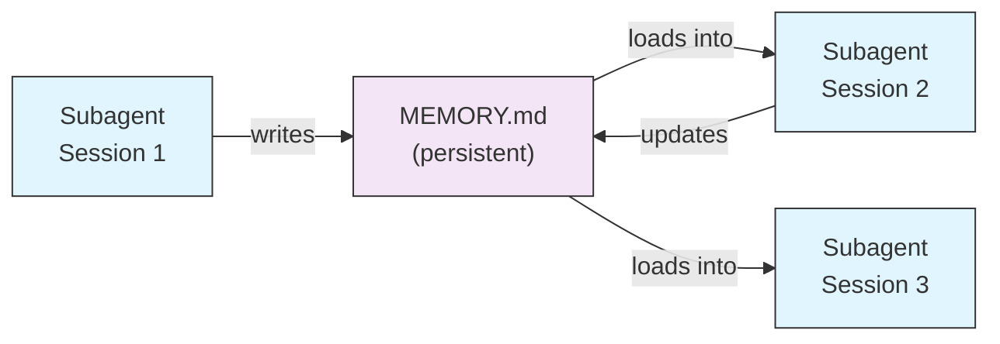
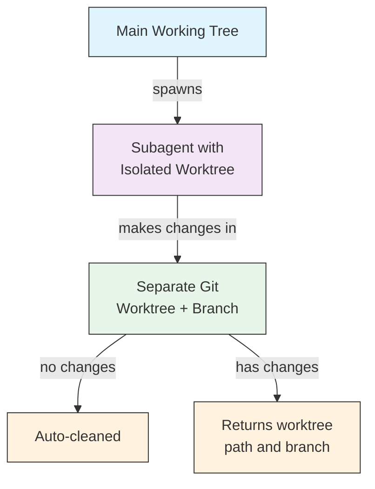
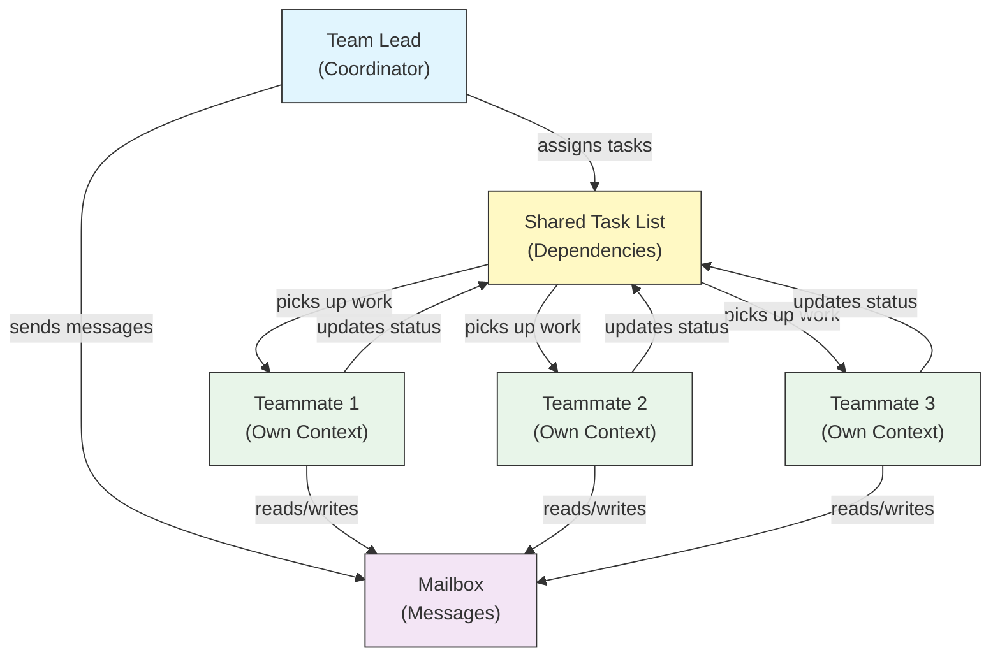
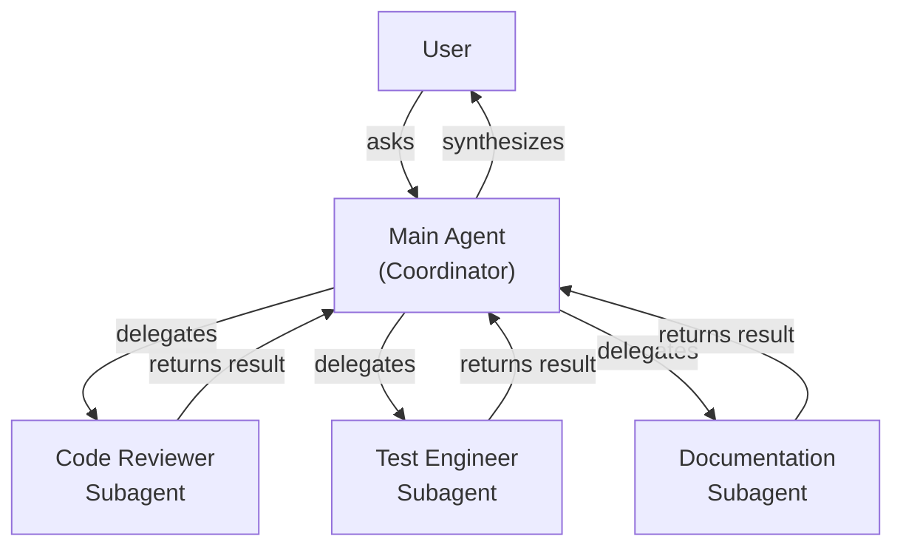
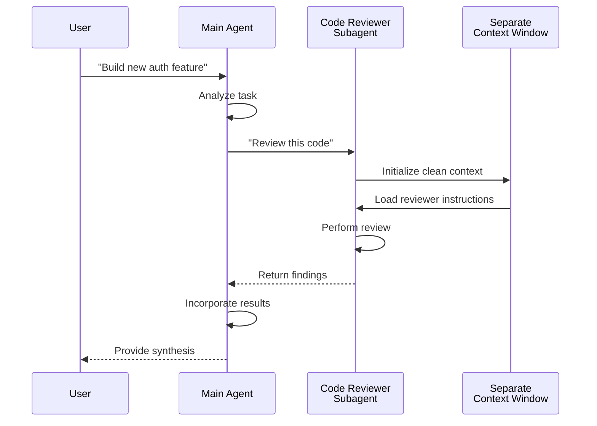
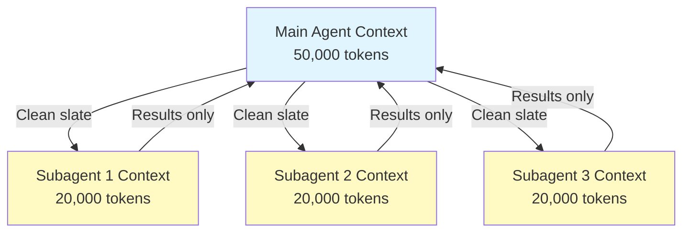
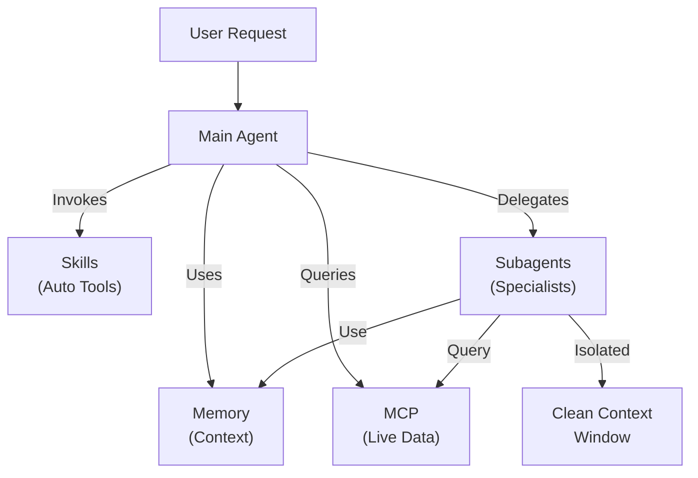

<picture>
  <source media="(prefers-color-scheme: dark)" srcset="../../resources/logos/claude-howto-logo-dark.svg">
  
</picture>

# Tác Nhân Con - Hướng Dẫn Tham Khảo Hoàn Chỉnh

Tác nhân con là các trợ lý AI chuyên biệt mà Claude Code có thể ủy quyền tác vụ. Mỗi tác nhân con có mục đích cụ thể, sử dụng cửa sổ bối cảnh riêng tách biệt với cuộc hội thoại chính, và có thể được cấu hình với các công cụ cụ thể và prompt hệ thống tùy chỉnh.

## Mục Lục

1. [Tổng Quan](#tổng-quan)
2. [Lợi Ích Chính](#lợi-ích-chính)
3. [Vị Trí File](#vị-trí-file)
4. [Cấu Hình](#cấu-hình)
5. [Tác Nhân Con Tích Hợp Sẵn](#tác-nhân-con-tích-hợp-sẵn)
6. [Quản Lý Tác Nhân Con](#quản-lý-tác-nhân-con)
7. [Sử Dụng Tác Nhân Con](#sử-dụng-tác-nhân-con)
8. [Tác Nhân Có Thể Tiếp Tục](#tác-nhân-có-thể-tiếp-tục)
9. [Chuỗi Tác Nhân Con](#chuỗi-tác-nhân-con)
10. [Bộ Nhớ Liên Tục Cho Tác Nhân Con](#bộ-nhớ-liên-tục-cho-tác-nhân-con)
11. [Tác Nhân Con Nền](#tác-nhân-con-nền)
12. [Cô Lập Worktree](#cô-lập-worktree)
13. [Hạn Chế Tác Nhân Con Có Thể Tạo](#hạn-chế-tác-nhân-con-có-thể-tạo)
14. [Lệnh CLI `claude agents`](#lệnh-cli-claude-agents)
15. [Đội Tác Nhân (Thử Nghiệm)](#đội-tác-nhân-thử-nghiệm)
16. [Bảo Mật Tác Nhân Con Plugin](#bảo-mật-tác-nhân-con-plugin)
17. [Kiến Trúc](#kiến-trúc)
18. [Quản Lý Bối Cảnh](#quản-lý-bối-cảnh)
19. [Khi Nào Sử Dụng Tác Nhân Con](#khi-nào-sử-dụng-tác-nhân-con)
20. [Thực Hành Tốt Nhất](#thực-hành-tốt-nhất)
21. [Ví Dụ Tác Nhân Con Trong Thư Mục Này](#ví-dụ-tác-nhân-con-trong-thư-mục-này)
22. [Hướng Dẫn Cài Đặt](#hướng-dẫn-cài-đặt)
23. [Khái Niệm Liên Quan](#khái-niệm-liên-quan)

---

## Tổng Quan

Tác nhân con cho phép thực thi tác vụ được ủy quyền trong Claude Code bằng cách:

- Tạo **các trợ lý AI cô lập** với các cửa sổ bối cảnh riêng
- Cung cấp **các prompt hệ thống tùy chỉnh** cho chuyên môn chuyên biệt
- Thực thi **kiểm soát truy cập công cụ** để giới hạn khả năng
- Ngăn **ô nhiễm bối cảnh** từ các tác vụ phức tạp
- Cho phép **thực thi song song** của nhiều tác vụ chuyên biệt

Mỗi tác nhân con hoạt động độc lập với một trang sạch, chỉ nhận bối cảnh cụ thể cần thiết cho tác vụ của họ, sau đó trả về kết quả cho tác nhân chính để tổng hợp.

**Bắt Đầu Nhanh**: Sử dụng lệnh `/agents` để tạo, xem, chỉnh sửa, và quản lý các tác nhân con của bạn một cách tương tác.

---

## Lợi Ích Chính

| Lợi Ích | Mô Tả |
|---------|-------------|
| **Bảo tồn bối cảnh** | Hoạt động trong bối cảnh riêng, ngăn ngắt ô nhiễm cuộc hội thoại chính |
| **Chuyên môn hóa** | Điều chỉnh tốt cho các lĩnh vực cụ thể với tỷ lệ thành công cao hơn |
| **Khả năng tái sử dụng** | Sử dụng qua các dự án khác và chia sẻ với các đội |
| **Quyền linh hoạt** | Các mức truy cập công cụ khác nhau cho các loại tác nhân con khác |
| **Khả năng mở rộng** | Nhiều tác nhân hoạt động trên các khía cạnh khác nhau đồng thời |

---

## Vị Trí File

Files tác nhân con có thể được lưu trữ ở nhiều vị trí với các phạm vi khác nhau:

| Ưu Tiên | Loại | Vị Trí | Phạm Vi |
|----------|------|----------|-------|
| 1 (cao nhất) | **Được định nghĩa qua CLI** | Qua cờ `--agents` (JSON) | Chỉ phiên |
| 2 | **Tác nhân dự án** | `.claude/agents/` | Dự án hiện tại |
| 3 | **Tác nhân người dùng** | `~/.claude/agents/` | Tất cả dự án |
| 4 (thấp nhất) | **Tác nhân plugin** | Thư mục `agents/` của plugin | Qua plugins |

Khi tên trùng lặp tồn tại, nguồn ưu tiên cao hơn sẽ được ưu tiên.

---

## Cấu Hình

### Định Dạng File

Tác nhân con được định nghĩa trong YAML frontmatter theo sau là prompt hệ thống trong markdown:

```yaml
---
name: your-sub-agent-name
description: Mô tả khi nào tác nhân con này nên được gọi
tools: tool1, tool2, tool3  # Tùy chọn - kế thừa tất cả công cụ nếu bỏ qua
disallowedTools: tool4  # Tùy chọn - công cụ rõ ràng không được phép
model: sonnet  # Tùy chọn - sonnet, opus, haiku, hoặc inherit
permissionMode: default  # Tùy chọn - chế độ quyền
maxTurns: 20  # Tùy chọn - giới hạn lượt tác nhân
skills: skill1, skill2  # Tùy chọn - skills để tải trước vào bối cảnh
mcpServers: server1  # Tùy chọn - MCP servers để cung cấp
memory: user  # Tùy chọn - phạm vi bộ nhớ liên tục (user, project, local)
background: false  # Tùy chọn - chạy như tác vụ nền
effort: high  # Tùy chọn - nỗ lực lý luận (low, medium, high, max)
isolation: worktree  # Tùy chọn - cô lập git worktree
initialPrompt: "Bắt đầu bằng cách phân tích codebase"  # Tùy chọn - lượt đầu tự động gửi
hooks:  # Tùy chọn - hooks theo phạm vi component
  PreToolUse:
    - matcher: "Bash"
      hooks:
        - type: command
          command: "./scripts/security-check.sh"
---

Prompt hệ thống của tác nhân con của bạn ở đây. Nhiều có thể là nhiều đoạn
và nên xác định rõ vai trò, khả năng, và cách tiếp cận
của tác nhân con để giải quyết vấn đề.
```

### Các Trường Cấu Hình

| Trường | Bắt Buộc | Mô Tả |
|-------|----------|-------------|
| `name` | Có | Định danh duy nhất (chữ thường và dấu gạch ngang) |
| `description` | Có | Mô tả ngôn ngữ của mục đích. Bao gồm "use PROACTIVELY" để khuyến khích gọi tự động |
| `tools` | Không | Danh sách phân tách bằng dấu phẩy của các công cụ cụ thể. Bỏ qua để kế thừa tất cả công cụ. Hỗ trợ cú pháp `Agent(agent_name)` để hạn chế tác nhân con có thể tạo |
| `disallowedTools` | Không | Danh sách phân tách bằng dấu phẩy của các công cụ mà tác nhân con không được sử dụng |
| `model` | Không | Mô hình để sử dụng: `sonnet`, `opus`, `haiku`, ID mô hình đầy đủ, hoặc `inherit`. Mặc định là mô hình tác nhân con được cấu hình |
| `permissionMode` | Không | `default`, `acceptEdits`, `dontAsk`, `bypassPermissions`, `plan` |
| `maxTurns` | Không | Số lượng lượt tác nhân tối đa mà tác nhân con có thể thực hiện |
| `skills` | Không | Danh sách phân tách bằng dấu phẩy của các skills để tải trước. Tiêm toàn bộ nội dung skill vào bối cảnh của tác nhân con khi khởi động |
| `mcpServers` | Không | MCP servers để cung cấp cho tác nhân con |
| `hooks` | Không | Hooks theo phạm vi component (PreToolUse, PostToolUse, Stop) |
| `memory` | Không | Phạm vi thư mục bộ nhớ liên tục: `user`, `project`, hoặc `local` |
| `background` | Không | Đặt thành `true` để luôn chạy tác nhân con này như một tác vụ nền |
| `effort` | Không | Mức độ nỗ lực lý luận: `low`, `medium`, `high`, hoặc `max` |
| `isolation` | Không | Đặt thành `worktree` để cung cấp cho tác nhân con git worktree riêng |
| `initialPrompt` | Không | Lượt đầu tự động gửi khi tác nhân con chạy như tác nhân chính |

### Tùy Chọn Cấu Hình Công Cụ

**Tùy Chọn 1: Kế Thừa Tất Cả Công Cụ (bỏ qua trường)**
```yaml
---
name: full-access-agent
description: Agent với tất cả các công cụ có sẵn
---
```

**Tùy Chọn 2: Chỉ Định Các Công Cụ Cụ Thể**
```yaml
---
name: limited-agent
description: Agent với các công cụ cụ thể chỉ
tools: Read, Grep, Glob, Bash
---
```

**Tùy Chọn 3: Truy Cập Công Cụ Có Điều Kiện**
```yaml
---
name: conditional-agent
description: Agent với truy cập công cụ được lọc
tools: Read, Bash(npm:*), Bash(test:*)
---
```

### Cấu Hình Dựa Trên CLI

Định nghĩa tác nhân con cho một phiên duy nhất sử dụng cờ `--agents` với định dạng JSON:

```bash
claude --agents '{
  "code-reviewer": {
    "description": "Expert code reviewer. Use proactively after code changes.",
    "prompt": "You are a senior code reviewer. Focus on code quality, security, and best practices.",
    "tools": ["Read", "Grep", "Glob", "Bash"],
    "model": "sonnet"
  }
}'
```

**Định Dạng JSON cho cờ `--agents`:**

```json
{
  "agent-name": {
    "description": "Required: khi nào gọi agent này",
    "prompt": "Required: prompt hệ thống cho agent",
    "tools": ["Optional", "array", "of", "tools"],
    "model": "optional: sonnet|opus|haiku"
  }
}
```

**Ưu Tiên Định Nghĩa Tác Nhân:**

Các định nghĩa tác nhân được tải với thứ tự ưu tiên này (khớp đầu tiên thắng):
1. **Được định nghĩa qua CLI** - cờ `--agents` (phiên chỉ, JSON)
2. **Cấp dự án** - `.claude/agents/` (dự án hiện tại)
3. **Cấp người dùng** - `~/.claude/agents/` (tất cả dự án)
4. **Cấp plugin** - Thư mục `agents/` của plugin

Điều này cho phép định nghĩa CLI ghi đè tất cả các nguồn khác cho một phiên duy nhất.

---

## Tác Nhân Con Tích Hợp Sẵn

Claude Code bao gồm một số tác nhân con được tích hợp sẵn luôn có sẵn:

| Tác Nhân | Mô Hình | Mục Đích |
|-------|-------|---------|
| **general-purpose** | Kế thừa | Tác vụ đa bước phức tạp |
| **Plan** | Kế thừa | Nghiên cứu cho chế độ lập kế hoạch |
| **Explore** | Haiku | Khám phá codebase chỉ đọc (nhanh/trung bình/rất kỹ) |
| **Bash** | Kế thừa | Lệnh terminal trong bối cảnh riêng |
| **statusline-setup** | Sonnet | Cấu hình dòng trạng thái |
| **Claude Code Guide** | Haiku | Trả lời câu hỏi về tính năng Claude Code |

### Tác Nhân General-Purpose

| Thuộc Tính | Giá Trị |
|----------|-------|
| **Mô Hình** | Kế thừa từ cha |
| **Công Cụ** | Tất cả công cụ |
| **Mục Đích** | Nhiệm vụ nghiên cứu phức tạp, hoạt động đa bước, chỉnh sửa code |

**Khi sử dụng**: Tác vụ yêu cầu cả khám phá và sửa đổi với lý luận phức tạp.

### Tác Nhân Plan

| Thuộc Tính | Giá Trị |
|----------|-------|
| **Mô Hình** | Kế thừa từ cha |
| **Công Cụ** | Read, Glob, Grep, Bash |
| **Mục Đích** | Được sử dụng tự động trong chế độ lập kế hoạch để nghiên cứu codebase |

**Khi sử dụng**: Khi Claude cần hiểu codebase trước khi trình bày kế hoạch.

### Tác Nhân Explore

| Thuộc Tính | Giá Trị |
|----------|-------|
| **Mô Hình** | Haiku (nhanh, độ trễ thấp) |
| **Chế Độ** | Chỉ đọc nghiêm ngặt |
| **Công Cụ** | Glob, Grep, Read, Bash (chỉ lệnh đọc) |
| **Mục Đích** | Tìm kiếm và phân tích codebase nhanh |

**Khi sử dụng**: Khi tìm kiếm/hiểu code mà không thực hiện thay đổi.

**Mức Độ Chuyên Sâu** - Chỉ định độ sâu của khám phá:
- **"quick"** - Tìm kiếm nhanh với khám phá tối thiểu, tốt để tìm các mẫu cụ thể
- **"medium"** - Khám phá vừa phải, cân bằng tốc độ và sự kỹ lưỡng, cách tiếp cận mặc định
- **"very thorough"** - Phân tích toàn diện qua nhiều vị trí và quy ước đặt tên, có thể mất nhiều thời gian hơn

### Tác Nhân Bash

| Thuộc Tính | Giá Trị |
|----------|-------|
| **Mô Hình** | Kế thừa từ cha |
| **Công Cụ** | Bash |
| **Mục Đích** | Thực thi các lệnh terminal trong một cửa sổ bối cảnh riêng |

**Khi sử dụng**: Khi chạy các lệnh shell hưởng lợi từ bối cảnh cô lập.

### Tác Nhân Cấu Trình Dòng Trạng Thái

| Thuộc Tính | Giá Trị |
|----------|-------|
| **Mô Hình** | Sonnet |
| **Công Cụ** | Read, Write, Bash |
| **Mục Đích** | Cấu hình hiển thị dòng trạng thái Claude Code |

**Khi sử dụng**: Khi thiết lập hoặc tùy chỉnh dòng trạng thái.

### Tác Nhân Hướng Dẫn Claude Code

| Thuộc Tính | Giá Trị |
|----------|-------|
| **Mô Hình** | Haiku (nhanh, độ trễ thấp) |
| **Công Cụ** | Chỉ đọc |
| **Mục Đích** | Trả lời câu hỏi về tính năng và cách sử dụng Claude Code |

**Khi sử dụng**: Khi người dùng hỏi về cách Claude Code hoạt động hoặc cách sử dụng các tính năng cụ thể.

---

## Quản Lý Tác Nhân Con

### Sử Dụng Lệnh `/agents` (Khuyến Nghị)

```bash
/agents
```

Điều này cung cấp menu tương tác để:
- Xem tất cả các tác nhân con có sẵn (tích hợp, người dùng, và dự án)
- Tạo các tác nhân con mới với thiết lập có hướng dẫn
- Chỉnh sửa các tác nhân con tùy chỉnh hiện có và truy cập công cụ
- Xóa các tác nhân con tùy chỉnh
- Xem các tác nhân con nào đang hoạt động khi có bản sao trùng lặp

### Quản Lý File Trực Tiếp

```bash
# Tạo một tác nhân dự án
mkdir -p .claude/agents
cat > .claude/agents/test-runner.md << 'EOF'
---
name: test-runner
description: Use proactively to run tests and fix failures
---

You are a test automation expert. When you see code changes, proactively
run the appropriate tests. If tests fail, analyze the failures and fix
them while preserving the original test intent.
EOF

# Tạo một tác nhân người dùng (có sẵn trong tất cả dự án)
mkdir -p ~/.claude/agents
```

---

## Sử Dụng Tác Nhân Con

### Ủy Quy Tự Động

Claude chủ động ủy quyền các tác vụ dựa trên:
- Mô tả tác vụ trong yêu cầu của bạn
- Trường `description` trong cấu hình tác nhân con
- Bối cảnh hiện tại và các công cụ có sẵn

Để khuyến khích sử dụng chủ động, bao gồm "use PROACTIVELY" hoặc "MUST BE USED" trong trường `description` của bạn:

```yaml
---
name: code-reviewer
description: Expert code review specialist. Use PROACTIVELY after writing or modifying code.
---
```

### Gọi Rõ Ràng

Bạn có thể yêu cầu một tác nhân con cụ thể một cách rõ ràng:

```
> Use the test-runner subagent to fix failing tests
> Have the code-reviewer subagent look at my recent changes
> Ask the debugger subagent to investigate this error
```

### Gọi Với @-Mention

Sử dụng tiền tố `@` để đảm bảo một tác nhân con cụ thể được gọi (bỏ qua các heuristic ủy quyền tự động):

```
> @"code-reviewer (agent)" review the auth module
```

### Tác Nhân Toàn Phiên

Chạy toàn bộ phiên sử dụng một tác nhân cụ thể như tác nhân chính:

```bash
# Qua cờ CLI
claude --agent code-reviewer

# Qua settings.json
{
  "agent": "code-reviewer"
}
```

### Liệt Kê Các Tác Nhân Có Sẵn

Sử dụng lệnh `claude agents` để liệt kê tất cả các tác nhân được cấu hình từ tất cả các nguồn:

```bash
claude agents
```

---

## Tác Nhân Có Thể Tiếp Tục

Tác nhân con có thể tiếp tục các cuộc hội thoại trước đó với toàn bộ bối cảnh được bảo tồn:

```bash
# Lời gọi ban đầu
> Use the code-analyzer agent to start reviewing the authentication module
# Returns agentId: "abc123"

# Tiếp tục tác nhân sau đó
> Resume agent abc123 and now analyze the authorization logic as well
```

**Trường hợp sử dụng**:
- Nghiên cứu dài chạy qua nhiều phiên
- Tinh chỉnh lặp lại mà không mất bối cảnh
- Workflow đa bước duy trì bối cảnh

---

## Chuỗi Tác Nhân Con

Thực hiện nhiều tác nhân con theo trình tự:

```bash
> First use the code-analyzer subagent to find performance issues,
  then use the optimizer subagent to fix them
```

Điều này cho phép các workflow phức tạp nơi đầu ra của một tác nhân con được truyền vào tác nhân khác.

---

## Bộ Nhớ Liên Tục Cho Tác Nhân Con

Trường `memory` cung cấp cho tác nhân con một thư mục liên tục tồn tại qua các cuộc hội thoại. Điều này cho phép tác nhân con xây dựng kiến thức theo thời gian, lưu trữ ghi chú, phát hiện, và bối cảnh tồn tại giữa các phiên.

### Các Phạm Vi Bộ Nhớ

| Phạm Vi | Thư Mục | Trường Hợp Dùng |
|-------|-----------|----------|
| `user` | `~/.claude/agent-memory/<name>/` | Ghi chú và tùy thích cá nhân qua tất cả dự án |
| `project` | `.claude/agent-memory/<name>/` | Kiến thức cụ thể dự án được chia sẻ với đội |
| `local` | `.claude/agent-memory-local/<name>/` | Kiến thức dự án cục bộ không được commit vào kiểm soát phiên bản |

### Cách Hoạt Động

- 200 dòng đầu tiên của `MEMORY.md` trong thư mục bộ nhớ được tự động tải vào prompt hệ thống của tác nhân con
- Các công cụ `Read`, `Write`, và `Edit` được tự động bật cho tác nhân con để quản lý các file bộ nhớ của nó
- Tác nhân con có thể tạo các file bổ sung trong thư mục bộ nhớ của mình khi cần

### Ví Dụ Cấu Hình

```yaml
---
name: researcher
memory: user
---

You are a research assistant. Use your memory directory to store findings,
track progress across sessions, and build up knowledge over time.

Check your MEMORY.md file at the start of each session to recall previous context.
```



---

## Tác Nhân Con Nền

Tác nhân con có thể chạy trong nền, giải phóng cuộc hội thoại chính cho các tác vụ khác.

### Cấu Hình

Đặt `background: true` trong frontmatter để luôn chạy tác nhân con như một tác vụ nền:

```yaml
---
name: long-runner
background: true
description: Performs long-running analysis tasks in the background
---
```

### Phím Tắt Nhan

| Phím Tắt | Hành Động |
|----------|--------|
| `Ctrl+B` | Chạy nền một tác vụ tác nhân con đang chạy |
| `Ctrl+F` | Giết tất cả các tác nhân nền (nhấn hai lần để xác nhận) |

### Vô Hiệu hóa Tác Vụ Nền

Đặt biến môi trường để vô hiệu hóa hỗ trợ tác vụ nền hoàn toàn:

```bash
export CLAUDE_CODE_DISABLE_BACKGROUND_TASKS=1
```

---

## Cô Lập Worktree

Thiết lập `isolation: worktree` cung cấp cho tác nhân con git worktree riêng, cho phép nó thực hiện các thay đổi một cách độc lập mà không ảnh hưởng đến cây làm việc chính.

### Cấu Hình

```yaml
---
name: feature-builder
isolation: worktree
description: Implements features in an isolated git worktree
tools: Read, Write, Edit, Bash, Grep, Glob
---
```

### Cách Hoạt Động



- Tác nhân con hoạt động trong git worktree của nó trên một nhánh riêng
- Nếu tác nhân con không thực hiện thay đổi, worktree được tự động dọn dẹp
- Nếu có thay đổi, đường dẫn worktree và tên nhánh được trả về cho tác nhân chính để xem xét hoặc hợp nhất

---

## Hạn Chế Tác Nhân Con Có Thể Tạo

Bạn có thể kiểm soát các tác nhân con mà một tác nhân con cho phép tạo bằng cách sử dụng cú pháp `Agent(agent_type)` trong trường `tools`. Điều này cung cấp một cách để cho phép danh sách các tác nhân con cụ thể cho ủy quyền.

> **Lưu ý**: Trong v2.1.63, công cụ `Task` đã được đổi tên thành `Agent`. Các tham chiếu `Task(...)` hiện có vẫn hoạt động như bí danh.

### Ví Dụ

```yaml
---
name: coordinator
description: Coordinates work between specialized agents
tools: Agent(worker, researcher), Read, Bash
---

You are a coordinator agent. You can delegate work to the "worker" and
"researcher" subagents only. Use Read and Bash for your own exploration.
```

Trong ví dụ này, tác nhân con `coordinator` chỉ có thể tạo các tác nhân con `worker` và `researcher`. Nó không thể tạo bất kỳ tác nhân con nào khác, ngay cả khi chúng được định nghĩa ở nơi khác.

---

## Lệnh CLI `claude agents`

Lệnh `claude agents` liệt kê tất cả các tác nhân được cấu hình được nhóm theo nguồn (tích hợp, cấp người dùng, cấp dự án):

```bash
claude agents
```

Lệnh này:
- Hiển thị tất cả các tác nhân có sẵn từ tất cả các nguồn
- Nhóm các tác nhân theo vị trí nguồn của chúng
- Chỉ định **ghi đè** khi một tác nhân ở mức ưu tiên cao hơn che một tác nhân ở mức thấp hơn (ví dụ: tác nhân cấp dự án với cùng tên như tác nhân cấp người dùng)

---

## Đội Tác Nhân (Thử Nghiệm)

Agent Teams điều phối nhiều phiên Claude Code hoạt động cùng nhau trên các tác vụ phức tạp. Không giống tác nhân con (được ủy quyền subtask và trả về kết quả), đồng nghiệp hoạt động độc lập với bối cảnh của riêng và giao tiếp trực tiếp qua hệ thống mailbox chia sẻ.

> **Tài Liệu Chính Thức**: [code.claude.com/docs/en/agent-teams](https://code.claude.com/docs/en/agent-teams)

> **Lưu ý**: Agent Teams là thử nghiệm và bị tắt theo mặc định. Yêu cầu Claude Code v2.1.32+. Bật trước khi sử dụng.

### Subagents vs Agent Teams

| Khía Cát | Subagents | Agent Teams |
|--------|-----------|-------------|
| **Mô hình ủy quyền** | Cha ủy quyền subtask, đợi kết quả | Trưởng đội chỉ định công việc, đồng nghiệp thực thi độc lập |
| **Bối cảnh** | Bối cảnh mới cho mỗi subtask, kết quả được chắt ngắn lại | Mỗi đồng nghiệp duy trì bối cảnh liên tục riêng |
| **Sự điều phối** | Tuần tự hoặc song song, được quản lý bởi cha | Danh sách việc chia sẻ với quản lý dependency tự động |
| **Giao tiếp** | Chỉ giá trị trả về | Nhắn tin liên-tác tác nhân qua mailbox |
| **Tiếp tục phiên** | Được hỗ trợ | Không được hỗ trợ với đồng nghiệp trong quá trình |
| **Tốt nhất cho** | Subtask được xác định rõ, tốt | Các dự án đa file lớn yêu cầu làm việc song song |

### Bật Agent Teams

Đặt biến môi trường hoặc thêm vào `settings.json` của bạn:

```bash
export CLAUDE_CODE_EXPERIMENTAL_AGENT_TEAMS=1
```

Hoặc trong `settings.json`:

```json
{
  "env": {
    "CLAUDE_CODE_EXPERIMENTAL_AGENT_TEAMS": "1"
  }
}
```

### Bắt đầu một đội

Sau khi bật, yêu cầu Claude làm việc với đồng nghiệp trong prompt của bạn:

```
User: Build the authentication module. Use a team — one teammate for the API endpoints,
      one for the database schema, and one for the test suite.
```

Claude sẽ tạo đội, chỉ định tác vụ, và điều phối công việc tự động.

### Chế độ hiển thị

Kiểm soát cách hiển thị hoạt động của đồng nghiệp:

| Chế Độ | Cờ | Mô Tả |
|------|------|-------------|
| **Auto** | `--teammate-mode auto` | Tự động chọn chế độ hiển thị tốt nhất cho terminal của bạn |
| **In-process** | `--teammate-mode in-process` | Hiển thị đầu ra đồng nghiệp nội tuyến trong terminal hiện tại (mặc định) |
| **Split-panes** | `--teammate-mode tmux` | Mỗi đồng nghiệp trong một pane tmux hoặc iTerm2 riêng |

```bash
claude --teammate-mode tmux
```

Bạn cũng có thể đặt chế độ hiển thị trong `settings.json`:

```json
{
  "teammateMode": "tmux"
}
```

> **Lưu ý**: Chế độ split-pane yêu cầu tmux hoặc iTerm2. Nó không có sẵn trong terminal VS Code, Windows Terminal, hoặc Ghostty.

### Điều hướng

Sử dụng `Shift+Down` để điều hướng giữa các đồng nghiệp trong chế độ split-pane.

### Cấu hình đội

Cấu hình đội được lưu trữ tại `~/.claude/teams/{team-name}/config.json`.

### Kiến Trúc



**Thành phần chính**:

- **Team Lead**: Phiên Claude Code chính tạo đội, chỉ định tác vụ, và điều phối
- **Shared Task List**: Danh sách tác vụ được đồng bộ hóa với theo dõi dependency tự động
- **Mailbox**: Hệ thống nhắn tin liên-tác nhân để đồng nghiệp giao tiếp trạng thái và điều phối
- **Teammates**: Các phiên Claude Code độc lập, mỗi phiên với cửa sổ bối cảnh riêng

### Giao việc và lập kế hoạch tác vụ

Đội trưởng chia nhỏ công việc thành các tác vụ và chỉ định chúng cho đồng nghiệp. Danh sách việc chia sẻ xử lý:

- **Quản lý dependency tự động** — các tác vụ chờ các dependency của chúng hoàn thành
- **Theo dõi trạng thái** — đồng nghiệp cập nhật trạng thái tác vụ khi họ làm việc
- **Nhắn tin liên-tác nhân** — đồng nghiệp gửi tin qua mailbox để điều phối (ví dụ: "Database schema is ready, you can start writing queries")

### Quy trình phê duyệt kế hoạch

Đối với các tác vụ phức tạp, đội trưởng tạo một kế hoạch thực thi trước khi đồng nghiệp bắt đầu làm việc. Người dùng xem xét và phê duyệt kế hoạch, đảm bảo cách tiếp cận của đội phù hợp với kỳ vọng trước bất kỳ thay đổi code nào.

### Sự kiện hook cho đội

Agent Teams giới thiệu hai sự kiện [hook](../06-hooks/) bổ sung:

| Sự Kiện | Kích Hoạt Khi | Trường Hợp Dùng |
|-------|-----------|----------|
| `TeammateIdle` | Một đồng nghiệp hoàn thành tác vụ hiện tại và không có công việc đang chờ | Kích hoạt thông báo, chỉ định tác vụ tiếp theo |
| `TaskCompleted` | Một tác vụ trong danh sách việc chia sẻ được đánh dấu hoàn thành | Chạy xác nhận, cập nhật dashboards, chuỗi công việc phụ thuộc |

### Thực hành tốt nhất

- **Kích thước đội**: Giữ đội ở mức 3-5 đồng nghiệp để điều phối tối ưu
- **Kích thước tác vụ**: Chia việc thành các tác vụ mất 5-15 phút mỗi tác — đủ nhỏ để song song hóa, đủ lớn để có ý nghĩa
- **Tránh xung đột file**: Gán các file hoặc thư mục khác nhau cho các đồng nghiệp khác nhau để ngăn xung đột merge
- **Bắt đầu đơn giản**: Sử dụng chế độ in-process cho đội đầu tiên của bạn; chuyển sang split-panes khi thoải mái
- **Mô tả tác vụ rõ ràng**: Cung cấp mô tả tác vụ cụ thể, có thể hành động để đồng nghiệp có thể làm việc độc lập

### Hạn Chế

- **Thử nghiệm**: Hành vi tính năng có thể thay đổi trong các phiên bản tương lai
- **Không tiếp tục phiên**: Đồng nghiệp trong quá trình không thể được tiếp tục sau khi phiên kết thúc
- **Một đội mỗi phiên**: Không thể tạo các đội lồng nhau hoặc nhiều đội trong một phiên
- **Lãnh đạo cố định**: Vai trò đội trưởng không thể chuyển cho đồng nghiệp
- **Hạn chế split-pane**: Yêu cầu tmux/iTerm2; không có sẵn trong terminal VS Code, Windows Terminal, hoặc Ghostty
- **Không có đội đa phiên**: Đồng nghiệp chỉ tồn tại trong phiên hiện tại

> **Cảnh báo**: Agent Teams là thử nghiệm. Thử nghiệm với công việc không quan trọng trước và giám sát điều phối đồng nghiệp cho hành vi bất ngờ.

---

## Bảo Mật Tác Nhân Con Plugin

Tác nhân con do plugin cung cấp có các khả năng frontmatter bị hạn chế để bảo mật. Các trường sau **không được phép** trong định nghĩa tác nhân con plugin:

- `hooks` - Không thể định nghĩa lifecycle hooks
- `mcpServers` - Không thể cấu hình MCP servers
- `permissionMode` - Không thể ghi đè cài đặt quyền

Điều này ngăn chặn plugins nâng cao đặc quyền hoặc thực thi các lệnh tùy ý qua hooks tác nhân con.

---

## Kiến Trúc

### Kiến Trúc Cấp Cao



### Vòng Đời Tác Nhân Con



---

## Quản Lý Bối Cảnh



### Điểm Chính

- Mỗi tác nhân con nhận một **cửa sổ bối cảnh mới** mà không có lịch sử hội thoại chính
- Chỉ **bối cảnh liên quan** được truyền cho tác nhân con cho tác vụ cụ thể của họ
- Kết quả được **chắt ngắn** trở lại tác nhân chính
- Điều này ngăn **hết token bối cảnh** trên các dự án dài

### Cân Nhắc Hiệu Suất

- **Hiệu quả bối cảnh** - Tác nhân bảo toàn bối cảnh chính, cho phép các phiên dài hơn
- **Độ trễ** - Tác nhân con bắt đầu với trang sạch và có thể thêm độ trễ khi thu thập bối cảnh ban đầu

### Hành Vi Chính

- **Không tạo lồng nhau** - Tác nhân con không thể tạo các tác nhân con khác
- **Quyền nền** - Tác nhân con nền tự động từ chối bất kỳ quyền nào không được phê duyệt trước
- **Chạy nền** - Nhấn `Ctrl+B` để chạy nền một tác vụ đang chạy
- **Bản ghi** - Bản ghi tác nhân con được lưu tại `~/.claude/projects/{project}/{sessionId}/subagents/agent-{agentId}.jsonl`
- **Tự động nén** - Bối cảnh tác nhân con tự động nén ở ~95% dung lượng (ghi đè qua biến môi trường `CLAUDE_AUTOCOMPACT_PCT_OVERRIDE`)

---

## Khi Nào Sử Dụng Tác Nhân Con

| Tình Huống | Sử Dụng Tác Nhân | Tại Sao |
|----------|--------------|-----|
| Tính năng phức tạp với nhiều bước | Có | Tách biệt mối quan tâm, ngăn ô nhiễm bối cảnh |
| Review code nhanh | Không | Chi phí không cần thiết |
| Thực thi tác vụ song song | Có | Mỗi tác nhân con có bối cảnh riêng |
| Cần chuyên môn hóa | Có | Prompt hệ thống tùy chỉnh |
| Phân tích dài chạy | Có | Ngăn cạn bối cảnh chính |
| Tác vụ đơn | Không | Thêm độ trễ không cần thiết |

---

## Thực Hành Tốt Nhất

### Nguyên Tắc Thiết Kế

**Nên Làm:**
- Bắt đầu với tác nhân do Claude tạo - Tạo tác nhân ban đầu với Claude, sau đó lặp để tùy chỉnh
- Thiết kế tác nhân con tập trung - Một trách nhiệm rõ ràng thay vì một làm mọi thứ
- Viết prompt chi tiết - Bao gồm hướng dẫn cụ thể, ví dụ, và ràng buộc
- Giới hạn truy cập công cụ - Chỉ cấp các công cụ cần thiết cho mục đích của tác nhân con
- Kiểm soát phiên bản - Kiểm tra các tác nhân dự án vào kiểm soát phiên bản để hợp tác đội

**Không Nên:**
- Tạo các tác nhân con chồng lấp với cùng vai trò
- Cung cấp cho tác nhân con quyền truy cập công cụ không cần thiết
- Sử dụng tác nhân con cho các tác vụ đơn giản, một bước
- Trộn lẫn mối quan tâm trong prompt của một tác nhân con
- Quên chuyển bối cảnh cần thiết

### Thực Hành Prompt Hệ Thống Tốt Nhất

1. **Cụ Thể Về Vai Trò**
   ```
   Bạn là một chuyên gia review code chuyên về [các lĩnh vực cụ thể]
   ```

2. **Xác Định Ưu Tiên Rõ Ràng**
   ```
   Review ưu tiên (theo thứ):
   1. Vấn Đề Bảo Mật
   2. Vấn Đề Hiệu Suất
   3. Chất Lượng Code
   ```

3. **Chỉnh Định Định Dạng Đầu Ra**
   ```
   Với mỗi vấn đề cung cấp: Mức Độ, Danh Mục, Vị Trí, Mô Tả, Sửa, Tác Động
   ```

4. **Bao Gồm Các Bước Hành Động**
   ```
   Khi được gọi:
   1. Chạy git diff để xem các thay đổi gần đây
   2. Tập trung vào các file đã sửa đổi
   3. Bắt đầu review ngay lập tức
   ```

### Chiến Lược Truy Cập Công Cụ

1. **Bắt Đầu Hạn Chế**: Bắt đầu chỉ với các công cụ thiết yếu
2. **Mở Rộng Chỉ Khi Cần**: Thêm công cụ khi yêu cầu đòi hỏi
3. **Chỉ Đọc Khi Có Thể**: Sử dụng Read/Grep cho các tác nhân phân tích
4. **Thực Thi Trong Sandbox**: Giới hạn các lệnh Bash cho các mẫu cụ thể

---

## Ví Dụ Tác Nhân Con Trong Thư Mục Này

Thư mục này chứa các ví dụ tác nhân con đã sẵn sàng sử dụng:

### 1. Code Reviewer (`code-reviewer.md`)

**Mục Đích**: Phân tích chất lượng và khả năng duy trì code toàn diện

**Công Cụ**: Read, Grep, Glob, Bash

**Chuyên Môn Hóa**:
- Phát hiện lỗ hổng bảo mật
- Xác định cơ hội tối ưu hóa hiệu suất
- Đánh giá khả năng duy trì
- Phân tích phủ vùng test

**Sử Dụng Khi**: Bạn cần review code tự động với tập trung vào chất lượng và bảo mật

---

### 2. Test Engineer (`test-engineer.md`)

**Mục Đích**: Chiến lược test, phân tích phủ vùng, và testing tự động

**Công Cụ**: Read, Write, Bash, Grep

**Chuyên Môn Hóa**:
- Tạo unit test
- Thiết kế test tích hợp
- Xác định các trường hợp ngoại lệ
- Phân tích phủ vùng (>80% mục tiêu)

**Sử Dụng Khi**: Bạn cần tạo bộ test toàn diện hoặc phân tích phủ vùng

---

### 3. Documentation Writer (`documentation-writer.md`)

**Mục Đích**: Tài liệu kỹ thuật, tài liệu API, và hướng dẫn người dùng

**Công Cụ**: Read, Write, Grep

**Chuyên Môn Hóa**:
- Tài liệu hóa endpoint API
- Tạo hướng dẫn người dùng
- Tài liệu hóa kiến trúc
- Cải thiện chú thích code

**Sử Dụng Khi**: Bạn cần tạo hoặc cập nhật tài liệu dự án

---

### 4. Secure Reviewer (`secure-reviewer.md`)

**Mục Đích**: Review code tập trung vào bảo mật với quyền tối thiểu

**Công Cụ**: Read, Grep

**Chuyên Môn Hóa**:
- Phát hiện lỗ hổng bảo mật
- Vấn đề xác thực/uỷ quyền
- Rủi ro lộ dữ liệu
- Xác định các cuộc tấn công tiêm nhiễm

**Sử Dụng Khi**: Bạn cần các audit bảo mật mà không có khả năng sửa đổi

---

### 5. Implementation Agent (`implementation-agent.md`)

**Mục Đích**: Khả năng triển khai đầy đủ cho phát triển tính năng

**Công Cụ**: Read, Write, Edit, Bash, Grep, Glob

**Chuyên Môn Hóa**:
- Triển khai tính năng
- Tạo code
- Thực thi build và test
- Sửa đổi codebase

**Sử Dụng Khi**: Bạn cần một tác nhân con để triển khai tính năng từ đầu đến cuối

---

### 6. Debugger (`debugger.md`)

**Mục Đích**: Chuyên gia debug cho lỗi, thất bại test, và hành vi bất ngờ

**Công Cụ**: Read, Edit, Bash, Grep, Glob

**Chuyên Môn Hóa**:
- Phân tích nguyên nhân gốc
- Điều tra lỗi
- Giải quyết thất bại test
- Triển khai sửa tối thiểu

**Sử Dụng Khi**: Bạn gặp bugs, lỗi, hoặc hành vi bất ngờ

---

### 7. Data Scientist (`data-scientist.md`)

**Mục Đích**: Chuyên gia phân tích dữ liệu cho các truy vấn SQL và thông tin dữ liệu

**Công Cụ**: Bash, Read, Write

**Chuyên Môn Hóa**:
- Tối ưu hóa truy vấn SQL
- Hoạt động BigQuery
- Phân tích và hình ảnh hóa dữ liệu
- Thông tin thống kê

**Sử Dụng Khi**: Bạn cần phân tích dữ liệu, truy vấn SQL, hoặc hoạt động BigQuery

---

## Hướng Dẫn Cài Đặt

### Phương Pháp 1: Sử Dụng Lệnh /agents (Khuyến Nghị)

```bash
/agents
```

Sau đó:
1. Chọn 'Create New Agent'
2. Chọn cấp dự án hoặc cấp người dùng
3. Mô tả tác nhân con của bạn chi tiết
4. Chọn các công cụ để cấp quyền truy cập (hoặc bỏ trống để kế thừa tất cả)
5. Lưu và sử dụng

### Phương Pháp 2: Sao Chép Vào Dự Án

Sao chép các file tác nhân vào thư mục `.claude/agents/` của dự án của bạn:

```bash
# Điều hướng đến dự án của bạn
cd /path/to/your/project

# Tạo thư mục agents nếu chưa tồn tại
mkdir -p .claude/agents

# Sao chép tất cả file agent từ thư mục này
cp /path/to/04-subagents/*.md .claude/agents/

# Xóa README (không cần trong .claude/agents)
rm .claude/agents/README.md
```

### Phương Pháp 3: Sao Chép Vào Thư Mục Người Dùng

Đối với các tác nhân có sẵn trong tất cả các dự án của bạn:

```bash
# Tạo thư mục agents người dùng
mkdir -p ~/.claude/agents

# Sao chép các tác nhân
cp /path/to/04-subagents/code-reviewer.md ~/.claude/agents/
cp /path/to/04-subagents/debugger.md ~/.claude/agents/
# ... sao chép những cái khác khi cần
```

### Xác Minh

Sau khi cài đặt, xác minh các tác nhân được nhận diện:

```bash
/agents
```

Bạn sẽ thấy các tác nhân đã cài của bạn được liệt kê cùng với các tác nhân được tích hợp sẵn.

---

## Cấu Trúc File

```
project/
├── .claude/
│   └── agents/
│       ├── code-reviewer.md
│       ├── test-engineer.md
│       ├── documentation-writer.md
│       ├── secure-reviewer.md
│       ├── implementation-agent.md
│       ├── debugger.md
│       └── data-scientist.md
└── ...
```

---

## Khái Niệm Liên Quan

### Tính Năng Liên Quan

- **[Lệnh Slash](../01-slash-commands/)** - Các lối tắt do người dùng gọi
- **[Bộ Nhớ](../02-memory/)** - Bối cảnh liên tục qua phiên
- **[Skills](../03-skills/)** - Khả năng tự động có thể tái sử dụng
- **[Giao Thức MCP](../05-mcp/)** - Truy cập dữ liệu bên ngoài thời gian thực
- **[Hooks](../06-hooks/)** - Tự động hóa lệnh shell dựa trên sự kiện
- **[Plugins](../07-plugins/)** - Các gói tiện ích mở rộng

### So Sánh Với Tính Năng Khác

| Tính Năng | Do Người Dùng Gọi | Tự Động Gọi | Liên Tục | Truy Cấp Bên Ngoài | Bối Cảnh Cô Lập |
|---------|--------------|--------------|-----------|------------------|------------------|
| **Lệnh Slash** | Có | Không | Không | Không | Không |
| **Tác Nhân Con** | Có | Có | Không | Không | Có |
| **Bộ Nhớ** | Tự động | Tự động | Có | Không | Không |
| **MCP** | Tự động | Có | Không | Có | Không |
| **Skills** | Có | Có | Không | Không | Không |

### Mẫu Tích Hợp



---

## Tài Nguyên Thêm

- [Tài Liệu Tác Nhân Con Chính Thức](https://code.claude.com/docs/en/sub-agents)
- [Tham Khảo CLI](https://code.claude.com/docs/en/cli-reference) - Cờ `--agents` và các tùy chọn CLI khác
- [Hướng Dẫn Plugins](../07-plugins/) - Để gói tác nhân với các tính năng khác
- [Hướng Dẫn Skills](../03-skills/) - Đối các khả năng tự động gọi
- [Hướng Dẫn Bộ Nhớ](../02-memory/) - Đối bối cảnh liên tục
- [Hướng Dẫn Hooks](../06-hooks/) - Đối tự động hóa dựa trên sự kiện

---

**Cập Nhật Lần Cuối**: Tháng 4 năm 2026
**Phiên Bản Claude Code**: 2.1+
**Các Mô Hình Tương Thích**: Claude Sonnet 4.6, Claude Opus 4.6, Claude Haiku 4.5
