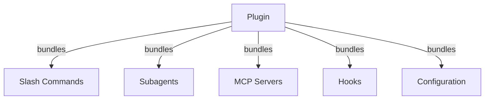
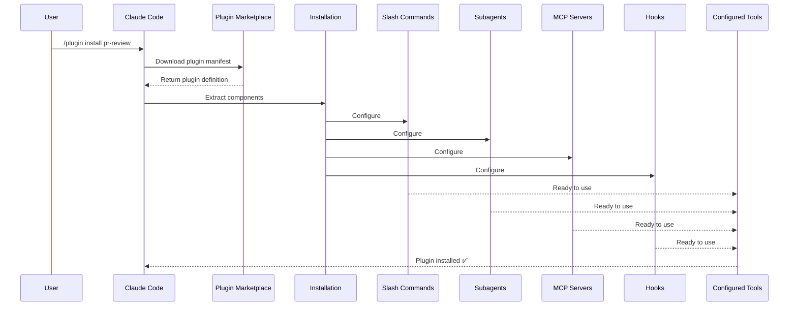
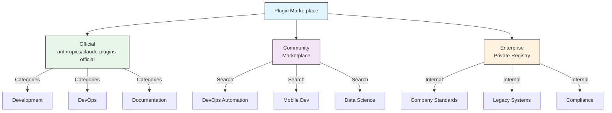
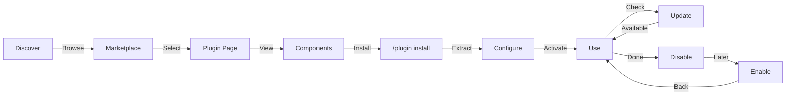
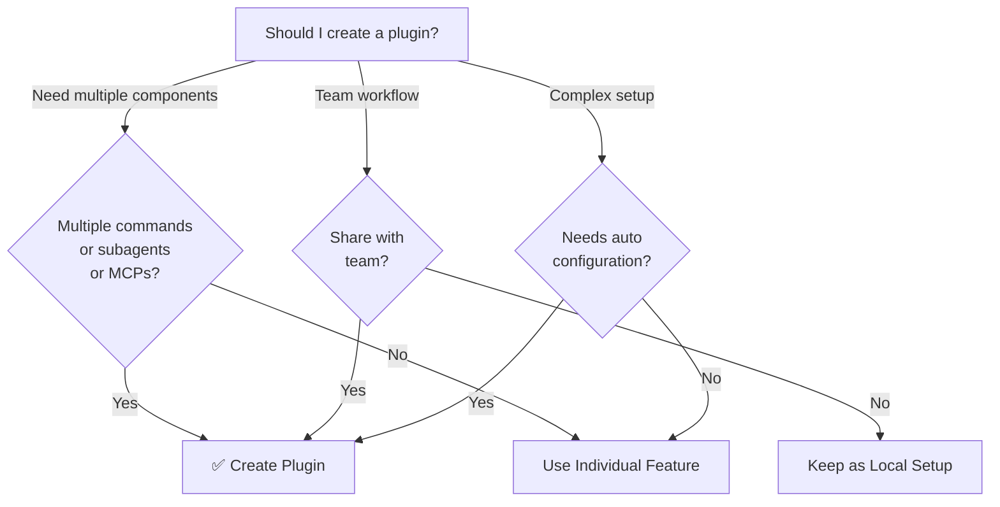

<picture>
  <source media="(prefers-color-scheme: dark)" srcset="../../resources/logos/claude-howto-logo-dark.svg">
  
</picture>

# Claude Code Plugins / Plugins Claude Code

Thư mục này chứa các ví dụ plugin hoàn chỉnh đóng gói nhiều tính năng Claude Code thành các gói có thể cài đặt liền mạch.

## Tổng Quan / Overview

Claude Code Plugins là các bộ sưu tập được đóng gói của các tùy chỉnh (slash commands, subagents, MCP servers, và hooks) cài đặt với một lệnh duy nhất. Chúng đại diện cho cơ chế mở rộng cấp cao nhất—kết hợp nhiều tính năng thành các gói gắn kết, có thể chia sẻ.

## Kiến Trúc Plugin / Plugin Architecture



## Quy Trình Tải Plugin / Plugin Loading Process



## Các Loại Plugin & Phân Phối / Plugin Types & Distribution

| Loại | Phạm Vi | Chia Sẻ | Quyền | Ví Dụ |
|------|-------|--------|-----------|----------|
| Chính Thức | Toàn cầu | Tất cả người dùng | Anthropic | PR Review, Security Guidance |
| Cộng Đồng | Công khai | Tất cả người dùng | Cộng Đồng | DevOps, Data Science |
| Tổ Chức | Nội bộ | Các thành viên nhóm | Công ty | Tiêu chuẩn nội bộ, công cụ |
| Cá Nhân | Cá nhân | Người dùng duy nhất | Nhà phát triển | Workflows tùy chỉnh |

## Cấu Trúc Định Nghĩa Plugin / Plugin Definition Structure

Plugin manifest sử dụng định dạng JSON trong `.claude-plugin/plugin.json`:

```json
{
  "name": "my-first-plugin",
  "description": "A greeting plugin",
  "version": "1.0.0",
  "author": {
    "name": "Your Name"
  },
  "homepage": "https://example.com",
  "repository": "https://github.com/user/repo",
  "license": "MIT"
}
```

## Ví Dụ Cấu Trúc Plugin / Plugin Structure Example

```
my-plugin/
├── .claude-plugin/
│   └── plugin.json       # Manifest (tên, mô tả, phiên bản, tác giả)
├── commands/             # Skills như các file Markdown
│   ├── task-1.md
│   ├── task-2.md
│   └── workflows/
├── agents/               # Định nghĩa agent tùy chỉnh
│   ├── specialist-1.md
│   ├── specialist-2.md
│   └── configs/
├── skills/               # Agent Skills với các file SKILL.md
│   ├── skill-1.md
│   └── skill-2.md
├── hooks/                # Event handlers trong hooks.json
│   └── hooks.json
├── .mcp.json             # Cấu hình MCP server
├── .lsp.json             # Cấu hình LSP server
├── settings.json         # Cài đặt mặc định
├── templates/
│   └── issue-template.md
├── scripts/
│   ├── helper-1.sh
│   └── helper-2.py
├── docs/
│   ├── README.md
│   └── USAGE.md
└── tests/
    └── plugin.test.js
```

### Cấu hình LSP server / LSP server configuration

Plugins có thể bao gồm hỗ trợ Language Server Protocol (LSP) để thông minh code thời gian thực. LSP servers cung cấp chẩn đoán, điều hướng code, và thông tin ký hiệu khi bạn làm việc.

**Vị trí cấu hình:**
- File `.lsp.json` trong thư mục gốc plugin
- Key `lsp` inline trong `plugin.json`

#### Tham khảo trường / Field reference

| Trường | Bắt Buộc | Mô Tả |
|-------|----------|-------------|
| `command` | Có | Binary LSP server (phải trong PATH) |
| `extensionToLanguage` | Có | Ánh xạ các phần mở rộng file đến ID ngôn ngữ |
| `args` | Không | Các đối số dòng lệnh cho server |
| `transport` | Không | Phương thức giao tiếp: `stdio` (mặc định) hoặc `socket` |
| `env` | Không | Biến môi trường cho tiến trình server |
| `initializationOptions` | Không | Các tùy chọn được gửi trong quá trình khởi tạo LSP |
| `settings` | Không | Cấu hình workspace được chuyển đến server |
| `workspaceFolder` | Không | Ghi đè đường dẫn thư mục workspace |
| `startupTimeout` | Không | Thời gian tối đa (ms) để chờ khởi động server |
| `shutdownTimeout` | Không | Thời gian tối đa (ms) để tắt graceful |
| `restartOnCrash` | Không | Tự động khởi động lại nếu server bị lỗi |
| `maxRestarts` | Không | Số lần khởi động lại tối đa trước khi bỏ cuộc |

#### Các cấu hình ví dụ / Example configurations

**Go (gopls):**

```json
{
  "go": {
    "command": "gopls",
    "args": ["serve"],
    "extensionToLanguage": {
      ".go": "go"
    }
  }
}
```

**Python (pyright):**

```json
{
  "python": {
    "command": "pyright-langserver",
    "args": ["--stdio"],
    "extensionToLanguage": {
      ".py": "python",
      ".pyi": "python"
    }
  }
}
```

**TypeScript:**

```json
{
  "typescript": {
    "command": "typescript-language-server",
    "args": ["--stdio"],
    "extensionToLanguage": {
      ".ts": "typescript",
      ".tsx": "typescriptreact",
      ".js": "javascript",
      ".jsx": "javascriptreact"
    }
  }
}
```

#### Các plugin LSP có sẵn / Available LSP plugins

Marketplace chính thức bao gồm các plugin LSP được cấu hình trước:

| Plugin | Ngôn Ngữ | Server Binary | Lệnh Cài Đặt |
|--------|----------|---------------|----------------|
| `pyright-lsp` | Python | `pyright-langserver` | `pip install pyright` |
| `typescript-lsp` | TypeScript/JavaScript | `typescript-language-server` | `npm install -g typescript-language-server typescript` |
| `rust-lsp` | Rust | `rust-analyzer` | Cài đặt qua `rustup component add rust-analyzer` |

#### Khả năng LSP / LSP capabilities

Khi được cấu hình, LSP servers cung cấp:

- **Chẩn đoán tức thì** — lỗi và cảnh báo xuất hiện ngay sau khi chỉnh sửa
- **Điều hướng code** — đi đến định nghĩa, tìm tham chiếu, implementations
- **Thông tin hover** — chữ ký kiểu và tài liệu khi hover
- **Liệt kê ký hiệu** — duyệt các ký hiệu trong file hoặc workspace hiện tại

## Tùy Chọn Plugin (v2.1.83+) / Plugin Options

Plugins có thể khai báo các tùy chọn có thể cấu hình bởi người dùng trong manifest qua `userConfig`. Các giá trị được đánh dấu `sensitive: true` được lưu trữ trong system keychain thay vì các file settings plain-text:

```json
{
  "name": "my-plugin",
  "version": "1.0.0",
  "userConfig": {
    "apiKey": {
      "description": "API key for the service",
      "sensitive": true
    },
    "region": {
      "description": "Deployment region",
      "default": "us-east-1"
    }
  }
}
```

## Dữ Liệu Plugin Liên Tục (`${CLAUDE_PLUGIN_DATA}`) (v2.1.78+)

Plugins có quyền truy cập đến một thư mục trạng thái liên tục qua biến môi trường `${CLAUDE_PLUGIN_DATA}`. Thư mục này là duy nhất cho mỗi plugin và tồn tại qua các phiên, làm cho nó phù hợp cho caches, databases, và các trạng thái liên tục khác:

```json
{
  "hooks": {
    "PostToolUse": [
      {
        "command": "node ${CLAUDE_PLUGIN_DATA}/track-usage.js"
      }
    ]
  }
}
```

Thư mục được tạo tự động khi plugin được cài đặt. Các file được lưu trữ ở đây tồn tại cho đến khi plugin được gỡ cài đặt.

## Plugin Inline qua Settings (`source: 'settings'`) (v2.1.80+)

Plugins có thể được định nghĩa inline trong các file settings như các mục marketplace sử dụng trường `source: 'settings'`. Điều này cho phép nhúng định nghĩa plugin trực tiếp mà không cần repository hoặc marketplace riêng:

```json
{
  "pluginMarketplaces": [
    {
      "name": "inline-tools",
      "source": "settings",
      "plugins": [
        {
          "name": "quick-lint",
          "source": "./local-plugins/quick-lint"
        }
      ]
    }
  ]
}
```

## Cài Đặt Plugin / Plugin Settings

Plugins có thể gửi một file `settings.json` để cung cấp cấu hình mặc định. Điều này hiện hỗ trợ key `agent`, thiết lập agent luồng chính cho plugin:

```json
{
  "agent": "agents/specialist-1.md"
}
```

Khi một plugin bao gồm `settings.json`, các mặc định của nó được áp dụng khi cài đặt. Người dùng có thể ghi đè các cài đặt này trong cấu hình project hoặc user của riêng họ.

## Cách Tiếp Cận Standalone vs Plugin / Standalone vs Plugin Approach

| Cách Tiếp Cận | Tên Lệnh | Cấu Hình | Tốt Nhất Cho |
|----------|---------------|---|---|
| **Standalone** | `/hello` | Thiết lập thủ công trong CLAUDE.md | Cá nhân, cụ thể project |
| **Plugins** | `/plugin-name:hello` | Tự động qua plugin.json | Chia sẻ, phân phối, sử dụng nhóm |

**Sử dụng slash commands standalone** cho workflows cá nhân nhanh. **Sử dụng plugins** khi bạn muốn đóng gói nhiều tính năng, chia sẻ với một nhóm, hoặc xuất bản để phân phối.

## Ví Dụ Thực Tiễn / Practical Examples

### Ví Dụ 1: Plugin PR Review / Example 1: PR Review Plugin

**File:** `.claude-plugin/plugin.json`

```json
{
  "name": "pr-review",
  "version": "1.0.0",
  "description": "Complete PR review workflow with security, testing, and docs",
  "author": {
    "name": "Anthropic"
  },
  "repository": "https://github.com/your-org/pr-review",
  "license": "MIT"
}
```

**File:** `commands/review-pr.md`

```markdown
---
name: Review PR
description: Start comprehensive PR review with security and testing checks
---

# PR Review

Lệnh này khởi tạo một pull request review hoàn chỉnh bao gồm:

1. Phân tích bảo mật
2. Xác minh phủ vùng test
3. Cập nhật tài liệu
4. Kiểm tra chất lượng code
5. Đánh giá tác động hiệu suất
```

**File:** `agents/security-reviewer.md`

```yaml
---
name: security-reviewer
description: Security-focused code review
tools: read, grep, diff
---

# Security Reviewer

Chuyên về việc tìm các lỗ hổng bảo mật:
- Vấn đề xác thực/ủy quyền
- Lộ dữ liệu
- Các tấn công tiêm nhiễm
- Cấu hình bảo mật
```

**Cài Đặt:**

```bash
/plugin install pr-review

# Result:
# ✅ 3 slash commands installed
# ✅ 3 subagents configured
# ✅ 2 MCP servers connected
# ✅ 4 hooks registered
# ✅ Ready to use!
```

### Ví Dụ 2: Plugin DevOps / Example 2: DevOps Plugin

**Các Thành Phần:**

```
devops-automation/
├── commands/
│   ├── deploy.md
│   ├── rollback.md
│   ├── status.md
│   └── incident.md
├── agents/
│   ├── deployment-specialist.md
│   ├── incident-commander.md
│   └── alert-analyzer.md
├── mcp/
│   ├── github-config.json
│   ├── kubernetes-config.json
│   └── prometheus-config.json
├── hooks/
│   ├── pre-deploy.js
│   ├── post-deploy.js
│   └── on-error.js
└── scripts/
    ├── deploy.sh
    ├── rollback.sh
    └── health-check.sh
```

### Ví Dụ 3: Plugin Tài Liệu / Example 3: Documentation Plugin

**Các Thành Phần Được Đóng Gói:**

```
documentation/
├── commands/
│   ├── generate-api-docs.md
│   ├── generate-readme.md
│   ├── sync-docs.md
│   └── validate-docs.md
├── agents/
│   ├── api-documenter.md
│   ├── code-commentator.md
│   └── example-generator.md
├── mcp/
│   ├── github-docs-config.json
│   └── slack-announce-config.json
└── templates/
    ├── api-endpoint.md
    ├── function-docs.md
    └── adr-template.md
```

## Marketplace Plugin / Plugin Marketplace

Thư mục plugin do Anthropic quản lý chính thức là `anthropics/claude-plugins-official`. Các quản trị viên enterprise cũng có thể tạo các plugin marketplaces riêng để phân phối nội bộ.



### Cấu Hình Marketplace / Marketplace Configuration

Người dùng enterprise và nâng cao có thể kiểm soát hành vi marketplace qua các cài đặt:

| Cài Đặt | Mô Tả |
|---------|-------------|
| `extraKnownMarketplaces` | Thêm các nguồn marketplace bổ sung ngoài mặc định |
| `strictKnownMarketplaces` | Kiểm soát marketplace nào người dùng được phép thêm |
| `deniedPlugins` | Blocklist do quản trị viên quản lý để ngăn cài đặt các plugin cụ thể |

### Các Tính Năng Marketplace Thêm / Additional Marketplace Features

- **Git timeout mặc định**: Tăng từ 30s lên 120s cho các repository plugin lớn
- **npm registries tùy chỉnh**: Plugins có thể chỉ định URLs registry npm tùy chỉnh để giải quyết dependency
- **Version pinning**: Khóa plugins đến các phiên bản cụ thể cho các môi trường có thể tái sản xuất

### Schema định nghĩa marketplace / Marketplace definition schema

Plugin marketplaces được định nghĩa trong `.claude-plugin/marketplace.json`:

```json
{
  "name": "my-team-plugins",
  "owner": "my-org",
  "plugins": [
    {
      "name": "code-standards",
      "source": "./plugins/code-standards",
      "description": "Enforce team coding standards",
      "version": "1.2.0",
      "author": "platform-team"
    },
    {
      "name": "deploy-helper",
      "source": {
        "source": "github",
        "repo": "my-org/deploy-helper",
        "ref": "v2.0.0"
      },
      "description": "Deployment automation workflows"
    }
  ]
}
```

| Trường | Bắt Buộc | Mô Tả |
|-------|----------|-------------|
| `name` | Có | Tên marketplace trong kebab-case |
| `owner` | Có | Tổ chức hoặc người dùng duy trì marketplace |
| `plugins` | Có | Mảng các mục plugin |
| `plugins[].name` | Có | Tên plugin (kebab-case) |
| `plugins[].source` | Có | Nguồn plugin (chuỗi đường dẫn hoặc object nguồn) |
| `plugins[].description` | Không | Mô tả plugin ngắn |
| `plugins[].version` | Không | Chuỗi phiên bản semantic |
| `plugins[].author` | Không | Tên tác giả plugin |

### Các loại nguồn plugin / Plugin source types

Plugins có thể được sourced từ nhiều vị trí:

| Nguồn | Cú Pháp | Ví Dụ |
|--------|--------|---------|
| **Đường dẫn tương đối** | Chuỗi đường dẫn | `"./plugins/my-plugin"` |
| **GitHub** | `{ "source": "github", "repo": "owner/repo" }` | `{ "source": "github", "repo": "acme/lint-plugin", "ref": "v1.0" }` |
| **Git URL** | `{ "source": "url", "url": "..." }` | `{ "source": "url", "url": "https://git.internal/plugin.git" }` |
| **Git subdirectory** | `{ "source": "git-subdir", "url": "...", "path": "..." }` | `{ "source": "git-subdir", "url": "https://github.com/org/monorepo.git", "path": "packages/plugin" }` |
| **npm** | `{ "source": "npm", "package": "..." }` | `{ "source": "npm", "package": "@acme/claude-plugin", "version": "^2.0" }` |
| **pip** | `{ "source": "pip", "package": "..." }` | `{ "source": "pip", "package": "claude-data-plugin", "version": ">=1.0" }` |

Các nguồn GitHub và git hỗ trợ các trường tùy chọn `ref` (nhánh/tag) và `sha` (hash commit) để version pinning.

### Các phương thức phân phối / Distribution methods

**GitHub (khuyến nghị):**
```bash
# Người dùng thêm marketplace của bạn
/plugin marketplace add owner/repo-name
```

**Các dịch vụ git khác** (yêu cầu URL đầy đủ):
```bash
/plugin marketplace add https://gitlab.com/org/marketplace-repo.git
```

**Repository riêng tư**: Được hỗ trợ qua các git credential helpers hoặc token môi trường. Người dùng phải có quyền truy cập đọc đến repository.

**Nộp marketplace chính thức**: Gửi plugins đến marketplace do Anthropic quản lý để phân phối rộng hơn.

### Chế độ nghiêm ngặt / Strict mode

Kiểm soát cách các định nghĩa marketplace tương tác với các file `plugin.json` cục bộ:

| Cài Đặt | Hành Vi |
|---------|----------|
| `strict: true` (mặc định) | `plugin.json` cục bộ là có thẩm quyền; mục marketplace bổ sung nó |
| `strict: false` | Mục marketplace là định nghĩa plugin hoàn chỉnh |

**Hạn chế tổ chức** với `strictKnownMarketplaces`:

| Giá Trị | Hiệu Ứng |
|-------|--------|
| Không được đặt | Không có hạn chế — người dùng có thể thêm bất kỳ marketplace nào |
| Mảng rỗng `[]` | Khóa — không cho phép marketplaces |
| Mảng các mẫu | Allowlist — chỉ các marketplaces khớp có thể được thêm |

```json
{
  "strictKnownMarketplaces": [
    "my-org/*",
    "github.com/trusted-vendor/*"
  ]
}
```

> **Cảnh Báo**: Trong chế độ nghiêm ngặt với `strictKnownMarketplaces`, người dùng chỉ có thể cài đặt plugins từ các marketplaces được allowlist. Điều này hữu ích cho các môi trường doanh nghiệp yêu cầu phân phối plugin được kiểm soát.

## Vòng Đời & Cài Đặt Plugin / Plugin Installation & Lifecycle



## So Sánh Tính Năng Plugin / Plugin Features Comparison

| Tính Năng | Slash Command | Skill | Subagent | Plugin |
|---------|---------------|-------|----------|--------|
| **Cài Đặt** | Copy thủ công | Copy thủ công | Cấu hình thủ công | Một lệnh |
| **Thời Gian Thiết Lập** | 5 phút | 10 phút | 15 phút | 2 phút |
| **Đóng Gói** | File đơn | File đơn | File đơn | Nhiều |
| **Phiên Bản Hóa** | Thủ công | Thủ công | Thủ công | Tự động |
| **Chia Sẻ Nhóm** | Copy file | Copy file | Copy file | Cài đặt ID |
| **Cập Nhật** | Thủ công | Thủ công | Thủ công | Tự động có sẵn |
| **Phụ Thuộc** | Không | Không | Không | Có thể bao gồm |
| **Marketplace** | Không | Không | Không | Có |
| **Phân Phối** | Repository | Repository | Repository | Marketplace |

## Các Lệnh CLI Plugin / Plugin CLI Commands

Tất cả các thao tác plugin có sẵn như các lệnh CLI:

```bash
claude plugin install <name>@<marketplace>   # Cài đặt từ marketplace
claude plugin uninstall <name>               # Gỡ bỏ plugin
claude plugin list                           # Liệt kê các plugin đã cài đặt
claude plugin enable <name>                  # Kích hoạt plugin đã bị vô hiệu hóa
claude plugin disable <name>                 # Vô hiệu hóa plugin
claude plugin validate                       # Xác thực cấu trúc plugin
```

## Các Phương Thức Cài Đặt / Installation Methods

### Từ Marketplace
```bash
/plugin install plugin-name
# hoặc từ CLI:
claude plugin install plugin-name@marketplace-name
```

### Kích Hoạt / Vô Hiệu Hóa (với phạm vi tự phát hiện)
```bash
/plugin enable plugin-name
/plugin disable plugin-name
```

### Plugin Cục Bộ (cho phát triển)
```bash
# Cờ CLI để test cục bộ (có thể lặp lại cho nhiều plugins)
claude --plugin-dir ./path/to/plugin
claude --plugin-dir ./plugin-a --plugin-dir ./plugin-b
```

### Từ Git Repository
```bash
/plugin install github:username/repo
```

## Khi Nào Tạo Một Plugin / When to Create a Plugin



### Các Trường Hợp Sử Dụng Plugin / Plugin Use Cases

| Trường Hợp Sử Dụng | Khuyến Nghị | Tại Sao |
|----------|-----------------|-----|
| **Team Onboarding** | ✅ Use Plugin | Thiết lập tức thì, tất cả cấu hình |
| **Framework Setup** | ✅ Use Plugin | Đóng gói các lệnh cụ thể framework |
| **Enterprise Standards** | ✅ Use Plugin | Phân phối trung tâm, kiểm soát phiên bản |
| **Quick Task Automation** | ❌ Use Command | Quá phức tạp |
| **Single Domain Expertise** | ❌ Use Skill | Quá nặng, sử dụng skill thay thế |
| **Specialized Analysis** | ❌ Use Subagent | Tạo thủ công hoặc sử dụng skill |
| **Live Data Access** | ❌ Use MCP | Standalone, đừng đóng gói |

## Testing Một Plugin / Testing a Plugin

Trước khi xuất bản, test plugin của bạn cục bộ sử dụng cờ CLI `--plugin-dir` (có thể lặp lại cho nhiều plugins):

```bash
claude --plugin-dir ./my-plugin
claude --plugin-dir ./my-plugin --plugin-dir ./another-plugin
```

Điều này khởi chạy Claude Code với plugin của bạn được tải, cho phép bạn:
- Xác minh tất cả các lệnh slash có sẵn
- Test subagents và agents hoạt động chính xác
- Xác nhận MCP servers kết nối đúng
- Xác thực thực thi hook
- Kiểm tra các cấu hình LSP server
- Kiểm tra các lỗi cấu hình

## Hot-Reload

Plugins hỗ trợ hot-reload trong quá trình phát triển. Khi bạn sửa đổi các file plugin, Claude Code có thể phát hiện các thay đổi tự động. Bạn cũng có thể force reload với:

```bash
/reload-plugins
```

Điều này đọc lại tất cả các plugin manifests, commands, agents, skills, hooks, và cấu hình MCP/LSP mà không cần khởi động lại phiên.

## Cài Đặt Được Quản Lý Cho Plugins / Managed Settings for Plugins

Các quản trị viên có thể kiểm soát hành vi plugin trên một tổ chức sử dụng các cài đặt được quản lý:

| Cài Đặt | Mô Tả |
|---------|-------------|
| `enabledPlugins` | Allowlist của các plugin được kích hoạt theo mặc định |
| `deniedPlugins` | Blocklist của các plugin không thể được cài đặt |
| `extraKnownMarketplaces` | Thêm các nguồn marketplace bổ sung ngoài mặc định |
| `strictKnownMarketplaces` | Hạn chế marketplace nào người dùng được phép thêm |
| `allowedChannelPlugins` | Kiểm soát plugins nào được phép theo kênh phát hành |

Các cài đặt này có thể được áp dụng ở cấp tổ chức qua các file cấu hình được quản lý và có ưu tiên hơn các cài đặt cấp người dùng.

## Bảo Mật Plugin / Plugin Security

Các subagent plugin chạy trong một sandbox bị hạn chế. Các key frontmatter sau **không được phép** trong định nghĩa subagent plugin:

- `hooks` -- Subagents không thể đăng ký event handlers
- `mcpServers` -- Subagents không thể cấu hình MCP servers
- `permissionMode` -- Subagents không thể ghi đè mô hình quyền

Điều này đảm bảo rằng plugins không thể leo thang đặc quyền hoặc sửa đổi môi trường host vượt quá phạm vi được khai báo của chúng.

## Xuất Bản Một Plugin / Publishing a Plugin

**Các bước để xuất bản:**

1. Tạo cấu trúc plugin với tất cả các thành phần
2. Viết manifest `.claude-plugin/plugin.json`
3. Tạo `README.md` với tài liệu
4. Test cục bộ với `claude --plugin-dir ./my-plugin`
5. Gửi đến plugin marketplace
6. Được review và phê duyệt
7. Xuất bản trên marketplace
8. Người dùng có thể cài đặt với một lệnh

**Ví dụ gửi:**

```markdown
# PR Review Plugin

## Mô Tả
Workflow PR review hoàn chỉnh với các kiểm tra bảo mật, testing, và tài liệu.

## Những Gì Được Bao Gồm
- 3 lệnh slash cho các loại review khác nhau
- 3 subagents chuyên biệt
- Tích hợp GitHub và CodeQL MCP
- Các hooks quét bảo mật tự động

## Cài Đặt
```bash
/plugin install pr-review
```

## Tính Năng
✅ Phân tích bảo mật
✅ Kiểm tra phủ vùng test
✅ Xác minh tài liệu
✅ Đánh giá chất lượng code
✅ Phân tích tác động hiệu suất

## Sử Dụng
```bash
/review-pr
/check-security
/check-tests
```

## Yêu Cầu
- Claude Code 1.0+
- Truy cập GitHub
- CodeQL (tùy chọn)
```

## Plugin vs Cấu Hình Thủ Công / Plugin vs Manual Configuration

**Thiết Lập Thủ Công (2+ giờ):**
- Cài đặt các lệnh slash từng cái một
- Tạo subagents riêng lẻ
- Cấu hình MCPs riêng biệt
- Thiết lập hooks thủ công
- Tài liệu hóa mọi thứ
- Chia sẻ với nhóm (hy vọng họ cấu hình đúng)

**Với Plugin (2 phút):**
```bash
/plugin install pr-review
# ✅ Mọi thứ được cài đặt và cấu hình
# ✅ Sẵn sàng sử dụng ngay lập tức
# ✅ Nhóm có thể tái sản xuất thiết lập chính xác
```

## Thực Hành Tốt Nhất / Best Practices

### Nên Làm ✅ / Do's ✅
- Sử dụng tên plugin rõ ràng, mô tả
- Bao gồm README toàn diện
- Phiên bản hóa plugin của bạn đúng cách (semver)
- Test tất cả các thành phần cùng nhau
- Tài liệu hóa các yêu cầu rõ ràng
- Cung cấp các ví dụ sử dụng
- Bao gồm xử lý lỗi
- Gắn thẻ phù hợp để khám phá
- Duy trì tương thích ngược
- Giữ các plugin tập trung và gắn kết
- Bao gồm các tests toàn diện
- Tài liệu hóa tất cả các dependencies

### Không Nên Làm ❌ / Don'ts ❌
- Đừng đóng gói các tính năng không liên quan
- Đừng hardcode credentials
- Đừng bỏ qua testing
- Đừng quên tài liệu
- Đừng tạo các plugin dư thừa
- Đừng bỏ qua versioning
- Đừng làm phức tạp quá mức các dependencies thành phần
- Đừng quên xử lý các lỗi một cách graceful

## Hướng Dẫn Cài Đặt / Installation Instructions

### Cài Đặt Từ Marketplace

1. **Duyệt các plugins có sẵn:**
   ```bash
   /plugin list
   ```

2. **Xem chi tiết plugin:**
   ```bash
   /plugin info plugin-name
   ```

3. **Cài đặt một plugin:**
   ```bash
   /plugin install plugin-name
   ```

### Cài Đặt Từ Đường Dẫn Cục Bộ

```bash
/plugin install ./path/to/plugin-directory
```

### Cài Đặt Từ GitHub

```bash
/plugin install github:username/repo
```

### Liệt Kê Các Plugins Đã Cài Đặt

```bash
/plugin list --installed
```

### Cập Nhật Một Plugin

```bash
/plugin update plugin-name
```

### Vô Hiệu Hóa/Kích Hoạt Một Plugin

```bash
# Vô hiệu hóa tạm thời
/plugin disable plugin-name

# Kích hoạt lại
/plugin enable plugin-name
```

### Gỡ Cài Đặt Một Plugin

```bash
/plugin uninstall plugin-name
```

## Các Khái Niệm Liên Quan / Related Concepts

Các tính năng Claude Code sau hoạt động cùng với plugins:

- **[Slash Commands](../01-slash-commands/)** - Các lệnh riêng lẻ được đóng gói trong plugins
- **[Memory](../02-memory/)** - Ngữ cảnh liên tục cho plugins
- **[Skills](../03-skills/)** - Chuyên môn lĩnh vực có thể được bọc trong plugins
- **[Subagents](../04-subagents/)** - Các agents chuyên biệt được bao gồm như các thành phần plugin
- **[MCP Servers](../05-mcp/)** - Các tích hợp Model Context Protocol được đóng gói trong plugins
- **[Hooks](../06-hooks/)** - Event handlers kích hoạt workflows plugin

## Workflow Ví Dụ Hoàn Chỉnh / Complete Example Workflow

### Workflow Plugin PR Review Đầy Đủ / PR Review Plugin Full Workflow

```
1. User: /review-pr

2. Plugin executes:
   ├── pre-review.js hook validates git repo
   ├── GitHub MCP fetches PR data
   ├── security-reviewer subagent analyzes security
   ├── test-checker subagent verifies coverage
   └── performance-analyzer subagent checks performance

3. Results synthesized and presented:
   ✅ Security: No critical issues
   ⚠️  Testing: Coverage 65% (recommend 80%+)
   ✅ Performance: No significant impact
   📝 12 recommendations provided
```

## Xử Lý Sự Cố / Troubleshooting

### Plugin Won't Install
- Kiểm tra tính tương thích phiên bản Claude Code: `/version`
- Xác minh cú pháp `plugin.json` với một trình xác thực JSON
- Kiểm tra kết nối internet (cho plugins từ xa)
- Review quyền: `ls -la plugin/`

### Components Not Loading
- Xác minh các đường dẫn trong `plugin.json` khớp với cấu trúc thư mục thực tế
- Kiểm tra quyền file: `chmod +x scripts/`
- Review cú pháp file thành phần
- Kiểm tra logs: `/plugin debug plugin-name`

### MCP Connection Failed
- Xác minh các biến môi trường được đặt đúng
- Kiểm tra cài đặt và sức khỏe MCP server
- Test kết nối MCP độc lập với `/mcp test`
- Review cấu hình MCP trong thư mục `mcp/`

### Commands Not Available After Install
- Đảm bảo plugin được cài đặt thành công: `/plugin list --installed`
- Kiểm tra nếu plugin được kích hoạt: `/plugin status plugin-name`
- Khởi động lại Claude Code: `exit` và mở lại
- Kiểm tra xung đột đặt tên với các lệnh hiện có

### Hook Execution Issues
- Xác minh các file hook có các quyền đúng
- Kiểm tra cú pháp hook và tên sự kiện
- Review logs hook để biết chi tiết lỗi
- Test hooks thủ công nếu có thể

## Tài Nguyên Thêm / Additional Resources

- [Tài Liệu Plugins Chính Thức](https://code.claude.com/docs/en/plugins)
- [Khám Phá Plugins](https://code.claude.com/docs/en/discover-plugins)
- [Plugin Marketplaces](https://code.claude.com/docs/en/plugin-marketplaces)
- [Plugins Reference](https://code.claude.com/docs/en/plugins-reference)
- [MCP Server Reference](https://modelcontextprotocol.io/)
- [Hướng Dẫn Cấu Hình Subagent](../04-subagents/README.md)
- [Hệ Thống Hook Reference](../06-hooks/README.md)

---

**Cập Nhật Lần Cuối**: Tháng 4 năm 2026
**Phiên Bản Claude Code**: 2.1+
**Các Mô Hình Tương Thích**: Claude Sonnet 4.6, Claude Opus 4.6, Claude Haiku 4.5
