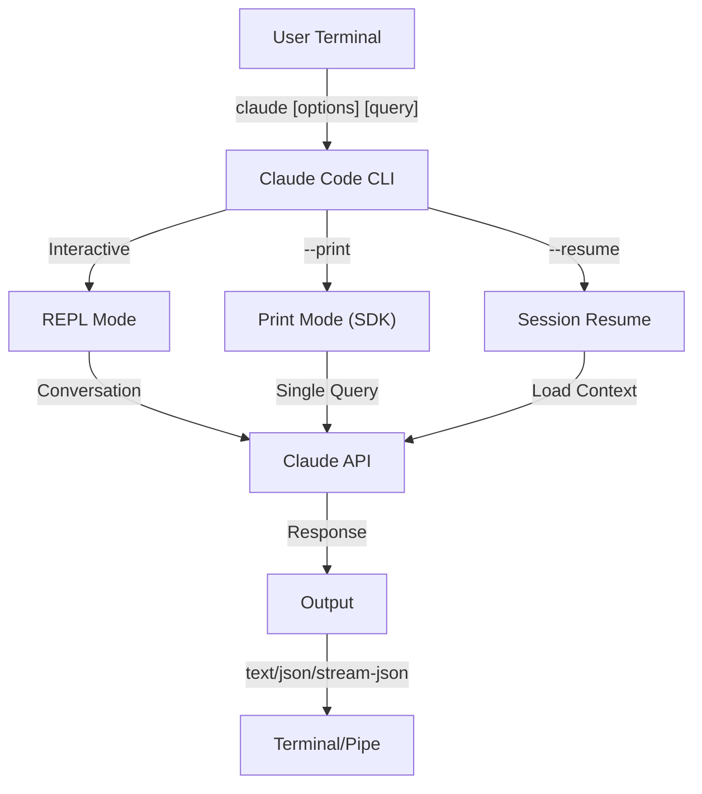
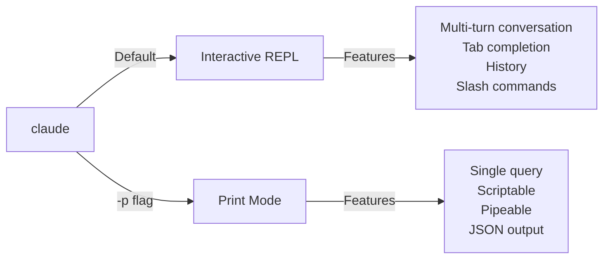

<picture>
  <source media="(prefers-color-scheme: dark)" srcset="../../resources/logos/claude-howto-logo-dark.svg">
  
</picture>

# Tham Chiếu CLI / CLI Reference

## Tổng Quan / Overview

CLI Claude Code (Command Line Interface) là cách chính để tương tác với Claude Code. Nó cung cấp các tùy chọn mạnh mẽ để chạy các truy vấn, quản lý sessions, cấu hình mô hình, và tích hợp Claude vào workflows phát triển của bạn.

## Kiến Trúc / Architecture



## Các Lệnh CLI / CLI Commands

| Lệnh | Mô Tả | Ví Dụ |
|---------|-------------|---------|
| `claude` | Bắt đầu REPL tương tác | `claude` |
| `claude "query"` | Bắt đầu REPL với prompt ban đầu | `claude "explain this project"` |
| `claude -p "query"` | Chế độ in - query sau đó thoát | `claude -p "explain this function"` |
| `cat file \| claude -p "query"` | Xử lý nội dung được pipe | `cat logs.txt \| claude -p "explain"` |
| `claude -c` | Tiếp tục hội thoại gần đây nhất | `claude -c` |
| `claude -c -p "query"` | Tiếp tục trong chế độ in | `claude -c -p "check for type errors"` |
| `claude -r "<session>" "query"` | Resume session theo ID hoặc tên | `claude -r "auth-refactor" "finish this PR"` |
| `claude update` | Cập nhật đến phiên bản mới nhất | `claude update` |
| `claude mcp` | Cấu hình MCP servers | Xem [Tài liệu MCP](../05-mcp/) |
| `claude mcp serve` | Chạy Claude Code như một MCP server | `claude mcp serve` |
| `claude agents` | Liệt kê tất cả các subagents được cấu hình | `claude agents` |
| `claude auto-mode defaults` | In các quy tắc mặc định chế độ tự động như JSON | `claude auto-mode defaults` |
| `claude remote-control` | Bắt đầu server Remote Control | `claude remote-control` |
| `claude plugin` | Quản lý plugins (cài đặt, kích hoạt, vô hiệu hóa) | `claude plugin install my-plugin` |
| `claude auth login` | Đăng nhập (hỗ trợ `--email`, `--sso`) | `claude auth login --email user@example.com` |
| `claude auth logout` | Đăng xuất khỏi tài khoản hiện tại | `claude auth logout` |
| `claude auth status` | Kiểm tra trạng thái auth (exit 0 nếu đã đăng nhập, 1 nếu chưa) | `claude auth status` |

## Các Cờ Chính / Core Flags

| Cờ | Mô Tả | Ví Dụ |
|------|-------------|---------|
| `-p, --print` | In phản hồi mà không có chế độ tương tác | `claude -p "query"` |
| `-c, --continue` | Tải hội thoại gần đây nhất | `claude --continue` |
| `-r, --resume` | Resume session cụ thể theo ID hoặc tên | `claude --resume auth-refactor` |
| `-v, --version` | In số phiên bản | `claude -v` |
| `-w, --worktree` | Bắt đầu trong git worktree cô lập | `claude -w` |
| `-n, --name` | Tên hiển thị session | `claude -n "auth-refactor"` |
| `--from-pr <number>` | Resume sessions được liên kết đến GitHub PR | `claude --from-pr 42` |
| `--remote "task"` | Tạo session web trên claude.ai | `claude --remote "implement API"` |
| `--remote-control, --rc` | Session tương tác với Remote Control | `claude --rc` |
| `--teleport` | Resume session web cục bộ | `claude --teleport` |
| `--teammate-mode` | Chế độ hiển thị agent team | `claude --teammate-mode tmux` |
| `--bare` | Chế độ tối thiểu (bỏ qua hooks, skills, plugins, MCP, auto memory, CLAUDE.md) | `claude --bare` |
| `--enable-auto-mode` | Mở khóa chế độ quyền tự động | `claude --enable-auto-mode` |
| `--channels` | Đăng ký các plugin kênh MCP | `claude --channels discord,telegram` |
| `--chrome` / `--no-chrome` | Bật/tắt tích hợp trình duyệt Chrome | `claude --chrome` |
| `--effort` | Đặt mức độ suy nghĩ | `claude --effort high` |
| `--init` / `--init-only` | Chạy các hooks khởi tạo | `claude --init` |
| `--maintenance` | Chạy các hooks bảo trì và thoát | `claude --maintenance` |
| `--disable-slash-commands` | Vô hiệu hóa tất cả skills và lệnh slash | `claude --disable-slash-commands` |
| `--no-session-persistence` | Vô hiệu hóa lưu session (chế độ in) | `claude -p --no-session-persistence "query"` |

### Tương Tác vs Chế Độ In / Interactive vs Print Mode



**Chế Độ Tương Tác** (mặc định):
```bash
# Bắt đầu session tương tác
claude

# Bắt đầu với prompt ban đầu
claude "explain the authentication flow"
```

**Chế Độ In** (không tương tác):
```bash
# Query đơn, sau đó thoát
claude -p "what does this function do?"

# Xử lý nội dung file
cat error.log | claude -p "explain this error"

# Chuỗi với các công cụ khác
claude -p "list todos" | grep "URGENT"
```

## Mô Hình & Cấu Hình / Model & Configuration

| Cờ | Mô Tả | Ví Dụ |
|------|-------------|---------|
| `--model` | Đặt mô hình (sonnet, opus, haiku, hoặc tên đầy đủ) | `claude --model opus` |
| `--fallback-model` | Fallback mô hình tự động khi quá tải | `claude -p --fallback-model sonnet "query"` |
| `--agent` | Chỉ định agent cho session | `claude --agent my-custom-agent` |
| `--agents` | Định nghĩa subagents tùy chỉnh qua JSON | Xem [Tác Nhân Con](../04-subagents/) |
| `--effort` | Đặt mức độ effort (low, medium, high, max) | `claude --effort high` |

### Ví Dụ Chọn Mô Hình / Model Selection Examples

```bash
# Sử dụng Opus 4.6 cho các tác vụ phức tạp
claude --model opus "design a caching strategy"

# Sử dụng Haiku 4.5 cho các tác vụ nhanh
claude --model haiku -p "format this JSON"

# Tên mô hình đầy đủ
claude --model claude-sonnet-4-6-20250929 "review this code"

# Với fallback để đảm bảo độ tin cậy
claude -p --model opus --fallback-model sonnet "analyze architecture"

# Sử dụng opusplan (Opus plans, Sonnet executes)
claude --model opusplan "design and implement the caching layer"
```

## Tùy Chỉnh System Prompt / System Prompt Customization

| Cờ | Mô Tả | Ví Dụ |
|------|-------------|---------|
| `--system-prompt` | Thay thế toàn bộ prompt mặc định | `claude --system-prompt "You are a Python expert"` |
| `--system-prompt-file` | Tải prompt từ file (chế độ in) | `claude -p --system-prompt-file ./prompt.txt "query"` |
| `--append-system-prompt` | Append vào prompt mặc định | `claude --append-system-prompt "Always use TypeScript"` |

### Ví Dụ System Prompt / System Prompt Examples

```bash
# Complete custom persona
claude --system-prompt "You are a senior security engineer. Focus on vulnerabilities."

# Append specific instructions
claude --append-system-prompt "Always include unit tests with code examples"

# Load complex prompt from file
claude -p --system-prompt-file ./prompts/code-reviewer.txt "review main.py"
```

### So Sánh Các Cờ System Prompt / System Prompt Flags Comparison

| Cờ | Hành Vi | Interactive | Print |
|------|----------|-------------|-------|
| `--system-prompt` | Thay thế toàn bộ system prompt | ✅ | ✅ |
| `--system-prompt-file` | Thay thế bằng prompt từ file | ❌ | ✅ |
| `--append-system-prompt` | Thêm vào system prompt mặc định | ✅ | ✅ |

**Chỉ sử dụng `--system-prompt-file` trong chế độ in. Trong chế độ tương tác, sử dụng `--system-prompt` hoặc `--append-system-prompt`.**

## Công Cụ & Quản Lý Quyền / Tool & Permission Management

| Cờ | Mô Tả | Ví Dụ |
|------|-------------|---------|
| `--tools` | Hạn chế các công cụ có sẵn | `claude -p --tools "Bash,Edit,Read" "query"` |
| `--allowedTools` | Các công cụ thực thi mà không cần prompt | `"Bash(git log:*)" "Read"` |
| `--disallowedTools` | Các công cụ bị xóa khỏi ngữ cảnh | `"Bash(rm:*)" "Edit"` |
| `--dangerously-skip-permissions` | Bỏ qua tất cả các prompt quyền | `claude --dangerously-skip-permissions` |
| `--permission-mode` | Bắt đầu trong chế độ quyền được chỉ định | `claude --permission-mode auto` |
| `--permission-prompt-tool` | Công cụ MCP để xử lý quyền | `claude -p --permission-prompt-tool mcp_auth "query"` |
| `--enable-auto-mode` | Mở khóa chế độ quyền tự động | `claude --enable-auto-mode` |

### Ví Dụ Quyền / Permission Examples

```bash
# Chế độ read-only để review code
claude --permission-mode plan "review this codebase"

# Hạn chế đến các công cụ an toàn chỉ
claude --tools "Read,Grep,Glob" -p "find all TODO comments"

# Cho phép các lệnh git cụ thể mà không cần prompts
claude --allowedTools "Bash(git status:*)" "Bash(git log:*)"

# Chặn các thao tác nguy hiểm
claude --disallowedTools "Bash(rm -rf:*)" "Bash(git push --force:*)"
```

## Đầu Ra & Định Dạng / Output & Format

| Cờ | Mô Tả | Tùy Chọn | Ví Dụ |
|------|-------------|---------|---------|
| `--output-format` | Chỉ định định dạng đầu ra (chế độ in) | `text`, `json`, `stream-json` | `claude -p --output-format json "query"` |
| `--input-format` | Chỉ định định dạng đầu vào (chế độ in) | `text`, `stream-json` | `claude -p --input-format stream-json` |
| `--verbose` | Bật ghi nhật chi tiết | | `claude --verbose` |
| `--include-partial-messages` | Bao gồm các sự kiện streaming | Yêu cầu `stream-json` | `claude -p --output-format stream-json --include-partial-messages "query"` |
| `--json-schema` | Nhận JSON được validate theo schema | | `claude -p --json-schema '{"type":"object"}' "query"` |
| `--max-budget-usd` | Giới hạn chi phí tối đa cho chế độ in | | `claude -p --max-budget-usd 5.00 "query"` |

### Ví Dụ Định Dạng Đầu Ra / Output Format Examples

```bash
# Plain text (mặc định)
claude -p "explain this code"

# JSON cho sử dụng lập trình
claude -p --output-format json "list all functions in main.py"

# Streaming JSON để xử lý real-time
claude -p --output-format stream-json "generate a long report"

# Structured output với schema validation
claude -p --json-schema '{"type":"object","properties":{"bugs":{"type":"array"}}}' \
  "find bugs in this code and return as JSON"
```

## Workspace & Thư Mục / Workspace & Directory

| Cờ | Mô Tả | Ví Dụ |
|------|-------------|---------|
| `--add-dir` | Thêm thư mục làm việc bổ sung | `claude --add-dir ../apps ../lib` |
| `--setting-sources` | Nguồn cài đặt phân cách bằng dấu phẩy | `claude --setting-sources user,project` |
| `--settings` | Tải cài đặt từ file hoặc JSON | `claude --settings ./settings.json` |
| `--plugin-dir` | Tải plugins từ thư mục (có thể lặp lại) | `claude --plugin-dir ./my-plugin` |

### Ví Dụ Đa Thư Mục / Multi-Directory Example

```bash
# Làm việc trên nhiều thư mục project
claude --add-dir ../frontend ../backend ../shared "find all API endpoints"

# Tải custom settings
claude --settings '{"model":"opus","verbose":true}' "complex task"
```

## Cấu Hình MCP / MCP Configuration

| Cờ | Mô Tả | Ví Dụ |
|------|-------------|---------|
| `--mcp-config` | Tải MCP servers từ JSON | `claude --mcp-config ./mcp.json` |
| `--strict-mcp-config` | Chỉ sử dụng MCP config được chỉ định | `claude --strict-mcp-config --mcp-config ./mcp.json` |
| `--channels` | Đăng ký các plugin kênh MCP | `claude --channels discord,telegram` |

### Ví Dụ MCP / MCP Examples

```bash
# Tải GitHub MCP server
claude --mcp-config ./github-mcp.json "list open PRs"

# Strict mode - chỉ servers được chỉ định
claude --strict-mcp-config --mcp-config ./production-mcp.json "deploy to staging"
```

## Quản Lý Session / Session Management

| Cờ | Mô Tả | Ví Dụ |
|------|-------------|---------|
| `--session-id` | Sử dụng session ID cụ thể (UUID) | `claude --session-id "550e8400-..."` |
| `--fork-session` | Tạo session mới khi resume | `claude --resume abc123 --fork-session` |

### Ví Dụ Session / Session Examples

```bash
# Tiếp tục hội thoại cuối
claude -c

# Resume named session
claude -r "feature-auth" "continue implementing login"

# Fork session để thử nghiệm
claude --resume feature-auth --fork-session "try alternative approach"

# Sử dụng specific session ID
claude --session-id "550e8400-e29b-41d4-a716-446655440000" "continue"
```

### Session Fork

Tạo một nhánh từ session hiện có để thử nghiệm:

```bash
# Fork một session để thử cách tiếp cận khác
claude --resume abc123 --fork-session "try alternative implementation"

# Fork với custom message
claude -r "feature-auth" --fork-session "test with different architecture"
```

**Trường Hợp Sử Dụng:**
- Thử các implementation khác mà không mất session gốc
- Thử nghiệm với các cách tiếp cận khác nhau song song
- Tạo các nhánh từ công việc thành công cho các biến thể
- Test các thay đổi breaking mà không ảnh hưởng đến main session

Session gốc vẫn không thay đổi, và fork trở thành một session độc lập mới.

## Tính Năng Nâng Cao / Advanced Features

| Cờ | Mô Tả | Ví Dụ |
|------|-------------|---------|
| `--chrome` | Bật tích hợp trình duyệt Chrome | `claude --chrome` |
| `--no-chrome` | Tắt tích hợp trình duyệt Chrome | `claude --no-chrome` |
| `--ide` | Tự động kết nối đến IDE nếu có | `claude --ide` |
| `--max-turns` | Giới hạn agentic turns (non-interactive) | `claude -p --max-turns 3 "query"` |
| `--debug` | Bật debug mode với filtering | `claude --debug "api,mcp"` |
| `--enable-lsp-logging` | Bật verbose LSP logging | `claude --enable-lsp-logging` |
| `--betas` | Beta headers cho API requests | `claude --betas interleaved-thinking` |
| `--plugin-dir` | Tải plugins từ thư mục (có thể lặp lại) | `claude --plugin-dir ./my-plugin` |
| `--enable-auto-mode` | Mở khóa chế độ quyền tự động | `claude --enable-auto-mode` |
| `--effort` | Đặt mức độ suy nghĩ | `claude --effort high` |
| `--bare` | Chế độ tối thiểu (bỏ qua hooks, skills, plugins, MCP, auto memory, CLAUDE.md) | `claude --bare` |
| `--channels` | Đăng ký các plugin kênh MCP | `claude --channels discord` |
| `--tmux` | Tạo tmux session cho worktree | `claude --tmux` |
| `--fork-session` | Tạo session ID mới khi resume | `claude --resume abc --fork-session` |
| `--max-budget-usd` | Chi phí tối đa (chế độ in) | `claude -p --max-budget-usd 5.00 "query"` |
| `--json-schema` | Validate JSON output | `claude -p --json-schema '{"type":"object"}' "q"` |

### Ví Dụ Nâng Cao / Advanced Examples

```bash
# Giới hạn autonomous actions
claude -p --max-turns 5 "refactor this module"

# Debug API calls
claude --debug "api" "test query"

# Bật IDE integration
claude --ide "help me with this file"
```

## Cấu Hình Agents / Agents Configuration

Cờ `--agents` chấp nhận một JSON object định nghĩa custom subagents cho một session.

### Agents JSON Format

```json
{
  "agent-name": {
    "description": "Required: when to invoke this agent",
    "prompt": "Required: system prompt for the agent",
    "tools": ["Optional", "array", "of", "tools"],
    "model": "optional: sonnet|opus|haiku"
  }
}
```

**Các Trường Bắt Buộc:**
- `description` - Mô tả tự nhiên khi nào sử dụng agent này
- `prompt` - System prompt định nghĩa role và hành vi của agent

**Các Trường Tùy Chọn:**
- `tools` - Array của available tools (kế thừa tất cả nếu omit)
  - Format: `["Read", "Grep", "Glob", "Bash"]`
- `model` - Model sử dụng: `sonnet`, `opus`, hoặc `haiku`

### Complete Agents Example

```json
{
  "code-reviewer": {
    "description": "Expert code reviewer. Use proactively after code changes.",
    "prompt": "You are a senior code reviewer. Focus on code quality, security, and best practices.",
    "tools": ["Read", "Grep", "Glob", "Bash"],
    "model": "sonnet"
  },
  "debugger": {
    "description": "Debugging specialist for errors and test failures.",
    "prompt": "You are an expert debugger. Analyze errors, identify root causes, and provide fixes.",
    "tools": ["Read", "Edit", "Bash", "Grep"],
    "model": "opus"
  },
  "documenter": {
    "description": "Documentation specialist for generating guides.",
    "prompt": "You are a technical writer. Create clear, comprehensive documentation.",
    "tools": ["Read", "Write"],
    "model": "haiku"
  }
}
```

### Ví Dụ Lệnh Agents / Agents Command Examples

```bash
# Define custom agents inline
claude --agents '{
  "security-auditor": {
    "description": "Security specialist for vulnerability analysis",
    "prompt": "You are a security expert. Find vulnerabilities and suggest fixes.",
    "tools": ["Read", "Grep", "Glob"],
    "model": "opus"
  }
}' "audit this codebase for security issues"

# Load agents from file
claude --agents "$(cat ~/.claude/agents.json)" "review the auth module"

# Combine with other flags
claude -p --agents "$(cat agents.json)" --model sonnet "analyze performance"
```

### Agent Priority

Khi nhiều agent definitions tồn tại, chúng được load theo thứ tự ưu tiên này:
1. **CLI-defined** (`--agents` flag) - Session-specific
2. **User-level** (`~/.claude/agents/`) - All projects
3. **Project-level** (`.claude/agents/`) - Current project

CLI-defined agents override cả user và project agents cho session.

---

## Các Trường Hợp Sử Dụng Giá Trị Cao / High-Value Use Cases

### 1. Tích Hợp CI/CD

Sử dụng Claude Code trong CI/CD pipelines để tự động review code, testing, và documentation.

**GitHub Actions Example:**

```yaml
name: AI Code Review

on: [pull_request]

jobs:
  review:
    runs-on: ubuntu-latest
    steps:
      - uses: actions/checkout@v4

      - name: Install Claude Code
        run: npm install -g @anthropic-ai/claude-code

      - name: Run Code Review
        env:
          ANTHROPIC_API_KEY: ${{ secrets.ANTHROPIC_API_KEY }}
        run: |
          claude -p --output-format json \
            --max-turns 1 \
            "Review the changes in this PR for:
            - Security vulnerabilities
            - Performance issues
            - Code quality
            Output as JSON with 'issues' array" > review.json

      - name: Post Review Comment
        uses: actions/github-script@v7
        with:
          script: |
            const fs = require('fs');
            const review = JSON.parse(fs.readFileSync('review.json', 'utf8'));
            // Process and post review comments
```

**Jenkins Pipeline:**

```groovy
pipeline {
    agent any
    stages {
        stage('AI Review') {
            steps {
                sh '''
                    claude -p --output-format json \
                      --max-turns 3 \
                      "Analyze test coverage and suggest missing tests" \
                      > coverage-analysis.json
                '''
            }
        }
    }
}
```

### 2. Script Piping

Xử lý files, logs, và data thông qua Claude để phân tích.

**Phân Tích Log:**

```bash
# Analyze error logs
tail -1000 /var/log/app/error.log | claude -p "summarize these errors and suggest fixes"

# Find patterns in access logs
cat access.log | claude -p "identify suspicious access patterns"

# Analyze git history
git log --oneline -50 | claude -p "summarize recent development activity"
```

**Xử Lý Code:**

```bash
# Review a specific file
cat src/auth.ts | claude -p "review this authentication code for security issues"

# Generate documentation
cat src/api/*.ts | claude -p "generate API documentation in markdown"

# Find TODOs and prioritize
grep -r "TODO" src/ | claude -p "prioritize these TODOs by importance"
```

### 3. Multi-Session Workflows

Quản lý các project phức tạp với nhiều conversation threads.

```bash
# Start a feature branch session
claude -r "feature-auth" "let's implement user authentication"

# Later, continue the session
claude -r "feature-auth" "add password reset functionality"

# Fork to try an alternative approach
claude --resume feature-auth --fork-session "try OAuth instead"

# Switch between different feature sessions
claude -r "feature-payments" "continue with Stripe integration"
```

### 4. Custom Agent Configuration

Định nghĩa specialized agents cho workflows của team bạn.

```bash
# Save agents config to file
cat > ~/.claude/agents.json << 'EOF'
{
  "reviewer": {
    "description": "Code reviewer for PR reviews",
    "prompt": "Review code for quality, security, and maintainability.",
    "model": "opus"
  },
  "documenter": {
    "description": "Documentation specialist",
    "prompt": "Generate clear, comprehensive documentation.",
    "model": "sonnet"
  },
  "refactorer": {
    "description": "Code refactoring expert",
    "prompt": "Suggest and implement clean code refactoring.",
    "tools": ["Read", "Edit", "Glob"]
  }
}
EOF

# Use agents in session
claude --agents "$(cat ~/.claude/agents.json)" "review the auth module"
```

### 5. Batch Processing

Xử lý nhiều queries với settings nhất quán.

```bash
# Process multiple files
for file in src/*.ts; do
  echo "Processing $file..."
  claude -p --model haiku "summarize this file: $(cat $file)" >> summaries.md
done

# Batch code review
find src -name "*.py" -exec sh -c '
  echo "## $1" >> review.md
  cat "$1" | claude -p "brief code review" >> review.md
' _ {} \;

# Generate tests for all modules
for module in $(ls src/modules/); do
  claude -p "generate unit tests for src/modules/$module" > "tests/$module.test.ts"
done
```

### 6. Phát Triển Có Nhận Thức Bảo Mật

Sử dụng permission controls cho hoạt động an toàn.

```bash
# Read-only security audit
claude --permission-mode plan \
  --tools "Read,Grep,Glob" \
  "audit this codebase for security vulnerabilities"

# Block dangerous commands
claude --disallowedTools "Bash(rm:*)" "Bash(curl:*)" "Bash(wget:*)" \
  "help me clean up this project"

# Restricted automation
claude -p --max-turns 2 \
  --allowedTools "Read" "Glob" \
  "find all hardcoded credentials"
```

### 7. JSON API Integration

Sử dụng Claude như một programmable API cho các công cụ của bạn với `jq` parsing.

```bash
# Get structured analysis
claude -p --output-format json \
  --json-schema '{"type":"object","properties":{"functions":{"type":"array"},"complexity":{"type":"string"}}}' \
  "analyze main.py and return function list with complexity rating"

# Integrate with jq for processing
claude -p --output-format json "list all API endpoints" | jq '.endpoints[]'

# Use in scripts
RESULT=$(claude -p --output-format json "is this code secure? answer with {secure: boolean, issues: []}" < code.py)
if echo "$RESULT" | jq -e '.secure == false' > /dev/null; then
  echo "Security issues found!"
  echo "$RESULT" | jq '.issues[]'
fi
```

### Ví Dụ jq Parsing

Parse và xử lý JSON output của Claude bằng `jq`:

```bash
# Extract specific fields
claude -p --output-format json "analyze this code" | jq '.result'

# Filter array elements
claude -p --output-format json "list issues" | jq -r '.issues[] | select(.severity=="high")'

# Extract multiple fields
claude -p --output-format json "describe the project" | jq -r '.{name, version, description}'

# Convert to CSV
claude -p --output-format json "list functions" | jq -r '.functions[] | [.name, .lineCount] | @csv'

# Conditional processing
claude -p --output-format json "check security" | jq 'if .vulnerabilities | length > 0 then "UNSAFE" else "SAFE" end'

# Extract nested values
claude -p --output-format json "analyze performance" | jq '.metrics.cpu.usage'

# Process entire array
claude -p --output-format json "find todos" | jq '.todos | length'

# Transform output
claude -p --output-format json "list improvements" | jq 'map({title: .title, priority: .priority})'
```

---

## Các Mô Hình / Models

Claude Code hỗ trợ nhiều mô hình với các capabilities khác nhau:

| Mô Hình | ID | Context Window | Ghi Chú |
|-------|-----|----------------|---------|
| Opus 4.6 | `claude-opus-4-6` | 1M tokens | Most capable, adaptive effort levels |
| Sonnet 4.6 | `claude-sonnet-4-6` | 1M tokens | Balanced speed and capability |
| Haiku 4.5 | `claude-haiku-4-5` | 1M tokens | Fastest, best for quick tasks |

### Chọn Mô Hình / Model Selection

```bash
# Use short names
claude --model opus "complex architectural review"
claude --model sonnet "implement this feature"
claude --model haiku -p "format this JSON"

# Use opusplan alias (Opus plans, Sonnet executes)
claude --model opusplan "design and implement the API"

# Toggle fast mode during session
/fast
```

### Effort Levels (Opus 4.6)

Opus 4.6 hỗ trợ adaptive reasoning với các effort levels:

```bash
# Set effort level via CLI flag
claude --effort high "complex review"

# Set effort level via slash command
/effort high

# Set effort level via environment variable
export CLAUDE_CODE_EFFORT_LEVEL=high   # low, medium, high, or max (Opus 4.6 only)
```

Từ khóa "ultrathink" trong prompts kích hoạt deep reasoning. Mức `max` effort chỉ dành cho Opus 4.6.

---

## Các Biến Môi Trường Quan Trọng / Key Environment Variables

| Biến | Mô Tả |
|----------|-------------|
| `ANTHROPIC_API_KEY` | API key cho authentication |
| `ANTHROPIC_MODEL` | Override default model |
| `ANTHROPIC_CUSTOM_MODEL_OPTION` | Custom model option for API |
| `ANTHROPIC_DEFAULT_OPUS_MODEL` | Override default Opus model ID |
| `ANTHROPIC_DEFAULT_SONNET_MODEL` | Override default Sonnet model ID |
| `ANTHROPIC_DEFAULT_HAIKU_MODEL` | Override default Haiku model ID |
| `MAX_THINKING_TOKENS` | Set extended thinking token budget |
| `CLAUDE_CODE_EFFORT_LEVEL` | Set effort level (`low`/`medium`/`high`/`max`) |
| `CLAUDE_CODE_SIMPLE` | Minimal mode, set by `--bare` flag |
| `CLAUDE_CODE_DISABLE_AUTO_MEMORY` | Disable automatic CLAUDE.md updates |
| `CLAUDE_CODE_DISABLE_BACKGROUND_TASKS` | Disable background task execution |
| `CLAUDE_CODE_DISABLE_CRON` | Disable scheduled/cron tasks |
| `CLAUDE_CODE_DISABLE_GIT_INSTRUCTIONS` | Disable git-related instructions |
| `CLAUDE_CODE_DISABLE_TERMINAL_TITLE` | Disable terminal title updates |
| `CLAUDE_CODE_DISABLE_1M_CONTEXT` | Disable 1M token context window |
| `CLAUDE_CODE_DISABLE_NONSTREAMING_FALLBACK` | Disable non-streaming fallback |
| `CLAUDE_CODE_ENABLE_TASKS` | Enable task list feature |
| `CLAUDE_CODE_TASK_LIST_ID` | Named task directory shared across sessions |
| `CLAUDE_CODE_ENABLE_PROMPT_SUGGESTION` | Toggle prompt suggestions (`true`/`false`) |
| `CLAUDE_CODE_EXPERIMENTAL_AGENT_TEAMS` | Enable experimental agent teams |
| `CLAUDE_CODE_NEW_INIT` | Use new initialization flow |
| `CLAUDE_CODE_SUBAGENT_MODEL` | Model for subagent execution |
| `CLAUDE_CODE_PLUGIN_SEED_DIR` | Directory for plugin seed files |
| `CLAUDE_CODE_SUBPROCESS_ENV_SCRUB` | Env vars to scrub from subprocesses |
| `CLAUDE_AUTOCOMPACT_PCT_OVERRIDE` | Override auto-compaction percentage |
| `CLAUDE_STREAM_IDLE_TIMEOUT_MS` | Stream idle timeout in milliseconds |
| `SLASH_COMMAND_TOOL_CHAR_BUDGET` | Character budget for slash command tools |
| `ENABLE_TOOL_SEARCH` | Enable tool search capability |
| `MAX_MCP_OUTPUT_TOKENS` | Maximum tokens for MCP tool output |

---

## Tham Chiếu Nhanh / Quick Reference

### Các Lệnh Phổ Biến Nhất

```bash
# Interactive session
claude

# Quick question
claude -p "how do I..."

# Continue conversation
claude -c

# Process a file
cat file.py | claude -p "review this"

# JSON output for scripts
claude -p --output-format json "query"
```

### Kết Hợp Cờ / Flag Combinations

| Trường Hợp Sử Dụng | Lệnh |
|----------|---------|
| Quick code review | `cat file | claude -p "review"` |
| Structured output | `claude -p --output-format json "query"` |
| Safe exploration | `claude --permission-mode plan` |
| Autonomous with safety | `claude --enable-auto-mode --permission-mode auto` |
| CI/CD integration | `claude -p --max-turns 3 --output-format json` |
| Resume work | `claude -r "session-name"` |
| Custom model | `claude --model opus "complex task"` |
| Minimal mode | `claude --bare "quick query"` |
| Budget-capped run | `claude -p --max-budget-usd 2.00 "analyze code"` |

---

## Xử Lý Sự Cố / Troubleshooting

### Command Not Found

**Vấn đề:** `claude: command not found`

**Giải pháp:**
- Cài đặt Claude Code: `npm install -g @anthropic-ai/claude-code`
- Kiểm tra PATH bao gồm npm global bin directory
- Thử chạy với full path: `npx claude`

### API Key Issues

**Vấn đề:** Authentication failed

**Giải pháp:**
- Đặt API key: `export ANTHROPIC_API_KEY=your-key`
- Kiểm tra key hợp lệ và có đủ credits
- Xác minh key permissions cho model được yêu cầu

### Session Not Found

**Vấn đề:** Cannot resume session

**Giải pháp:**
- Liệt kê các sessions có sẵn để tìm đúng tên/ID
- Sessions có thể hết hạn sau một thời gian không hoạt động
- Sử dụng `-c` để tiếp tục session gần nhất

### Output Format Issues

**Vấn đề:** JSON output is malformed

**Giải pháp:**
- Sử dụng `--json-schema` để enforce structure
- Thêm instructions JSON rõ ràng trong prompt
- Sử dụng `--output-format json` (không chỉ yêu cầu JSON trong prompt)

### Permission Denied

**Vấn đề:** Tool execution blocked

**Giải pháp:**
- Kiểm tra `--permission-mode` setting
- Xem lại `--allowedTools` và `--disallowedTools` flags
- Sử dụng `--dangerously-skip-permissions` cho automation (cẩn thận)

---

## Tài Nguyên Thêm / Additional Resources

- **[Official CLI Reference](https://code.claude.com/docs/en/cli-reference)** - Complete command reference
- **[Headless Mode Documentation](https://code.claude.com/docs/en/headless)** - Automated execution
- **[Slash Commands](../01-slash-commands/)** - Custom shortcuts within Claude
- **[Memory Guide](../02-memory/)** - Persistent context via CLAUDE.md
- **[MCP Protocol](../05-mcp/)** - External tool integrations
- **[Advanced Features](../09-advanced-features/)** - Planning mode, extended thinking
- **[Hướng Dẫn Subagents](../04-subagents/)** - Thực thi tác vụ được ủy quyền

---

*Phần của series hướng dẫn [Claude How To](../)*

---

**Cập Nhật Lần Cuối**: Tháng 4 năm 2026
**Phiên Bản Claude Code**: 2.1+
**Các Mô Hình Tương Thích**: Claude Sonnet 4.6, Claude Opus 4.6, Claude Haiku 4.5
