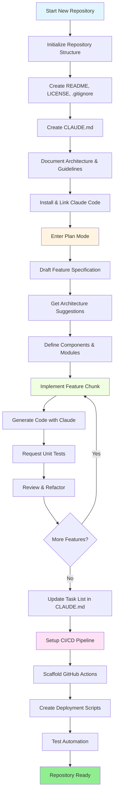
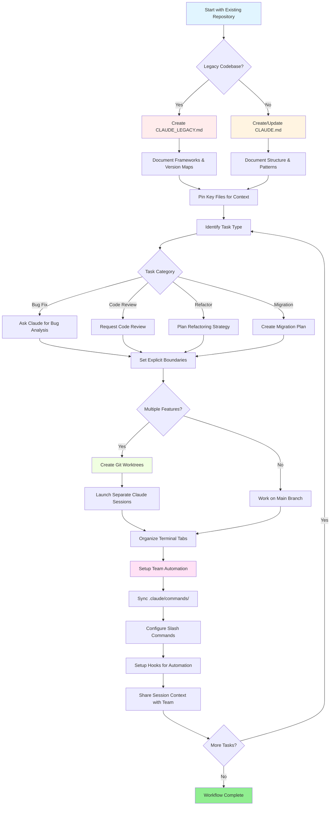

<picture>
  <source media="(prefers-color-scheme: dark)" srcset="../resources/logos/claude-howto-logo-dark.svg">
  
</picture>

# Danh Sách Tài Nguyên Hữu Ích
# List of Good Resources

## Tài Liệu Chính Thức / Official Documentation

| Tài Nguyên | Mô Tả | Liên Kết |
|----------|-------------|------|
| Claude Code Docs | Tài liệu Claude Code chính thức | [code.claude.com/docs/en/overview](https://code.claude.com/docs/en/overview) |
| Anthropic Docs | Tài liệu Anthropic đầy đủ | [docs.anthropic.com](https://docs.anthropic.com) |
| MCP Protocol | Model Context Protocol specification | [modelcontextprotocol.io](https://modelcontextprotocol.io) |
| MCP Servers | Các MCP server implementations chính thức | [github.com/modelcontextprotocol/servers](https://github.com/modelcontextprotocol/servers) |
| Anthropic Cookbook | Code examples và tutorials | [github.com/anthropics/anthropic-cookbook](https://github.com/anthropics/anthropic-cookbook) |
| Claude Code Skills | Community skills repository | [github.com/anthropics/skills](https://github.com/anthropics/skills) |
| Agent Teams | Multi-agent coordination và collaboration | [code.claude.com/docs/en/agent-teams](https://code.claude.com/docs/en/agent-teams) |
| Scheduled Tasks | Recurring tasks với `/loop` và cron | [code.claude.com/docs/en/scheduled-tasks](https://code.claude.com/docs/en/scheduled-tasks) |
| Chrome Integration | Browser automation | [code.claude.com/docs/en/chrome](https://code.claude.com/docs/en/chrome) |
| Keybindings | Keyboard shortcut customization | [code.claude.com/docs/en/keybindings](https://code.claude.com/docs/en/keybindings) |
| Desktop App | Native desktop application | [code.claude.com/docs/en/desktop](https://code.claude.com/docs/en/desktop) |
| Remote Control | Remote session control | [code.claude.com/docs/en/remote-control](https://code.claude.com/docs/en/remote-control) |
| Auto Mode | Automatic permission management | [code.claude.com/docs/en/permissions](https://code.claude.com/docs/en/permissions) |
| Channels | Multi-channel communication | [code.claude.com/docs/en/channels](https://code.claude.com/docs/en/channels) |
| Voice Dictation | Voice input cho Claude Code | [code.claude.com/docs/en/voice-dictation](https://code.claude.com/docs/en/voice-dictation) |

## Anthropic Engineering Blog

| Bài Viết | Mô Tả | Liên Kết |
|---------|-------------|------|
| Code Execution with MCP | Cách giải quyết MCP context bloat sử dụng code execution — 98.7% token reduction | [anthropic.com/engineering/code-execution-with-mcp](https://www.anthropic.com/engineering/code-execution-with-mcp) |

---

## Mastering Claude Code in 30 Minutes / Làm Chủ Claude Code trong 30 Phút

_Video_: https://www.youtube.com/watch?v=6eBSHbLKuN0

_**Tất Cả Tips**_
- **Khám Phá Các Tính Năng Nâng Cao và Shortcuts**
  - Thường xuyên kiểm tra các tính năng code editing và context mới của Claude trong release notes.
  - Học keyboard shortcuts để chuyển đổi giữa chat, file, và editor views nhanh chóng.

- **Thiết Lập Hiệu Quả**
  - Tạo các project-specific sessions với tên/mô tả rõ ràng để dễ dàng truy xuất.
  - Pin các files hoặc folders được sử dụng nhiều nhất để Claude có thể truy cập bất cứ lúc nào.
  - Thiết lập các integrations của Claude (ví dụ: GitHub, popular IDEs) để hợp lý hóa coding process của bạn.

- **Codebase Q&A Hiệu Quả**
  - Hỏi Claude các câu hỏi chi tiết về architecture, design patterns, và các modules cụ thể.
  - Sử dụng file và line references trong câu hỏi của bạn (ví dụ: "What does the logic in `app/models/user.py` accomplish?").
  - Đối với large codebases, cung cấp summary hoặc manifest để giúp Claude tập trung.
  - **Example prompt**: _"Can you explain the authentication flow implemented in src/auth/AuthService.ts:45-120? How does it integrate with the middleware in src/middleware/auth.ts?"_

- **Code Editing & Refactoring**
  - Sử dụng inline comments hoặc requests trong code blocks để có được các edits tập trung ("Refactor this function for clarity").
  - Yêu cầu side-by-side before/after comparisons.
  - Để Claude generate tests hoặc documentation sau các edits lớn để đảm bảo chất lượng.
  - **Example prompt**: _"Refactor the getUserData function in api/users.js to use async/await instead of promises. Show me a before/after comparison and generate unit tests for the refactored version."_

- **Quản Lý Context**
  - Giới hạn pasted code/context của bạn chỉ vào những gì liên quan cho task hiện tại.
  - Sử dụng structured prompts ("Here's file A, here's function B, my question is X") cho best performance.
  - Remove hoặc collapse các large files trong prompt window để tránh exceeding context limits.
  - **Example prompt**: _"Here's the User model from models/User.js and the validateUser function from utils/validation.js. My question is: how can I add email validation while maintaining backward compatibility?"_

- **Tích Hợp Team Tools**
  - Kết nối Claude sessions với repositories và documentation của team bạn.
  - Sử dụng built-in templates hoặc tạo custom ones cho recurring engineering tasks.
  - Cộng tác bằng cách chia sẻ session transcripts và prompts với teammates.

- **Boosting Performance**
  - Cung cấp cho Claude các instructions rõ ràng, goal-oriented (ví dụ: "Summarize this class in five bullet points").
  - Trim unnecessary comments và boilerplate từ context windows.
  - Nếu output của Claude bị lệch, reset context hoặc rephrase questions cho better alignment.
  - **Example prompt**: _"Summarize the DatabaseManager class in src/db/Manager.ts in five bullet points, focusing on its main responsibilities and key methods."_

- **Practical Use Examples / Ví Dụ Sử Dụng Thực Tế**
  - Debugging: Paste errors và stack traces, sau đó hỏi về possible causes và fixes.
  - Test Generation: Yêu cầu property-based, unit, hoặc integration tests cho complex logic.
  - Code Reviews: Hỏi Claude để identify risky changes, edge cases, hoặc code smells.
  - **Example prompts**:
    - _"I'm getting this error: 'TypeError: Cannot read property 'map' of undefined at line 42 in components/UserList.jsx'. Here's the stack trace and the relevant code. What's causing this and how can I fix it?"_
    - _"Generate comprehensive unit tests for the PaymentProcessor class, including edge cases for failed transactions, timeouts, and invalid inputs."_
    - _"Review this pull request diff and identify potential security issues, performance bottlenecks, and code smells."_

- **Workflow Automation**
  - Script các repetitive tasks (như formatting, clean-ups, và repetitive renaming) sử dụng Claude prompts.
  - Sử dụng Claude để draft PR descriptions, release notes, hoặc documentation dựa trên code diffs.
  - **Example prompt**: _"Based on the git diff, create a detailed PR description with a summary of changes, list of modified files, testing steps, and potential impacts. Also generate release notes for version 2.3.0."_

**Tip**: Để có kết quả tốt nhất, kết hợp một số practices này — bắt đầu bằng cách pinning các critical files và summarizing goals của bạn, sau đó sử dụng focused prompts và các công cụ refactoring của Claude để incrementally improve codebase và automation của bạn.

**Recommended workflow with Claude Code / Workflow được khuyến nghị với Claude Code**

### Cho Repository Mới / For a New Repository

1. **Initialize the Repo & Claude Integration**
   - Thiết lập repository mới của bạn với essential structure: README, LICENSE, .gitignore, root configs.
   - Tạo một file `CLAUDE.md` mô tả architecture, high-level goals, và coding guidelines.
   - Cài đặt Claude Code và liên kết nó với repository của bạn để được code suggestions, test scaffolding, và workflow automation.

2. **Sử Dụng Plan Mode và Specs**
   - Sử dụng plan mode (`shift-tab` hoặc `/plan`) để draft một specification chi tiết trước khi implement features.
   - Hỏi Claude để được architecture suggestions và initial project layout.
   - Giữ một clear, goal-oriented prompt sequence — hỏi về component outlines, major modules, và responsibilities.

3. **Phát Triển & Review Iterative**
   - Implement core features trong small chunks, prompting Claude cho code generation, refactoring, và documentation.
   - Yêu cầu unit tests và examples sau mỗi increment.
   - Duy trì một running task list trong CLAUDE.md.

4. **Tự Động Hóa CI/CD và Deployment**
   - Sử dụng Claude để scaffold GitHub Actions, npm/yarn scripts, hoặc deployment workflows.
   - Dễ dàng adapt pipelines bằng cách update CLAUDE.md của bạn và yêu cầu các commands/scripts tương ứng.

#### Cho Repository Hiện Có / For an Existing Repository

1. **Repository & Context Setup**
   - Thêm hoặc update `CLAUDE.md` để document repo structure, coding patterns, và key files. Đối với legacy repos, sử dụng `CLAUDE_LEGACY.md` covering frameworks, version maps, instructions, bugs, và upgrade notes.
   - Pin hoặc highlight các main files Claude nên sử dụng cho context.

2. **Contextual Code Q&A**
   - Hỏi Claude cho code reviews, bug explanations, refactors, hoặc migration plans tham chiếu đến specific files/functions.
   - Cung cấp cho Claude explicit boundaries (ví dụ: "modify only these files" hoặc "no new dependencies").

3. **Branch, Worktree, và Multi-Session Management**
   - Sử dụng multiple git worktrees cho isolated features hoặc bug fixes và launch separate Claude sessions per worktree.
   - Giữ terminal tabs/windows được tổ chức theo branch hoặc feature cho parallel workflows.

4. **Team Tools và Automation**
   - Đồng bộ các custom commands qua `.claude/commands/` cho cross-team consistency.
   - Tự động hóa các repetitive tasks, PR creation, và code formatting via Claude's slash commands hoặc hooks.
   - Chia sẻ sessions và context với team members cho collaborative troubleshooting và review.

**Tips**:
- Bắt đầu mỗi feature hoặc fix mới với một spec và plan mode prompt.
- Đối với legacy và complex repos, lưu detailed guidance trong CLAUDE.md/CLAUDE_LEGACY.md.
- Cung cấp clear, focused instructions và break down complex work thành multi-phase plans.
- Thường xuyên clean up sessions, prune context, và remove completed worktrees để tránh clutter.

Các bước này capture các core recommendations cho smooth workflows với Claude Code trong cả new và existing codebases.

---

## Tính Năng Mới & Khả Năng (March 2026) / New Features & Capabilities

### Key Feature Resources / Tài Nguyên Tính Năng Chính

| Tính Năng | Mô Tả | Tìm Hiểu Thêm |
|---------|-------------|------------|
| **Auto Memory** | Claude tự động học và nhớ preferences của bạn qua các phiên | [Memory Guide](02-memory/) |
| **Remote Control** | Điều khiển Claude Code sessions từ các external tools và scripts | [Advanced Features](09-advanced-features/) |
| **Web Sessions** | Truy cập Claude Code qua browser-based interfaces cho remote development | [CLI Reference](10-cli/) |
| **Desktop App** | Native desktop application cho Claude Code với enhanced UI | [Claude Code Docs](https://code.claude.com/docs/en/desktop) |
| **Extended Thinking** | Deep reasoning toggle qua `Alt+T`/`Option+T` hoặc `MAX_THINKING_TOKENS` env var | [Advanced Features](09-advanced-features/) |
| **Permission Modes** | Fine-grained control: default, acceptEdits, plan, auto, dontAsk, bypassPermissions | [Advanced Features](09-advanced-features/) |
| **7-Tier Memory** | Managed Policy, Project, Project Rules, User, User Rules, Local, Auto Memory | [Memory Guide](02-memory/) |
| **Hook Events** | 25 events: PreToolUse, PostToolUse, PostToolUseFailure, Stop, StopFailure, SubagentStart, SubagentStop, Notification, Elicitation, và nhiều hơn | [Hooks Guide](06-hooks/) |
| **Agent Teams** | Phối hợp nhiều agents làm việc cùng nhau trên các complex tasks | [Subagents Guide](04-subagents/) |
| **Scheduled Tasks** | Thiết lập recurring tasks với `/loop` và cron tools | [Advanced Features](09-advanced-features/) |
| **Chrome Integration** | Browser automation với headless Chromium | [Advanced Features](09-advanced-features/) |
| **Keyboard Customization** | Tùy chỉnh keybindings bao gồm chord sequences | [Advanced Features](09-advanced-features/) |

---
**Cập Nhật Lần Cuối**: Tháng 4 năm 2026
