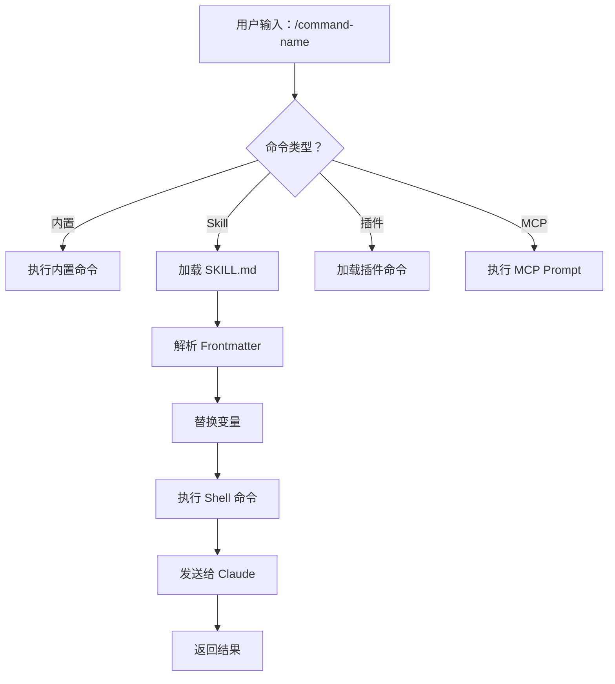
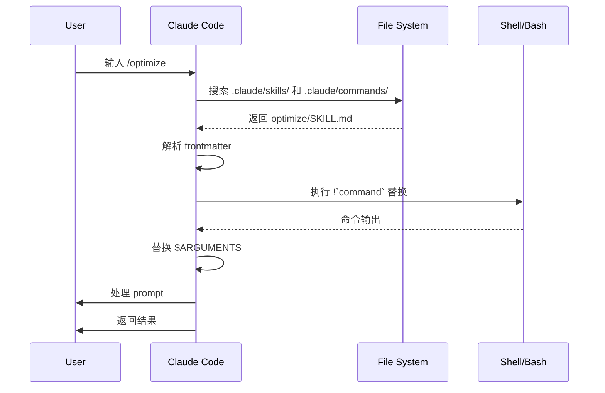
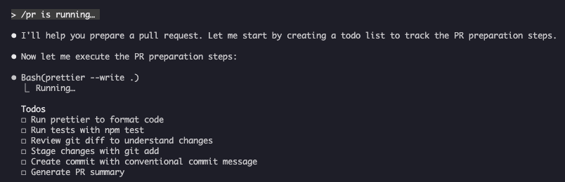

<picture>
  <source media="(prefers-color-scheme: dark)" srcset="../../resources/logos/claude-howto-logo-dark.svg">
  
</picture>

# Slash Commands 参考指南

## 概览

Slash command 是你在 Claude 的交互式会话中用来控制行为的快捷方式，主要分为几类：

- **内置命令**：Claude Code 自带，例如 `/help`、`/clear`、`/model`
- **Skills**：你自己定义的命令，基于 `SKILL.md` 文件，例如 `/optimize`、`/pr`
- **插件命令**：来自已安装插件的命令，例如 `/frontend-design:frontend-design`
- **MCP prompts**：来自 MCP server 的命令，例如 `/mcp__github__list_prs`

> **注意**：自定义 slash command 已经合并进 Skills。`.claude/commands/` 仍然可用，但现在更推荐使用 `.claude/skills/`。两者都会创建 `/command-name` 形式的快捷命令。完整参考请见 [Skills 指南](../03-skills/README.md)。

## 内置命令速查

Claude Code 目前提供 55+ 个内置命令和 5 个内置 Skills。你可以在 Claude Code 中输入 `/` 查看全部，也可以输入 `/` 后继续键入字母进行筛选。

| 命令 | 作用 |
|---------|---------|
| `/add-dir <path>` | 添加工作目录 |
| `/agents` | 管理 agent 配置 |
| `/branch [name]` | 将当前对话分支到新会话（别名：`/fork`。注意：`/fork` 在 v2.1.77 中更名为 `/branch`） |
| `/btw <question>` | 额外问题，不写入历史 |
| `/chrome` | 配置 Chrome 浏览器集成 |
| `/clear` | 清空对话（别名：`/reset`、`/new`） |
| `/color [color|default]` | 设置提示栏颜色 |
| `/compact [instructions]` | 压缩对话，可附带聚焦指令 |
| `/config` | 打开设置（别名：`/settings`） |
| `/context` | 用彩色网格可视化上下文占用 |
| `/copy [N]` | 将 assistant 回复复制到剪贴板；`w` 会写入文件 |
| `/cost` | 查看 token 使用统计 |
| `/desktop` | 继续在桌面应用中处理（别名：`/app`） |
| `/diff` | 查看未提交更改的交互式 diff |
| `/doctor` | 检查安装健康状态 |
| `/effort [low|medium|high|max|auto]` | 设置推理强度；`max` 需要 Opus 4.6 |
| `/exit` | 退出 REPL（别名：`/quit`） |
| `/export [filename]` | 将当前对话导出为文件或剪贴板内容 |
| `/extra-usage` | 配置额外用量以应对速率限制 |
| `/fast [on|off]` | 切换快速模式 |
| `/feedback` | 提交反馈（别名：`/bug`） |
| `/help` | 显示帮助 |
| `/hooks` | 查看 hook 配置 |
| `/ide` | 管理 IDE 集成 |
| `/init` | 初始化 `CLAUDE.md`，可设置 `CLAUDE_CODE_NEW_INIT=1` 启用交互式流程 |
| `/insights` | 生成会话分析报告 |
| `/install-github-app` | 配置 GitHub Actions app |
| `/install-slack-app` | 安装 Slack app |
| `/keybindings` | 打开快捷键配置 |
| `/login` | 切换 Anthropic 账号 |
| `/logout` | 退出当前 Anthropic 账号 |
| `/mcp` | 管理 MCP servers 和 OAuth |
| `/memory` | 编辑 `CLAUDE.md`，切换自动记忆 |
| `/mobile` | 生成移动端扫码二维码（别名：`/ios`、`/android`） |
| `/model [model]` | 选择模型，并可用左右箭头调整 effort |
| `/passes` | 分享一周免费 Claude Code 使用权 |
| `/permissions` | 查看或更新权限（别名：`/allowed-tools`） |
| `/plan [description]` | 进入规划模式 |
| `/plugin` | 管理插件 |
| `/pr-comments [PR]` | 获取 GitHub PR 评论 |
| `/privacy-settings` | 隐私设置（仅 Pro/Max） |
| `/release-notes` | 查看更新日志 |
| `/reload-plugins` | 重新加载当前插件 |
| `/remote-control` | 从 claude.ai 进行远程控制（别名：`/rc`） |
| `/remote-env` | 配置默认远程环境 |
| `/rename [name]` | 重命名会话 |
| `/resume [session]` | 恢复对话（别名：`/continue`） |
| `/review` | **已弃用**，请改用 `code-review` 插件 |
| `/rewind` | 回退对话和/或代码（别名：`/checkpoint`） |
| `/sandbox` | 切换沙盒模式 |
| `/schedule [description]` | 创建/管理定时任务 |
| `/security-review` | 分析分支中的安全漏洞 |
| `/skills` | 列出可用 Skills |
| `/stats` | 可视化每日使用量、会话和连续天数 |
| `/status` | 显示版本、模型、账号 |
| `/statusline` | 配置状态栏 |
| `/tasks` | 列出/管理后台任务 |
| `/terminal-setup` | 配置终端快捷键 |
| `/theme` | 更改颜色主题 |
| `/voice` | 切换按住说话语音输入 |

### 内置 Skills

以下 Skills 随 Claude Code 一起提供，调用方式和 slash command 一样：

| Skill | 作用 |
|-------|---------|
| `/batch <instruction>` | 使用 worktree 编排大规模并行修改 |
| `/claude-api` | 加载 Claude API 参考，便于为项目所用语言编写代码 |
| `/debug [description]` | 启用调试日志 |
| `/loop [interval] <prompt>` | 按固定间隔重复运行提示词 |
| `/simplify [focus]` | 审查改动文件的代码质量 |

### 已弃用命令

| 命令 | 状态 |
|---------|--------|
| `/review` | 已弃用，已被 `code-review` 插件替代 |
| `/output-style` | 自 v2.1.73 起弃用 |
| `/fork` | 已重命名为 `/branch`（别名仍可用，v2.1.77） |
| `/vim` | 自 v2.1.92 起移除；改用 `/config → Editor mode` |

### 最近变化

- `/fork` 已更名为 `/branch`，但保留 `/fork` 作为别名（v2.1.77）
- `/output-style` 已弃用（v2.1.73）
- `/review` 已弃用，推荐改用 `code-review` 插件
- 新增 `/effort`，其中 `max` 级别需要 Opus 4.6
- 新增 `/voice`，用于按住说话语音输入
- 新增 `/schedule`，用于创建和管理定时任务
- 新增 `/color`，用于自定义提示栏颜色
- `/model` 选择器现在显示人类可读标签，例如 “Sonnet 4.6”
- `/resume` 支持 `/continue` 别名
- MCP prompts 可作为 `/mcp__<server>__<prompt>` 命令使用，见 [MCP Prompts as Commands](#mcp-prompts-作为命令)

## 自定义命令（现已归入 Skills）

自定义 slash command 已经**合并到 Skills**。两种方式都可以通过 `/command-name` 调用：

| 方式 | 位置 | 状态 |
|----------|----------|--------|
| **Skills（推荐）** | `.claude/skills/<name>/SKILL.md` | 当前标准 |
| **旧式命令** | `.claude/commands/<name>.md` | 仍可使用 |

如果 skill 和 command 同名，**skill 优先**。例如同时存在 `.claude/commands/review.md` 和 `.claude/skills/review/SKILL.md` 时，会使用 skill 版本。

### 迁移路径

你现有的 `.claude/commands/` 文件可以继续直接使用。若要迁移到 Skills：

**迁移前（Command）：**
```text
.claude/commands/optimize.md
```

**迁移后（Skill）：**
```text
.claude/skills/optimize/SKILL.md
```

### 为什么用 Skills

- **目录结构**：可以把脚本、模板、参考文件打包在一起
- **自动触发**：相关场景下 Claude 可以自动调用
- **调用控制**：可以决定由用户、Claude 或两者共同调用
- **子 agent 执行**：可在隔离上下文中运行 skill
- **渐进披露**：只在需要时加载额外文件

### 把自定义命令做成 Skill

创建一个包含 `SKILL.md` 的目录：

```bash
mkdir -p .claude/skills/my-command
```

**文件：** `.claude/skills/my-command/SKILL.md`

```yaml
---
name: my-command
description: 这个命令的作用，以及何时使用它
---

# 我的命令

当该命令被触发时，Claude 需要遵循的说明。

1. 第一步
2. 第二步
3. 第三步
```

### Frontmatter 参考

| 字段 | 作用 | 默认值 |
|-------|---------|---------|
| `name` | 命令名（会变成 `/name`） | 目录名 |
| `description` | 简短说明，帮助 Claude 判断何时使用 | 第一段 |
| `argument-hint` | 自动补全时显示的参数提示 | 无 |
| `allowed-tools` | 命令可无权限使用的工具 | 继承 |
| `model` | 指定要使用的模型 | 继承 |
| `disable-model-invocation` | 若为 `true`，只有用户能调用，Claude 不能自动调用 | `false` |
| `user-invocable` | 若为 `false`，不会出现在 `/` 菜单中 | `true` |
| `context` | 设为 `fork` 时，在隔离 subagent 中运行 | 无 |
| `agent` | `context: fork` 时使用的 agent 类型 | `general-purpose` |
| `hooks` | Skill 范围内的 hooks（PreToolUse、PostToolUse、Stop） | 无 |

### 参数

命令可以接收参数：

**使用 `$ARGUMENTS` 接收全部参数：**

```yaml
---
name: fix-issue
description: 根据编号修复 GitHub issue
---

按团队编码规范修复 #$ARGUMENTS
```

调用 `/fix-issue 123` 时，`$ARGUMENTS` 会变成 `123`。

**使用 `$0`、`$1` 等接收单个参数：**

```yaml
---
name: review-pr
description: 按优先级审查 PR
---

审查 #$0，优先级为 $1
```

调用 `/review-pr 456 high` 时，`$0="456"`，`$1="high"`。

### 用 Shell 命令注入动态上下文

在 prompt 发送前，可用 `!` 命令先执行 shell 命令：

```yaml
---
name: commit
description: 使用上下文创建 git commit
allowed-tools: Bash(git *)
---

## 上下文

- 当前 git 状态：!`git status`
- 当前 diff：!`git diff HEAD`
- 当前分支：!`git branch --show-current`
- 最近提交：!`git log --oneline -5`

## 你的任务

根据以上变更，创建一个 git commit。
```

### 文件引用

使用 `@` 引用文件内容：

```markdown
审查 @src/utils/helpers.js 中的实现
比较 @src/old-version.js 和 @src/new-version.js
```

## 插件命令

插件可以提供自定义命令：

```text
/plugin-name:command-name
```

如果没有命名冲突，也可以直接使用 `/command-name`。

**示例：**
```bash
/frontend-design:frontend-design
/commit-commands:commit
```

## MCP Prompts 作为命令

MCP servers 可以把 prompt 暴露成 slash command：

```text
/mcp__<server-name>__<prompt-name> [arguments]
```

**示例：**
```bash
/mcp__github__list_prs
/mcp__github__pr_review 456
/mcp__jira__create_issue "Bug title" high
```

### MCP 权限语法

在权限中控制 MCP server 访问：

- `mcp__github` - 访问整个 GitHub MCP server
- `mcp__github__*` - 通配符访问全部工具
- `mcp__github__get_issue` - 访问某个特定工具

## 命令架构



## 命令生命周期



## 本文件中的可用命令

这些示例命令可以作为 skill 或旧式命令安装。

### 1. `/optimize` - 代码优化

分析性能问题、内存泄漏和优化机会。

**用法：**
```text
/optimize
[粘贴你的代码]
```

**文件：** [optimize.md](optimize.md)

### 2. `/pr` - Pull Request 准备

引导你完成 PR 准备清单，包括 lint、测试和提交格式整理。

**用法：**
```text
/pr
```

**文件：** [pr.md](pr.md)

**截图：**


### 3. `/generate-api-docs` - API 文档生成器

从源码生成完整的 API 文档。

**用法：**
```text
/generate-api-docs
```

**文件：** [generate-api-docs.md](generate-api-docs.md)

### 4. `/commit` - 带上下文的 Git Commit

基于仓库中的动态上下文创建 git commit。

**用法：**
```text
/commit [可选说明]
```

**文件：** [commit.md](commit.md)

### 5. `/push-all` - 暂存、提交并推送

会先暂存所有改动，再提交，并带安全检查地推送到远端。

**用法：**
```text
/push-all
```

**文件：** [push-all.md](push-all.md)

**安全检查：**
- 密钥文件：`.env*`、`*.key`、`*.pem`、`credentials.json`
- API Keys：识别真实 key 与占位符
- 大文件：未使用 Git LFS 且大于 10MB
- 构建产物：`node_modules/`、`dist/`、`__pycache__/`

### 6. `/doc-refactor` - 文档重构

重组项目文档，让结构更清晰、可访问性更好。

**文件：** [doc-refactor.md](doc-refactor.md)

### 7. `/setup-ci-cd` - CI/CD 流水线配置

实现 pre-commit hooks 和 GitHub Actions 质量保障流程。

**文件：** [setup-ci-cd.md](setup-ci-cd.md)

### 8. `/unit-test-expand` - 测试覆盖率扩展

针对未测试分支和边界情况，提升测试覆盖率。

**文件：** [unit-test-expand.md](unit-test-expand.md)

## 安装

### 作为 Skills（推荐）

复制到你的 skills 目录：

```bash
# 创建 skills 目录
mkdir -p .claude/skills

# 对每个命令文件，创建一个 skill 目录
for cmd in optimize pr commit; do
  mkdir -p .claude/skills/$cmd
  cp 01-slash-commands/$cmd.md .claude/skills/$cmd/SKILL.md
done
```

### 作为旧式命令

复制到 commands 目录：

```bash
# 项目范围（团队）
mkdir -p .claude/commands
cp 01-slash-commands/*.md .claude/commands/

# 个人使用
mkdir -p ~/.claude/commands
cp 01-slash-commands/*.md ~/.claude/commands/
```

## 创建你自己的命令

### Skill 模板（推荐）

创建 `.claude/skills/my-command/SKILL.md`：

```yaml
---
name: my-command
description: 这个命令做什么。用于 [触发条件]。
argument-hint: [可选参数]
allowed-tools: Bash(npm *), Read, Grep
---

# Command Title

## 上下文

- 当前分支：!`git branch --show-current`
- 相关文件：@package.json

## 指令

1. 第一步
2. 第二步，参数：$ARGUMENTS
3. 第三步

## 输出格式

- 如何格式化回复
- 需要包含什么
```

### 仅用户可调用的命令（无自动触发）

对于带副作用、Claude 不应自动触发的命令：

```yaml
---
name: deploy
description: 部署到生产环境
disable-model-invocation: true
allowed-tools: Bash(npm *), Bash(git *)
---

将应用部署到生产环境：

1. 运行测试
2. 构建应用
3. 推送到部署目标
4. 验证部署
```

## 最佳实践

| 应该做 | 不要做 |
|------|---------|
| 使用清晰、以动作导向的命名 | 为一次性任务创建命令 |
| 在 `description` 中写清触发条件 | 在命令里写太复杂的逻辑 |
| 保持命令聚焦于单一任务 | 硬编码敏感信息 |
| 有副作用时使用 `disable-model-invocation` | 跳过 description 字段 |
| 用 `!` 前缀注入动态上下文 | 假设 Claude 知道当前状态 |
| 把相关文件组织进 skill 目录 | 所有内容都塞进一个文件 |

## 故障排查

### 找不到命令

**解决办法：**
- 检查文件是否位于 `.claude/skills/<name>/SKILL.md` 或 `.claude/commands/<name>.md`
- 确认 frontmatter 中的 `name` 与预期命令名一致
- 重启 Claude Code 会话
- 运行 `/help` 查看可用命令

### 命令没有按预期执行

**解决办法：**
- 补充更具体的指令
- 在 skill 文件中加入示例
- 如果使用 bash 命令，检查 `allowed-tools`
- 先用简单输入测试

### Skill 与 Command 冲突

如果同名同时存在，**skill 优先**。删除其中一个或重命名即可。

## 相关指南

- **[Skills](../03-skills/README.md)** - 完整的 Skills 参考
- **[Memory](../02-memory/README.md)** - 带 `CLAUDE.md` 的持久上下文
- **[Subagents](../04-subagents/README.md)** - 委派式 AI agents
- **[Plugins](../07-plugins/README.md)** - 打包好的命令集合
- **[Hooks](../06-hooks/README.md)** - 事件驱动自动化

## 其他资源

- [官方交互模式文档](https://code.claude.com/docs/en/interactive-mode) - 内置命令参考
- [官方 Skills 文档](https://code.claude.com/docs/en/skills) - 完整 Skills 参考
- [CLI Reference](https://code.claude.com/docs/en/cli-reference) - 命令行选项

---

**最后更新**: 2026 年 4 月 9 日
**Claude Code 版本**: 2.1.97

---

*Claude How To 指南系列的一部分*
