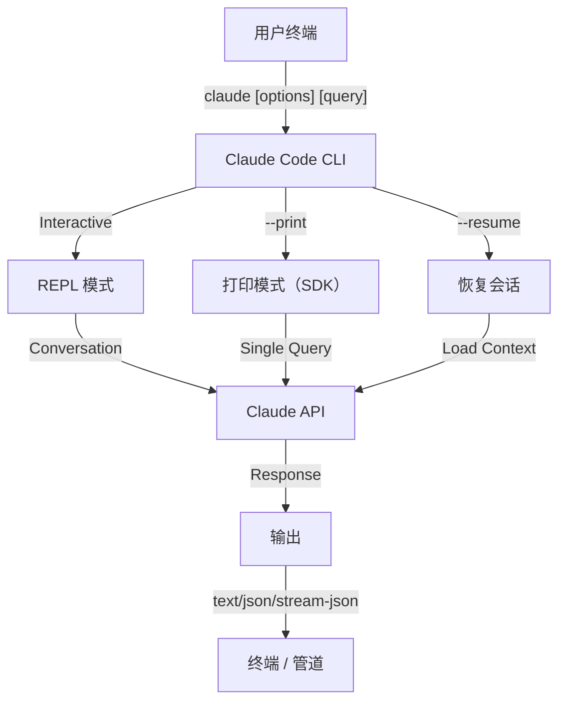
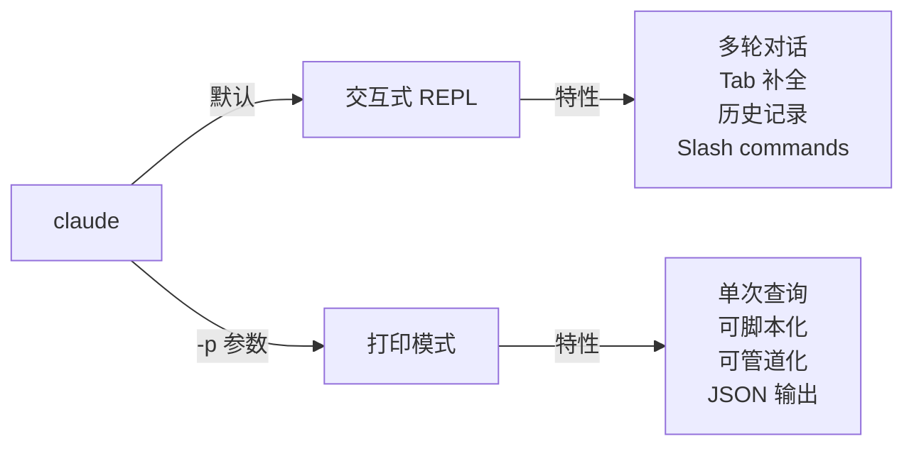

<picture>
  <source media="(prefers-color-scheme: dark)" srcset="../../resources/logos/claude-howto-logo-dark.svg">
  
</picture>

# CLI 参考

## 概览

Claude Code 的 CLI（命令行接口）是与 Claude Code 交互的主要方式。它提供了强大的参数和命令，用于执行查询、管理会话、配置模型，并把 Claude 集成进你的开发工作流。

## 架构



## CLI 命令

| 命令 | 说明 | 示例 |
|---------|-------------|---------|
| `claude` | 启动交互式 REPL | `claude` |
| `claude "query"` | 带初始提示启动 REPL | `claude "解释这个项目"` |
| `claude -p "query"` | 打印模式，查询后退出 | `claude -p "解释这个函数"` |
| `cat file \| claude -p "query"` | 处理通过管道传入的内容 | `cat logs.txt \| claude -p "解释这些日志"` |
| `claude -c` | 继续最近一次会话 | `claude -c` |
| `claude -c -p "query"` | 在打印模式下继续会话 | `claude -c -p "检查类型错误"` |
| `claude -r "<session>" "query"` | 通过 ID 或名称恢复会话 | `claude -r "auth-refactor" "完成这个 PR"` |
| `claude update` | 更新到最新版本 | `claude update` |
| `claude mcp` | 配置 MCP servers | 见 [MCP 文档](../05-mcp/README.md) |
| `claude mcp serve` | 将 Claude Code 作为 MCP server 运行 | `claude mcp serve` |
| `claude agents` | 列出所有已配置的 subagents | `claude agents` |
| `claude auto-mode defaults` | 以 JSON 打印 auto mode 默认规则 | `claude auto-mode defaults` |
| `claude remote-control` | 启动远程控制服务 | `claude remote-control` |
| `claude plugin` | 管理插件（安装、启用、禁用） | `claude plugin install my-plugin` |
| `claude auth login` | 登录（支持 `--email`、`--sso`） | `claude auth login --email user@example.com` |
| `claude auth logout` | 注销当前账号 | `claude auth logout` |
| `claude auth status` | 检查登录状态（已登录返回 0，否则返回 1） | `claude auth status` |

## 核心标志

| 参数 | 说明 | 示例 |
|------|-------------|---------|
| `-p, --print` | 不进入交互式模式，直接输出结果 | `claude -p "query"` |
| `-c, --continue` | 加载最近一次会话 | `claude --continue` |
| `-r, --resume` | 按 ID 或名称恢复指定会话 | `claude --resume auth-refactor` |
| `-v, --version` | 输出版本号 | `claude -v` |
| `-w, --worktree` | 在隔离的 git worktree 中启动 | `claude -w` |
| `-n, --name` | 设置会话显示名称 | `claude -n "auth-refactor"` |
| `--from-pr <number>` | 恢复与 GitHub PR 关联的会话 | `claude --from-pr 42` |
| `--remote "task"` | 在 claude.ai 上创建 web session | `claude --remote "implement API"` |
| `--remote-control, --rc` | 使用 Remote Control 进入交互式会话 | `claude --rc` |
| `--teleport` | 将 web session 恢复到本地 | `claude --teleport` |
| `--teammate-mode` | agent team 显示模式 | `claude --teammate-mode tmux` |
| `--bare` | 极简模式，跳过 hooks、skills、plugins、MCP、自动记忆和 `CLAUDE.md` | `claude --bare` |
| `--enable-auto-mode` | 解锁 auto permission mode | `claude --enable-auto-mode` |
| `--channels` | 订阅 MCP channel 插件 | `claude --channels discord,telegram` |
| `--chrome` / `--no-chrome` | 启用 / 禁用 Chrome 浏览器集成 | `claude --chrome` |
| `--effort` | 设置推理强度 | `claude --effort high` |
| `--init` / `--init-only` | 运行初始化 hooks | `claude --init` |
| `--maintenance` | 运行维护 hooks 后退出 | `claude --maintenance` |
| `--disable-slash-commands` | 禁用所有 skills 和 slash commands | `claude --disable-slash-commands` |
| `--no-session-persistence` | 禁用会话保存（打印模式） | `claude -p --no-session-persistence "query"` |

### 交互模式 vs 打印模式



**交互模式**（默认）：
```bash
# 启动交互式会话
claude

# 带初始提示启动
claude "解释这个认证流程"
```

**打印模式**（非交互式）：
```bash
# 单次查询后退出
claude -p "这个函数做什么？"

# 处理文件内容
cat error.log | claude -p "解释这个错误"

# 与其他工具串联
claude -p "列出待办事项" | grep "URGENT"
```

## 模型与配置

| 参数 | 说明 | 示例 |
|------|-------------|---------|
| `--model` | 设置模型（sonnet、opus、haiku，或完整模型名） | `claude --model opus` |
| `--fallback-model` | 当前模型负载过高时自动切换的后备模型 | `claude -p --fallback-model sonnet "query"` |
| `--agent` | 为当前会话指定 agent | `claude --agent my-custom-agent` |
| `--agents` | 通过 JSON 定义自定义 subagents | 见 [Agents Configuration](#subagents-配置) |
| `--effort` | 设置推理级别（low、medium、high、max） | `claude --effort high` |

### 模型选择示例

```bash
# 复杂任务使用 Opus 4.6
claude --model opus "设计一个缓存策略"

# 快速任务使用 Haiku 4.5
claude --model haiku -p "格式化这个 JSON"

# 使用完整模型名
claude --model claude-sonnet-4-6-20250929 "审查这段代码"

# 带后备模型以提升稳定性
claude -p --model opus --fallback-model sonnet "分析架构"

# 使用 opusplan（Opus 负责规划，Sonnet 负责执行）
claude --model opusplan "设计并实现缓存层"
```

## 系统提示词自定义

| 参数 | 说明 | 示例 |
|------|-------------|---------|
| `--system-prompt` | 替换整段默认系统提示词 | `claude --system-prompt "You are a Python expert"` |
| `--system-prompt-file` | 从文件加载提示词（仅打印模式） | `claude -p --system-prompt-file ./prompt.txt "query"` |
| `--append-system-prompt` | 在默认提示词后追加内容 | `claude --append-system-prompt "Always use TypeScript"` |

### 系统提示词示例

```bash
# 完整自定义人格
claude --system-prompt "你是一名资深安全工程师，重点关注漏洞。"

# 追加特定指令
claude --append-system-prompt "始终在代码示例中包含单元测试"

# 从文件加载复杂提示词
claude -p --system-prompt-file ./prompts/code-reviewer.txt "review main.py"
```

### 系统提示词参数对比

| 参数 | 行为 | 交互模式 | 打印模式 |
|------|----------|-------------|-------|
| `--system-prompt` | 替换整个默认系统提示词 | ✅ | ✅ |
| `--system-prompt-file` | 用文件中的提示词替换 | ❌ | ✅ |
| `--append-system-prompt` | 追加到默认系统提示词后 | ✅ | ✅ |

**仅在打印模式中使用 `--system-prompt-file`。交互模式请使用 `--system-prompt` 或 `--append-system-prompt`。**

## 工具与权限管理

| 参数 | 说明 | 示例 |
|------|-------------|---------|
| `--tools` | 限制可用的内置工具 | `claude -p --tools "Bash,Edit,Read" "query"` |
| `--allowedTools` | 无需提示即可执行的工具 | `"Bash(git log:*)" "Read"` |
| `--disallowedTools` | 从上下文中移除的工具 | `"Bash(rm:*)" "Edit"` |
| `--dangerously-skip-permissions` | 跳过所有权限提示 | `claude --dangerously-skip-permissions` |
| `--permission-mode` | 以指定权限模式启动 | `claude --permission-mode auto` |
| `--permission-prompt-tool` | 用于权限处理的 MCP tool | `claude -p --permission-prompt-tool mcp_auth "query"` |
| `--enable-auto-mode` | 解锁 auto permission mode | `claude --enable-auto-mode` |

### 权限示例

```bash
# 代码审查只读模式
claude --permission-mode plan "审查这个代码库"

# 只允许安全工具
claude --tools "Read,Grep,Glob" -p "找出所有 TODO 注释"

# 允许特定 git 命令无需提示
claude --allowedTools "Bash(git status:*)" "Bash(git log:*)"

# 阻止危险操作
claude --disallowedTools "Bash(rm -rf:*)" "Bash(git push --force:*)"
```

## 输出与格式

| 参数 | 说明 | 选项 | 示例 |
|------|-------------|---------|---------|
| `--output-format` | 指定输出格式（打印模式） | `text`、`json`、`stream-json` | `claude -p --output-format json "query"` |
| `--input-format` | 指定输入格式（打印模式） | `text`、`stream-json` | `claude -p --input-format stream-json` |
| `--verbose` | 启用详细日志 |  | `claude --verbose` |
| `--include-partial-messages` | 包含流式事件 | 需要 `stream-json` | `claude -p --output-format stream-json --include-partial-messages "query"` |
| `--json-schema` | 获取符合 schema 的 JSON 输出 |  | `claude -p --json-schema '{"type":"object"}' "query"` |
| `--max-budget-usd` | 打印模式最大花费 |  | `claude -p --max-budget-usd 5.00 "query"` |

### 输出格式示例

```bash
# 纯文本（默认）
claude -p "解释这段代码"

# 供程序使用的 JSON
claude -p --output-format json "列出 main.py 中的所有函数"

# 用于实时处理的流式 JSON
claude -p --output-format stream-json "生成一份长报告"

# 使用 schema 验证的结构化输出
claude -p --json-schema '{"type":"object","properties":{"bugs":{"type":"array"}}}' \
  "找出这段代码中的 bug，并以 JSON 返回"
```

## 工作区与目录

| 参数 | 说明 | 示例 |
|------|-------------|---------|
| `--working-directory` | 设置工作目录 | `claude --working-directory /path/to/project` |
| `--add-dir` | 追加额外工作目录 | `claude --add-dir /path/to/other/project` |

### 多目录示例

```bash
# 在多个项目目录中协作
claude --working-directory ~/projects/app --add-dir ~/projects/shared

# 加载自定义设置
claude --working-directory ./backend --add-dir ./frontend
```

## MCP 配置

| 参数 | 说明 | 示例 |
|------|-------------|---------|
| `--mcp-config` | 从文件加载 MCP 配置 | `claude --mcp-config ./mcp.json` |
| `--mcp` | 启用 / 配置 MCP 服务 | `claude --mcp github` |
| `--mcp-list` | 列出可用 MCP 配置 | `claude --mcp-list` |

### MCP 示例

```bash
# 加载 GitHub MCP server
claude --mcp-config ./configs/github-mcp.json

# 严格模式，只允许指定的 server
claude --mcp-config ./configs/strict-mcp.json --mcp github
```

## 会话管理

| 参数 | 说明 | 示例 |
|------|-------------|---------|
| `--session` | 指定会话名称 | `claude --session feature-auth` |
| `--new-session` | 强制开启新会话 | `claude --new-session` |
| `--resume-last` | 恢复最近一次会话 | `claude --resume-last` |
| `--fork-session` | 从当前会话分叉 | `claude --fork-session` |

### 会话示例

```bash
# 继续上一次对话
claude --continue

# 恢复命名会话
claude --resume feature-auth

# 为实验分叉会话
claude --fork-session

# 指定会话 ID
claude --resume 123456789
```

### 会话分叉

```bash
# 分叉会话尝试不同方案
claude --fork-session "尝试另一种实现"

# 带自定义消息分叉
claude --fork-session --session "experiment-a"
```

## 高级特性

| 参数 | 说明 | 示例 |
|------|-------------|---------|
| `--disable-auto-checkpoints` | 禁用自动 checkpoint | `claude --disable-auto-checkpoints` |
| `--enable-auto-checkpoints` | 启用自动 checkpoint | `claude --enable-auto-checkpoints` |
| `--interactive` | 强制交互模式 | `claude --interactive` |
| `--dry-run` | 仅模拟执行 | `claude --dry-run "review code"` |
| `--unsafe` | 允许更多自动化操作 | `claude --unsafe` |

### 高级示例

```bash
# 限制自主操作
claude --permission-mode plan --model opus "设计并实现认证系统"

# 调试 API 调用
claude --verbose -p "diagnose this issue"

# 启用 IDE 集成
claude --ide "review this diff"
```

<a id="agents-configuration"></a>
## Subagents 配置

| 参数 | 说明 | 示例 |
|------|-------------|---------|
| `--agents` | 通过 JSON 定义自定义 subagents | `claude --agents ./agents.json` |
| `--agent` | 指定当前会话使用的 agent | `claude --agent reviewer` |

### Subagents JSON 格式

```json
{
  "agent-name": {
    "description": "Required: when to invoke this agent",
    "prompt": "Required: system prompt for the agent",
    "tools": ["Optional", "array", "of", "tools"],
    "model": "optional: sonnet|opus|haiku"
  }
}
```

**必填字段：**
- `description` - 何时使用这个 agent 的自然语言说明
- `prompt` - 定义 agent 角色和行为的系统提示词

**可选字段：**
- `tools` - 可用工具数组（如果省略则继承全部工具）
  - 格式：`["Read", "Grep", "Glob", "Bash"]`
- `model` - 使用的模型：`sonnet`、`opus` 或 `haiku`

### 完整 Agents 示例

```json
{
  "code-reviewer": {
    "description": "Expert code reviewer. Use proactively after code changes.",
    "prompt": "You are a senior code reviewer. Focus on code quality, security, and best practices.",
    "tools": ["Read", "Grep", "Glob", "Bash"],
    "model": "sonnet"
  },
  "debugger": {
    "description": "Debugging specialist for errors and test failures.",
    "prompt": "You are an expert debugger. Analyze errors, identify root causes, and provide fixes.",
    "tools": ["Read", "Edit", "Bash", "Grep"],
    "model": "opus"
  },
  "documenter": {
    "description": "Documentation specialist for generating guides.",
    "prompt": "You are a technical writer. Create clear, comprehensive documentation.",
    "tools": ["Read", "Write"],
    "model": "haiku"
  }
}
```

### Agents 命令示例

```bash
# 直接定义自定义 agent
claude --agents '{
  "security-auditor": {
    "description": "Security specialist for vulnerability analysis",
    "prompt": "You are a security expert. Find vulnerabilities and suggest fixes.",
    "tools": ["Read", "Grep", "Glob"],
    "model": "opus"
  }
}' "audit this codebase for security issues"

# 从文件加载 agents
claude --agents ./configs/agents.json

# 与其他参数组合
claude --agents ./configs/agents.json --model opus
```

### Subagent 优先级

当同时存在多种 agent 定义时，加载优先级如下：
1. **CLI 定义**（`--agents` 参数）- 当前会话专用
2. **用户级**（`~/.claude/agents/`）- 所有项目可用
3. **项目级**（`.claude/agents/`）- 当前项目可用

命令行定义的 agents 会覆盖本次会话里的用户级和项目级 agents。

## 高价值使用场景

### 1. CI/CD 集成

```bash
claude -p --output-format json "run tests and summarize failures"
```

### 2. 管道式脚本处理

```bash
# 分析错误日志
cat error.log | claude -p "解释这些错误并给出修复建议"

# 查找访问日志中的模式
cat access.log | claude -p "找出异常流量"

# 分析 git 历史
git log --oneline -20 | claude -p "总结最近的开发方向"

# 审查某个文件
claude -p "review src/app.ts and suggest improvements"

# 生成文档
claude -p "根据 README 生成 API 文档"

# 查找 TODO 并排优先级
rg -n "TODO|FIXME" . | claude -p "按优先级分类这些待办"
```

### 3. 多会话工作流

```bash
# 启动特性分支会话
claude --session feature-auth

# 之后继续该会话
claude --resume feature-auth

# 分叉尝试另一种方案
claude --fork-session

# 在不同特性会话之间切换
claude --resume feature-auth
claude --resume feature-payment
```

### 4. 自定义 agent 配置

```bash
# 将 agents 配置保存到文件
cat > agents.json <<'JSON'
{
  "agents": [
    {"name":"reviewer","description":"review code"},
    {"name":"tester","description":"write tests"}
  ]
}
JSON

# 在会话中使用这些 agent
claude --agents ./agents.json --agent reviewer
```

### 5. 批处理

```bash
# 处理多个文件
find src -name "*.ts" | xargs -I{} claude -p "review {}"

# 批量代码审查
claude -p "review all changes in this branch"

# 为所有模块生成测试
claude -p "generate tests for the modified modules"
```

### 6. 安全敏感开发

```bash
# 只读安全审计
claude --permission-mode plan -p "audit this repository"

# 阻止危险命令
claude --disallowedTools "Bash(rm -rf:*)" "Bash(git push --force:*)"

# 限制自动化
claude --tools "Read,Grep,Glob" -p "inspect the codebase"
```

### 7. JSON API 集成

```bash
# 获取结构化分析结果
claude -p --output-format json "analyze this code and return findings"

# 配合 jq 处理
claude -p --output-format json "list functions" | jq '.functions[]'

# 在脚本中使用
result=$(claude -p --output-format json "summarize changes")
```

### jq 解析示例

```bash
# 提取特定字段
claude -p --output-format json "analyze repo" | jq '.summary'

# 过滤数组元素
claude -p --output-format json "find bugs" | jq '.bugs[] | select(.severity=="high")'

# 提取多个字段
claude -p --output-format json "analyze" | jq '{summary, risk, recommendations}'

# 转成 CSV
claude -p --output-format json "list files" | jq -r '.files[] | [.name, .size] | @csv'

# 条件处理
claude -p --output-format json "check status" | jq 'if .ok then "pass" else "fail" end'

# 提取嵌套值
claude -p --output-format json "inspect" | jq '.details.metrics.coverage'

# 处理整个数组
claude -p --output-format json "find todos" | jq '.todos | length'

# 转换输出
claude -p --output-format json "review" | jq '{issues: [.issues[] | {file, line, message}]}'
```

## 模型

### 模型选择

```bash
# 使用短名称
claude --model sonnet
claude --model opus
claude --model haiku

# 使用 opusplan 别名（Opus 负责规划，Sonnet 负责执行）
claude --model opusplan "design and implement the caching layer"

# 会话中切换快速模式
claude --model haiku --effort low
```

### Effort 级别（Opus 4.6）

```bash
# 通过 CLI 参数设置 effort
claude --model opus --effort high "design the architecture"

# 通过 slash command 设置 effort
/effort max

# 通过环境变量设置 effort
CLAUDE_EFFORT=medium claude --model opus
```

## 常用环境变量

| 环境变量 | 说明 |
|----------|------|
| `ANTHROPIC_API_KEY` | API key |
| `CLAUDE_MODEL` | 默认模型 |
| `CLAUDE_EFFORT` | 默认推理强度 |
| `CLAUDE_WORKING_DIRECTORY` | 默认工作目录 |
| `CLAUDE_OUTPUT_FORMAT` | 默认输出格式 |
| `CLAUDE_MCP_CONFIG` | 默认 MCP 配置 |

## 快速参考

### 最常用命令

```bash
# 交互式会话
claude

# 快速提问
claude -p "explain this repo"

# 继续上次对话
claude -c

# 处理某个文件
claude -p "review README.md"

# 为脚本输出 JSON
claude -p --output-format json "list all classes"
```

### 参数组合

```bash
# 只读审查
claude --permission-mode plan -p "review this codebase"

# 高级模型 + JSON 输出
claude --model opus -p --output-format json "analyze architecture"

# 自定义工作目录 + MCP
claude --working-directory ./backend --mcp-config ./mcp.json
```

## 故障排查

### 找不到命令

- 确认 `claude` 已安装并在 `PATH` 中
- 重新打开终端
- 检查是否需要重新登录或更新版本

### API Key 问题

- 检查 `ANTHROPIC_API_KEY`
- 确认 key 未过期
- 检查网络是否可访问 API

### 找不到会话

- 确认会话名称或 ID 正确
- 先运行 `claude --list-sessions`（如果你的版本支持）
- 检查当前账号是否一致

### 输出格式问题

- 使用 `--output-format json` 时确保输出可被解析
- 如果是流式输出，加入 `--include-partial-messages`

### 权限被拒绝

- 检查 `--permission-mode`
- 检查 `--allowedTools` 和 `--disallowedTools`
- 如有必要，明确允许所需工具

## 更多资源

- [根目录中文指南](../README.md)
- [Slash Commands 中文参考](../01-slash-commands/README.md)
- [MCP 文档](../05-mcp/README.md)
- [Claude Code 官方 CLI 文档](https://code.claude.com/docs/en/cli-reference)
