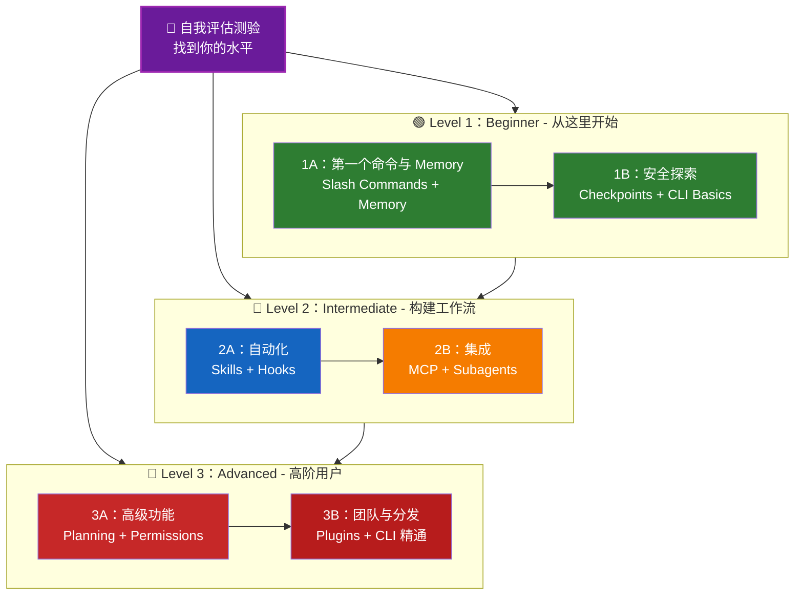

<picture>
  <source media="(prefers-color-scheme: dark)" srcset="../resources/logos/claude-howto-logo-dark.svg">
  
</picture>

# 📚 Claude Code 学习路线图

**刚接触 Claude Code？** 这份指南会帮你按照自己的节奏掌握 Claude Code 的各项功能。无论你是完全新手，还是经验丰富的开发者，都可以先做下面的自我评估测验，找到最适合自己的起点。

---

<a id="find-your-level"></a>
## 🧭 找到你的水平

每个人的起点都不同。先做一份快速自我评估，确认最适合你的入口。

**请诚实回答下面的问题：**

- [ ] 我可以启动 Claude Code 并与它对话（`claude`）
- [ ] 我创建或编辑过 `CLAUDE.md`
- [ ] 我至少使用过 3 个内置 slash command（例如 `/help`、`/compact`、`/model`）
- [ ] 我创建过自定义 slash command 或 skill（`SKILL.md`）
- [ ] 我配置过 MCP server（例如 GitHub、数据库）
- [ ] 我在 `~/.claude/settings.json` 中设置过 hooks
- [ ] 我创建或使用过自定义 subagents（`.claude/agents/`）
- [ ] 我使用过 print mode（`claude -p`）做脚本或 CI/CD

**你的水平：**

| 勾选数 | 水平 | 从这里开始 | 完成时间 |
|--------|-------|----------|------------------|
| 0-2 | **Level 1：Beginner** - 从这里开始 | [里程碑 1A](#里程碑-1a第一个命令与-memory) | 约 3 小时 |
| 3-5 | **Level 2：Intermediate** - 构建工作流 | [里程碑 2A](#里程碑-2a自动化skills--hooks) | 约 5 小时 |
| 6-8 | **Level 3：Advanced** - 高阶用户与团队负责人 | [里程碑 3A](#里程碑-3a高级功能) | 约 5 小时 |

> **提示**：如果不确定，宁可从低一级开始。先回顾熟悉内容，总比漏掉基础概念更划算。

> **交互式版本**：在 Claude Code 中运行 `/self-assessment`，就能得到一份引导式、交互式测验，会覆盖全部 10 个功能领域，并生成个性化学习路径。

---

## 🎯 学习理念

本仓库里的文件夹是按照**推荐学习顺序**编号的，背后有 3 个原则：

1. **依赖关系** - 先学基础概念
2. **复杂度** - 先学简单功能，再学高级功能
3. **使用频率** - 先学最常用的功能

这样可以让你一边建立扎实基础，一边尽快获得实际收益。

---

## 🗺️ 你的学习路径



**颜色说明：**
- 💜 紫色：自我评估测验
- 🟢 绿色：Level 1 - Beginner 路线
- 🔵 蓝色 / 🟡 金色：Level 2 - Intermediate 路线
- 🔴 红色：Level 3 - Advanced 路线

---

## 📊 完整路线图表

| 步骤 | 功能 | 复杂度 | 时间 | 水平 | 依赖 | 为什么学它 | 关键收益 |
|------|---------|-----------|------|-------|--------------|----------------|--------------|
| **1** | [Slash Commands](01-slash-commands/README.md) | ⭐ Beginner | 30 分钟 | Level 1 | 无 | 快速获得生产力提升（55+ 内置命令 + 5 个 bundled skills） | 立即自动化、统一团队规范 |
| **2** | [Memory](02-memory/README.md) | ⭐⭐ Beginner+ | 45 分钟 | Level 1 | 无 | 所有功能的基础 | 持久上下文、偏好设置 |
| **3** | [Checkpoints](08-checkpoints/README.md) | ⭐⭐ Intermediate | 45 分钟 | Level 1 | 会话管理 | 安全探索 | 试验、恢复 |
| **4** | [CLI Basics](10-cli/README.md) | ⭐⭐ Beginner+ | 30 分钟 | Level 1 | 无 | 核心 CLI 用法 | 交互式与 print mode |
| **5** | [Skills](03-skills/README.md) | ⭐⭐ Intermediate | 1 小时 | Level 2 | Slash Commands | 自动化专业能力 | 可复用能力、一致性 |
| **6** | [Hooks](06-hooks/README.md) | ⭐⭐ Intermediate | 1 小时 | Level 2 | 工具、命令 | 工作流自动化（25 个事件、4 种类型） | 校验、质量门禁 |
| **7** | [MCP](05-mcp/README.md) | ⭐⭐⭐ Intermediate+ | 1 小时 | Level 2 | 配置 | 实时数据访问 | 实时集成、API |
| **8** | [Subagents](04-subagents/README.md) | ⭐⭐⭐ Intermediate+ | 1.5 小时 | Level 2 | Memory、命令 | 处理复杂任务（包含 Bash 在内的 6 个内置 agent） | 委派、专业分工 |
| **9** | [Advanced Features](09-advanced-features/README.md) | ⭐⭐⭐⭐⭐ Advanced | 2-3 小时 | Level 3 | 前面所有内容 | 高阶工具 | Planning、自动模式（Auto Mode）、通道（Channels）、语音输入、权限控制 |
| **10** | [Plugins](07-plugins/README.md) | ⭐⭐⭐⭐ Advanced | 2 小时 | Level 3 | 前面所有内容 | 完整解决方案 | 团队入职、分发 |
| **11** | [CLI Mastery](10-cli/README.md) | ⭐⭐⭐ Advanced | 1 小时 | Level 3 | 建议：全部 | 掌握命令行用法 | 脚本、CI/CD、自动化 |

**总学习时间**：约 11-13 小时（或者直接跳到你的水平，节省时间）

---

## 🟢 Level 1：Beginner - 从这里开始

**适合**：测验勾选数 0-2
**时间**：约 3 小时
**重点**：立刻提升生产力，理解基础概念
**结果**：可以熟练日常使用，并准备进入 Level 2

<a id="milestone-1a-first-commands-memory"></a>
### 里程碑 1A：第一个命令与 Memory

**主题**：Slash Commands + Memory
**时间**：1-2 小时
**复杂度**：⭐ Beginner
**目标**：通过自定义命令和持久上下文，快速提升效率

#### 你将完成什么
✅ 为重复性任务创建自定义 slash commands
✅ 为团队规范设置项目 memory
✅ 配置个人偏好
✅ 理解 Claude 如何自动加载上下文

#### 实战练习

```bash
# 练习 1：安装你的第一个 slash command
mkdir -p .claude/commands
cp 01-slash-commands/optimize.md .claude/commands/

# 练习 2：创建项目 memory
cp 02-memory/project-CLAUDE.md ./CLAUDE.md

# 练习 3：试用一下
# 在 Claude Code 中输入：/optimize
```

#### 成功标准
- [ ] 成功执行 `/optimize`
- [ ] Claude 记住了 `CLAUDE.md` 中的项目规范
- [ ] 你知道什么时候用 slash command，什么时候用 memory

#### 下一步
熟悉之后，请阅读：
- [01-slash-commands/README.md](01-slash-commands/README.md)
- [02-memory/README.md](02-memory/README.md)

> **检查理解**：在 Claude Code 中运行 `/lesson-quiz slash-commands` 或 `/lesson-quiz memory`，检验你学会了多少。

---

### 里程碑 1B：安全探索

**主题**：Checkpoints + CLI Basics
**时间**：1 小时
**复杂度**：⭐⭐ Beginner+
**目标**：学会安全试验，并使用核心 CLI 命令

#### 你将完成什么
✅ 创建和恢复 checkpoints，安全试验
✅ 理解交互模式与 print mode
✅ 使用基本 CLI 参数和选项
✅ 通过管道处理文件

#### 实战练习

```bash
# 练习 1：尝试 checkpoint 工作流
# 在 Claude Code 中：
# 做一些实验性修改，然后按 Esc+Esc 或使用 /rewind
# 选择你实验之前的 checkpoint
# 选择“恢复代码和对话”返回

# 练习 2：交互模式 vs 输出模式（Print mode）
claude "explain this project"           # 交互模式
claude -p "explain this function"       # 输出模式（非交互）

# 练习 3：通过管道处理文件内容
cat error.log | claude -p "explain this error"
```

#### 成功标准
- [ ] 成功创建并回退到一个 checkpoint
- [ ] 使用过交互模式和 print mode
- [ ] 把文件通过管道传给 Claude 做分析
- [ ] 明白什么时候该用 checkpoints 做安全试验

#### 下一步
- 阅读：[08-checkpoints/README.md](08-checkpoints/README.md)
- 阅读：[10-cli/README.md](10-cli/README.md)
- **准备进入 Level 2！** 继续看 [里程碑 2A](#里程碑-2a自动化skills--hooks)

> **检查理解**：运行 `/lesson-quiz checkpoints` 或 `/lesson-quiz cli`，确认你准备好进入 Level 2。

---

## 🔵 Level 2：Intermediate - 构建工作流

**适合**：测验勾选数 3-5
**时间**：约 5 小时
**重点**：自动化、集成、任务委派
**结果**：可以构建自动化工作流、接入外部服务，并准备进入 Level 3

### 前置条件检查

开始 Level 2 之前，先确认你已经掌握这些 Level 1 内容：

- [ ] 会创建和使用 slash commands（[01-slash-commands/README.md](01-slash-commands/README.md)）
- [ ] 会通过 `CLAUDE.md` 设置项目 memory（[02-memory/README.md](02-memory/README.md)）
- [ ] 知道如何创建和恢复 checkpoints（[08-checkpoints/README.md](08-checkpoints/README.md)）
- [ ] 会在命令行使用 `claude` 和 `claude -p`（[10-cli/README.md](10-cli/README.md)）

> **有空缺？** 继续之前，先回顾上面的链接教程。

---

<a id="milestone-2a-automation-skills-hooks"></a>
### 里程碑 2A：自动化（Skills + Hooks）

**主题**：Skills + Hooks
**时间**：2-3 小时
**复杂度**：⭐⭐ Intermediate
**目标**：自动化常见工作流和质量检查

#### 你将完成什么
✅ 通过 YAML frontmatter 自动触发专门能力（包含 `effort` 和 `shell` 字段）
✅ 在 25 个 hook 事件上设置事件驱动自动化
✅ 使用 4 种 hook 类型（command、http、prompt、agent）
✅ 强制执行代码质量标准
✅ 为自己的工作流创建自定义 hooks

#### 实战练习

```bash
# 练习 1：安装一个 skill
cp -r 03-skills/code-review ~/.claude/skills/

# 练习 2：设置 hooks
mkdir -p ~/.claude/hooks
cp 06-hooks/pre-tool-check.sh ~/.claude/hooks/
chmod +x ~/.claude/hooks/pre-tool-check.sh

# 练习 3：在 settings 中配置 hooks
# 添加到 ~/.claude/settings.json：
{
  "hooks": {
    "PreToolUse": [
      {
        "matcher": "Bash",
        "hooks": [
          {
            "type": "command",
            "command": "~/.claude/hooks/pre-tool-check.sh"
          }
        ]
      }
    ]
  }
}
```

#### 成功标准
- [ ] 在相关场景下，代码审查 skill 会自动触发
- [ ] PreToolUse hook 会在工具执行前运行
- [ ] 你理解 skill 自动触发和 hook 事件触发的区别

#### 下一步
- 创建你自己的 custom skill
- 为工作流增加更多 hooks
- 阅读：[03-skills/README.md](03-skills/README.md)
- 阅读：[06-hooks/README.md](06-hooks/README.md)

> **检查理解**：在继续之前，运行 `/lesson-quiz skills` 或 `/lesson-quiz hooks` 测试你的理解。

---

### 里程碑 2B：集成（MCP + Subagents）

**主题**：MCP + Subagents
**时间**：2-3 小时
**复杂度**：⭐⭐⭐ Intermediate+
**目标**：集成外部服务，并把复杂任务委派出去

#### 你将完成什么
✅ 从 GitHub、数据库等位置访问实时数据
✅ 把工作委派给专门化 AI agents
✅ 明白什么时候该用 MCP，什么时候该用 subagents
✅ 构建集成式工作流

#### 实战练习

```bash
# 练习 1：设置 GitHub MCP
export GITHUB_TOKEN="your_github_token"
claude mcp add github -- npx -y @modelcontextprotocol/server-github

# 练习 2：测试 MCP 集成
# 在 Claude Code 中：/mcp__github__list_prs

# 练习 3：安装 subagents
mkdir -p .claude/agents
cp 04-subagents/*.md .claude/agents/
```

#### 集成练习
试试这个完整工作流：
1. 用 MCP 获取一个 GitHub PR
2. 让 Claude 把审查任务委派给 code-reviewer subagent
3. 再用 hooks 自动运行测试

#### 成功标准
- [ ] 能通过 MCP 成功查询 GitHub 数据
- [ ] Claude 会把复杂任务委派给 subagents
- [ ] 你理解 MCP 和 subagents 的区别
- [ ] 能把 MCP + subagents + hooks 组合进一个工作流

#### 下一步
- 配置更多 MCP servers（数据库、Slack 等）
- 为你的领域创建自定义 subagents
- 阅读：[05-mcp/README.md](05-mcp/README.md)
- 阅读：[04-subagents/README.md](04-subagents/README.md)
- **准备进入 Level 3！** 继续看 [里程碑 3A](#里程碑-3a高级功能)

> **检查理解**：运行 `/lesson-quiz mcp` 或 `/lesson-quiz subagents`，确认你准备好进入 Level 3。

---

## 🔴 Level 3：Advanced - 高阶用户与团队负责人

**适合**：测验勾选数 6-8
**时间**：约 5 小时
**重点**：团队工具、CI/CD、企业功能、插件开发
**结果**：成为高阶用户，能够搭建团队工作流和 CI/CD

### 前置条件检查

开始 Level 3 之前，先确认你已经掌握这些 Level 2 内容：

- [ ] 会创建并自动触发 skills（[03-skills/README.md](03-skills/README.md)）
- [ ] 会配置 hooks 做事件驱动自动化（[06-hooks/README.md](06-hooks/README.md)）
- [ ] 会配置 MCP servers 访问外部数据（[05-mcp/README.md](05-mcp/README.md)）
- [ ] 知道如何用 subagents 分派任务（[04-subagents/README.md](04-subagents/README.md)）

> **有空缺？** 继续之前，先回顾上面的链接教程。

---

<a id="milestone-3a-advanced-features"></a>
### 里程碑 3A：高级功能

**主题**：高级功能（Planning、Permissions、Extended Thinking、自动模式（Auto Mode）、通道（Channels）、语音输入（Voice Dictation）、Remote/Desktop/Web）
**时间**：2-3 小时
**复杂度**：⭐⭐⭐⭐⭐ Advanced
**目标**：掌握高级工作流和高阶工具

#### 你将完成什么
✅ 为复杂功能使用 planning mode
✅ 用 6 种模式进行细粒度权限控制（default、acceptEdits、plan、auto、dontAsk、bypassPermissions）
✅ 用 Alt+T / Option+T 切换 extended thinking
✅ 管理后台任务
✅ 使用 Auto Memory 记住偏好
✅ 使用自动模式（Auto Mode）和后台安全分类器
✅ 使用通道（Channels）组织多会话工作流
✅ 使用语音输入（Voice Dictation）解放双手
✅ 远程控制、桌面应用和 Web 会话
✅ 使用 Agent Teams 协作

#### 实战练习

```bash
# 练习 1：使用 planning mode
/plan Implement user authentication system

# 练习 2：尝试权限模式（共有 6 种：default、acceptEdits、plan、auto、dontAsk、bypassPermissions）
claude --permission-mode plan "analyze this codebase"
claude --permission-mode acceptEdits "refactor the auth module"
claude --permission-mode auto "implement the feature"

# 练习 3：启用 extended thinking
# 在会话中按 Alt+T（macOS 上是 Option+T）切换

# 练习 4：高级 checkpoint 工作流
# 1. 创建名为 "Clean state" 的 checkpoint
# 2. 使用 planning mode 设计功能
# 3. 通过 subagent 委派实现
# 4. 在后台运行测试
# 5. 如果测试失败，回退到 checkpoint
# 6. 尝试另一种方案

# 练习 5：尝试自动模式（Auto mode，后台安全分类器）
claude --permission-mode auto "implement user settings page"

# 练习 6：启用 agent teams
export CLAUDE_AGENT_TEAMS=1
# 让 Claude 执行："Implement feature X using a team approach"

# 练习 7：定时任务
/loop 5m /check-status
# 或使用 CronCreate 创建持久化定时任务

# 练习 8：用通道（Channels）管理多会话工作流
# 用 channels 来组织跨会话工作

# 练习 9：语音输入（Voice Dictation）
# 用语音输入和 Claude Code 进行无手操作
```

#### 成功标准
- [ ] 为复杂功能使用过 planning mode
- [ ] 配置过权限模式（plan、acceptEdits、auto、dontAsk）
- [ ] 用 Alt+T / Option+T 切换过 extended thinking
- [ ] 使用过带后台安全分类器的自动模式（Auto mode）
- [ ] 使用过后台任务处理长时间操作
- [ ] 探索过通道（Channels）做多会话工作流
- [ ] 尝试过语音输入（Voice Dictation）做无手输入
- [ ] 理解 Remote Control、Desktop App 和 Web 会话
- [ ] 启用并使用过 Agent Teams 做协作任务
- [ ] 用过 `/loop` 做周期任务或定时监控

#### 下一步
- 阅读：[09-advanced-features/README.md](09-advanced-features/README.md)

> **检查理解**：运行 `/lesson-quiz advanced`，测试你对高阶功能的掌握程度。

---

### 里程碑 3B：团队与分发（Plugins + CLI 精通）

**主题**：Plugins + CLI 精通 + CI/CD
**时间**：2-3 小时
**复杂度**：⭐⭐⭐⭐ Advanced
**目标**：搭建团队工具、创建插件、熟练集成 CI/CD

#### 你将完成什么
✅ 安装和创建完整的 bundled plugins
✅ 掌握 CLI，用于脚本和自动化
✅ 使用 `claude -p` 做 CI/CD 集成
✅ 为自动化流水线输出 JSON
✅ 管理会话与批处理

#### 实战练习

```bash
# 练习 1：安装一个完整 plugin
# 在 Claude Code 中：/plugin install pr-review

# 练习 2：让 print mode 服务于 CI/CD
claude -p "Run all tests and generate report"

# 练习 3：为脚本输出 JSON
claude -p --output-format json "list all functions"

# 练习 4：会话管理与恢复
claude -r "feature-auth" "continue implementation"

# 练习 5：带约束的 CI/CD 集成
claude -p --max-turns 3 --output-format json "review code"

# 练习 6：批处理
for file in *.md; do
  claude -p --output-format json "summarize this: $(cat $file)" > ${file%.md}.summary.json
done
```

#### CI/CD 集成练习
创建一个简单的 CI/CD 脚本：
1. 用 `claude -p` 审查变更文件
2. 把结果输出成 JSON
3. 用 `jq` 处理特定问题
4. 集成进 GitHub Actions 工作流

---

## 🧪 测试你的知识

根据你刚学完的内容，直接运行下面的测验：

```bash
/lesson-quiz slash-commands
/lesson-quiz memory
/lesson-quiz checkpoints
/lesson-quiz cli
/lesson-quiz skills
/lesson-quiz hooks
/lesson-quiz mcp
/lesson-quiz subagents
/lesson-quiz advanced-features
```

---

## ⚡ 快速开始路径

### 如果你只有 15 分钟
**目标**：先拿到一个立竿见影的成果

1. 复制一个 slash command：`cp 01-slash-commands/optimize.md .claude/commands/`
2. 在 Claude Code 中试一下：`/optimize`
3. 阅读：[01-slash-commands/README.md](01-slash-commands/README.md)

**结果**：你会得到一个能用的 slash command，并理解基础用法

---

### 如果你有 1 小时
**目标**：搭好基础生产力工具

1. **Slash commands**（15 分钟）：复制并测试 `/optimize` 和 `/pr`
2. **项目 memory**（15 分钟）：用项目规范创建 `CLAUDE.md`
3. **安装一个 skill**（15 分钟）：配置 code-review skill
4. **一起试用**（15 分钟）：感受它们如何协同工作

**结果**：命令、memory 和自动 skills 带来基础效率提升

---

### 如果你有一个周末
**目标**：熟悉大部分功能

**周六上午**（3 小时）：
- 完成里程碑 1A：Slash Commands + Memory
- 完成里程碑 1B：Checkpoints + CLI Basics

**周六下午**（3 小时）：
- 完成里程碑 2A：Skills + Hooks
- 完成里程碑 2B：MCP + Subagents

**周日**（4 小时）：
- 完成里程碑 3A：高级功能
- 完成里程碑 3B：Plugins + CLI 精通 + CI/CD
- 为你的团队构建一个自定义 plugin

**结果**：你会成为 Claude Code 的高阶用户，能够培训别人并自动化复杂工作流

---

## 💡 学习建议

### ✅ 建议做

- **先做测验**，找到自己的起点
- **完成每个里程碑的实战练习**
- **先从简单开始**，再逐步增加复杂度
- **在进入下一个功能前先测试当前功能**
- **记下哪些做法最适合你的工作流**
- **学习新内容时回头复习基础概念**
- **借助 checkpoints 安全试验**
- **把经验分享给团队**

### ❌ 不建议做

- **不要跳过前置条件检查**
- **不要试图一次学完所有内容**
- **不要照搬配置却不理解它们**
- **不要忘记测试**
- **不要急着跳过里程碑**
- **不要忽视文档**
- **不要把自己隔离起来**

---

## 🎓 学习风格

### 视觉型学习者
- 阅读每个 README 里的 Mermaid 图
- 观察命令执行流程
- 自己画工作流图
- 使用上面的可视化路径图

### 动手型学习者
- 完成每个实战练习
- 试试不同变体
- 先搞坏再修复（记得用 checkpoints）
- 创建自己的示例

### 阅读型学习者
- 认真阅读每个 README
- 研究代码示例
- 看对比表
- 阅读资源区链接的博客文章

### 社交型学习者
- 组织结对编程
- 给队友讲解概念
- 参与 Claude Code 社区讨论
- 分享你的自定义配置

---

## 📈 进度追踪

用这些清单按水平追踪进度。你可以随时运行 `/self-assessment` 更新自己的技能画像，也可以在每个教程后运行 `/lesson-quiz [lesson]` 验证理解。

### 🟢 Level 1：Beginner
- [ ] 完成 [01-slash-commands](01-slash-commands/README.md)
- [ ] 完成 [02-memory](02-memory/README.md)
- [ ] 创建第一个自定义 slash command
- [ ] 设置项目 memory
- [ ] **达到里程碑 1A**
- [ ] 完成 [08-checkpoints](08-checkpoints/README.md)
- [ ] 完成 [10-cli](10-cli/README.md) 基础部分
- [ ] 创建并回退到一个 checkpoint
- [ ] 使用交互模式和 print mode
- [ ] **达到里程碑 1B**

### 🔵 Level 2：Intermediate
- [ ] 完成 [03-skills](03-skills/README.md)
- [ ] 完成 [06-hooks](06-hooks/README.md)
- [ ] 安装第一个 skill
- [ ] 设置 PreToolUse hook
- [ ] **达到里程碑 2A**
- [ ] 完成 [05-mcp](05-mcp/README.md)
- [ ] 完成 [04-subagents](04-subagents/README.md)
- [ ] 连接 GitHub MCP
- [ ] 创建自定义 subagent
- [ ] 把多个集成组合进一个工作流
- [ ] **达到里程碑 2B**

### 🔴 Level 3：Advanced
- [ ] 完成 [09-advanced-features](09-advanced-features/README.md)
- [ ] 成功使用 planning mode
- [ ] 配置权限模式（包含 auto 在内的 6 种）
- [ ] 使用带安全分类器的自动模式（Auto mode）
- [ ] 使用 extended thinking 切换
- [ ] 探索通道（Channels）和语音输入（Voice Dictation）
- [ ] **达到里程碑 3A**
- [ ] 完成 [07-plugins](07-plugins/README.md)
- [ ] 完成 [10-cli](10-cli/README.md) 的高级用法
- [ ] 配置 print mode（`claude -p`）用于 CI/CD
- [ ] 为自动化创建 JSON 输出
- [ ] 把 Claude 集成到 CI/CD 流水线
- [ ] 创建团队 plugin
- [ ] **达到里程碑 3B**

---

## 🆘 常见学习难题

### 难题 1：“概念一下子太多了”
**解决**：一次只关注一个里程碑。完成所有练习后再往下走。

### 难题 2：“不知道什么时候该用哪个功能”
**解决**：回到主 README 里的 [Use Case Matrix](README.md#你能用它做什么)。

### 难题 3：“配置没有生效”
**解决**：检查主 README 里的 [Troubleshooting](README.md#故障排查) 部分，并确认文件路径。

### 难题 4：“概念之间好像重叠”
**解决**：查看主 README 里的 [Feature Comparison](README.md#功能对比) 表，理解差异。

### 难题 5：“太多东西记不住”
**解决**：自己做一份速查表；同时用 checkpoints 安全试验。

### 难题 6：“我经验很足，但不知道从哪里开始”
**解决**：先做上面的 [自我评估测验](#-找到你的水平)，直接跳到你的水平，并用前置条件检查找出空缺。

---

## 🎯 学完之后做什么？

完成所有里程碑后，可以继续做这些事：

1. **写团队文档** - 记录团队的 Claude Code 配置
2. **构建自定义 plugins** - 把团队工作流打包起来
3. **探索 Remote Control** - 通过外部工具以编程方式控制 Claude Code 会话
4. **试试 Web Sessions** - 用浏览器界面远程开发
5. **使用 Desktop App** - 通过原生桌面应用访问 Claude Code
6. **使用自动模式（Auto Mode）** - 让 Claude 在后台安全分类器保护下自主工作
7. **启用 Auto Memory** - 让 Claude 随时间自动学习你的偏好
8. **设置 Agent Teams** - 让多个 agent 协同处理复杂、多维任务
9. **使用通道（Channels）** - 用结构化的多会话工作流组织工作
10. **试试语音输入（Voice Dictation）** - 用语音无障碍地与 Claude Code 交互
11. **使用 Scheduled Tasks** - 借助 `/loop` 和 cron 工具自动化周期性检查
12. **贡献示例** - 把经验分享给社区
13. **带新人** - 帮助队友快速上手
14. **持续优化工作流** - 根据使用情况不断改进
15. **保持更新** - 跟进 Claude Code 发布和新功能

---

## 📚 其他资源

### 官方文档
- [Claude Code Documentation](https://code.claude.com/docs/en/overview)
- [Anthropic Documentation](https://docs.anthropic.com)
- [MCP Protocol Specification](https://modelcontextprotocol.io)

### 博客文章
- [Discovering Claude Code Slash Commands](https://medium.com/@luongnv89/discovering-claude-code-slash-commands-cdc17f0dfb29)

### 社区
- [Anthropic Cookbook](https://github.com/anthropics/anthropic-cookbook)
- [MCP Servers Repository](https://github.com/modelcontextprotocol/servers)

---

## 💬 反馈与支持

- **发现问题？** 在仓库里创建 issue
- **有建议？** 提交 pull request
- **需要帮助？** 查看文档，或者向社区提问

---

**最后更新**：2026 年 3 月
**维护者**：Claude How-To Contributors
**许可证**：仅供学习与参考，免费使用和改编

---

[← 返回主 README](README.md)
