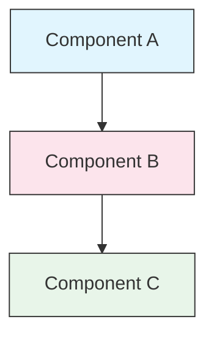

<picture>
  <source media="(prefers-color-scheme: dark)" srcset="../resources/logos/claude-howto-logo-dark.svg">
  
</picture>

# 风格指南

> 为 Claude How To 贡献内容时遵循的约定和格式规则。请按照这份指南保持内容一致、专业且易于维护。

---

## 目录

- [文件与文件夹命名](#文件与文件夹命名)
- [文档结构](#文档结构)
- [标题](#标题)
- [文本格式](#文本格式)
- [列表](#列表)
- [表格](#表格)
- [代码块](#代码块)
- [链接与交叉引用](#链接与交叉引用)
- [图表](#图表)
- [Emoji 用法](#emoji-用法)
- [YAML Frontmatter](#yaml-frontmatter)
- [图片与媒体](#图片与媒体)
- [语气与文风](#语气与文风)
- [提交信息](#提交信息)
- [作者检查清单](#作者检查清单)

---

## 文件与文件夹命名

### 课程文件夹

课程文件夹使用一个 **两位数字前缀**，后接一个 **kebab-case** 描述符：

```
01-slash-commands/
02-memory/
03-skills/
04-subagents/
05-mcp/
```

这个数字反映了学习路径的顺序，从初学者到高级。

### 文件名

| 类型 | 约定 | 示例 |
|------|-----------|----------|
| **课程 README** | `README.md` | `01-slash-commands/README.md` |
| **功能文件** | kebab-case `.md` | `code-reviewer.md`, `generate-api-docs.md` |
| **Shell 脚本** | kebab-case `.sh` | `format-code.sh`, `validate-input.sh` |
| **配置文件** | 标准名称 | `.mcp.json`, `settings.json` |
| **记忆文件** | 带作用域前缀 | `project-CLAUDE.md`, `personal-CLAUDE.md` |
| **顶层文档** | UPPER_CASE `.md` | `CATALOG.md`, `QUICK_REFERENCE.md`, `CONTRIBUTING.md` |
| **图片资源** | kebab-case | `pr-slash-command.png`, `claude-howto-logo.svg` |

### 规则

- 除顶层文档外，所有文件和文件夹名都使用 **小写**
- 使用连字符（`-`）作为单词分隔符，永远不要使用下划线或空格
- 名称要具体，但保持简洁

---

## 文档结构

### 根 README

根目录 `README.md` 的顺序如下：

1. Logo（使用带深色/浅色变体的 `<picture>` 元素）
2. H1 标题
3. 引导性引用块（一句话价值主张）
4. “为什么需要这份指南？”部分，以及对比表
5. 分隔线（`---`）
6. 目录
7. 功能目录
8. 快速导航
9. 学习路径
10. 功能章节
11. 快速上手
12. 最佳实践 / 故障排查
13. 参与贡献 / 许可证

### 课程 README

每个课程 `README.md` 的顺序如下：

1. H1 标题，例如 `# Slash Commands`
2. 简短概述段落
3. 快速参考表格（可选）
4. 架构图（Mermaid）
5. 详细章节（H2）
6. 实用示例（编号列表，4-6 个示例）
7. 最佳实践（Do's 和 Don'ts 表）
8. 故障排查
9. 相关指南 / 官方文档
10. 文档元数据页脚

### 功能/示例文件

单个功能文件，例如 `optimize.md`、`pr.md`：

1. YAML frontmatter（如果适用）
2. H1 标题
3. 目的 / 描述
4. 使用说明
5. 代码示例
6. 自定义提示

### 分隔线

使用水平分隔线（`---`）来分隔文档中的主要区域：

```markdown
---

## New Major Section
```

将它们放在引导性引用块之后，以及文档中逻辑上不同的部分之间。

---

## 标题

### 层级

| 级别 | 用途 | 示例 |
|-------|-----|---------|
| `#` H1 | 页面标题，每个文档一个 | `# Slash Commands` |
| `##` H2 | 主要章节 | `## Best Practices` |
| `###` H3 | 子章节 | `### Adding a Skill` |
| `####` H4 | 再下一级子章节，较少使用 | `#### Configuration Options` |

### 规则

- **每个文档只允许一个 H1**，即页面标题
- **不要跳级**，不要从 H2 直接跳到 H4
- **标题要简洁**，尽量控制在 2-5 个词
- **使用句首大写**，只大写首字和专有名词（例外：功能名保持原样）
- **只有根 README 的章节标题** 可以使用 Emoji 前缀，见 [Emoji 用法](#emoji-用法)

---

## 文本格式

### 强调

| 样式 | 使用时机 | 示例 |
|-------|------------|---------|
| **粗体** (`**text**`) | 关键术语、表格标签、重要概念 | `**Installation**:` |
| *斜体* (`*text*`) | 技术术语首次出现、书名或文档名 | `*frontmatter*` |
| `Code` (`` `text` ``) | 文件名、命令、配置值、代码引用 | `` `CLAUDE.md` `` |

### 使用引述块做提示

对重要说明使用带粗体前缀的引述块：

```markdown
> **Note**: Custom slash commands have been merged into skills since v2.0.

> **Important**: Never commit API keys or credentials.

> **Tip**: Combine memory with skills for maximum effectiveness.
```

支持的提示类型：**Note**、**Important**、**Tip**、**Warning**。

### 段落

- 保持段落简短，2-4 句为宜
- 段落之间留一个空行
- 先说重点，再补充上下文
- 解释“为什么”，不只是“是什么”

---

## 列表

### 无序列表

使用短横线（`-`），嵌套时使用 2 个空格缩进：

```markdown
- First item
- Second item
  - Nested item
  - Another nested item
    - Deep nested (avoid going deeper than 3 levels)
- Third item
```

### 有序列表

用于顺序步骤、操作说明和排序项：

```markdown
1. First step
2. Second step
   - Sub-point detail
   - Another sub-point
3. Third step
```

### 说明性列表

对键值对风格的列表，使用粗体标签：

```markdown
- **Performance bottlenecks** - identify O(n^2) operations, inefficient loops
- **Memory leaks** - find unreleased resources, circular references
- **Algorithm improvements** - suggest better algorithms or data structures
```

### 规则

- 保持一致的缩进，每层 2 个空格
- 列表前后都要空一行
- 列表项结构要平行一致，例如都用动词开头，或者都用名词开头
- 嵌套深度不要超过 3 层

---

## 表格

### 标准格式

```markdown
| Column 1 | Column 2 | Column 3 |
|----------|----------|----------|
| Data     | Data     | Data     |
```

### 常见表格模式

**功能对比（3-4 列）：**

```markdown
| Feature | Invocation | Persistence | Best For |
|---------|-----------|------------|----------|
| **Slash Commands** | Manual (`/cmd`) | Session only | Quick shortcuts |
| **Memory** | Auto-loaded | Cross-session | Long-term learning |
```

**Do's and Don'ts：**

```markdown
| Do | Don't |
|----|-------|
| Use descriptive names | Use vague names |
| Keep files focused | Overload a single file |
```

**快速参考：**

```markdown
| Aspect | Details |
|--------|---------|
| **Purpose** | Generate API documentation |
| **Scope** | Project-level |
| **Complexity** | Intermediate |
```

### 规则

- 当表头是行标签时，**表头要加粗**
- 代码源文件中的管道符尽量对齐，便于阅读（可选但推荐）
- 单元格内容要简洁；细节用链接展开
- 命令和文件路径在单元格中要使用 `代码格式`

---

## 代码块

### 语言标签

始终为语法高亮指定语言标签：

| 语言 | 标签 | 用途 |
|----------|-----|---------|
| Shell | `bash` | CLI 命令、脚本 |
| Python | `python` | Python 代码 |
| JavaScript | `javascript` | JS 代码 |
| TypeScript | `typescript` | TS 代码 |
| JSON | `json` | 配置文件 |
| YAML | `yaml` | Frontmatter、配置 |
| Markdown | `markdown` | Markdown 示例 |
| SQL | `sql` | 数据库查询 |
| Plain text | (no tag) | 期望输出、目录树 |

### 约定

```bash
# Comment explaining what the command does
claude mcp add notion --transport http https://mcp.notion.com/mcp
```

- 在不明显的命令前添加一行 **注释**
- 所有示例都要做到 **可直接复制粘贴**
- 相关时同时提供 **简单版和高级版**
- 需要时要给出 **期望输出**，这时使用不带标签的代码块

### 安装示例

安装说明请使用以下模式：

```bash
# Copy files to your project
cp 01-slash-commands/*.md .claude/commands/
```

### 多步骤工作流

```bash
# Step 1: Create the directory
mkdir -p .claude/commands

# Step 2: Copy the templates
cp 01-slash-commands/*.md .claude/commands/

# Step 3: Verify installation
ls .claude/commands/
```

---

## 链接与交叉引用

### 内部链接（相对路径）

内部链接全部使用相对路径：

```markdown
[Slash Commands](01-slash-commands/README.md)
[Skills Guide](03-skills/README.md)
[Memory Architecture](02-memory/README.md)
```

从课程文件夹返回根目录或兄弟目录：

```markdown
[返回主指南](README.md)
[相关：Skills](03-skills/README.md)
```

### 外部链接（绝对路径）

使用完整 URL，并使用具有描述性的锚文本：

```markdown
[Anthropic's official documentation](https://code.claude.com/docs/en/overview)
```

- 不要使用“click here”或“this link”作为锚文本
- 使用脱离上下文也能理解的描述性文字

### 章节锚点

链接到同一文档中的章节时，使用 GitHub 风格锚点：

```markdown
[文件与文件夹命名](#文件与文件夹命名)
[作者检查清单](#作者检查清单)
```

### 相关指南模式

课程末尾要附上相关指南章节：

```markdown
## Related Guides

- [Slash Commands](01-slash-commands/README.md) - 快速快捷命令
- [Memory](02-memory/README.md) - 持久上下文
- [Skills](03-skills/README.md) - 可复用能力
```

---

## 图表

### Mermaid

所有图表都使用 Mermaid。支持的类型包括：

- `graph TB` / `graph LR` - 架构、层级、流程
- `sequenceDiagram` - 交互流程
- `timeline` - 时间顺序

### 样式约定

使用 style block 保持颜色一致：



**颜色调色板：**

| Color | Hex | Use For |
|-------|-----|---------|
| Light blue | `#e1f5fe` | Primary components, inputs |
| Light pink | `#fce4ec` | Processing, middleware |
| Light green | `#e8f5e9` | Outputs, results |
| Light yellow | `#fff9c4` | Configuration, optional |
| Light purple | `#f3e5f5` | User-facing, UI |

### 规则

- 节点标签使用 `["Label text"]`，这样可以包含特殊字符
- 在标签中换行使用 `<br/>`
- 图表保持简洁，最多 10-12 个节点
- 图表下方添加简短文字说明，方便无障碍阅读
- 层级结构使用自上而下（`TB`），流程使用左右（`LR`）

---

## Emoji 用法

### Emoji 的使用场景

Emoji 使用要 **克制且有目的**，只在特定场景中出现：

| 场景 | Emoji | 示例 |
|---------|--------|---------|
| Root README 章节标题 | 分类图标 | `## 📚 Learning Path` |
| Skill 等级指示 | 彩色圆点 | 🟢 Beginner, 🔵 Intermediate, 🔴 Advanced |
| Do's 和 Don'ts | 对勾/叉号 | ✅ Do this, ❌ Don't do this |
| 复杂度评级 | 星星 | ⭐⭐⭐ |

### 标准 Emoji 集合

| Emoji | 含义 |
|-------|---------|
| 📚 | 学习、指南、文档 |
| ⚡ | 快速上手、速查 |
| 🎯 | 功能、速查 |
| 🎓 | 学习路径 |
| 📊 | 统计、对比 |
| 🚀 | 安装、快速命令 |
| 🟢 | 初学者级别 |
| 🔵 | 中级别 |
| 🔴 | 高级别 |
| ✅ | 推荐做法 |
| ❌ | 避免 / 反模式 |
| ⭐ | 复杂度评级单位 |

### 规则

- **不要在正文或段落中使用 Emoji**
- **只在根 README 的标题中使用 Emoji**，不要在课程 README 中使用
- **不要添加装饰性 Emoji**，每个 Emoji 都应该有意义
- Emoji 的使用要与上表保持一致

---

## YAML Frontmatter

### 功能文件（Skills、Commands、Agents）

```yaml
---
name: unique-identifier
description: What this feature does and when to use it
allowed-tools: Bash, Read, Grep
---
```

### 可选字段

```yaml
---
name: my-feature
description: Brief description
argument-hint: "[file-path] [options]"
allowed-tools: Bash, Read, Grep, Write, Edit
model: opus                        # opus, sonnet, or haiku
disable-model-invocation: true     # User-only invocation
user-invocable: false              # Hidden from user menu
context: fork                      # Run in isolated subagent
agent: Explore                     # Agent type for context: fork
---
```

### 规则

- Frontmatter 放在文件最顶部
- `name` 字段使用 **kebab-case**
- `description` 保持为一句话
- 只包含真正需要的字段

---

## 图片与媒体

### Logo 模式

所有以 Logo 开头的文档都使用 `<picture>` 元素，以支持深色/浅色模式：

```html
<picture>
  <source media="(prefers-color-scheme: dark)" srcset="../resources/logos/claude-howto-logo-dark.svg">
  
</picture>
```

### 截图

- 存放在对应课程文件夹中，例如 `01-slash-commands/pr-slash-command.png`
- 使用 kebab-case 文件名
- 包含描述性的 alt 文本
- 图表优先使用 SVG，截图优先使用 PNG

### 规则

- 图片始终要有 alt 文本
- 控制图片文件大小，PNG 尽量小于 500KB
- 图片引用使用相对路径
- 图片存放在引用它的文档同目录，或者放在 `assets/` 里供共享使用

---

## 语气与文风

### 写作风格

- **专业但亲切** - 技术准确，同时不过度堆砌术语
- **主动语态** - 说“Create a file”，不要说“一个文件应该被创建”
- **直接指令** - 说“Run this command”，不要说“你也许可以运行这个命令”
- **适合初学者** - 假设读者是 Claude Code 新手，但不是编程新手

### 内容原则

| 原则 | 示例 |
|-----------|---------|
| **Show, don't tell** | 提供可运行示例，而不是抽象描述 |
| **渐进式复杂度** | 先简单，后面再增加深度 |
| **解释“为什么”** | “Use memory for... because...” 而不只是 “Use memory for...” |
| **可直接复制粘贴** | 每个代码块都应能直接粘贴使用 |
| **真实场景** | 使用实际场景，而不是牵强的例子 |

### 词汇

- 使用 “Claude Code”（不要写 “Claude CLI” 或 “the tool”）
- 使用 “skill”（不要写 “custom command”，这是旧术语）
- 使用 “lesson” 或 “guide” 来称呼编号章节
- 使用 “example” 来称呼单个功能文件

---

## 提交信息

遵循 [Conventional Commits](https://www.conventionalcommits.org/)：

```
type(scope): description
```

### 类型

| Type | Use For |
|------|---------|
| `feat` | 新功能、示例或指南 |
| `fix` | Bug 修复、纠正、损坏链接 |
| `docs` | 文档改进 |
| `refactor` | 只重构、不改变行为 |
| `style` | 仅格式化改动 |
| `test` | 测试新增或修改 |
| `chore` | 构建、依赖、CI |

### 作用域

使用课程名称或文件区域作为作用域：

```
feat(slash-commands): Add API documentation generator
docs(memory): Improve personal preferences example
fix(README): Correct table of contents link
docs(skills): Add comprehensive code review skill
```

---

## 文档元数据页脚

课程 README 以元数据块结尾：

```markdown
---
**Last Updated**: March 2026
**Claude Code Version**: 2.1.97
**Compatible Models**: Claude Sonnet 4.6, Claude Opus 4.6, Claude Haiku 4.5
```

- 使用“月份 + 年份”格式，例如 “March 2026”
- 功能变化时更新版本
- 列出所有兼容模型

---

## 作者检查清单

提交内容前，请确认：

- [ ] 文件/文件夹名使用 kebab-case
- [ ] 文档以 H1 标题开头，每个文件一个
- [ ] 标题层级正确，没有跳级
- [ ] 所有代码块都带语言标签
- [ ] 代码示例可直接复制粘贴
- [ ] 内部链接使用相对路径
- [ ] 外部链接使用描述性锚文本
- [ ] 表格格式正确
- [ ] Emoji 遵循标准集合（如果使用）
- [ ] Mermaid 图表使用标准配色
- [ ] 没有敏感信息，例如 API key、凭据
- [ ] YAML frontmatter 有效（如果适用）
- [ ] 图片有 alt 文本
- [ ] 段落简短且聚焦
- [ ] 相关指南章节链接到合适的课程
- [ ] 提交信息符合 conventional commits 格式
