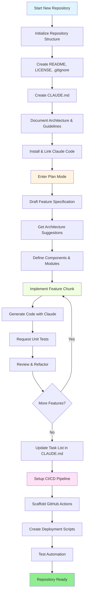
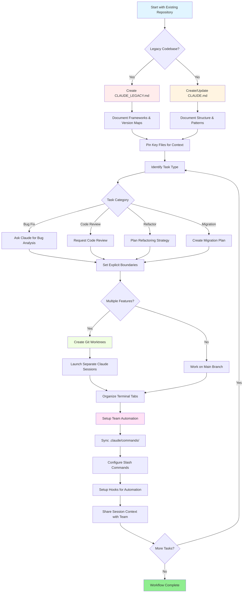

<picture>
  <source media="(prefers-color-scheme: dark)" srcset="../resources/logos/claude-howto-logo-dark.svg">
  
</picture>

# 优质资源清单

## 官方文档

| 资源 | 说明 | 链接 |
|----------|-------------|------|
| Claude Code 文档 | Claude Code 官方文档 | [code.claude.com/docs/en/overview](https://code.claude.com/docs/en/overview) |
| Anthropic 文档 | Anthropic 完整文档 | [docs.anthropic.com](https://docs.anthropic.com) |
| MCP Protocol | Model Context Protocol 规范 | [modelcontextprotocol.io](https://modelcontextprotocol.io) |
| MCP Servers | 官方 MCP server 实现 | [github.com/modelcontextprotocol/servers](https://github.com/modelcontextprotocol/servers) |
| Anthropic Cookbook | 代码示例和教程 | [github.com/anthropics/anthropic-cookbook](https://github.com/anthropics/anthropic-cookbook) |
| Claude Code Skills | 社区技能仓库 | [github.com/anthropics/skills](https://github.com/anthropics/skills) |
| Agent Teams | 多 agent 协作与协调 | [code.claude.com/docs/en/agent-teams](https://code.claude.com/docs/en/agent-teams) |
| Scheduled Tasks | 使用 `/loop` 和 cron 的周期性任务 | [code.claude.com/docs/en/scheduled-tasks](https://code.claude.com/docs/en/scheduled-tasks) |
| Chrome Integration | 浏览器自动化 | [code.claude.com/docs/en/chrome](https://code.claude.com/docs/en/chrome) |
| Keybindings | 键盘快捷键自定义 | [code.claude.com/docs/en/keybindings](https://code.claude.com/docs/en/keybindings) |
| Desktop App | 原生桌面应用 | [code.claude.com/docs/en/desktop](https://code.claude.com/docs/en/desktop) |
| Remote Control | 远程会话控制 | [code.claude.com/docs/en/remote-control](https://code.claude.com/docs/en/remote-control) |
| Auto Mode | 自动权限管理 | [code.claude.com/docs/en/permissions](https://code.claude.com/docs/en/permissions) |
| Channels | 多通道通信 | [code.claude.com/docs/en/channels](https://code.claude.com/docs/en/channels) |
| Voice Dictation | Claude Code 语音输入 | [code.claude.com/docs/en/voice-dictation](https://code.claude.com/docs/en/voice-dictation) |

## Anthropic Engineering Blog

| 文章 | 说明 | 链接 |
|---------|-------------|------|
| Code Execution with MCP | 如何通过代码执行解决 MCP 上下文膨胀问题，Token 数量减少 98.7% | [anthropic.com/engineering/code-execution-with-mcp](https://www.anthropic.com/engineering/code-execution-with-mcp) |

---

## 30 分钟掌握 Claude Code

_视频_: https://www.youtube.com/watch?v=6eBSHbLKuN0

_**全部技巧**_
- **探索高级功能和快捷键**
  - 定期查看 Claude 发布说明中的新代码编辑与上下文功能。
  - 学习键盘快捷键，在聊天、文件和编辑器视图之间快速切换。

- **高效设置**
  - 为项目创建带有清晰名称和描述的会话，便于之后查找。
  - 将最常用的文件或文件夹固定住，让 Claude 随时可访问。
  - 配置 Claude 的集成，例如 GitHub 和常见 IDE，以简化你的编码流程。

- **高效的代码库问答**
  - 向 Claude 询问架构、设计模式和具体模块的细节问题。
  - 在问题里使用文件和行号引用，例如：“`app/models/user.py` 里的逻辑是在做什么？”
  - 对于大型代码库，提供摘要或清单，帮助 Claude 聚焦。
  - **示例提示词**：_“你能解释一下 `src/auth/AuthService.ts:45-120` 里实现的认证流程吗？它是如何与 `src/middleware/auth.ts` 里的中间件集成的？”_

- **代码编辑与重构**
  - 使用代码块中的内联注释或请求来获得更聚焦的编辑结果（例如：“把这个函数重构得更清晰一些”）。
  - 让 Claude 给出并排的修改前后对比。
  - 在重大修改后，让 Claude 生成测试或文档，以保证质量。
  - **示例提示词**：_“把 `api/users.js` 里的 `getUserData` 函数从 promises 改成 async/await。给我一个修改前后对比，并为重构后的版本生成单元测试。”_

- **上下文管理**
  - 只粘贴当前任务真正需要的代码和上下文。
  - 使用结构化提示词（“这里是文件 A，这里是函数 B，我的问题是 X”）通常效果最好。
  - 在提示窗口里移除或折叠大文件，避免超出上下文限制。
  - **示例提示词**：_“这里是 `models/User.js` 里的 User 模型，以及 `utils/validation.js` 里的 `validateUser` 函数。我的问题是：如何在保持向后兼容的前提下添加邮箱验证？”_

- **接入团队工具**
  - 将 Claude 会话连接到你们团队的代码仓库和文档。
  - 使用内置模板，或为重复出现的工程任务创建自定义模板。
  - 通过和队友共享会话记录与提示词来协作。

- **提升性能**
  - 给 Claude 清晰、面向目标的指令，例如：“用五个要点总结这个类”。
  - 从上下文窗口中删掉不必要的注释和样板代码。
  - 如果 Claude 的输出跑偏了，重置上下文或重新表述问题，以获得更好的对齐。
  - **示例提示词**：_“用五个要点总结 `src/db/Manager.ts` 里的 `DatabaseManager` 类，重点说明它的核心职责和关键方法。”_

- **实用场景示例**
  - 调试：粘贴错误和堆栈信息，然后询问可能的原因和修复方式。
  - 生成测试：为复杂逻辑请求属性测试、单元测试或集成测试。
  - 代码审查：请 Claude 识别风险变更、边界情况或代码异味。
  - **示例提示词**：
    - _“我遇到这个错误：`TypeError: Cannot read property 'map' of undefined at line 42 in components/UserList.jsx`。这是堆栈信息和相关代码。是什么原因导致的？我该怎么修复？”_
    - _“为 `PaymentProcessor` 类生成完整的单元测试，包括失败交易、超时和无效输入等边界情况。”_
    - _“审查这个 pull request diff，找出潜在的安全问题、性能瓶颈和代码异味。”_

- **工作流自动化**
  - 用 Claude 提示词为格式化、清理、批量重命名等重复任务编写脚本。
  - 用 Claude 基于代码 diff 起草 PR 描述、发布说明或文档。
  - **示例提示词**：_“根据 git diff，生成一份详细的 PR 描述，包含变更摘要、修改文件列表、测试步骤和潜在影响。同时为 2.3.0 版本生成发布说明。”_

**提示**：想要获得最佳效果，可以把这些实践组合起来使用。先固定关键文件并总结目标，再使用聚焦的提示词和 Claude 的重构工具，逐步改进你的代码库和自动化流程。

**与 Claude Code 配合使用的推荐工作流**

### Claude Code 推荐工作流

#### 新仓库场景

1. **初始化仓库并接入 Claude**
   - 建立新仓库的基础结构：`README`、`LICENSE`、`.gitignore`、根配置文件。
   - 创建 `CLAUDE.md`，说明架构、高层目标和编码规范。
   - 安装 Claude Code，并将其连接到仓库，用于代码建议、测试脚手架和工作流自动化。

2. **使用计划模式和规格说明**
   - 在实现功能之前，使用计划模式（`shift-tab` 或 `/plan`）先写详细规格。
   - 让 Claude 给出架构建议和初始项目布局。
   - 保持清晰、面向目标的提示词序列，依次询问组件轮廓、主要模块和职责。

3. **迭代开发与审查**
   - 把核心功能拆成小块逐步实现，并在过程中请求 Claude 生成代码、重构和文档。
   - 每增加一小步，都请求单元测试和示例。
   - 在 `CLAUDE.md` 中维护持续更新的任务列表。

4. **自动化 CI/CD 和部署**
   - 用 Claude 搭建 GitHub Actions、npm/yarn 脚本或部署工作流。
   - 通过更新 `CLAUDE.md` 并请求对应命令/脚本，轻松调整流水线。

#### 现有仓库场景

1. **仓库与上下文准备**
   - 添加或更新 `CLAUDE.md`，记录仓库结构、编码模式和关键文件。对于旧仓库，可以使用 `CLAUDE_LEGACY.md`，其中涵盖框架、版本映射、说明、已知问题和升级笔记。
   - 固定或高亮 Claude 应该用来作为上下文的主文件。

2. **上下文驱动的代码问答**
   - 让 Claude 基于具体文件/函数，回答代码审查、 bug 解释、重构或迁移计划。
   - 给 Claude 明确边界，例如“只修改这些文件”或者“不要新增依赖”。

3. **分支、工作区和多会话管理**
   - 使用多个 git worktree 做隔离的功能开发或 bug 修复，并为每个 worktree 启动独立的 Claude 会话。
   - 通过终端标签页/窗口按分支或功能组织并行工作。

4. **团队工具和自动化**
   - 通过 `.claude/commands/` 同步自定义命令，保持团队一致性。
   - 用 Claude 的 slash commands 或 hooks 自动化重复任务、PR 创建和代码格式化。
   - 与团队成员共享会话和上下文，便于协作排障和审查。

**提示**：
- 每个新功能或修复都从规格和计划模式提示词开始。
- 对于旧仓库和复杂仓库，把更详细的指导存放在 `CLAUDE.md` / `CLAUDE_LEGACY.md` 中。
- 给出清晰、聚焦的指令，把复杂工作拆成多阶段计划。
- 定期清理会话、裁剪上下文，并删除已完成的工作区，避免堆积混乱。

这些步骤概括了在新旧代码库中更顺畅使用 Claude Code 的核心建议。

---

## 2026 年 3 月新增功能与能力

### 关键功能资源

| 功能 | 说明 | 了解更多 |
|---------|-------------|------------|
| **Auto Memory** | Claude 会自动学习并记住你跨会话的偏好 | [记忆指南](02-memory/README.md) |
| **Remote Control** | 通过外部工具和脚本以编程方式控制 Claude Code 会话 | [高级功能](09-advanced-features/README.md) |
| **Web Sessions** | 通过基于浏览器的界面访问 Claude Code，实现远程开发 | [CLI 参考](10-cli/README.md) |
| **Desktop App** | Claude Code 的原生桌面应用，界面更强大 | [Claude Code 文档](https://code.claude.com/docs/en/desktop) |
| **Extended Thinking** | 通过 `Alt+T` / `Option+T` 或 `MAX_THINKING_TOKENS` 环境变量切换深度推理 | [高级功能](09-advanced-features/README.md) |
| **Permission Modes** | 精细权限控制：default、acceptEdits、plan、auto、dontAsk、bypassPermissions | [高级功能](09-advanced-features/README.md) |
| **7-Tier Memory** | Managed Policy、Project、Project Rules、User、User Rules、Local、Auto Memory | [记忆指南](02-memory/README.md) |
| **Hook Events** | 25 个事件：PreToolUse、PostToolUse、PostToolUseFailure、Stop、StopFailure、SubagentStart、SubagentStop、Notification、Elicitation 等 | [Hooks 指南](06-hooks/README.md) |
| **Agent Teams** | 协调多个 agent 共同处理复杂任务 | [Subagents 指南](04-subagents/README.md) |
| **Scheduled Tasks** | 用 `/loop` 和 cron 工具设置周期性任务 | [高级功能](09-advanced-features/README.md) |
| **Chrome Integration** | 使用无头 Chromium 做浏览器自动化 | [高级功能](09-advanced-features/README.md) |
| **Keyboard Customization** | 自定义按键绑定，包括组合键序列 | [高级功能](09-advanced-features/README.md) |
